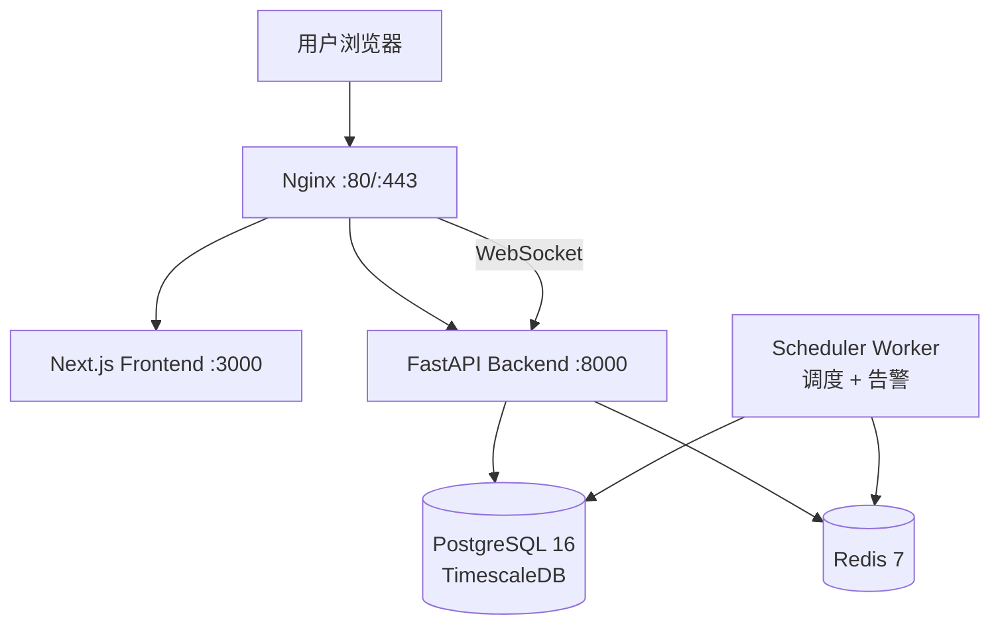

# BTC 全市场智能研究平台

> 面向 BTC 的全市场智能研究、历史数据、周期分析、个人资金计划、策略回测与风险监测一体化平台。

本平台聚合行情、链上、ETF 资金流、衍生品、期权、宏观经济与市场情绪等多源数据，
通过周期定位、估值、风险、市场状态与数据质量等分析引擎，为投资决策提供可解释、
可回测、可监测的研究支撑。

---

## 目录

- [功能特性](#-功能特性)
- [技术栈](#-技术栈)
- [系统架构](#-系统架构)
- [快速开始：开发环境](#-快速开始开发环境)
- [快速开始：生产部署](#-快速开始生产部署)
- [SMTP 邮件告警配置](#-smtp-邮件告警配置)
- [创建第一条预警规则](#-创建第一条预警规则)
- [常用命令](#-常用命令)
- [目录结构](#-目录结构)
- [文档索引](#-文档索引)
- [免责声明](#-免责声明)
- [License](#license)

---

## ✨ 功能特性

| 模块 | 说明 |
| --- | --- |
| **全市场数据聚合** | 行情 / 链上 / ETF 资金流 / 衍生品 / 期权 / 宏观 / 情绪多源统一接入，多 Provider 自动故障转移与健康评分 |
| **分析引擎** | 周期定位（牛熊阶段）、估值（MVRV / NUPL / 已实现价格）、风险（波动率 / 回撤 / 清算）、市场状态四引擎融合 |
| **历史数据** | TimescaleDB 时序存储 + 压缩/保留策略，支持多年期日线数据回溯与缺口补齐 |
| **策略回测** | 历史数据驱动的回测框架：事件驱动与向量化双引擎、绩效指标、逐笔交易明细 |
| **个人资金计划** | 定投 / 分批建仓计划管理、组合净值快照、收益与回撤追踪 |
| **智能预警** | 条件树（与/或/非）预警规则、冷却窗口、速率限制、邮件投递 |
| **数据源管理** | Provider 注册、优先级、限流、健康监控、故障转移事件审计 |
| **实时推送** | WebSocket 行情广播，前端实时刷新 |

---

## 🛠 技术栈

### 后端
| 类别 | 技术 |
| --- | --- |
| 语言 | Python 3.12+ |
| Web 框架 | FastAPI + Uvicorn |
| ORM / 迁移 | SQLAlchemy 2.0 (async) + Alembic |
| 数据库 | PostgreSQL 16 + TimescaleDB（时序数据） |
| 缓存 / 限流 | Redis 7 |
| 数据处理 | Polars / NumPy / Pandas |
| 调度 | 纯 asyncio 调度器（独立 worker 进程） |
| 包管理 | uv |

### 前端
| 类别 | 技术 |
| --- | --- |
| 框架 | Next.js 15 + React 19 |
| 语言 | TypeScript |
| 样式 | Tailwind CSS |
| 图表 | ECharts + Lightweight Charts |
| 状态管理 | Zustand |
| HTTP | Axios |
| 包管理 | pnpm |

### 基础设施
- Docker / Docker Compose（多阶段构建，生产编排 `docker-compose.prod.yml`）
- Nginx 反向代理（gzip / WebSocket / SSL 模板）
- systemd 开机自启（`deploy/btc-platform.service`）

---

## 🏗 系统架构

详细模块划分见 [docs/architecture/03-system-modules.md](docs/architecture/03-system-modules.md)，
部署拓扑见 [docs/architecture/21-deployment.md](docs/architecture/21-deployment.md)。



生产环境中 backend 与 scheduler 分离运行：API 进程专注请求处理（多 worker），
调度任务与告警扫描由独立的 scheduler 容器专职执行，避免重复执行与告警双发。

---

## 🚀 快速开始：开发环境

### 前置要求

| 工具 | 版本 | 说明 |
| --- | --- | --- |
| Docker Desktop / Engine | 4.30+ | 含 Docker Compose V2 |
| Python + uv | 3.12+ / latest | 后端 |
| Node.js + pnpm | 20 LTS / 9+ | 前端 |

### Windows（PowerShell）

```powershell
# 一键启动（基础设施 + 依赖 + 迁移 + 前后端热重载）
powershell -ExecutionPolicy Bypass -File .\scripts\dev-start.ps1
```

### Linux / macOS

```bash
./scripts/dev-start.sh
```

### 手动分步启动

```bash
# 1. 配置环境变量
cp .env.example .env          # 按需修改密码 / API Keys

# 2. 启动基础设施（Postgres + Redis + Adminer）
docker compose -f docker-compose.yml -f docker-compose.dev.yml up -d

# 3. 后端（终端 1）
cd backend && uv sync --extra dev
uv run alembic upgrade head                     # 迁移
uv run python scripts/seed_data.py              # 种子数据（可选）
uv run uvicorn app.main:app --reload --port 8000

# 4. 前端（终端 2）
cd frontend && pnpm install && pnpm dev
```

### 开发环境端口

| 服务 | 地址 |
| --- | --- |
| 前端 | http://localhost:3000 |
| 后端 API / Swagger | http://localhost:8000 / http://localhost:8000/docs |
| PostgreSQL | localhost:5432 |
| Redis | localhost:6379 |
| Adminer（DB 管理 UI） | http://localhost:8080 |

---

## 🐳 快速开始：生产部署

目标机器：Linux（Ubuntu 20.04+ / Debian 11+），推荐 2C4G 起步。

```bash
# 1. 克隆代码
git clone <your-repo-url> /opt/btc-platform
cd /opt/btc-platform

# 2. 一键安装（检查 Docker -> 生成强密码 -> 构建镜像 ->
#    启动基础设施 -> 迁移 -> 种子数据 -> 启动全部服务）
sudo bash scripts/install.sh

# 3. 修改配置并重启生效
vim .env     # 数据源 API Keys、SMTP、预警收件人
bash scripts/manage.sh    # 选 3 重启
```

安装完成后：

| 入口 | 地址 |
| --- | --- |
| 平台 | http://\<server-ip\>/ |
| API | http://\<server-ip\>/api/v1 |
| 健康检查 | http://\<server-ip\>/health |

后续升级 / 备份 / 恢复 / 卸载：

```bash
bash scripts/update.sh      # 升级（git pull -> rebuild -> 迁移 -> 重启，保留数据）
bash scripts/backup.sh      # 备份（每日 30 天保留策略）
bash scripts/restore.sh     # 恢复（交互选择备份文件）
bash scripts/uninstall.sh   # 卸载（可选删除数据卷，双重确认）
bash scripts/manage.sh      # 交互式管理控制台
```

### HTTPS（可选）

`docker/nginx/conf.d/default.conf` 文末附带 Let's Encrypt / certbot 完整注释模板：
获取证书后按模板启用 443 server 块即可。

### 开机自启（systemd，可选）

```bash
sudo cp deploy/btc-platform.service /etc/systemd/system/
sudo systemctl daemon-reload
sudo systemctl enable --now btc-platform.service
```

### 每日自动备份（可选）

```bash
crontab -e
# 添加（每日 03:00 备份，日志写入 backups/backup.log）：
0 3 * * * cd /opt/btc-platform && bash scripts/backup.sh >> backups/backup.log 2>&1
```

---

## 📧 SMTP 邮件告警配置

预警触发后通过邮件投递。编辑 `.env`：

```ini
# 是否启用邮件发送（false 时预警仍记录事件但不投递）
SMTP_ENABLED=true

# SMTP 服务器与端口：587 = STARTTLS（默认），465 = 隐式 SSL（配 SMTP_USE_SSL=true）
SMTP_HOST=smtp.gmail.com
SMTP_PORT=587
SMTP_USER=your-email@gmail.com
SMTP_PASSWORD=your-app-password     # Gmail 需使用「应用专用密码」
SMTP_FROM_EMAIL=your-email@gmail.com
SMTP_FROM_NAME=BTC Intelligence Platform
SMTP_USE_TLS=true                   # STARTTLS（配合 587）
SMTP_USE_SSL=false                  # 隐式 SSL（配合 465）

# 预警默认收件人（MVP 单收件人）
ALERT_DEFAULT_RECIPIENT=your-email@example.com
```

**常用服务商参考**

| 服务商 | SMTP_HOST | 端口 / 模式 |
| --- | --- | --- |
| Gmail | smtp.gmail.com | 587 STARTTLS（需应用专用密码） |
| QQ 邮箱 | smtp.qq.com | 587 STARTTLS（授权码） |
| 163 邮箱 | smtp.163.com | 465 SSL（授权码，USE_SSL=true） |
| Outlook | smtp.office365.com | 587 STARTTLS |

修改后重启服务并在管理控制台验证连通性：

```bash
bash scripts/manage.sh    # 选 3 重启 -> 选 10 测试邮件
```

---

## 🔔 创建第一条预警规则

平台暂未开放规则管理 UI 时，可直接向数据库插入规则（条件树 JSON 结构见
[docs/architecture](docs/architecture/12-indicator-dictionary.md) 与
`backend/app/alerts/schemas.py`）：

1. **确保数据在采集**：启动后 scheduler 每分钟采集 BTC 价格，每小时计算核心指标；
2. **连接数据库**：`psql` 直连或 Adminer（开发环境 http://localhost:8080）；
3. **插入规则**（示例：价格跌破 20,000 美元时邮件告警，冷却 1 小时）：

   ```sql
   INSERT INTO alert_rules (name, description, condition_tree, cooldown_seconds, is_enabled)
   VALUES (
       'BTC 跌破 2 万',
       '价格跌破 20000 美元触发',
       '{"operator":"LESS_THAN","metric":"price_usd","threshold":20000}'::jsonb,
       3600,
       true
   );
   ```

4. **等待扫描**：告警引擎每小时扫描一次（`ALERT_SCAN_INTERVAL_SECONDS` 可调）；
5. **验证**：触发后收件箱收到邮件，平台记录预警事件与恢复事件。

> 条件树支持 `AND` / `OR` / `NOT` 组合与持续时间、连续次数增强条件，
> 数据缺失或过期时返回 UNKNOWN（不误报）。

---

## 📟 常用命令

### Makefile（开发）

| 命令 | 说明 |
| --- | --- |
| `make help` | 显示全部命令 |
| `make dev-up` / `make dev-down` | 启动 / 停止开发基础设施 |
| `make backend-install` / `make backend-dev` | 后端依赖安装 / 热重载启动 |
| `make frontend-install` / `make frontend-dev` | 前端依赖安装 / 启动 |
| `make test` | 后端测试（pytest） |
| `make lint` / `make format` | 代码检查 / 格式化 |
| `make migrate` | 数据库迁移 |
| `make backup` | 快速备份数据库 |

### scripts/（生产运维）

| 命令 | 说明 |
| --- | --- |
| `bash scripts/install.sh` | 一键安装（生产） |
| `bash scripts/update.sh` | 升级更新（保留数据） |
| `bash scripts/uninstall.sh` | 卸载（可选删数据卷） |
| `bash scripts/backup.sh` | 全量备份（DB + 配置，30 天保留） |
| `bash scripts/restore.sh` | 交互式恢复 |
| `bash scripts/manage.sh` | 交互式管理控制台 |
| `bash scripts/dev-start.sh` | 开发环境一键启动（Linux/macOS） |

---

## 📁 目录结构

```
btc数据分析/
├── backend/                    # FastAPI 后端
│   ├── app/
│   │   ├── alerts/             # 智能预警（条件树 / 冷却 / 投递）
│   │   ├── api/v1/             # REST API 路由
│   │   ├── backtest/           # 回测引擎（事件驱动 + 向量化）
│   │   ├── core/               # 配置 / 数据库 / 中间件 / 安全
│   │   ├── engines/            # 分析引擎（周期/估值/风险/市场状态/质量）
│   │   ├── indicators/         # 指标计算（技术/链上/衍生品/复合）
│   │   ├── models/             # SQLAlchemy ORM 模型
│   │   ├── portfolio/          # 资金计划 / 定投模拟 / 组合快照
│   │   ├── providers/          # 数据源适配器（市场/链上/ETF/宏观/情绪）
│   │   ├── scheduler/          # asyncio 调度器 + 独立 worker 入口
│   │   ├── services/           # 业务服务层
│   │   └── main.py             # 应用入口（lifespan 编排）
│   ├── migrations/             # Alembic 迁移
│   ├── config/providers.yaml   # Provider 注册配置
│   └── Dockerfile              # 后端镜像（uv 多阶段构建）
├── frontend/                   # Next.js 15 前端
│   ├── src/app/                # App Router 页面
│   ├── src/components/         # UI 组件
│   └── Dockerfile              # 前端镜像（standalone 多阶段构建）
├── docker/
│   ├── nginx/                  # Nginx 主配置 + 站点配置（SSL 模板）
│   └── postgres/init.sql       # 数据库完整初始化（表/超表/压缩/种子）
├── scripts/                    # 运维脚本（install/update/backup/restore/manage）
├── deploy/                     # systemd 服务单元
├── docs/architecture/          # 架构设计文档（23 份）
├── docker-compose.yml          # 基础设施（Postgres + Redis）
├── docker-compose.dev.yml      # 开发覆盖（+Adminer）
└── docker-compose.prod.yml     # 生产编排（nginx + backend + scheduler + frontend）
```

---

## 📚 文档索引

完整设计文档位于 [docs/architecture/](docs/architecture/)：

| # | 文档 | # | 文档 |
| --- | --- | --- | --- |
| 01 | [产品架构](docs/architecture/01-product-architecture.md) | 13 | [模型架构](docs/architecture/13-model-architecture.md) |
| 02 | [技术架构](docs/architecture/02-technical-architecture.md) | 14 | [回测架构](docs/architecture/14-backtest-architecture.md) |
| 03 | [系统模块](docs/architecture/03-system-modules.md) | 15 | [资金计划架构](docs/architecture/15-portfolio-architecture.md) |
| 04 | [Provider 架构](docs/architecture/04-provider-architecture.md) | 16 | [页面架构](docs/architecture/16-page-architecture.md) |
| 05 | [故障转移架构](docs/architecture/05-failover-architecture.md) | 17 | [API 设计](docs/architecture/17-api-design.md) |
| 06 | [Provider 健康评分](docs/architecture/06-provider-health-scoring.md) | 18 | [权限设计](docs/architecture/18-permission-design.md) |
| 07 | [数据流架构](docs/architecture/07-data-flow-architecture.md) | 19 | [日志设计](docs/architecture/19-logging-design.md) |
| 08 | [数据库 ER 设计](docs/architecture/08-database-er-design.md) | 20 | [备份恢复](docs/architecture/20-backup-restore.md) |
| 09 | [核心表结构](docs/architecture/09-core-tables.md) | 21 | [部署设计](docs/architecture/21-deployment.md) |
| 10 | [数据质量](docs/architecture/10-data-quality.md) | 22 | [测试设计](docs/architecture/22-testing-design.md) |
| 11 | [历史数据](docs/architecture/11-historical-data.md) | 23 | [开发路线图](docs/architecture/23-development-roadmap.md) |
| 12 | [指标字典](docs/architecture/12-indicator-dictionary.md) | | |

---

## ⚠️ 免责声明

本项目为**数据分析与研究工具**，所有输出（周期判断、估值区间、风险评分、
回测结果、预警信号等）均基于公开历史数据与统计模型，**仅供参考，
不构成任何投资建议**。

加密货币市场波动剧烈，历史表现不代表未来收益。任何投资决策及其后果
由使用者自行承担。使用本项目即表示您已理解并接受上述条款。

数据来源为第三方公开 API，本项目不保证数据的准确性、完整性与及时性。

---

## License

[MIT](LICENSE)（占位，待定稿）
