<div align="center">

# ₿ BTC 全市场智能研究平台

**BTC Intelligence Platform**

一个开源的 BTC 全市场智能研究与监测平台：聚合 **24 个数据源**、**83,080 根 K 线**（2017-08-17 至今），
通过周期定位、估值、风险、市场状态等 **9 大分析维度**，为投资研究提供可解释、可回测、可监测的决策支撑。

[](https://www.python.org/)
[](https://fastapi.tiangolo.com/)
[](https://nextjs.org/)
[](https://www.timescale.com/)
[](https://redis.io/)
[](#-测试)
[](#license)

</div>

---

## 目录

- [界面预览](#-界面预览)
- [核心特性](#-核心特性)
- [技术架构](#-技术架构)
- [快速开始](#-快速开始)
- [功能页面导览](#-功能页面导览)
- [智能预警使用示例](#-智能预警使用示例)
- [项目结构](#-项目结构)
- [测试](#-测试)
- [文档索引](#-文档索引)
- [免责声明](#-免责声明)
- [License](#license)

---

## 📸 界面预览

<p align="center">
  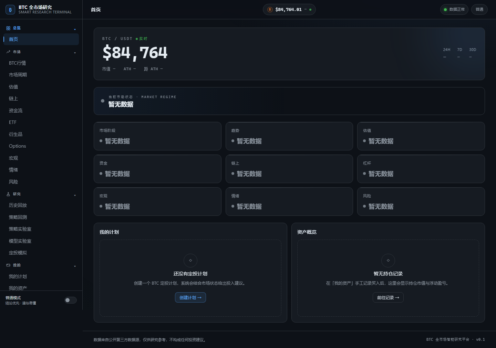
  <br/><sub><b>首页 Dashboard</b> —— 实时价格横幅 + 9 维度状态卡片 + Regime 市场状态条</sub>
</p>

<p align="center">
  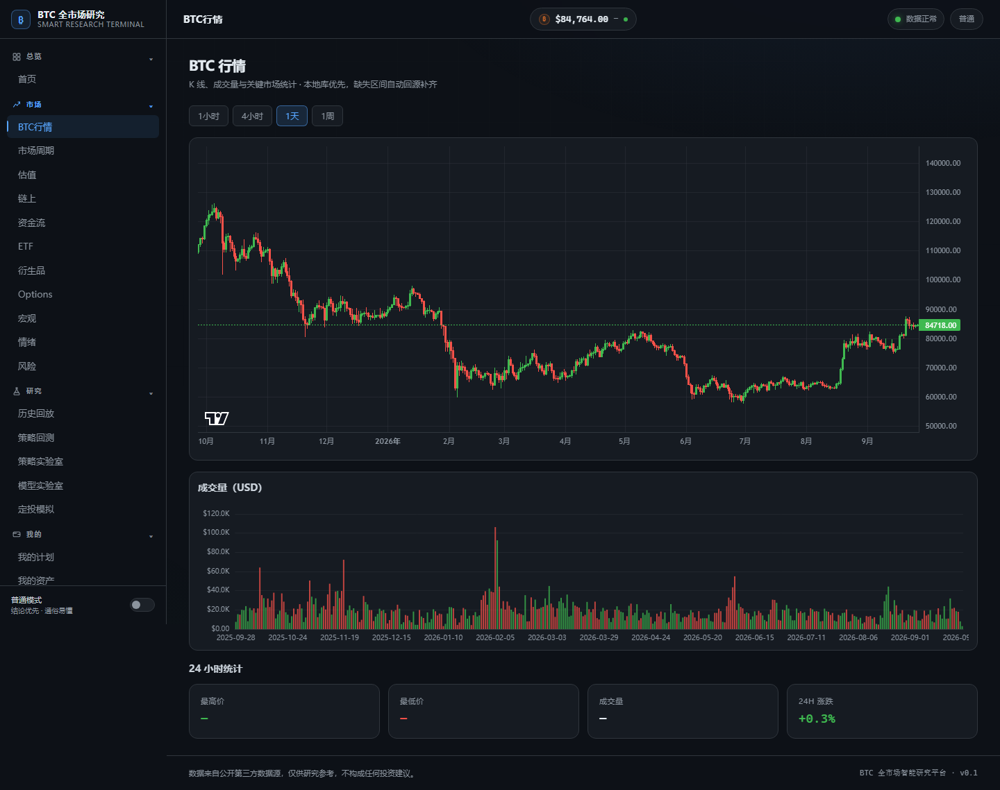
  <br/><sub><b>行情</b> —— 多周期 K 线图 + 24h 统计</sub>
</p>

<p align="center">
  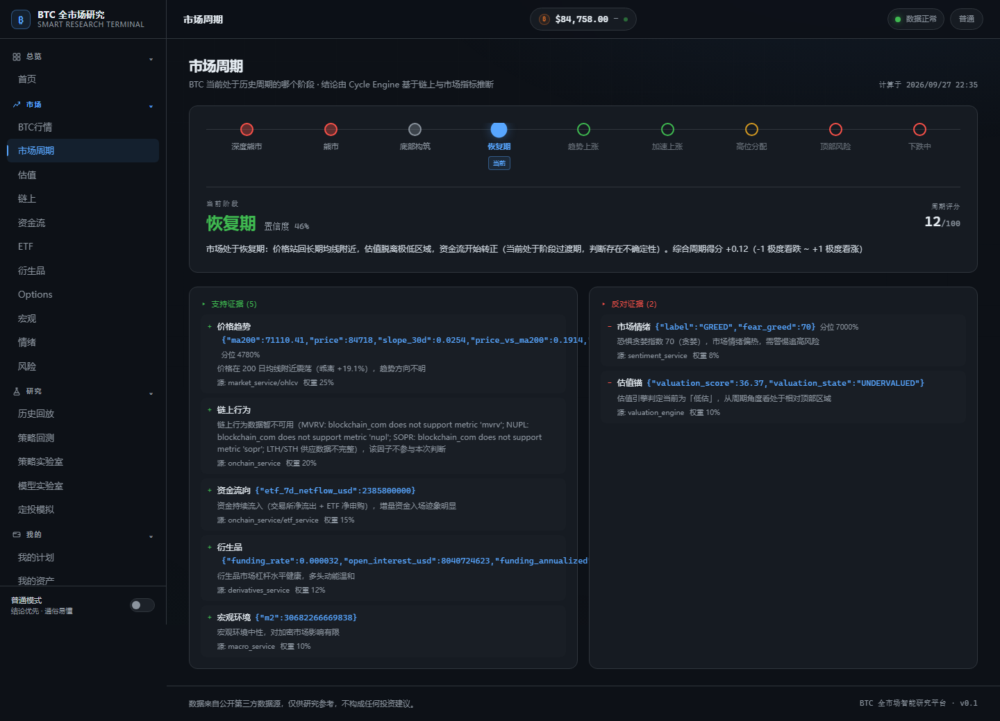
  <br/><sub><b>市场周期</b> —— 牛熊阶段定位 + 多引擎证据链展示</sub>
</p>

<p align="center">
  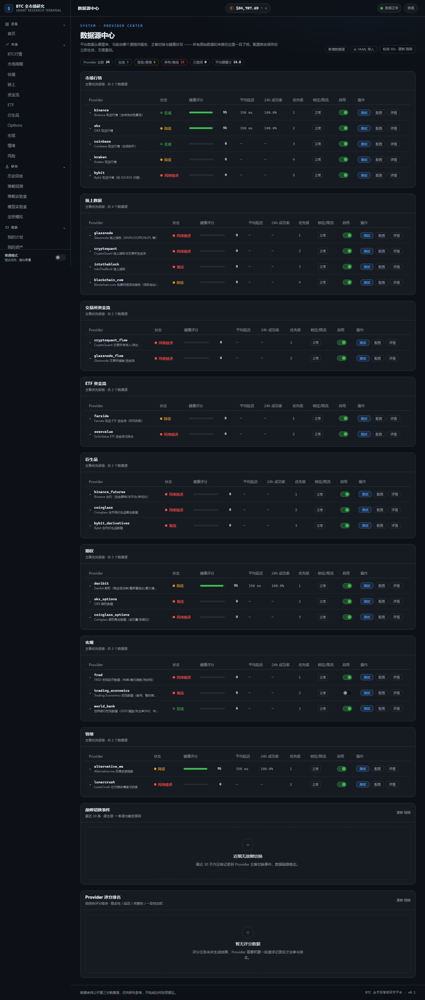
  <br/><sub><b>数据源中心</b> —— 24 个 Provider 状态 / 健康评分 / 故障转移监控</sub>
</p>

<p align="center">
  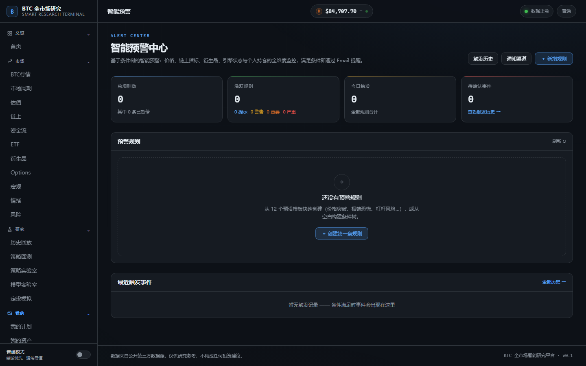
  <br/><sub><b>预警中心</b> —— 规则管理 + 触发 / 恢复事件历史</sub>
</p>

<p align="center">
  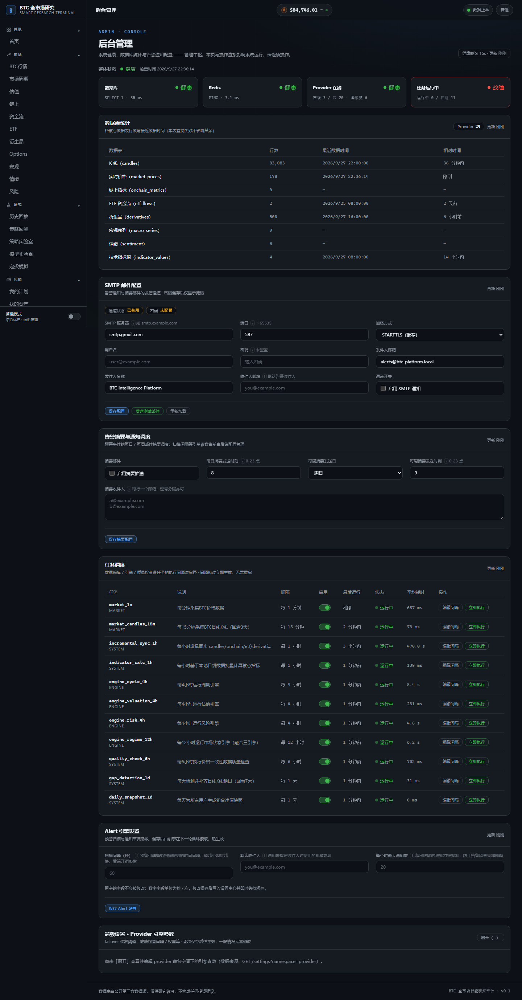
  <br/><sub><b>后台管理</b> —— SMTP 配置 / 任务调度 / 系统设置在线管理</sub>
</p>

<details>
<summary><strong>📷 更多页面截图</strong>（点击展开）</summary>

<br/>

<p align="center"><b>估值仪表 + MVRV 曲线</b></p>
<p align="center">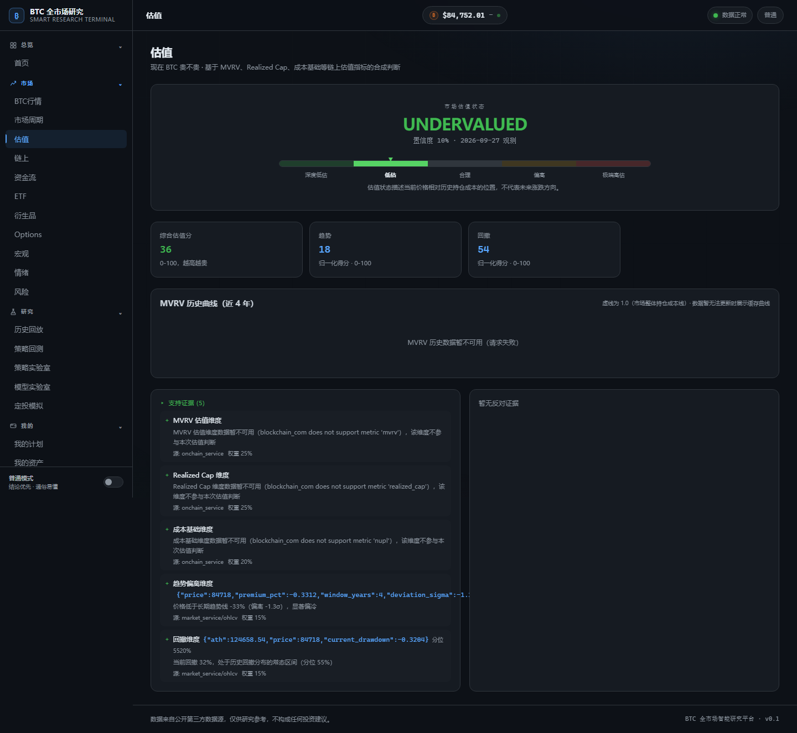</p>

<p align="center"><b>风险雷达 + 因子明细</b></p>
<p align="center">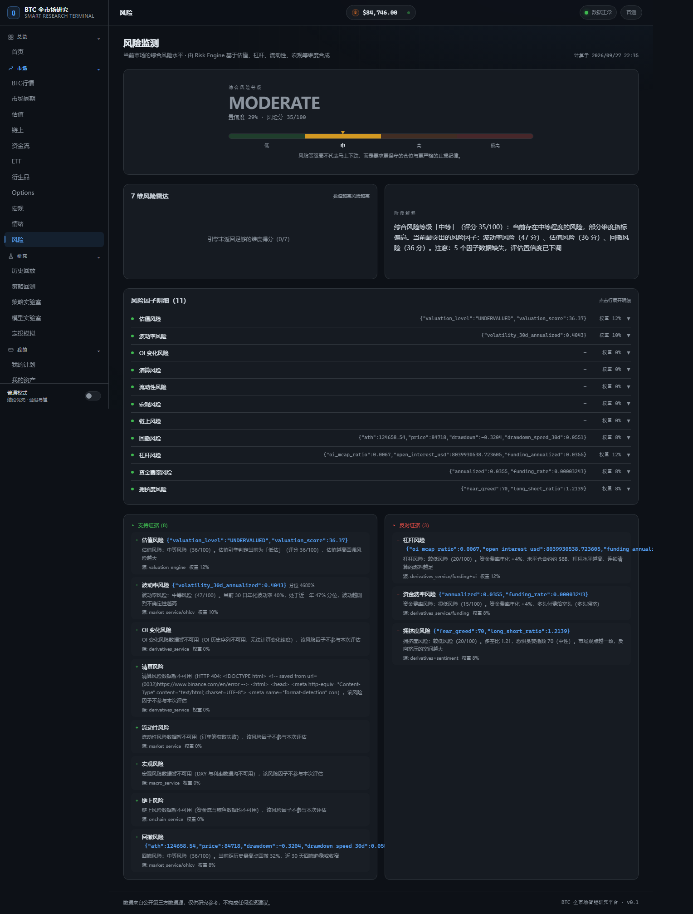</p>

<p align="center"><b>恐惧贪婪指数仪表</b></p>
<p align="center">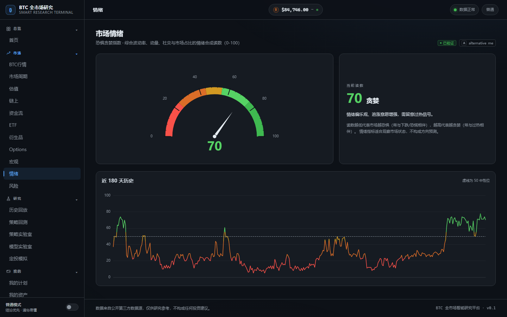</p>

<p align="center"><b>资金费率 / 持仓量 / 清算</b></p>
<p align="center">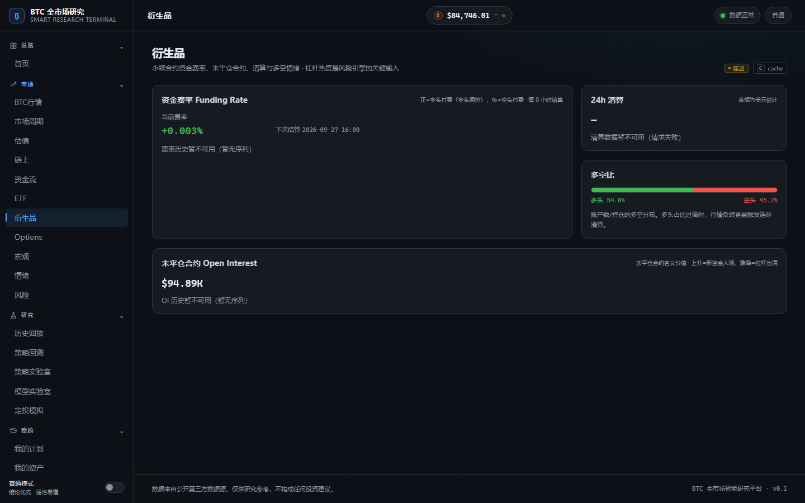</p>

<p align="center"><b>ETF 资金流</b></p>
<p align="center">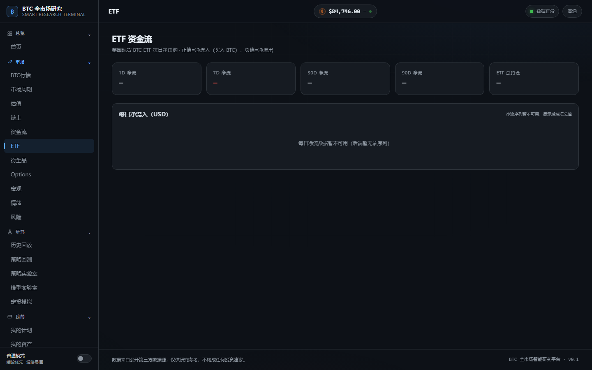</p>

<p align="center"><b>我的资产</b></p>
<p align="center">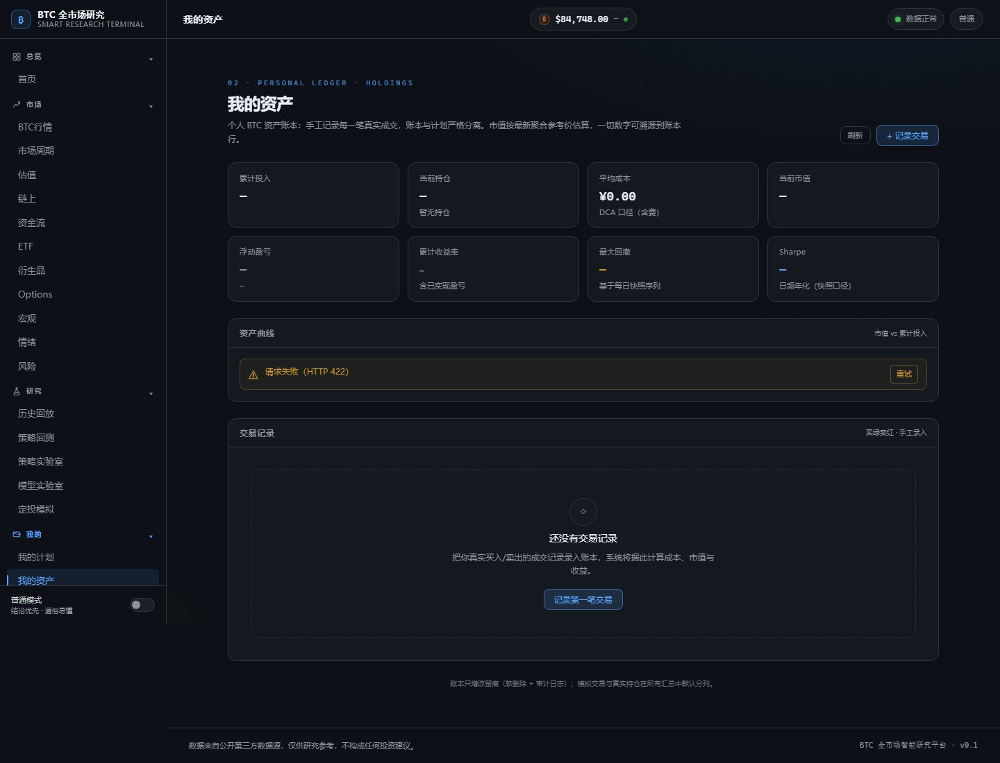</p>

<p align="center"><b>策略回测</b></p>
<p align="center">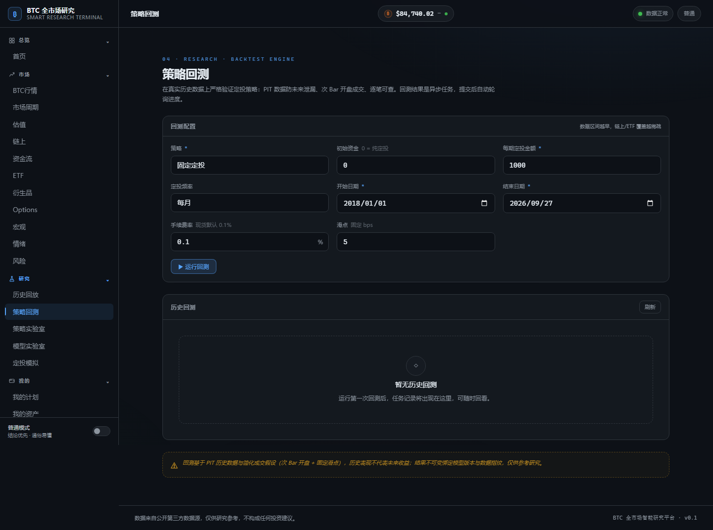</p>

</details>

---

## ✨ 核心特性

### 🔌 多数据源高可用

- **24 个 Provider** 统一接入：行情、链上、ETF 资金流、衍生品、期权、宏观经济、市场情绪
- Provider **自动故障转移**：主源失败秒级切换备用源，保障数据不中断
- **健康评分体系**：响应延迟、成功率、数据新鲜度加权评分，直观呈现数据源质量
- Provider 优先级、限流策略与故障转移事件审计全程可视化

### 🛡 数据质量保障

- **TimescaleDB 时序存储**：超表 + 压缩 + 保留策略，多年期数据高效查询
- **8 年历史数据**：83,080 根 K 线（2017-08-17 至今），支持缺口检测与自动补齐
- 数据新鲜度校验、异常值过滤，指标计算基于可信数据
- 数据质量页面实时监控各维度完整度

### 🧠 智能分析引擎

- **9 大分析维度**融合：周期、估值、风险、市场状态（Regime）、数据质量等引擎协同输出
- **周期定位**：牛熊阶段判断 + 多维度证据链，判断过程完全可解释
- **估值体系**：MVRV、NUPL、已实现价格等经典链上估值指标仪表化
- **风险监测**：波动率、回撤、杠杆水平等多因子风险雷达
- **市场状态识别**：自动判定趋势 / 震荡等 Regime，辅助策略选择

### 📈 回测与模拟

- **双引擎回测框架**：事件驱动与向量化引擎，兼顾灵活性与性能
- 完整绩效指标：收益率、最大回撤、夏普比率等 + 逐笔交易明细
- **DCA 定投模拟**：不同周期 / 金额的历史定投收益对比
- 基于真实 8 年历史数据，结果可复现

### 🔔 智能预警

- **条件树规则引擎**：支持 AND / OR / NOT 组合与持续时间、连续次数增强条件
- **12 套内置模板**：价格突破 / 跌破、大幅回撤、极端恐慌、估值高低位、杠杆堆积、ETF 资金异常、市场阶段变化等，一键套用
- **冷却窗口 + 速率限制**：避免重复告警骚扰
- 邮件投递 + 触发 / 恢复事件完整记录；数据缺失时返回 UNKNOWN，**不误报**

### ⚙️ 配置后台化

- Provider 参数在线编辑、**热更新生效**，无需重启服务
- SMTP 邮件、任务调度、系统设置全部 UI 化管理
- 后台内置连通性测试（测试邮件一键发送）
- 运维脚本齐备：安装 / 升级 / 备份 / 恢复 / 交互式管理控制台

---

## 🏗 技术架构

简版分层架构（详细模块划分见 [docs/architecture/03-system-modules.md](docs/architecture/03-system-modules.md)，部署拓扑见 [docs/architecture/21-deployment.md](docs/architecture/21-deployment.md)）：

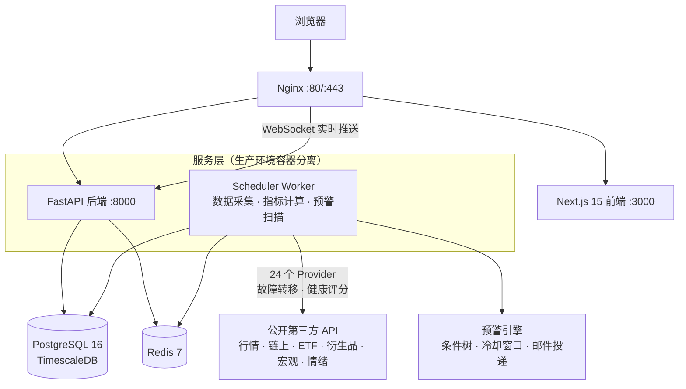

**技术栈概览**

| 层次 | 技术 |
| --- | --- |
| 后端 | Python 3.12 · FastAPI · SQLAlchemy 2.0 (async) · Alembic · Polars / NumPy |
| 数据库 | PostgreSQL 16 + TimescaleDB（时序）· Redis 7（缓存 / 限流） |
| 前端 | Next.js 15 · React 19 · TypeScript · Tailwind CSS · ECharts / Lightweight Charts · Zustand |
| 调度 | 纯 asyncio 调度器，独立 worker 进程（与 API 容器分离，避免任务重复执行） |
| 基础设施 | Docker Compose（多阶段构建）· Nginx 反向代理 · systemd 开机自启 |

---

## 🚀 快速开始

### 环境要求

| 环境 | 要求 | 说明 |
| --- | --- | --- |
| Linux（生产部署） | Ubuntu 20.04+ / Debian 11+ | 推荐 2C4G 起步 |
| Docker | 含 Compose V2 | 基础设施与生产编排 |
| Python | 3.12+ | 后端（推荐使用 [uv](https://docs.astral.sh/uv/) 管理） |
| Node.js | 20 LTS+ | 前端 |
| pnpm | 9+ | 前端包管理 |

### 一键部署（Linux 生产环境）

```bash
git clone https://github.com/tanglx02/btc-intelligence-platform.git /opt/btc-platform
cd /opt/btc-platform
sudo bash scripts/install.sh
```

安装脚本会自动完成：依赖检查 → 生成随机强密码 → 构建镜像 → 启动数据库 →
执行迁移 → 初始化种子数据 → 启动全部服务。

完成后编辑 `.env` 填写数据源 API Keys 与 SMTP 配置，然后 `bash scripts/manage.sh` 选择重启生效。

后续运维：

```bash
bash scripts/update.sh      # 升级更新（保留数据）
bash scripts/backup.sh      # 全量备份（30 天保留策略）
bash scripts/restore.sh     # 交互式恢复
bash scripts/uninstall.sh   # 卸载
bash scripts/manage.sh      # 交互式管理控制台
```

### 开发环境（Windows / Linux / macOS）

```bash
# 1. 克隆并配置环境变量
git clone https://github.com/tanglx02/btc-intelligence-platform.git
cd btc-intelligence-platform
cp .env.example .env            # 按需修改密码 / API Keys

# 2. 启动基础设施（PostgreSQL + Redis，开发模式另含 Adminer）
docker compose -f docker-compose.yml -f docker-compose.dev.yml up -d

# 3. 后端（终端 1）
cd backend
uv sync --extra dev
uv run alembic upgrade head                     # 数据库迁移
uv run python scripts/seed_data.py              # 种子数据
uv run uvicorn app.main:app --reload --port 8000

# 4. 前端（终端 2）
cd frontend
pnpm install
pnpm dev
```

| 服务 | 地址 |
| --- | --- |
| 前端 | http://localhost:3000 |
| 后端 API / Swagger | http://localhost:8000 / http://localhost:8000/docs |
| Adminer（DB 管理） | http://localhost:8080（仅开发模式） |

> Windows 下也可一键启动：`powershell -ExecutionPolicy Bypass -File .\scripts\dev-start.ps1`（Linux/macOS 为 `./scripts/dev-start.sh`）。

---

## 🧭 功能页面导览

| 页面 | 路由 | 说明 |
| --- | --- | --- |
| 首页 Dashboard | `/` | 实时价格横幅 + 9 维度状态卡片 + Regime 状态条 |
| 行情 | `/market` | 多周期 K 线图 + 24h 统计 |
| 市场周期 | `/cycle` | 牛熊阶段定位 + 证据链 |
| 估值 | `/valuation` | MVRV / NUPL / 已实现价格仪表与曲线 |
| 风险 | `/risk` | 风险雷达 + 因子明细 |
| 市场情绪 | `/sentiment` | 恐惧贪婪指数仪表 |
| 衍生品 | `/derivatives` | 资金费率 / 持仓量 / 清算数据 |
| ETF 资金流 | `/etf` | ETF 单日净流入 / 流出 |
| 数据源中心 | `/providers` | 24 Provider 状态 / 健康分 / 故障转移事件 |
| 预警中心 | `/alerts` | 规则管理 + 触发 / 恢复事件历史 |
| 我的资产 | `/portfolio` | 资产概览 + 净值追踪 |
| 策略回测 | `/backtest` | 历史回测 + 绩效报告 |
| 数据质量 | `/quality` | 各维度数据完整度监控 |
| 后台管理 | `/admin` | SMTP / 任务调度 / 系统设置 |

---

## 🔔 智能预警使用示例

三步开启邮件预警：

**第 1 步：配置 SMTP**

编辑 `.env`，填入邮件服务商 SMTP 信息与默认收件人：

```ini
SMTP_ENABLED=true
SMTP_HOST=smtp.qq.com          # Gmail: smtp.gmail.com / 163: smtp.163.com
SMTP_PORT=587                  # 465 端口需配合 SMTP_USE_SSL=true
SMTP_USER=your-email@qq.com
SMTP_PASSWORD=your-auth-code   # 使用邮箱「授权码 / 应用专用密码」
SMTP_FROM_EMAIL=your-email@qq.com
ALERT_DEFAULT_RECIPIENT=your-email@example.com
```

重启生效后可在 **后台管理** 页面一键发送测试邮件验证连通性。

**第 2 步：选择模板**

进入 **预警中心 → 新建规则**，从 12 套内置模板中选择（价格跌破 / 突破、大幅回撤、
极端恐慌、MVRV 估值高低位、杠杆堆积、ETF 资金异常、市场阶段变化等），
模板已预置合理默认阈值，只需按需微调：

<p align="center">
  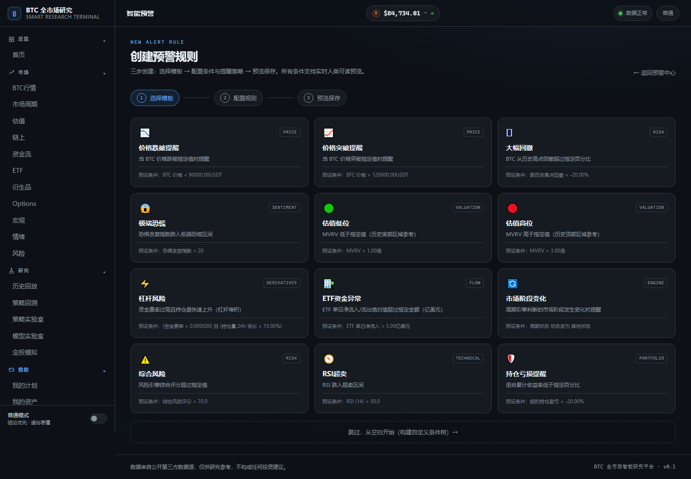
  <br/><sub><b>规则创建向导</b> —— 12 套内置模板，改个阈值即可启用</sub>
</p>

**第 3 步：创建规则并等待触发**

设置规则名称、严重级别与**冷却窗口**（同一规则在窗口内不重复告警），启用即可。
预警引擎按固定周期扫描，条件满足时投递邮件并记录事件；条件恢复时同样记录恢复事件。
数据缺失或过期时评估结果为 UNKNOWN，不会误报。

> 进阶玩法：条件树支持 AND / OR / NOT 任意组合，例如「资金费率 > 0.05% 且 24h
> 持仓量增幅 > 15%」识别杠杆堆积风险。

---

## 📁 项目结构

```
btc-intelligence-platform/
├── backend/                    # FastAPI 后端
│   ├── app/
│   │   ├── alerts/             # 智能预警（条件树 / 冷却 / 投递 / 模板）
│   │   ├── api/v1/             # REST API 路由
│   │   ├── backtest/           # 回测引擎（事件驱动 + 向量化）
│   │   ├── engines/            # 分析引擎（周期 / 估值 / 风险 / Regime / 质量）
│   │   ├── indicators/         # 指标计算（技术 / 链上 / 衍生品 / 复合）
│   │   ├── models/             # SQLAlchemy ORM 模型
│   │   ├── portfolio/          # 资金计划 / 定投模拟 / 组合快照
│   │   ├── providers/          # 数据源适配器（24 Provider）
│   │   ├── scheduler/          # asyncio 调度器 + 独立 worker 入口
│   │   ├── services/           # 业务服务层
│   │   └── main.py             # 应用入口
│   ├── migrations/             # Alembic 迁移
│   ├── config/providers.yaml   # Provider 注册配置
│   └── tests/                  # pytest 测试（453 项）
├── frontend/                   # Next.js 15 前端（App Router）
│   └── src/app/                # 页面路由
├── docker/
│   ├── nginx/                  # Nginx 配置（含 SSL 模板）
│   └── postgres/init.sql       # 数据库初始化（表 / 超表 / 压缩策略）
├── scripts/                    # 运维脚本（install / update / backup / manage）
├── deploy/                     # systemd 服务单元
├── docs/
│   ├── architecture/           # 架构设计文档（23 份）
│   └── screenshots/            # README 截图
├── docker-compose.yml          # 基础设施
├── docker-compose.dev.yml      # 开发覆盖
└── docker-compose.prod.yml     # 生产编排（nginx + backend + scheduler + frontend）
```

---

## ✅ 测试

后端共 **453 项测试**（单元 + 集成），覆盖指标计算、回测引擎、资金计划、预警条件树与 API 集成：

```bash
cd backend
uv sync --extra dev
uv run pytest                        # 运行全部测试
uv run pytest tests/integration -v   # 仅集成测试
uv run pytest tests/indicators -v    # 仅指标计算测试
```

测试策略与设计详见 [docs/architecture/22-testing-design.md](docs/architecture/22-testing-design.md)。

---

## 📚 文档索引

完整设计文档位于 [docs/architecture/](docs/architecture/)：

| # | 文档 | # | 文档 |
| --- | --- | --- | --- |
| 01 | [产品架构](docs/architecture/01-product-architecture.md) | 13 | [模型架构](docs/architecture/13-model-architecture.md) |
| 02 | [技术架构](docs/architecture/02-technical-architecture.md) | 14 | [回测架构](docs/architecture/14-backtest-architecture.md) |
| 03 | [系统模块](docs/architecture/03-system-modules.md) | 15 | [资金计划架构](docs/architecture/15-portfolio-architecture.md) |
| 04 | [Provider 架构](docs/architecture/04-provider-architecture.md) | 16 | [页面架构](docs/architecture/16-page-architecture.md) |
| 05 | [故障转移架构](docs/architecture/05-failover-architecture.md) | 17 | [API 设计](docs/architecture/17-api-design.md) |
| 06 | [Provider 健康评分](docs/architecture/06-provider-health-scoring.md) | 18 | [权限设计](docs/architecture/18-permission-design.md) |
| 07 | [数据流架构](docs/architecture/07-data-flow-architecture.md) | 19 | [日志设计](docs/architecture/19-logging-design.md) |
| 08 | [数据库 ER 设计](docs/architecture/08-database-er-design.md) | 20 | [备份恢复](docs/architecture/20-backup-restore.md) |
| 09 | [核心表结构](docs/architecture/09-core-tables.md) | 21 | [部署设计](docs/architecture/21-deployment.md) |
| 10 | [数据质量](docs/architecture/10-data-quality.md) | 22 | [测试设计](docs/architecture/22-testing-design.md) |
| 11 | [历史数据](docs/architecture/11-historical-data.md) | 23 | [开发路线图](docs/architecture/23-development-roadmap.md) |
| 12 | [指标字典](docs/architecture/12-indicator-dictionary.md) | | |

---

## ⚠️ 免责声明

本项目为**数据分析与研究工具**，所有输出（周期判断、估值区间、风险评分、
回测结果、预警信号等）均基于公开历史数据与统计模型，**仅供参考，
不构成任何投资建议**。

加密货币市场波动剧烈，历史表现不代表未来收益，任何投资决策及其后果由使用者自行承担。
数据来源为第三方公开 API，本项目不保证数据的准确性、完整性与及时性。
使用本项目即表示您已理解并接受上述条款。

---

## License

本项目基于 [MIT License](LICENSE) 开源。
