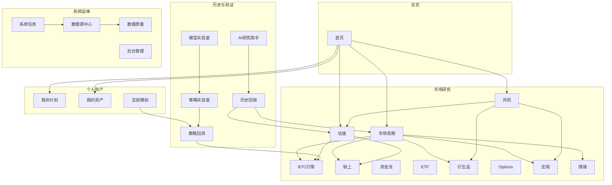
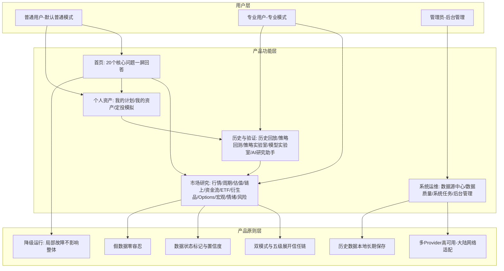

# 01 · 完整产品架构

> BTC 全市场智能研究、历史数据、周期分析、个人资金计划、策略回测与风险监测平台
>
> 文档版本：v1.0 ｜ 状态：架构基线 ｜ 关联文档：[02-技术架构](./02-technical-architecture.md)、[03-系统模块](./03-system-modules.md)

---

## 概述

本文档定义平台的**产品层架构**：产品定位、目标用户、核心价值主张、功能模块总览、用户模式设计、首页信息架构、降级运行策略、数据安全原则，以及中国大陆网络环境适配要求。

本文档是所有后续产品设计（页面信息架构、API 设计、权限设计）与开发决策的**最高依据**。任何功能实现与本文档原则冲突时，以本文档为准。

## 目录

- [1. 产品定位](#1-产品定位)
- [2. 目标用户](#2-目标用户)
- [3. 核心价值主张](#3-核心价值主张)
- [4. 功能模块总览](#4-功能模块总览)
- [5. 用户模式设计](#5-用户模式设计普通模式-vs-专业模式)
- [6. 首页信息架构：必须回答的 20 个问题](#6-首页信息架构必须回答的-20-个问题)
- [7. 降级运行策略](#7-降级运行策略)
- [8. 数据安全原则](#8-数据安全原则)
- [9. 中国大陆网络环境适配](#9-中国大陆网络环境适配)
- [10. 产品功能全景图](#10-产品功能全景图)

---

## 1. 产品定位

### 1.1 一句话定位

**一个可以长期运行（目标 5–10 年及以上）、持续积累 BTC 历史数据、即使外部数据源不断变化仍能持续工作的专业 BTC 数据研究平台。**

### 1.2 定位拆解

| 维度 | 本平台是什么 | 本平台不是什么 |
|------|-------------|---------------|
| 产品性质 | 长期运行的专业数据研究系统 | 普通行情网站、简单 K 线站 |
| 数据策略 | 历史数据本地长期保存，持续积累 | 每次展示都依赖第三方实时 API |
| 结论输出 | 可解释、可追溯、可回放、可回测 | 拍脑袋预测、精准抄底逃顶话术 |
| 交易属性 | 只分析、只模拟、只提醒 | 自动交易、代客下单 |
| 运行假设 | 任何 Provider 随时可能失效是**常态** | 假设外部 API 永远可用 |
| 生命周期 | 5 年、10 年、更长 | 一次性演示项目 |

### 1.3 长期运行目标对产品的约束

产品目标是运行 5–10 年以上，这意味着：

1. **Provider 可替换**：任何第三方数据公司停止服务，不允许导致系统重构；
2. **模型可升级**：模型版本永久保留、不被覆盖，回测结果永久对应模型版本与数据版本；
3. **数据库可迁移**：历史数据不能因为升级而丢失；
4. **指标可增加**：指标字典化，新指标以配置 + 计算函数方式接入，不改动已有模块；
5. **前端可升级**：前端只消费 API，API 契约稳定则前端可整体重写而不影响后端；
6. **数据资产是核心**：平台最有价值的资产是**本地积累的完整历史数据库**，而非任何单一功能页面。

---

## 2. 目标用户

### 2.1 主要用户画像

**非金融专业人员的长期 BTC 投资者/研究者**，具备以下特征与诉求：

| 特征 | 产品必须做到的应对 |
|------|------------------|
| 不懂金融术语 | 默认普通模式：用「偏高 / 低估 / 风险升高」等自然语言结论，而非裸指标数值 |
| 不懂复杂指标 | 每个结论附带「为什么重要 / 历史上通常代表什么 / 支持与反对证据」 |
| 需要信任系统 | 所有结论可解释、所有数据可追溯（来源 + 更新时间 + 质量状态） |
| 需要验证判断 | 所有历史结果可回放（任意日期当时视角），所有策略可历史回测 |
| 无法承受资金损失误导 | 所有模型经过严格验证（In-Sample / Out-of-Sample / Walk-Forward），证据不足时直接显示「当前无法可靠预测」 |
| 身处中国大陆网络环境 | 任何单一数据接口失效，系统整体不停止工作 |

### 2.2 次要用户：专业模式用户

同一位用户在需要深挖时可切换到专业模式，查看公式、原始数值、标准化数值、历史分位、模型权重、计算过程、原始 Provider 响应。**普通模式与专业模式是同一数据的两种呈现深度，不是两套数据。**

### 2.3 管理员

负责数据源管理后台：Provider 增删启停、优先级调整、API Key 维护、故障排查、任务管理、备份恢复。

---

## 3. 核心价值主张

### 3.1 五条最高优先级排序（不可颠倒）

```
数据可靠性   > 算法复杂度
稳定性       > 页面特效
真实数据     > 漂亮结果
可验证       > 所谓精准预测
历史回测     > 主观判断
多 Provider 高可用 > 单一 API
```

### 3.2 逐条解释

| 价值主张 | 含义 | 产品层面的落地 |
|---------|------|--------------|
| 数据可靠性 > 算法复杂度 | 再聪明的模型喂进坏数据也输出坏结论 | 多源交叉验证、数据质量状态标记（Verified / Estimated / Stale / Conflict）、自动补洞 |
| 稳定性 > 页面特效 | 系统 7×24 长期运行优先于视觉炫技 | 降级运行、局部故障隔离、后台任务可恢复 |
| 真实数据 > 漂亮结果 | 宁缺毋假 | 禁止假数据（见第 8 节），数据不可用时明确显示「数据暂时不可用」 |
| 可验证 > 所谓精准预测 | 预测必须附样本量、置信区间、历史表现 | 预测输出概率分布而非单点结论；证据不足直接拒绝预测 |
| 历史回测 > 主观判断 | 任何策略/模型必须能被历史检验 | 回测引擎强制防未来数据泄漏（Look-ahead / Future Leakage / Revision Leakage） |

### 3.3 信任链设计

产品的核心竞争力是**信任链**：任何一个结论，用户都可以沿着以下路径一路点击展开验证：

```
自然语言结论（如「市场估值：偏高」）
  → 判断依据（MVRV、Realized Cap、历史分位…）
    → 指标数值 + 计算公式 + 计算过程
      → 标准化数据（Normalized Data）
        → 原始数据（Raw Data：Provider、Endpoint、抓取时间、原始响应）
```

**任何一级都不允许断链。** 无法追溯到原始数据的结论不允许出现在产品中。

---

## 4. 功能模块总览

### 4.1 导航结构（24 个一级导航模块）

导航按用户心智分为五大区：**总览 → 市场研究 → 历史与验证 → 个人资产 → 系统运维**。

| # | 导航模块 | 分区 | 核心职责 | 主要数据来源模块 |
|---|---------|------|---------|----------------|
| 1 | 首页 | 总览 | 一屏回答用户最关心的 20 个问题（见第 6 节） | 全部引擎汇总 |
| 2 | BTC 行情 | 市场研究 | 价格、OHLCV K 线、成交量、市值、ATH、回撤、波动率、订单簿 | providers/market |
| 3 | 市场周期 | 市场研究 | 九阶段周期识别（深度熊市→顶部风险→下跌），置信度 + 正反证据 + 历史相似阶段 | engines/cycle |
| 4 | 估值 | 市场研究 | MVRV / Realized Cap / 成本基础 / 历史分位 → 五档估值状态 | engines/valuation |
| 5 | 链上 | 市场研究 | MVRV、SOPR、NUPL、Puell、RHODL、Reserve Risk、HODL Waves、活跃地址等 | providers/onchain |
| 6 | 资金流 | 市场研究 | 交易所流入/流出/净流量、储备、稳定币流、鲸鱼动向 | providers/onchain |
| 7 | ETF | 市场研究 | 每日净流入/流出、7D/30D/90D、累计流量、持仓量 | providers/etf |
| 8 | 衍生品 | 市场研究 | Funding、OI、清算、多空比、基差、溢价、Taker 买卖、CVD | providers/derivatives |
| 9 | Options | 市场研究 | 期权 OI、成交量、IV、Put/Call、Skew、Gamma、到期分布 | providers/options |
| 10 | 宏观 | 市场研究 | DXY、Fed 利率、2Y/10Y、实际收益率、CPI、PCE、失业率、NFP、GDP、M2、全球流动性 | providers/macro |
| 11 | 情绪 | 市场研究 | Fear & Greed、Google Trends、新闻情绪、社交情绪 | providers/sentiment |
| 12 | 风险 | 市场研究 | 七大风险维度评分（趋势/估值/杠杆/流动性/宏观/链上/综合），可展开原因 | engines/risk |
| 13 | 历史回放 | 历史与验证 | 任意历史日期全维度状态恢复；「当时视角」与「事后视角」切换 | engines/regime + 本地历史库 |
| 14 | 我的计划 | 个人资产 | 资金计划配置：初始资金、每月/每周投入、周期、加仓规则、回撤容忍度 | portfolio |
| 15 | 我的资产 | 个人资产 | 资产账本：交易记录、持仓、平均成本、市值、浮盈亏、收益率、最大回撤 | portfolio |
| 16 | 定投模拟 | 个人资产 | 固定定投、下跌加仓、回撤加仓、估值加仓、风险/周期调整、自定义策略模拟 | portfolio + backtest |
| 17 | 策略回测 | 历史与验证 | 真回测引擎：2015 至今全历史，收益/年化/回撤/Sharpe/Sortino 等完整统计 | backtest |
| 18 | 策略实验室 | 历史与验证 | 策略编辑、参数化、版本管理、Walk-Forward / 参数敏感性 / 极端行情测试 | backtest |
| 19 | 模型实验室 | 历史与验证 | 模型开发、In/Out-of-Sample 验证、版本化、预测概率输出与历史表现追踪 | engines/* + backtest |
| 20 | AI 研究助手 | 历史与验证 | 解释数据/指标/模型/历史/回测/市场状态，只引用真实数据，禁止编造 | services 层 + LLM |
| 21 | 数据源中心 | 系统运维 | 全部 Provider 状态总览、健康分、优先级、故障切换记录、一键测试 | providers/base |
| 22 | 数据质量 | 系统运维 | 数据缺失/冲突/延迟、同步进度、覆盖范围、自动补洞状态 | engines/quality |
| 23 | 系统任务 | 系统运维 | 采集任务列表：运行/暂停/恢复/重试/跳过/手动执行、任务优先级、Checkpoint | scheduler |
| 24 | 后台管理 | 系统运维 | 用户/权限、Provider 配置管理、模型版本、审计日志、备份恢复 | api + core |

> 注：需求文档第四十八节导航清单共列出 24 项（含首页）；本表与之逐一对应。任务描述中「25 个导航模块」按需求文档实际清单为准执行，如后续新增导航（如「市场事件时间线」独立成页），在本表追加并同步更新信息架构文档。

### 4.2 全局功能：市场事件时间线

不作为独立导航，而是**贯穿型组件**：BTC Halving、ATH、历史大跌、历史底部、极端清算、ETF 重大资金变化、美联储会议、利率变化、CPI、PCE 等重要宏观事件，全部标记在行情、周期、历史回放等页面的时间轴上，支持按事件类型过滤。

### 4.3 模块依赖方向（产品视角）



产品原则：**上层模块依赖下层模块的结论，但下层模块永不感知上层**。「首页」是纯消费方，任何研究模块故障时首页对应卡片降级显示，其余卡片正常。

---

## 5. 用户模式设计（普通模式 vs 专业模式）

### 5.1 双模式定义

| 维度 | 普通模式（默认） | 专业模式 |
|------|----------------|---------|
| 呈现方式 | 自然语言结论 + 状态色/图标 | 公式、原始数值、计算过程 |
| 示例 | 「市场估值：偏高」 | MVRV = 2.38，历史分位 87%，公式 MVRV = Market Cap / Realized Cap |
| 数据内容 | 结论、置信度、一句话解释 | 标准化数值、模型权重、数据源、Provider 当前优先级 |
| 目标用户 | 不懂金融的普通用户 | 需要验证细节的专业用户 |
| 切换粒度 | 全局开关 + 每个结论卡片可独立展开 | 同左 |

### 5.2 结论卡片的标准展开层级

任何结论（估值状态、周期阶段、风险评分、市场状态…）必须支持逐级展开：

```
第 1 级：结论（自然语言）+ 置信度 + 数据状态标记
第 2 级：为什么重要 / 历史上通常代表什么 / 支持证据 / 反向证据
第 3 级：指标数值 / 历史分位 / 数据来源 / 更新时间
第 4 级：公式 / 数学定义 / 计算过程 / 模型权重（专业模式）
第 5 级：原始数据（Provider、Endpoint、抓取时间、原始响应片段）
```

### 5.3 数据状态标记（所有数据点强制携带）

| 状态 | 含义 | 前端呈现 |
|------|------|---------|
| VERIFIED | 多源交叉验证一致 | 正常显示，「数据源一致」 |
| ESTIMATED | 单源数据或备用源数据 | 显示当前 Provider 名称 +「备用源」标记 |
| STALE | 数据过期（全部 Provider 失败，使用最近可信数据） | 显示「数据暂时无法更新」+ 最后成功更新时间 |
| CONFLICT | 多源数据差异异常 | 显示「数据源存在异常差异，当前结果仅供参考」 |
| INVALID | 无可用数据或数据校验失败 | 显示「数据暂时不可用」/「数据源未配置」 |

### 5.4 置信度机制

每个引擎输出（链上、ETF、宏观、周期、风险…）必须附带 Confidence 百分比。关键 Provider 刚发生切换时，置信度自动降低；数据状态为 STALE / CONFLICT 时，置信度显著折减。置信度的计算因子在产品层要求透明可查。

---

## 6. 首页信息架构：必须回答的 20 个问题

用户打开首页，不需要知道任何金融术语，系统必须直接回答（对应需求文档第四十九节）：

| # | 用户问题 | 首页承载组件 | 数据来源 |
|---|---------|-------------|---------|
| 1 | 现在 BTC 怎么样？ | 顶部价格卡：当前价 + 24H / 7D / 30D 涨跌 | MarketService（缓存实时价） |
| 2 | 现在是什么市场阶段？ | 周期阶段卡（九阶段 + 置信度） | engines/cycle |
| 3 | 当前趋势是什么？ | 趋势状态卡（Trend State） | engines/regime |
| 4 | 当前估值高不高？ | 估值状态卡（五档：深度低估→极端高估） | engines/valuation |
| 5 | 当前资金是在流入还是流出？ | 资金流卡（交易所净流量方向） | OnChainService |
| 6 | 机构资金发生什么变化？ | 资金流卡展开层（鲸鱼流、矿工流） | OnChainService |
| 7 | ETF 资金发生什么变化？ | ETF 卡（当日净流入 + 7D/30D 趋势） | ETFService |
| 8 | 杠杆风险高不高？ | 风险卡·杠杆维度（Funding、OI、清算） | engines/risk |
| 9 | 宏观环境如何？ | 宏观状态卡（Macro State） | engines/regime |
| 10 | 市场风险如何？ | 风险卡·综合（Overall Risk + 六维分解） | engines/risk |
| 11 | 历史上有没有出现过类似情况？ | 相似历史阶段卡（可跳转历史回放） | engines/cycle |
| 12 | 如果我按照我的资金计划执行，历史上会发生什么？ | 计划回测卡（一键回测我的计划） | backtest + portfolio |
| 13 | 我的计划当前处于什么状态？ | 我的计划卡：下次投入时间、当前进度、建议动作 | portfolio |
| 14 | 为什么系统这么判断？ | 每个结论卡的「为什么」展开层（第 2 级） | 各引擎证据链 |
| 15 | 哪些数据支持这个结论？ | 展开层「支持证据」列表 | 各引擎证据链 |
| 16 | 哪些数据反对这个结论？ | 展开层「反向证据」列表（强制展示，不允许隐藏） | 各引擎证据链 |
| 17 | 数据可靠吗？ | 全局数据健康条（今日 Provider 成功率、冲突数、缺失数） | engines/quality |
| 18 | 现在使用的是哪个 Provider？ | 每张数据卡角标显示当前数据源名称与主/备标记 | providers/base |
| 19 | 是否发生过故障切换？ | 数据健康条 + 切换事件流（原主源、切换原因、切换时间） | providers/base |
| 20 | （隐含）个人资产现在如何？ | 我的资产卡：持仓、市值、浮盈亏、平均成本 | portfolio |

### 6.1 首页布局原则

1. **顶部**：BTC 当前价格 + 24H/7D/30D + 数据状态角标（来源、更新时间）；
2. **中部**：市场阶段 → 趋势 → 估值 → 资金 → 链上 → 杠杆 → 宏观 → 情绪 → 风险 → 综合状态（Market Regime）十卡横排/网格，每卡可展开「为什么」；
3. **下部**：我的计划（下次投入时间）→ 个人资产 → 计划历史回测入口；
4. **贯穿**：全局数据健康条常驻（可折叠），任何数据异常/故障切换/冲突主动提示，不等用户发现。

首页不允许出现未经解释的专业术语裸值；所有卡片遵守第 5 节双模式与展开层级规范。

---

## 7. 降级运行策略

### 7.1 最高原则

**局部故障不能影响整体系统。** 任何模块数据不可用时显示「数据暂时不可用」，而不是报错页面、空白页或整站崩溃。

### 7.2 降级矩阵

| 故障场景 | 受影响范围 | 系统行为 | 用户看到什么 |
|---------|-----------|---------|-------------|
| 单一 Provider 失效 | 无 | 自动切换备用 Provider，记录 Failover Event | 数据卡角标变为「Provider B（备用源）」 |
| 某类数据全部 Provider 失效（如链上） | 仅该类数据模块 | 使用最近可信数据并标记 STALE；后台持续重试 | 「数据暂时无法更新，最后成功更新：XX:XX」 |
| 链上 API 全部失效 | 链上、资金流模块 + 依赖链上的引擎输入 | 价格、技术指标、个人计划、历史数据库、回测**全部正常** | 首页链上相关卡片降级，其余卡片正常 |
| ETF API 失效 | 仅 ETF 模块实时更新 | 关闭 ETF 实时更新，历史 ETF 数据仍可查 | ETF 卡显示历史数据 + STALE 标记 |
| 宏观 API 失效 | 宏观模块 + Regime 宏观因子 | 宏观因子权重自动重分配或该维度显示不可用 | 宏观状态显示「数据暂时不可用」，首页不报错 |
| 网络完全断开 | 全部实时数据 | 本地数据库继续服务全部历史数据、指标定义、回测、模型结果、用户资产 | 全站可浏览历史内容，实时区显示断网提示 |
| Redis 不可用 | 缓存与实时推送 | 直接读数据库（性能降级但功能完整）；WebSocket 暂停推送 | 页面刷新变慢，功能不丢失 |
| 采集任务崩溃 | 单个任务 | 从 Checkpoint 恢复续传，不从头开始 | 系统任务页显示任务重试记录 |
| 引擎计算异常 | 单个引擎输出 | 该引擎结论显示不可用，不阻塞其他引擎 | 对应卡片降级，置信度体系如实反映 |

### 7.3 降级运行的产品要求

1. **降级必须可见**：所有降级状态必须明确告知用户（STALE / INVALID 标记），禁止静默降级让用户误以为数据是新鲜的；
2. **降级必须可恢复**：Provider 恢复后经 Recovery Threshold（连续成功 N 次 + 响应正常 + 质量正常）自动恢复为 Primary，避免好坏抖动；
3. **降级不污染数据**：降级期间绝不用估算值、外推值悄悄写入数据库冒充真实数据；
4. **历史功能永不降级**：历史数据、指标定义、历史回测、已有模型结果、用户资产数据，在任何外部故障下必须可正常查看——它们只依赖本地数据库。

---

## 8. 数据安全原则

### 8.1 假数据零容忍（禁止清单）

系统任何位置**禁止**出现：

- ❌ 随机数据、模拟数据冒充真实数据
- ❌ 硬编码数据
- ❌ 伪造 ETF 流量、伪造链上数据
- ❌ 伪造预测结果（无统计依据的「99% 准确」「100% 暴涨」「精准抄底/逃顶」）
- ❌ 假 API、静态 JSON 假装实时数据
- ❌ 数据异常时用错误数据悄悄覆盖正确数据

开发阶段没有真实 API 时，界面必须明确显示「**数据源未配置**」或「**当前 Provider 未连接**」，不能伪造一个数字。

测试环境可以使用独立 Mock Provider，但必须与 Production 数据**物理隔离**（独立数据库/独立 schema/独立环境标识），绝不能混入真实数据库。

### 8.2 数据可追溯（三要素强制）

所有数据必须有：

1. **来源**：source_id（哪个 Provider、哪个 Endpoint）；
2. **时间**：observation_time（数据观测时间）+ fetch_time（抓取时间）；
3. **质量状态**：quality_status（VERIFIED / ESTIMATED / STALE / CONFLICT）。

### 8.3 双存储原则

所有重要数据同时保存 **Raw Data**（原始响应、Provider、Endpoint、抓取时间、请求参数、单位、版本、状态）与 **Normalized Data**（标准化后供系统计算）。Provider 更换后可基于 Raw Data 重新分析历史数据。

### 8.4 预测与 AI 的边界

| 主体 | 允许 | 禁止 |
|------|------|------|
| 预测系统 | 输出上涨/横盘/下跌概率、波动区间、置信度、样本数量、历史模型表现、模型版本；证据不足时显示「当前无法可靠预测」 | 单点精准预测、无置信区间的结论 |
| AI 研究助手 | 解释数据/指标/模型/历史/回测/市场状态，引用真实数值，区分「事实 / 统计结果 / 模型判断」，列出反向证据与不确定性 | 编造数据、编造预测、脱离系统数据自由发挥 |

### 8.5 交易安全边界

系统默认**只分析、只模拟、只提醒，不能自动下单**。未来即使接入交易 API，也必须：默认关闭、最小权限、单独授权、独立模块、风险确认、日志记录、可随时关闭。

### 8.6 用户资产数据安全

用户的资金计划、交易记录、资产账本是**最高保护级别数据**：

- 绝不能因为任何外部 API 失效而丢失；
- 纳入强制备份范围（数据库备份、配置备份、模型备份、用户计划备份、Provider 配置备份），支持一键恢复；
- 所有变更写入审计日志（audit_logs）。

---

## 9. 中国大陆网络环境适配

### 9.1 架构级定位

**「多数据源、高可用、自动故障切换」不是附加功能，而是本项目最高级别的基础架构要求。**

产品必须从架构层面假设：

- 部分国外 API、网站、CDN、数据服务、DNS、网络线路随时可能：访问慢、超时、临时无法访问、区域限制、频繁限流、接口变更、永久停止服务；
- 「某一个 API 某一天访问不了」是**正常情况**，而不是异常情况；
- 不能依赖单一 Provider、不能单点故障、不能临时手工换 API、不能因为一个接口挂掉而停止整个程序。

### 9.2 产品能力要求

| 能力 | 产品要求 |
|------|---------|
| 多 Provider | 每种重要数据至少设计主源 + 多个备用源，业务层不感知具体 Provider |
| 自动故障切换 | 超时/连接失败/DNS 失败/TLS 错误/429/403/Key 无效/数据异常 → 自动逐级切换，全程记录 Failover Event |
| 自动恢复 | 原主源恢复且通过 Recovery Threshold 后自动升回 Primary |
| 独立网络配置 | 每个 Provider 可单独配置代理（HTTP/HTTPS/SOCKS5）、超时、重试、请求头、API Key、Rate Limit；不要求整个系统使用同一网络出口 |
| 历史本地化 | 历史数据抓取成功即入库，此后查看 2017–2026 任意历史原则上直接读本地数据库 |
| 断点续传 | 数据同步支持 Checkpoint：暂停、继续、重试、跳过、重新同步、补洞 |
| 健康可见 | 用户随时能看到「现在的数据从哪里来」（数据源中心 + 每张数据卡的来源角标） |
| 交叉验证 | 价格、成交量、资金流、ETF、链上等重要数据多源比对，差异异常记录 CONFLICT 并提示用户 |

### 9.3 完整闭环

产品最终必须实现的运转闭环（同时也是验收标准）：

```
自动检测 → 自动切换 → 自动恢复 → 数据交叉验证 → 数据质量评估 → 历史本地保存 → 故障可追踪
```

---

## 10. 产品功能全景图



---

## 附：与其他架构文档的关系

| 文档 | 承接本文档的内容 |
|------|----------------|
| [02-technical-architecture.md](./02-technical-architecture.md) | 将第 7 节降级策略、第 9 节网络适配落实为技术栈选型、分层架构、进程架构与网络架构 |
| [03-system-modules.md](./03-system-modules.md) | 将第 4 节功能模块映射为后端代码模块，定义模块职责、依赖与隔离原则 |
| 数据库 ER 设计（后续文档） | 将第 8 节数据安全原则落实为表结构（source_id / observation_time / fetch_time / quality_status 强制字段） |
| 页面信息架构（后续文档） | 将第 5、6 节双模式与首页 20 问落实为逐页面线框与组件规范 |
