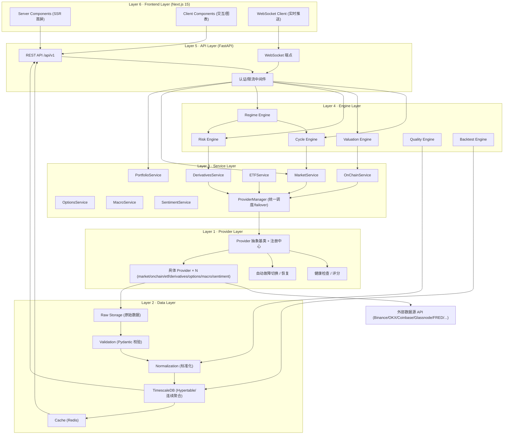
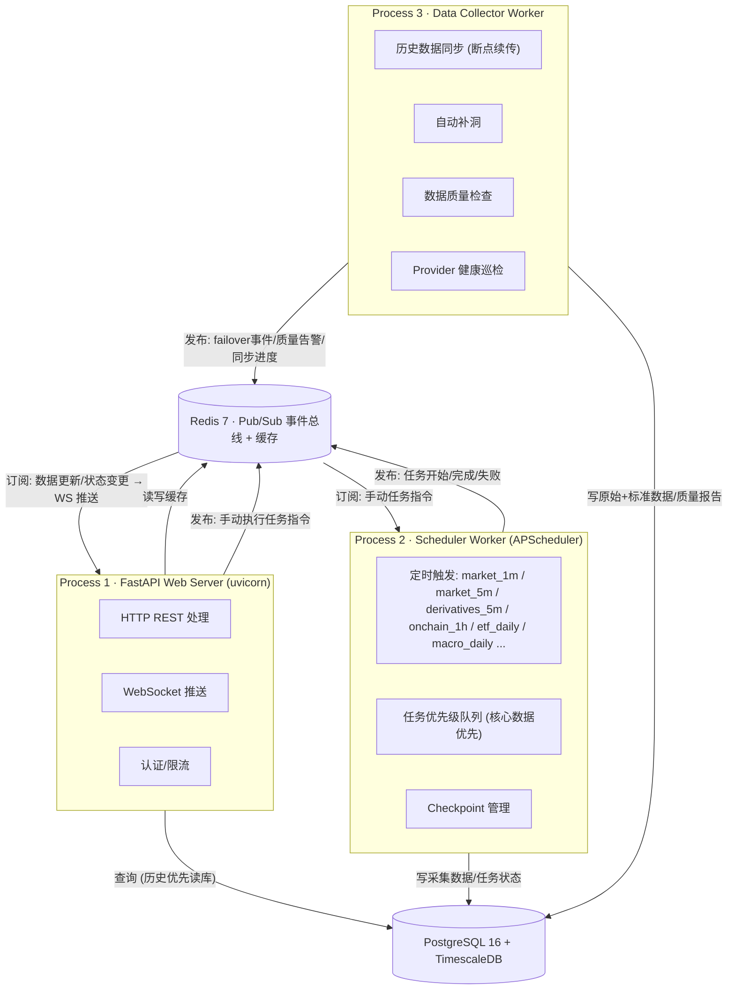
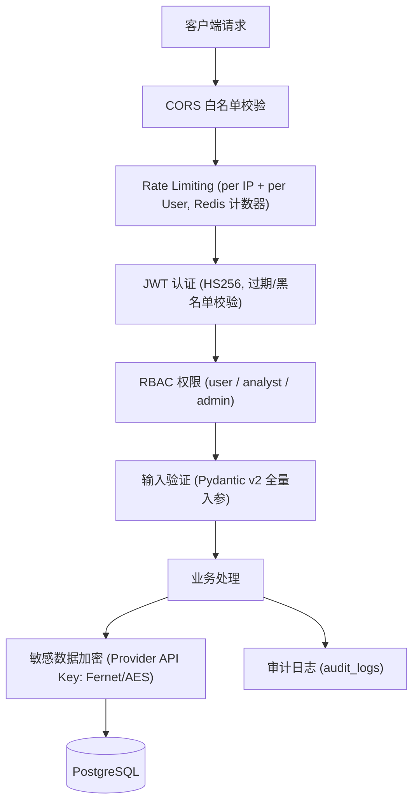
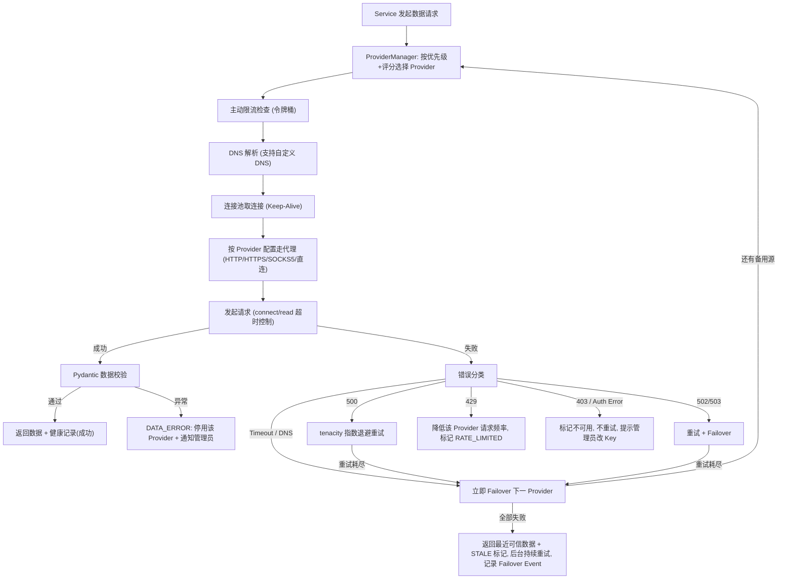
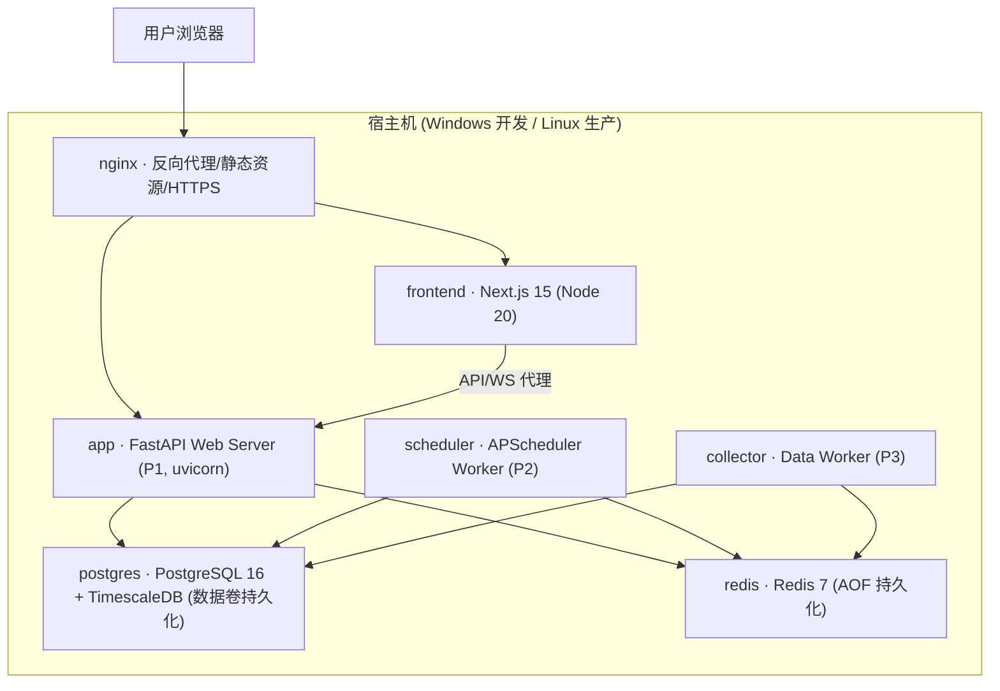

# 02 · 完整技术架构

> BTC 全市场智能研究平台 · 技术架构设计
>
> 文档版本：v1.0 ｜ 状态：架构基线 ｜ 关联文档：[01-产品架构](./01-product-architecture.md)、[03-系统模块](./03-system-modules.md)

---

## 概述

本文档定义平台的**技术层架构**：技术栈选型及理由、系统六层架构、三进程架构、通信设计（REST / WebSocket / Redis Pub/Sub）、安全架构，以及针对中国大陆网络环境的网络架构设计。

技术架构的所有决策服务于产品架构的三条铁律：**数据可靠性 > 算法复杂度、稳定性 > 页面特效、任何单一 Provider 失效不影响系统整体**。

## 目录

- [1. 技术栈选型及理由](#1-技术栈选型及理由)
- [2. 系统分层架构](#2-系统分层架构)
- [3. 进程架构](#3-进程架构)
- [4. 通信设计](#4-通信设计)
- [5. 安全架构](#5-安全架构)
- [6. 网络架构（中国大陆适配）](#6-网络架构中国大陆适配)
- [7. 部署架构](#7-部署架构)
- [8. 可观测性与运维](#8-可观测性与运维)

---

## 1. 技术栈选型及理由

### 1.1 技术栈总览

| 层面 | 选型 | 版本要求 |
|------|------|---------|
| 后端语言 | Python | 3.12+ |
| Web 框架 | FastAPI | ≥ 0.115 |
| ORM | SQLAlchemy（async） | 2.0+ |
| 数据库迁移 | Alembic | ≥ 1.14 |
| 数据校验 | Pydantic | v2 |
| 数据库 | PostgreSQL + TimescaleDB | PG 16 |
| 缓存 / 消息 | Redis | 7.x |
| 前端框架 | Next.js / React | 15 / 19 |
| 前端语言 | TypeScript | 5.x |
| CSS | Tailwind CSS | 4.x |
| 通用图表 | ECharts | 5.x |
| K 线图表 | TradingView Lightweight Charts | 4.x/5.x |
| HTTP 客户端 | httpx | ≥ 0.27 |
| 重试 | tenacity | ≥ 9.0 |
| 数据处理 | Polars（主）+ NumPy + SciPy | — |
| 任务调度 | APScheduler（持久化 Job Store） | 4.0 |
| 容器化 | Docker Compose | 跨平台 Windows / Linux |
| Python 包管理 | uv | — |
| Node 包管理 | pnpm | — |
| 日志 | loguru | — |
| 认证 | python-jose (JWT) + passlib (bcrypt) | — |

### 1.2 选型理由

#### 后端：Python 3.12+ / FastAPI / SQLAlchemy 2.0 (async) / Alembic / Pydantic v2

| 选型 | 理由 |
|------|------|
| Python 3.12+ | 金融数据生态最完整（Polars/NumPy/SciPy）；3.12 性能显著提升；长期维护周期覆盖项目 5–10 年目标的前半程，且可平滑升级 |
| FastAPI | 原生 async/await 与 httpx 异步采集模型一致；Pydantic 深度集成实现「入口即校验」；自动生成 OpenAPI 文档，API 契约长期可追溯；WebSocket 原生支持 |
| SQLAlchemy 2.0 (async) | ORM 事实标准，2.0 风格 API 原生支持 asyncio（asyncpg 驱动）；模型声明式定义支撑长期演进；生态成熟度保障 10 年维护 |
| Alembic | 与 SQLAlchemy 同源的迁移工具，保障「数据库可迁移、历史数据不因升级丢失」的产品要求 |
| Pydantic v2 | Rust 内核高性能校验；所有 Provider 原始响应、API 入参、引擎输出统一经 Pydantic 模型校验，是「数据异常不能用错误数据悄悄覆盖正确数据」的第一道防线 |

#### 数据库：PostgreSQL 16 + TimescaleDB

| 需求 | TimescaleDB 对应能力 |
|------|---------------------|
| 海量时序数据（1m K 线、5m 衍生品数据 × 10 年） | Hypertable 自动按时间分区，避免单表膨胀 |
| 历史数据本地长期保存 | 原生压缩（可达 90%+），冷数据低成本留存 |
| 多周期图表查询（1m→5m→1h→1d） | **连续聚合（Continuous Aggregate）** 自动维护多粒度物化视图，即「自动降采样」 |
| 长期运行数据老化 | 数据保留策略（Retention Policy）自动管理，重要数据永不删除、原始数据分层归档 |
| 关系型数据（用户计划、Provider 配置、模型版本） | 完整 PostgreSQL 关系能力，时序 + 关系一库搞定，减少运维面 |
| 备份恢复 | pg_dump / pg_basebackup 成熟方案，支撑一键备份恢复 |

#### 缓存：Redis 7

| 用途 | 说明 |
|------|------|
| 实时价格缓存 | 最新价、热门指标、首页聚合数据毫秒级读取 |
| Pub/Sub 事件总线 | failover 事件、数据质量告警、任务状态变更的进程间广播 |
| 会话存储 | JWT 黑名单、登录会话、Rate Limit 计数器 |
| Provider 健康状态 | 健康检查实时快照（成功率、延迟、连续失败数） |

**红线：缓存不能成为唯一数据源，PostgreSQL 才是长期数据源。Redis 整体失效时系统必须能直读数据库降级运行。**

#### 前端：Next.js 15 / React 19 / TypeScript / Tailwind CSS

| 选型 | 理由 |
|------|------|
| Next.js 15 | SSR 首屏直出（首页价格/状态卡秒开）；App Router + Server Components 减少客户端 JS；API Routes 可做 BFF 轻量聚合；长期由 Vercel/社区维护，10 年可持续 |
| React 19 | 生态最大、招聘/维护成本最低；并发渲染适合大量图表卡片页面 |
| TypeScript | 与后端 Pydantic Schema 对应生成类型（OpenAPI → TS types），API 契约前后端强一致 |
| Tailwind CSS | 原子化 CSS 支撑「稳定性 > 页面特效」：样式可维护、构建产物小、长期迭代不腐化 |

#### 图表：ECharts + TradingView Lightweight Charts

| 选型 | 分工 | 理由 |
|------|------|------|
| ECharts | 通用图表：柱状/折线/热力/桑基/仪表盘（ETF 流量、风险雷达、HODL Waves、周期图） | 图表类型最全、中文文档完善、大数据量渲染成熟 |
| TradingView Lightweight Charts | 专业 K 线图（行情页、历史回放页时间轴） | 金融 K 线专用、轻量（~45KB）、原生支持实时增量更新与标记（事件时间线打点） |

#### HTTP 客户端：httpx

- 原生 async，与 FastAPI / asyncio 采集模型一致；
- **原生代理支持**（HTTP/HTTPS/SOCKS5），满足「每个 Provider 独立代理配置」的大陆网络核心要求；
- 连接池 + Keep-Alive 内建；
- 超时精细控制（connect / read / write / pool 分离）；
- 配合 tenacity 实现指数退避重试。

#### 数据处理：Polars（主）+ NumPy + SciPy

| 选型 | 分工 |
|------|------|
| Polars | 主力 DataFrame：数据清洗、标准化（Raw → Normalized）、指标计算、回测数据准备。Rust 内核、多线程、内存效率远优于 Pandas，10 年数据量下依然可控 |
| NumPy | 底层数值计算（矩阵、统计量） |
| SciPy | 统计检验、分布拟合、Walk-Forward 验证中的统计工具 |

（Pandas 保留在依赖中仅用于兼容个别第三方库接口，新代码统一 Polars。）

#### 调度：APScheduler 4.0（持久化 Job Store）

- 4.0 重构为 async-first，与整体异步架构一致；
- **持久化 Job Store（PostgreSQL）**：进程崩溃重启后任务定义不丢失，配合 `sync_checkpoints` 表实现「数据采集任务必须可恢复」；
- 支持 cron / interval / date 触发器，覆盖 market_1m 到 macro_daily 的全部任务节奏；
- 相比 Celery：单机部署场景无需引入独立 Broker 拓扑，运维复杂度低，符合个人/小团队长期自托管定位（Redis 仅作事件总线，不承担任务队列的持久化职责）。

#### 容器与包管理：Docker Compose + uv + pnpm

| 选型 | 理由 |
|------|------|
| Docker Compose | 跨平台（开发机 Windows / 生产 Linux）一致环境；服务编排（app / scheduler / worker / postgres / redis / frontend / nginx）声明式定义；备份、升级、回滚以镜像为单位 |
| uv | Rust 实现，依赖解析与安装比 pip 快 10 倍+；`uv.lock` 锁文件保障多年后仍可精确复现环境 |
| pnpm | 硬链接节省磁盘、严格依赖隔离（无幽灵依赖）、workspace 支持，锁定 `pnpm-lock.yaml` 保障可复现 |

---

## 2. 系统分层架构

### 2.1 六层架构总览



### 2.2 各层职责定义

#### Layer 1 · Provider Layer（数据源抽象层）

| 组件 | 职责 |
|------|------|
| Provider 抽象基类 | 定义统一接口契约（get_current_price / get_ohlcv / get_funding / get_etf_flow…按数据类别分接口族）；所有具体 Provider 实现统一接口 |
| Provider 注册中心 | Provider 的注册、发现、启停；配置（优先级、超时、重试、代理、Key）从数据库加载，支持运行时热更新 |
| 健康检查 | 每个 Provider 持续记录：状态（ONLINE/DEGRADED/SLOW/RATE_LIMITED/AUTH_ERROR/NETWORK_ERROR/DATA_ERROR/OFFLINE/DISABLED）、响应时间、成功率（1h/24h）、连续失败数、数据延迟、数据完整性 |
| 智能评分 | Provider Score = f(准确性, 响应速度, 稳定性, 成功率, 完整性, 历史故障率, 价格偏差, 与其他源一致性, 网络可达性)；评分驱动优先级动态调整，管理员可手动锁定 |
| 自动故障切换 | 主源失败 → 按优先级/评分逐级尝试备用源；全部失败 → 返回 STALE 标记的最近可信数据，**绝不生成假数据**；记录 Failover Event（原主源、切换原因、切换时间） |
| 自动恢复 | Recovery Threshold：连续成功 N 次 + 响应时间正常 + 数据质量正常，才升回 Primary，防止好坏抖动 |

#### Layer 2 · Data Layer（数据层）

| 组件 | 职责 |
|------|------|
| Raw Storage | 原始响应全量落库（raw_market_data 等）：Provider、Endpoint、抓取时间、数据时间、单位、字段、版本、请求参数、状态 |
| Validation | Pydantic 模型校验原始数据：类型、范围、必填字段、异常值检测（如价格为负、时间倒流）；校验失败的数据进入隔离区并告警，不写入标准表 |
| Normalization | 统一单位（价格→USD、时间→UTC、数量→BTC）、统一字段命名、统一时间粒度；产出 normalized 数据 |
| TimescaleDB 存储 | Hypertable 按时间分区；连续聚合自动维护 1m→5m→1h→1d 降采样；压缩策略管理冷数据 |
| Cache | Redis 缓存实时价格、热门指标、首页聚合结果、短期计算结果；所有缓存携带数据状态与时间戳 |

数据流强制路径：**Provider → Raw → Validation → Normalized → DB → Cache**。任何计算引擎只允许消费 Normalized 数据（回测/审计场景可回放 Raw）。

#### Layer 3 · Service Layer（业务服务层）

- 按数据域划分：MarketService、OnChainService、ETFService、DerivativesService、OptionsService、MacroService、SentimentService、PortfolioService；
- **业务层唯一入口**：Engine 层与 API 层只能调用 Service，**不能直接依赖具体 Provider**；
- Service 内部通过 ProviderManager 完成「按优先级取数 → failover → 交叉验证 → 数据状态标注」，向上返回带元数据（source、fetch_time、quality_status、confidence）的业务对象；
- Service 同时承担「实时取数」与「历史读库」双路径：历史数据原则上直接读本地 TimescaleDB，不请求第三方。

#### Layer 4 · Engine Layer（引擎层）

| 引擎 | 职责 | 输出 |
|------|------|------|
| Cycle Engine | 综合价格/趋势/链上/估值/资金/ETF/衍生品/宏观/情绪识别九阶段周期（禁止硬编码四年周期） | 阶段 + 置信度 + 主要证据 + 反向证据 + 历史相似阶段 |
| Valuation Engine | MVRV、Realized Cap、成本基础、历史分位、周期位置、回撤 → 五档估值 | 深度低估/低估/合理/偏高/极端高估 + 依据链 |
| Risk Engine | 估值/波动/杠杆/Funding/OI/清算/流动性/宏观/链上异常/拥挤度/回撤 | 六维风险分 + Overall Risk，每项可展开原因 |
| Regime Engine | 聚合 Trend/Valuation/CapitalFlow/OnChain/Derivative/Macro/Sentiment/Risk/Cycle 九状态 | Market Regime，每次变化持久化，支持历史回看 |
| Quality Engine | 缺失检测、冲突检测、自动补洞、覆盖率统计、交叉验证裁决 | 数据质量报告 + 补洞任务 |
| Backtest Engine | 严格防未来数据泄漏的历史回测（Look-ahead / Future Leakage / Survivorship / Revision Leakage / Data Snooping 五防） | 完整回测统计 + 模型/数据版本绑定 |

引擎层规则：**Engine 不直接调用 Provider，只通过 Service 层取数**；所有引擎输出必须携带输入数据的版本号与置信度；所有引擎每次输出持久化（支持「历史回放」与「系统当时到底判断了什么」的追溯）。

#### Layer 5 · API Layer（接口层）

- REST `/api/v1/*`：标准 CRUD + 查询，Pydantic Schema 出入参，OpenAPI 自动生成；
- WebSocket `/ws/*`：实时价格推送、Provider 状态变更、任务进度；
- 中间件链：CORS → Rate Limit → JWT 认证 → RBAC 鉴权 → 请求日志；
- 统一响应结构：`{ data, meta: { source, fetched_at, quality_status, confidence }, error }` —— **meta 强制携带数据溯源信息**，前端据此渲染来源角标与降级提示。

#### Layer 6 · Frontend Layer（前端层）

- Server Components：首页/研究页首屏 SSR 直出（价格、状态卡），SEO 与首屏性能；
- Client Components：图表（ECharts / Lightweight Charts）、实时推送、交互展开（结论五级展开信任链）；
- 状态管理：轻量 store（zustand）管理全局模式开关（普通/专业）、数据健康条状态；
- **前端不直接访问数据库，只消费 API 层**；所有降级 UI（STALE / INVALID / CONFLICT）由响应 meta 驱动，前端不自行猜测数据状态。

---

## 3. 进程架构

### 3.1 三进程模型



### 3.2 进程职责边界

| 进程 | 职责 | 不做什么 |
|------|------|---------|
| **P1 · FastAPI Web Server** | 处理 HTTP/WebSocket 请求；读缓存/读库；聚合引擎输出；向 WS 客户端转发订阅事件；接收管理员「手动执行任务」指令并发布到 Redis | 不做重计算、不直接抓取外部 API（实时价格兜底查询除外，且走 ProviderManager 统一路径） |
| **P2 · Scheduler Worker** | APScheduler 定时触发采集任务；任务生命周期管理（运行/暂停/恢复/重试/失败/跳过）；任务优先级（核心数据优先）；写 Checkpoint | 不处理用户请求 |
| **P3 · Data Collector Worker** | 长耗时后台作业：历史数据批量同步（断点续传）、自动补洞、质量检查、Provider 健康巡检、交叉验证 | 不处理用户请求、不持有定时触发权（由 P2 调度或事件驱动） |

### 3.3 进程间通信：Redis Pub/Sub

| 频道（示例） | 发布者 | 订阅者 | 事件内容 |
|-------------|--------|--------|---------|
| `events:price_update` | P2/P3 | P1 | 最新价格 → WS 推送前端 |
| `events:provider_failover` | P2/P3 | P1、其他 Worker | 原主源、新源、原因、时间 → 前端数据源角标更新 + 审计 |
| `events:provider_recovery` | P3 | P1 | Provider 恢复升级为 Primary |
| `events:quality_alert` | P3 | P1 | 数据缺失/冲突/异常 → 首页数据健康条 |
| `events:task_status` | P2/P3 | P1 | 任务开始/进度/完成/失败 → 系统任务页实时刷新 |
| `commands:task_run` | P1 | P2 | 管理员手动触发任务 |

设计要点：

1. **Pub/Sub 只做通知，不做数据传输**——事件体只含 ID 与摘要，订阅方按需回查数据库/缓存，避免大 payload 阻塞；
2. **Pub/Sub 消息不持久化**，可靠性由数据库兜底：订阅方错过事件不影响数据正确性（前端刷新时从 REST 拉全量状态）；
3. Redis 不可用时：P1 降级为轮询数据库，P2/P3 任务照常执行（**Redis 故障不影响数据采集主链路**）。

### 3.4 进程失败与恢复

| 故障 | 影响 | 恢复策略 |
|------|------|---------|
| P1 崩溃 | 前端暂时不可访问 | Docker restart policy 自动拉起；数据仍在正常采集 |
| P2 崩溃 | 定时任务暂停 | 重启后从 PostgreSQL Job Store 恢复任务定义；错过的任务按 misfire 策略补跑；采集进度从 Checkpoint 续传 |
| P3 崩溃 | 同步/补洞暂停 | 重启后读取 sync_checkpoints，从断点继续（例如同步到 2021-05-01 崩溃，则从 2021-05-02 继续） |
| Redis 崩溃 | 缓存与事件失效 | P1 直读数据库降级；P2/P3 主链路不受影响 |
| PostgreSQL 崩溃 | 全站写入停止 | 容器自动重启 + 事务保证一致性；Provider 侧数据在恢复后由补洞机制回补 |

---

## 4. 通信设计

### 4.1 REST API

- 风格：资源化 REST，前缀 `/api/v1`，版本化保障长期兼容（API 可以变化，但旧版本冻结而非破坏）；
- 出入参：Pydantic v2 Schema 强校验；OpenAPI 3.1 自动文档；前端类型由 OpenAPI 生成；
- 统一响应包裹：

```json
{
  "data": { },
  "meta": {
    "source": "binance",
    "source_role": "primary | backup",
    "fetched_at": "2026-09-27T10:00:00Z",
    "observation_time": "2026-09-27T09:59:00Z",
    "quality_status": "VERIFIED | ESTIMATED | STALE | CONFLICT | INVALID",
    "confidence": 0.96
  },
  "error": null
}
```

- 查询约定：分页（cursor/offset）、时间范围（start/end）、粒度（interval）参数标准化；
- 错误码：HTTP 语义 + 业务错误码表，**数据不可用返回明确的 INVALID 语义而非 500**（配合前端降级 UI）。

### 4.2 WebSocket

| 端点 | 用途 | 消息方向 |
|------|------|---------|
| `/ws/market` | 实时价格、涨跌幅推送 | Server → Client（订阅制，按 symbol/频道） |
| `/ws/system` | Provider 状态变更、failover 事件、数据质量告警 | Server → Client |
| `/ws/tasks` | 采集/同步任务进度（管理员页面） | Server → Client |

设计要点：心跳保活（ping/pong）、断线自动重连 + 重连后全量状态同步、事件来源为 Redis Pub/Sub 订阅转发；WS 不可用时前端自动降级为 REST 轮询。

### 4.3 Redis Pub/Sub（内部事件）

见 3.3 节频道表。事件体统一 Schema：

```json
{
  "event_type": "provider_failover",
  "occurred_at": "2026-09-27T10:00:00Z",
  "payload": { "data_category": "btc_spot_price", "from": "provider_a", "to": "provider_b", "reason": "timeout" },
  "severity": "info | warning | critical"
}
```

---

## 5. 安全架构

### 5.1 安全分层总览



### 5.2 各项安全设计

| 安全域 | 设计 |
|--------|------|
| **API Key 加密存储** | 所有第三方 Provider API Key 使用 Fernet（AES-128-CBC + HMAC）加密后入库；主密钥仅存在于环境变量/KMS，绝不入库、绝不入代码仓库；后台界面只显示掩码（`****abcd`）；解密仅发生在 Provider 发起请求的内存瞬间 |
| **认证** | JWT（python-jose，HS256，可升级 RS256）；access token 短时效 + refresh token；登出/封禁 token 进 Redis 黑名单；密码 passlib+bcrypt 加盐哈希 |
| **RBAC 权限** | 三级角色：`user`（个人计划/资产/研究页面）、`analyst`（+ 模型/策略实验室）、`admin`（+ 数据源中心/后台管理/任务管理）；权限校验在 API 路由依赖注入层统一执行 |
| **Rate Limiting** | 双维度：per IP（未认证接口）+ per User（认证接口），Redis 滑动窗口计数器；对写操作（计划/账本变更）单独更严格限额；防止单客户端拖垮服务 |
| **CORS** | 白名单域名制（配置于环境变量）；生产环境禁止 `*`；预检请求缓存 |
| **输入验证** | 全部入参 Pydantic 模型强校验（类型/范围/长度/枚举）；ORM 参数化查询杜绝 SQL 注入；富文本输入（计划备注等）输出转义防 XSS |
| **审计** | 敏感操作（Provider 配置变更、Key 修改、优先级锁定、用户资产修改、任务手动干预）全部写 audit_logs：谁、何时、改了什么（前后值） |
| **密钥管理** | `.env` 注入 + `.gitignore` 排除；`.env.example` 只提供占位符；备份文件中的密钥材料单独加密 |

---

## 6. 网络架构（中国大陆适配）

### 6.1 设计立场

「某一个 API 某一天访问不了」是**正常情况**。网络层的一切设计以「单一 Provider、单一线路、单一 DNS 失效均不影响整体」为前提。

### 6.2 Provider 级独立网络配置

每个 Provider 拥有独立的网络配置记录（存于数据库，运行时热加载）：

| 配置项 | 说明 | 示例 |
|--------|------|------|
| proxy_url | 独立代理，支持 HTTP / HTTPS / SOCKS5，可为空（直连） | Provider A 直连；Provider B 走 HTTP Proxy；Provider C 走 SOCKS5；Provider D 走另一代理线路 |
| connect_timeout / read_timeout | 连接与读取超时分离 | 5s / 15s |
| max_retries | 最大重试次数（上限约束，**禁止无限重试**耗尽 CPU 与网络） | 3 |
| backoff_base / backoff_max | 指数退避基数与上限 | 1s → 2s → 4s，上限 30s |
| rate_limit | 对该 Provider 的主动请求频率上限（尊重对方 429 策略） | 10 req/min |
| custom_dns | 自定义 DNS 解析（应对 DNS 污染） | 指定 DoH/自定义 hosts 映射 |
| headers | 自定义请求头（UA、认证方式） | — |
| pool_limits | 独立连接池大小 + Keep-Alive | — |

**系统不要求所有 Provider 使用同一网络出口**；每条线路独立失败、独立恢复、独立计入健康评分。

### 6.3 请求执行管道



### 6.4 错误分类处置策略（对应需求第三十四节）

| 错误类型 | 策略 | 健康状态标记 |
|---------|------|-------------|
| HTTP 429 | 降低请求频率（退避该 Provider），不立即切换 | RATE_LIMITED |
| HTTP 500 | 指数退避重试，重试耗尽后 Failover | DEGRADED |
| HTTP 502/503 | 重试 + Failover 并行 | DEGRADED → OFFLINE |
| Timeout | 立即 Failover | SLOW / NETWORK_ERROR |
| DNS 失败 | 立即 Failover；记录以便自定义 DNS 介入 | NETWORK_ERROR |
| TLS 错误 | 立即 Failover | NETWORK_ERROR |
| HTTP 403 | 标记 Provider 不可用 | AUTH_ERROR |
| API Key 无效 | **不无限重试**，提示管理员修改 Key | AUTH_ERROR |
| 数据格式异常 | 停止使用该 Provider，通知管理员（防止接口变更污染数据） | DATA_ERROR |
| 返回空数据 / 数据过期 / 质量异常 | Failover + 记录，不写入标准表 | DATA_ERROR |

所有失败均计入健康评分与 Failover Event，全部过程可追踪（数据源中心页面可视化）。

### 6.5 前端资源的网络适配

- 前端依赖（字体、图表库）全部本地化打包（pnpm 安装后由 Next.js 自托管），**不引用境外 CDN**，避免 CDN 不可达导致页面残缺；
- 静态资源由本地 Nginx 服务。

---

## 7. 部署架构

### 7.1 Docker Compose 服务编排



### 7.2 环境与运维要点

| 项 | 设计 |
|----|------|
| 环境分离 | development / staging / production 三套配置（.env 注入）；Mock Provider 仅存在于 dev/test，数据物理隔离 |
| 数据持久化 | PostgreSQL、Redis 使用命名卷；备份脚本定期 pg_dump + 配置文件 + Provider 配置 + 用户计划 |
| 一键运维 | install / update / uninstall / backup / restore 脚本 + 交互式菜单；支持启动/停止/重启/状态/日志/升级；Linux 生产支持 systemd 托管 |
| 升级原则 | 镜像化升级、数据库 Alembic 迁移先行、历史数据零丢失、模型版本不覆盖 |
| 启动自检 | 检查 Python / Node / PostgreSQL / Redis / 系统依赖，缺失自动提示安装；启动时验证数据库迁移状态与 Provider 连通性 |

---

## 8. 可观测性与运维

| 维度 | 设计 |
|------|------|
| 日志 | loguru 结构化日志；按进程分文件 + 轮转；Provider 请求日志（脱敏后）可查；错误日志带上下文（provider、endpoint、error class） |
| Provider 监控 | 健康中心：状态、响应时间、最近成功/失败时间、连续失败数、1h/24h 成功率、限流状态、数据延迟、当前优先级、健康分——数据源中心页面实时可视 |
| 数据质量监控 | Quality Engine 定期报告：缺失、冲突、覆盖率、同步进度、自动切换次数 |
| 任务监控 | system_jobs 表 + 系统任务页：任务状态、耗时、失败原因、Checkpoint 位置 |
| 审计 | audit_logs 记录全部敏感操作 |
| 告警 | 质量告警/故障切换事件通过 Redis Pub/Sub 实时推送前端；严重事件（全部 Provider 失败、Key 失效、数据格式变更）在后台管理显著提示 |

---

## 附：关键技术决策记录（ADR 摘要）

| # | 决策 | 备选方案 | 选择理由 |
|---|------|---------|---------|
| 1 | TimescaleDB 而非独立时序库（InfluxDB/QuestDB） | InfluxDB、QuestDB、纯 PG 分区表 | 时序 + 关系一库；连续聚合原生支持自动降采样；PostgreSQL 生态（备份/迁移/权限）成熟，10 年维护成本最低 |
| 2 | APScheduler 而非 Celery | Celery + Redis Broker、RQ | 单机自托管场景 Celery 拓扑过重；APScheduler 4.0 async + PG Job Store 满足持久化与恢复要求 |
| 3 | Redis Pub/Sub 而非消息队列（Kafka/RabbitMQ） | Kafka、RabbitMQ、Redis Streams | 事件仅作通知，可靠性由数据库兜底；Pub/Sub 零额外运维；未来量级增长可平滑迁移 Redis Streams |
| 4 | Polars 为主而非 Pandas | Pandas | 多线程 + 内存效率，10 年数据量下性能可控；API 更严格不易产生静默错误 |
| 5 | httpx 而非 aiohttp/requests | aiohttp、requests | 代理支持（SOCKS5）+ 连接池 + 精细超时 + OpenAPI 测试客户端同源 |
| 6 | Next.js SSR + ECharts/LWC 而非纯 SPA | Vite SPA、AntV | SSR 首屏直出符合「稳定性优先」；LWC 是金融 K 线最轻最专的方案 |
| 7 | Docker Compose 而非 Kubernetes | K8s、裸机部署 | 个人/小团队长期自托管，Compose 跨平台（Windows 开发/Linux 生产）且运维复杂度最低 |
