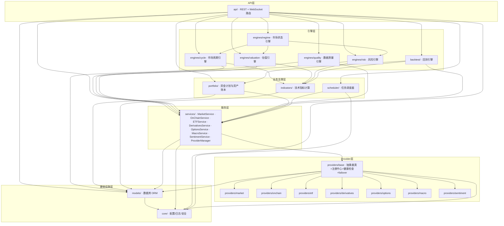
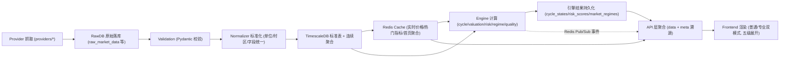

# 03 · 系统模块图

> BTC 全市场智能研究平台 · 模块划分、依赖关系与通信协议
>
> 文档版本：v1.0 ｜ 状态：架构基线 ｜ 关联文档：[01-产品架构](./01-product-architecture.md)、[02-技术架构](./02-technical-architecture.md)

---

## 概述

本文档定义平台的**模块级架构**：全部后端模块的 Mermaid 依赖关系图、每个模块的职责/输入/输出/关键接口/代码路径、模块间通信协议，以及模块隔离原则。

模块划分与既有项目骨架目录一一对应（`backend/app/` 下），是后续编码阶段目录结构与代码评审的依据。**任何模块可独立替换而不影响其他模块**是本文档的最高设计约束。

## 目录

- [1. 模块依赖关系图](#1-模块依赖关系图)
- [2. 模块详细说明](#2-模块详细说明)
- [3. 模块间通信协议](#3-模块间通信协议)
- [4. 模块隔离原则](#4-模块隔离原则)
- [5. 模块与代码目录映射](#5-模块与代码目录映射)

---

## 1. 模块依赖关系图

### 1.1 全局模块依赖（Mermaid）

依赖箭头方向 = 「依赖于 / 调用」。禁止出现反向依赖与循环依赖。



### 1.2 分层依赖规则（速查）

| 规则 | 说明 |
|------|------|
| API → Engine / Service / Portfolio | API 层可调用引擎与服务，不越过 Service 直接调 Provider |
| Engine → Service / Indicators | 引擎不直接调用 Provider，取数一律经 Service |
| Service → providers/base（ProviderManager） | Service 不 import 任何具体 Provider 实现，只面向注册中心与抽象接口 |
| providers/base → providers/* | 注册中心加载具体 Provider；具体 Provider 之间互不依赖 |
| 所有模块 → models / core | ORM 与配置/日志是被动的公共底座，不含业务逻辑，不反向依赖任何上层 |
| backtest → portfolio | 回测引擎复用资金计划模型做「计划历史演练」，portfolio 不感知 backtest |

---

## 2. 模块详细说明

### 2.1 providers/base — Provider 抽象基类与注册中心

| 项 | 内容 |
|----|------|
| 职责描述 | 定义全部数据源统一接口契约；Provider 注册/发现/启停；健康检查与智能评分；自动故障切换（failover）与自动恢复（Recovery Threshold）；每 Provider 独立网络配置（代理/超时/重试/限流/自定义 DNS）；Failover Event 记录 |
| 输入 | 具体 Provider 实现（providers/* 注册进来）；数据库中的 Provider 配置与健康记录（models）；core 配置与日志 |
| 输出 | 向 services/ 提供「按优先级取数 + 自动切换 + 数据状态标注」的统一取数能力；向 engines/quality、api（数据源中心页）提供健康状态与 failover 事件；向 Redis 发布 provider_failover / provider_recovery 事件 |
| 关键接口 | `DataProvider`（抽象基类：health_check / fetch / capabilities）；`ProviderRegistry`（register / get / list / enable / disable）；`ProviderManager`（fetch_with_failover / get_current_source / get_health_snapshot）；`ProviderScorer`（score / adjust_priority / lock_priority） |
| 对应代码路径 | `backend/app/providers/base/` |

### 2.2 providers/market — 市场行情数据源

| 项 | 内容 |
|----|------|
| 职责描述 | 实现 BTC 现货行情类数据的抓取适配器：Binance、OKX、Coinbase、Kraken、Bybit 等；覆盖价格、OHLCV、成交量、市值、订单簿、价差、CVD；每交易所一个独立 Provider 类，互不影响 |
| 输入 | 各交易所公开 API（经独立网络配置）；providers/base 的抽象契约与调度 |
| 输出 | 原始响应 + 标准化行情数据 → Data Layer（raw/normalized 表）；健康记录 → providers/base |
| 关键接口 | `get_current_price()` / `get_ohlcv(interval, start, end)` / `get_volume()` / `get_market_cap()` / `get_orderbook()` / `get_ath()`；历史批量接口 `fetch_history_range()`（支持 Checkpoint 分段） |
| 对应代码路径 | `backend/app/providers/market/` |

### 2.3 providers/onchain — 链上数据源

| 项 | 内容 |
|----|------|
| 职责描述 | 链上指标与交易所资金流数据抓取：MVRV、Realized Cap、SOPR/aSOPR/LTH-SOPR、NUPL、Puell、RHODL、Reserve Risk、HODL Waves、活跃/新增地址、交易所流入/流出/净流量、矿工流、鲸鱼活动、Coin Days Destroyed 等；多供应商适配（如 Glassnode、CryptoQuant 及替代源） |
| 输入 | 链上数据供应商 API（需 API Key，加密存储）；providers/base 调度 |
| 输出 | 原始 + 标准化链上时序数据 → Data Layer；数据延迟与完整性记录 → providers/base |
| 关键接口 | `get_mvrv()` / `get_sopr()` / `get_nupl()` / `get_exchange_flow()` / `get_exchange_reserve()` / `get_holder_supply()` / `get_metric(metric_key, start, end)`（通用指标接口，新指标零改动接入） |
| 对应代码路径 | `backend/app/providers/onchain/` |

### 2.4 providers/etf — ETF 数据源

| 项 | 内容 |
|----|------|
| 职责描述 | 现货 BTC ETF 每日流量与持仓数据抓取：Daily Inflow/Outflow、Net Flow、7D/30D/90D、累计流量、各 ETF 持仓量；多源适配（如 Farside 及替代源） |
| 输入 | ETF 数据发布方 API/页面数据接口；providers/base 调度 |
| 输出 | 原始 + 标准化 ETF 流量时序 → Data Layer |
| 关键接口 | `get_etf_flow(date_range)` / `get_etf_holdings()` / `get_cumulative_flow()` |
| 对应代码路径 | `backend/app/providers/etf/` |

### 2.5 providers/derivatives — 衍生品数据源

| 项 | 内容 |
|----|------|
| 职责描述 | 永续/期货衍生品数据抓取：Funding Rate、Open Interest、清算数据、多空比、基差、溢价、Taker Buy/Sell、CVD；多交易所适配（Binance、OKX、Bybit、Coinglass 聚合等） |
| 输入 | 各交易所衍生品 API 与聚合数据商 API；providers/base 调度 |
| 输出 | 原始 + 标准化衍生品时序 → Data Layer；极端清算事件 → 市场事件时间线 |
| 关键接口 | `get_funding()` / `get_open_interest()` / `get_liquidation()` / `get_long_short_ratio()` / `get_basis()` / `get_taker_flow()` |
| 对应代码路径 | `backend/app/providers/derivatives/` |

### 2.6 providers/options — 期权数据源

| 项 | 内容 |
|----|------|
| 职责描述 | BTC 期权数据抓取：Open Interest、成交量、隐含波动率（IV）、Put/Call 比、Skew、Gamma、到期分布；主要适配 Deribit 及其他期权数据源 |
| 输入 | 期权交易所 API（如 Deribit）；providers/base 调度 |
| 输出 | 原始 + 标准化期权时序 → Data Layer |
| 关键接口 | `get_options_oi()` / `get_iv()` / `get_put_call_ratio()` / `get_skew()` / `get_gamma_exposure()` / `get_expirations()` |
| 对应代码路径 | `backend/app/providers/options/` |

### 2.7 providers/macro — 宏观数据源

| 项 | 内容 |
|----|------|
| 职责描述 | 宏观经济数据抓取：DXY、Fed 利率、2Y/10Y 国债、实际收益率、CPI、PCE、失业率、NFP、GDP、M2、Fed 资产负债表、全球流动性；**强制区分 Observation Date / Release Date / Revision Date**（防修订泄漏） |
| 输入 | FRED 等宏观数据 API；providers/base 调度 |
| 输出 | 原始 + 标准化宏观时序（含三日期字段）→ Data Layer；宏观日历事件（FOMC/CPI/PCE 发布）→ 市场事件时间线 |
| 关键接口 | `get_macro_series(series_key, start, end)` / `get_release_calendar()` / `get_revision_history(series_key)` |
| 对应代码路径 | `backend/app/providers/macro/` |

### 2.8 providers/sentiment — 情绪数据源

| 项 | 内容 |
|----|------|
| 职责描述 | 市场情绪数据抓取：Fear & Greed 指数、Google Trends、新闻情绪、社交情绪；多源适配（Alternative.me 等） |
| 输入 | 情绪数据 API；providers/base 调度 |
| 输出 | 原始 + 标准化情绪时序 → Data Layer |
| 关键接口 | `get_fear_greed()` / `get_google_trends()` / `get_news_sentiment()` / `get_social_sentiment()` |
| 对应代码路径 | `backend/app/providers/sentiment/` |

### 2.9 services/ — 业务服务层

| 项 | 内容 |
|----|------|
| 职责描述 | 按数据域封装的统一 Provider 调用入口（业务层唯一取数通道）：MarketService、OnChainService、ETFService、DerivativesService、OptionsService、MacroService、SentimentService；负责「实时取数 or 历史读库」路由决策（历史数据原则上直读本地 TimescaleDB）；触发多源交叉验证；为返回数据附加元信息（source、fetch_time、quality_status、confidence） |
| 输入 | providers/base（ProviderManager）；models（历史数据读库）；Redis 缓存；engines/quality 的验证规则 |
| 输出 | 带溯源元数据的业务数据对象 → engines/*、api/、portfolio/、backtest/、scheduler/；缓存更新 → Redis；数据更新事件 → Redis Pub/Sub |
| 关键接口 | 每个 Service 提供 `get_latest_*()` / `get_history_*(start, end, interval)` / `get_status()`（当前数据源与质量状态）；内部统一经 `ProviderManager.fetch_with_failover()` |
| 对应代码路径 | `backend/app/services/` |

### 2.10 engines/quality — 数据质量引擎

| 项 | 内容 |
|----|------|
| 职责描述 | 数据质量中枢：缺失检测（Gap Detection）、多源冲突检测与裁决（Cross Validation：Median/VWAP/Deviation → VERIFIED/CONFLICT）、自动补洞（生成补洞任务交给采集链路）、数据覆盖率统计、同步进度跟踪、数据状态标记（VERIFIED/ESTIMATED/STALE/CONFLICT） |
| 输入 | services/（多源比对数据）；models（raw/normalized 表、data_quality 表、sync_checkpoints） |
| 输出 | 质量报告与告警 → api（数据质量页）、Redis Pub/Sub（quality_alert）；补洞任务 → scheduler/采集链路；质量状态标记回写 → models |
| 关键接口 | `detect_gaps(dataset, range)` / `cross_validate(dataset, timestamp)` / `create_backfill_tasks()` / `get_coverage_report()` / `get_quality_status(dataset)` |
| 对应代码路径 | `backend/app/engines/quality/` |

### 2.11 engines/cycle — 市场周期引擎

| 项 | 内容 |
|----|------|
| 职责描述 | 综合价格、趋势、链上、估值、资金、ETF、衍生品、宏观、情绪识别 BTC 当前周期阶段（九阶段：深度熊市/熊市/底部构筑/恢复/趋势上涨/加速上涨/高位分配/顶部风险/下跌）；**禁止按四年周期硬编码**；输出阶段 + 置信度 + 主要证据 + 反向证据 + 历史相似阶段；每次状态变化持久化（cycle_states） |
| 输入 | services/（全数据域）；indicators/（趋势与动量指标）；本地历史库（历史相似阶段匹配） |
| 输出 | 周期状态 → api（市场周期页、首页）、engines/regime；历史阶段序列 → backtest/、历史回放 |
| 关键接口 | `identify_current_cycle()` / `get_cycle_history(range)` / `find_similar_historical_phases()` / `get_evidence_chain(cycle_id)` |
| 对应代码路径 | `backend/app/engines/cycle/` |

### 2.12 engines/valuation — 估值引擎

| 项 | 内容 |
|----|------|
| 职责描述 | 基于 MVRV、Realized Cap、成本基础、历史分位数、周期位置、长期趋势、回撤，输出五档估值状态（深度低估/低估/合理/偏高/极端高估）；每个状态附完整依据链；**任何估值状态不得解释为「未来一定上涨」** |
| 输入 | services/（OnChainService、MarketService）；indicators/（历史分位计算） |
| 输出 | 估值状态 → api（估值页、首页）、engines/risk、engines/regime、backtest/（估值加仓策略因子） |
| 关键接口 | `get_valuation_state()` / `get_valuation_history(range)` / `get_percentile(metric)` / `get_evidence_chain()` |
| 对应代码路径 | `backend/app/engines/valuation/` |

### 2.13 engines/risk — 风险引擎

| 项 | 内容 |
|----|------|
| 职责描述 | 独立风险分析：估值风险、波动风险、杠杆风险、Funding 风险、OI 风险、清算风险、流动性风险、宏观风险、链上异常、市场拥挤度、回撤风险 → 汇总为 Trend / Valuation / Leverage / Liquidity / Macro / On-chain / Overall Risk 七项评分；每项支持展开全部原因；评分历史持久化（risk_scores） |
| 输入 | services/（DerivativesService、MarketService、MacroService、OnChainService）；indicators/（波动率、ATR、回撤）；engines/valuation（估值风险因子） |
| 输出 | 风险评分 → api（风险页、首页）、engines/regime、backtest/（风险调整策略因子）、portfolio/（回撤容忍度告警） |
| 关键接口 | `get_risk_scores()` / `get_risk_history(range)` / `get_risk_factors(risk_type)` / `check_breach(plan_tolerance)` |
| 对应代码路径 | `backend/app/engines/risk/` |

### 2.14 engines/regime — 市场状态引擎

| 项 | 内容 |
|----|------|
| 职责描述 | Multi-Factor 综合状态机：聚合 Trend / Valuation / Capital Flow / On-chain / Derivative / Macro / Sentiment / Risk / Cycle 九个维度状态 → 输出 Market Regime；**不输出 BUY/SELL**；每次 Regime 变化持久化（market_regimes），支持回看任意日期「当时系统判断了什么」；关键数据源刚切换时置信度自动降低 |
| 输入 | engines/cycle、engines/valuation、engines/risk；services/（趋势、资金流、宏观、情绪状态） |
| 输出 | Market Regime → api（首页综合状态卡、历史回放）；状态变更事件 → Redis Pub/Sub；信号记录（signals） |
| 关键接口 | `get_current_regime()` / `get_regime_at(date)`（历史回放核心）/ `get_regime_history(range)` / `get_factor_states()` |
| 对应代码路径 | `backend/app/engines/regime/` |

### 2.15 indicators/ — 技术指标计算

| 项 | 内容 |
|----|------|
| 职责描述 | 纯计算库：MA、EMA、RSI、MACD、ADX、ATR、Bollinger Bands、Volume Profile、Historical Volatility、Percentile 等；指标字典化管理（indicator_definitions：公式、参数、数学定义、为什么重要）；计算结果持久化（indicator_values）；**无副作用、不取数**——只接收标准化的时序数据并返回指标值 |
| 输入 | 调用方传入的标准化 OHLCV/时序数据（来源为 services/ 或本地库，由调用方负责）；models（指标定义与结果表） |
| 输出 | 指标值 → engines/*、backtest/、api（行情页、历史回放）；指标定义 → api（普通/专业模式的「为什么重要」「公式」展开层） |
| 关键接口 | `calculate(indicator_key, data, params)` / `calculate_batch(keys, data)` / `get_definition(indicator_key)` / `get_percentile(indicator_key, value, window)` |
| 对应代码路径 | `backend/app/indicators/` |

### 2.16 backtest/ — 回测引擎

| 项 | 内容 |
|----|------|
| 职责描述 | 真正的历史回测：支持 2015 至今全历史（随数据积累自动扩展）；输入初始资金/定期投入/策略/周期/手续费/滑点，输出最终资产、总投入、收益、年化、最大回撤、最长回撤、恢复时间、Sharpe、Sortino、最佳/最差年份、BTC 数量、平均成本、手续费；**强制五防**：Look-ahead Bias、Future Leakage、Survivorship Bias、Revision Leakage、Data Snooping；宏观数据严格按 Release Date 对齐；支持 In-Sample / Out-of-Sample / Walk-Forward / 参数敏感性 / 极端行情测试；回测结果永久绑定模型版本与数据版本 |
| 输入 | services/（历史数据，只读本地库）；indicators/；portfolio/（用户计划作为回测输入）；策略定义（策略实验室） |
| 输出 | 回测结果（backtest_runs / backtest_results）→ api（策略回测页、首页「我的计划历史演练」卡）；模型验证报告 → 模型实验室 |
| 关键接口 | `run_backtest(strategy, params, range)` / `walk_forward(strategy, config)` / `sensitivity_analysis(run_id, param)` / `get_result(run_id)` / `assert_no_leakage(run_id)`（泄漏自检） |
| 对应代码路径 | `backend/app/backtest/` |

### 2.17 portfolio/ — 个人资金计划与资产账本

| 项 | 内容 |
|----|------|
| 职责描述 | 用户资金计划管理（初始资金、每月/每周投入、定投周期、起止日期、币种、现金储备、最大单次投入、额外加仓规则、最大回撤容忍度、投资期限、计划名称，全部可配置）；资产账本（手工记录买入：时间/价格/数量/手续费；累计投入、持仓、平均成本、市值、浮盈亏、收益率、最大回撤；预留交易所 API 导入但**默认禁止自动交易**）；定投策略模拟（固定/下跌加仓/回撤加仓/估值加仓/风险调整/周期调整/自定义）；组合快照持久化（portfolio_snapshots） |
| 输入 | models（用户数据表）；services/（当前价格用于市值计算）；engines/risk（回撤容忍度告警）；engines/valuation、engines/cycle（估值/周期调整型定投因子） |
| 输出 | 计划与资产数据 → api（我的计划/我的资产/定投模拟页、首页个人卡片）；计划参数 → backtest/（「我的计划历史演练」）；快照 → 历史回放 |
| 关键接口 | `create_plan()` / `update_plan()` / `record_transaction()` / `get_holdings()` / `get_portfolio_curve(range)` / `simulate_dca(strategy, range)` / `get_next_investment_date(plan_id)` |
| 对应代码路径 | `backend/app/portfolio/` |

### 2.18 scheduler/ — 任务调度器

| 项 | 内容 |
|----|------|
| 职责描述 | 全部数据采集任务的定义与生命周期管理：market_1m / market_5m / market_1h / market_1d / onchain_1h / etf_daily / macro_daily / derivatives_5m 等；支持运行/暂停/恢复/重试/失败/跳过/手动执行；任务优先级（核心数据优先）；Checkpoint 持久化（崩溃后断点续传，如已同步至 2021-05-01 则重启后从 2021-05-02 继续）；APScheduler 4.0 + PostgreSQL Job Store |
| 输入 | core/（配置）；models（system_jobs、sync_checkpoints）；Redis（commands:task_run 手动指令）；engines/quality（补洞任务注入） |
| 输出 | 触发 services/ 执行采集；任务状态 → Redis Pub/Sub（events:task_status）→ api（系统任务页）；任务记录 → models |
| 关键接口 | `register_job()` / `pause_job()` / `resume_job()` / `trigger_now(job_id)` / `get_job_status()` / `save_checkpoint()` / `load_checkpoint()` |
| 对应代码路径 | `backend/app/scheduler/` |

### 2.19 api/ — REST API 路由

| 项 | 内容 |
|----|------|
| 职责描述 | 对外唯一接口层：REST `/api/v1/*`（行情、链上、ETF、衍生品、期权、宏观、情绪、周期、估值、风险、Regime、历史回放、计划、资产、回测、数据源中心、数据质量、任务、后台管理）+ WebSocket（实时价格、Provider 状态、任务进度）；统一响应包裹（data + meta 溯源信息 + error）；中间件链（CORS → Rate Limit → JWT → RBAC → 输入验证）；版本化管理保障长期兼容 |
| 输入 | engines/*、services/、portfolio/、backtest/、scheduler/、models；core/（安全与配置） |
| 输出 | JSON / WS 消息 → 前端；审计日志 → models（audit_logs）；手动任务指令 → Redis Pub/Sub |
| 关键接口 | 路由组：`/market` `/onchain` `/etf` `/derivatives` `/options` `/macro` `/sentiment` `/cycle` `/valuation` `/risk` `/regime` `/replay` `/plans` `/portfolio` `/backtest` `/providers` `/quality` `/jobs` `/admin` `/auth`；WS：`/ws/market` `/ws/system` `/ws/tasks` |
| 对应代码路径 | `backend/app/api/`（v1 路由位于 `backend/app/api/v1/`） |

### 2.20 models/ — 数据库 ORM

| 项 | 内容 |
|----|------|
| 职责描述 | SQLAlchemy 2.0 声明式模型，映射全部核心数据表：assets、providers、provider_health、provider_failover_events、provider_requests、raw_market_data、market_prices、candles、orderbooks、onchain_metrics、exchange_flows、etf_flows、derivatives、options_data、macro_series、sentiment、indicators、indicator_definitions、indicator_values、cycle_states、valuation_states、risk_scores、market_regimes、signals、model_versions、model_weights、backtest_runs、backtest_results、user_plans、user_transactions、user_holdings、portfolio_snapshots、data_quality、sync_checkpoints、system_jobs、audit_logs；**所有核心数据表强制包含 source_id / observation_time / fetch_time / created_at / updated_at / quality_status**；TimescaleDB Hypertable 与连续聚合定义 |
| 输入 | core/（数据库连接配置） |
| 输出 | ORM 模型与仓储接口 → 全部上层模块（被动底座，不含业务逻辑） |
| 关键接口 | 模型类 + Repository 模式读写封装（`*Repository.get_range()` / `.upsert()` / `.latest()`）；Alembic 迁移基线 |
| 对应代码路径 | `backend/app/models/`（迁移：`backend/migrations/`） |

### 2.21 core/ — 配置、日志、安全

| 项 | 内容 |
|----|------|
| 职责描述 | 横切基础设施：配置中心（pydantic-settings，环境变量/.env 注入，嵌套前缀约定）；日志（loguru 结构化日志、按进程分文件轮转、脱敏）；安全（JWT 签发/校验、密码哈希、API Key Fernet 加密/解密、RBAC 依赖注入、Rate Limit 工具）；Redis / 数据库连接工厂；统一异常与错误码定义 |
| 输入 | 环境变量 / .env 文件 |
| 输出 | settings 单例、logger、安全工具、连接工厂 → 全部模块（最底层，不依赖任何业务模块） |
| 关键接口 | `get_settings()` / `get_logger()` / `create_access_token()` / `encrypt_secret()` / `decrypt_secret()` / `get_redis()` / `get_session()` |
| 对应代码路径 | `backend/app/core/` |

---

## 3. 模块间通信协议

### 3.1 三种通信方式

| 方式 | 适用场景 | 协议/机制 |
|------|---------|----------|
| **同步调用** | Service → Provider（经 ProviderManager）；API → Engine/Service；Engine → Service/Indicators | Python 进程内 async 函数调用，面向抽象接口，依赖注入传递实例 |
| **异步事件** | failover 事件、Provider 恢复、数据更新、质量告警、任务状态、手动任务指令 | Redis Pub/Sub 频道广播（见 02 文档 3.3 节频道表）；事件只含 ID 与摘要，订阅方回查数据库 |
| **数据流（存储中介）** | 跨进程、跨时间的数据传递 | 数据库表 + Redis 缓存作为中介，模块间不直接传递大数据体 |

### 3.2 主数据流管道

```
Provider → RawDB → Normalizer → Cache → Engine → API → Frontend
```



管道纪律：

1. **单向流动**：数据只能沿管道向下游流动，下游不得向上游写回（质量状态标记回写除外，且仅由 engines/quality 执行）；
2. **Raw 不可变**：原始数据只追加不修改，标准化数据可由 Raw 重算（Provider 更换后重新分析历史）；
3. **校验前置**：未通过 Validation 的数据进入隔离区，绝不进入标准表；
4. **计算可重放**：Engine 输出全部持久化并绑定输入数据版本，任意历史时刻可重放。

### 3.3 同步调用链约定

```
API Route → (RBAC 依赖) → Engine/Service → ProviderManager → Provider 实现
                                   ↓
                        models Repository (历史数据直读本地库)
```

- Service 调用 ProviderManager 时声明数据类别（data_category），由 ProviderManager 决定当前应使用哪个 Provider（优先级 + 健康评分 + 锁定策略）；
- 调用返回统一结果对象：`FetchResult(data, source, quality_status, confidence, error)`；
- Engine 之间允许单向依赖（regime → cycle/valuation/risk），禁止循环。

### 3.4 事件协议约定

统一事件体 Schema（见 02 文档 4.3 节）。发布纪律：

- 只有 providers/base、engines/quality、scheduler/ 有权发布系统级事件；
- 事件消费失败不影响发布方（fire-and-forget + 数据库兜底）；
- 所有 failover / 质量告警事件同时落库（provider_failover_events / data_quality），保证「故障可追踪」不依赖 Redis 存活。

---

## 4. 模块隔离原则

### 4.1 五条铁律

| # | 原则 | 落地机制 | 违反后果示例（禁止发生） |
|---|------|---------|------------------------|
| 1 | **Provider 不与业务逻辑耦合** | Provider 只做「抓取 + 按契约返回标准化结果」，不写业务判断、不算指标、不直接操作业务表 | 在 BinanceProvider 里写「若价格跌破 MA200 则…」 |
| 2 | **Engine 不直接调用 Provider，通过 Service 层** | Engine 的构造函数只注入 Service 接口；代码评审禁止 engine 文件中出现 `import providers.*`（providers/base 的抽象类型除外） | Cycle Engine 直接请求 Glassnode API，Glassnode 失效导致周期引擎整体重写 |
| 3 | **Frontend 不直接访问数据库，通过 API 层** | 前端只消费 REST/WS；数据库凭据绝不出现在前端环境变量 | 前端直连 PG 导致凭据泄露、Schema 变更击穿前端 |
| 4 | **任何模块可独立替换而不影响其他模块** | 面向接口编程 + 依赖注入；Provider 替换只改注册配置；引擎替换保持接口签名；Service 替换 Provider A→B→C 时业务层零修改 | 某数据公司停服 → 需要修改几十个业务模块（明确禁止） |
| 5 | **公共底座不含业务** | models/ 与 core/ 只做数据映射与横切能力，禁止出现业务规则；业务规则只存在于 engines/、services/、portfolio/、backtest/ | 在 ORM 模型里写估值判断逻辑，导致模型层无法独立迁移 |

### 4.2 替换场景演练（架构验收用例）

| 场景 | 期望行为 | 涉及模块 |
|------|---------|---------|
| Provider A 永久停服 | 管理后台禁用 A → ProviderManager 自动使用 B → 业务层/前端/引擎/数据库**零修改** | providers/base、后台管理 |
| 新增数据源 Provider E | 实现抽象接口 + 注册 + 配置优先级/代理 → 立即参与 failover 与交叉验证 | providers/*、providers/base |
| 更换估值算法 | 新 Valuation Engine 实现同一接口 → 旧版本结果保留（模型版本化）→ API/前端零修改 | engines/valuation、models |
| 前端整体重构 | API 契约不变 → 新前端直接对接 | api/、frontend |
| 数据库迁移升级 | Alembic 迁移 + 备份恢复演练 → 历史数据零丢失 | models/、core/ |
| Redis 整体故障 | API 直读数据库、前端轮询降级、采集主链路不受影响 | 全模块（隔离性验证） |

### 4.3 目录即边界

- 每个模块一个独立 Python 包（目录 + `__init__.py`），模块公开接口在 `__init__.py` 显式导出；
- 跨模块 import 只允许 import 对方导出的公开接口，禁止深入对方私有子模块；
- 每个 Provider 独立文件/子包、每个 Engine 独立子包——**不做成巨型 Python 文件**；
- 依赖方向由 CI 静态检查（import-linter 或等价工具）强制，循环依赖构建失败。

---

## 5. 模块与代码目录映射

```
backend/
├── app/
│   ├── api/                  # 2.19 api/ — REST + WebSocket 路由
│   │   └── v1/               #      版本化路由
│   ├── backtest/             # 2.16 backtest/ — 回测引擎
│   ├── core/                 # 2.21 core/ — 配置(config.py)、日志(logging.py)、安全
│   ├── engines/
│   │   ├── cycle/            # 2.11 市场周期引擎
│   │   ├── quality/          # 2.10 数据质量引擎
│   │   ├── regime/           # 2.14 市场状态引擎
│   │   ├── risk/             # 2.13 风险引擎
│   │   └── valuation/        # 2.12 估值引擎
│   ├── indicators/           # 2.15 技术指标计算（纯计算库）
│   ├── models/               # 2.20 数据库 ORM（全部核心表）
│   ├── portfolio/            # 2.17 个人资金计划与资产账本
│   ├── providers/
│   │   ├── base/             # 2.1 抽象基类 + 注册中心 + 健康检查 + failover
│   │   ├── derivatives/      # 2.5 衍生品数据源
│   │   ├── etf/              # 2.4 ETF 数据源
│   │   ├── macro/            # 2.7 宏观数据源
│   │   ├── market/           # 2.2 市场行情数据源
│   │   ├── onchain/          # 2.3 链上数据源
│   │   ├── options/          # 2.6 期权数据源
│   │   └── sentiment/        # 2.8 情绪数据源
│   ├── scheduler/            # 2.18 任务调度器
│   ├── schemas/              # Pydantic 出入参 Schema（api 层契约，跨模块共享 DTO）
│   ├── services/             # 2.9 业务服务层（统一 Provider 调用入口）
│   ├── utils/                # 通用工具（无业务语义）
│   └── main.py               # FastAPI 应用装配入口
├── migrations/               # Alembic 数据库迁移
├── scripts/                  # 运维脚本（备份/恢复/安装）
└── tests/                    # 测试（Provider 单测、failover、泄漏测试等）

frontend/
└── src/
    ├── app/                  # Next.js App Router 页面
    ├── components/           # UI 组件（结论卡、数据健康条、图表封装）
    ├── hooks/                # 数据获取/WS 订阅 hooks
    ├── lib/                  # API client、类型（由 OpenAPI 生成）
    ├── stores/               # 全局状态（普通/专业模式开关等）
    └── types/                # 共享类型定义
```

> 补充说明：`schemas/` 与 `utils/` 为骨架中的辅助模块——`schemas/` 承载 Pydantic DTO（API 契约与模块间数据对象），`utils/` 承载无业务语义的通用工具；二者遵守与 models/core 相同的「不含业务规则」纪律。

---

## 附：模块 ↔ 产品导航映射

| 产品导航（01 文档第 4 节） | 主要支撑模块 |
|---------------------------|-------------|
| 首页 | api → engines/regime + engines/risk + engines/cycle + engines/valuation + portfolio + services |
| BTC 行情 | api → services/market → providers/market；indicators |
| 市场周期 / 估值 / 风险 | engines/cycle、engines/valuation、engines/risk |
| 链上 / 资金流 / ETF / 衍生品 / Options / 宏观 / 情绪 | services/* → providers/*（对应域） |
| 历史回放 | engines/regime（get_regime_at）+ models（全部状态持久化表） |
| 我的计划 / 我的资产 / 定投模拟 | portfolio |
| 策略回测 / 策略实验室 / 模型实验室 | backtest + engines/*（模型版本化 models） |
| AI 研究助手 | api → services（只读真实数据）+ LLM 接入（禁止编造） |
| 数据源中心 | providers/base（健康/评分/failover 事件） |
| 数据质量 | engines/quality |
| 系统任务 | scheduler |
| 后台管理 | api/admin + core（安全）+ models（audit_logs、Provider 配置） |
