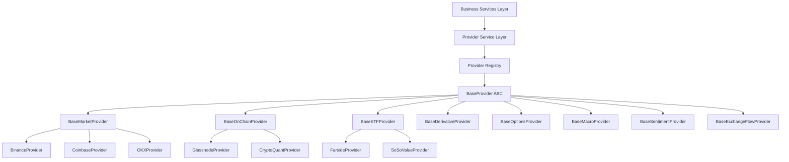
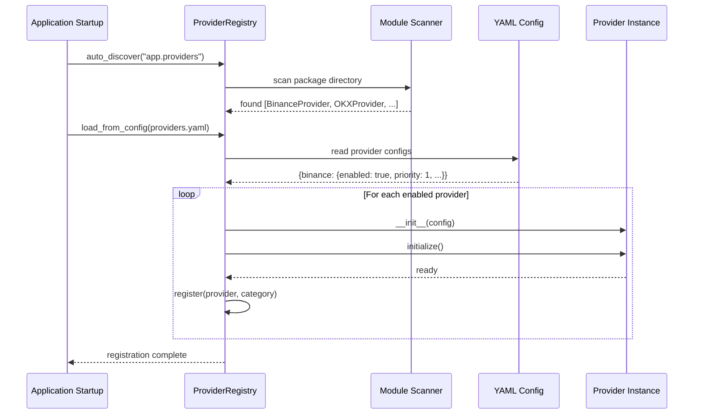
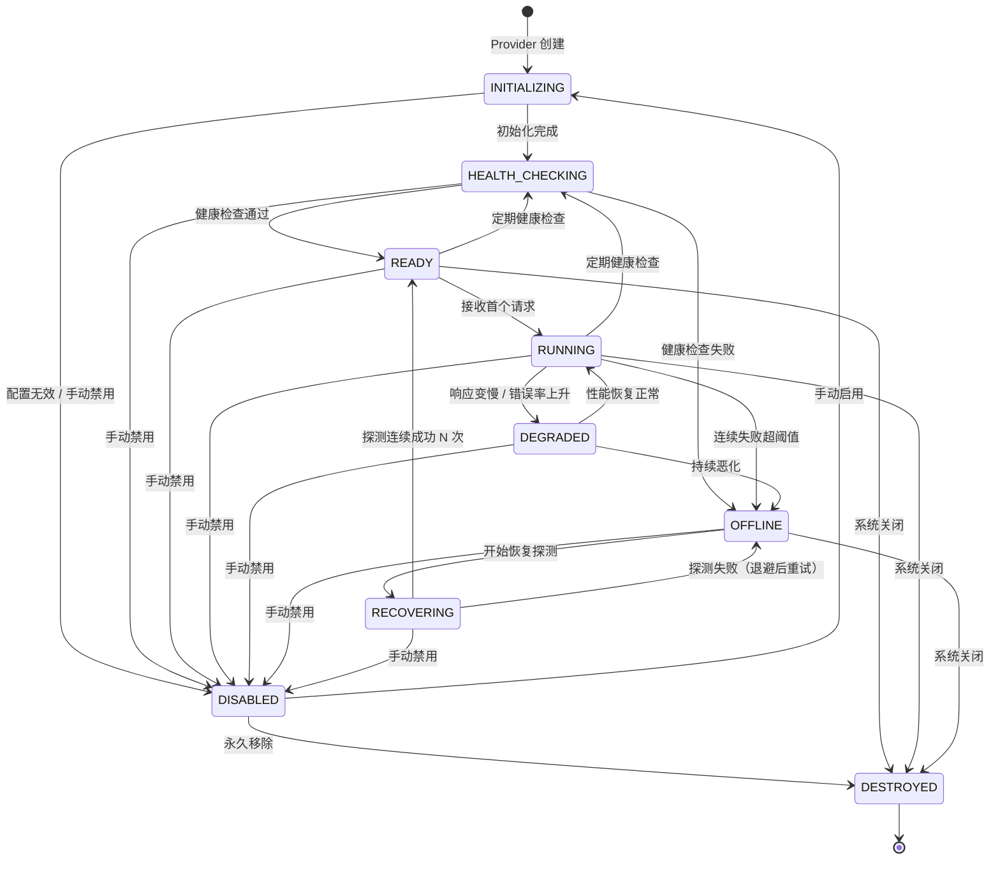
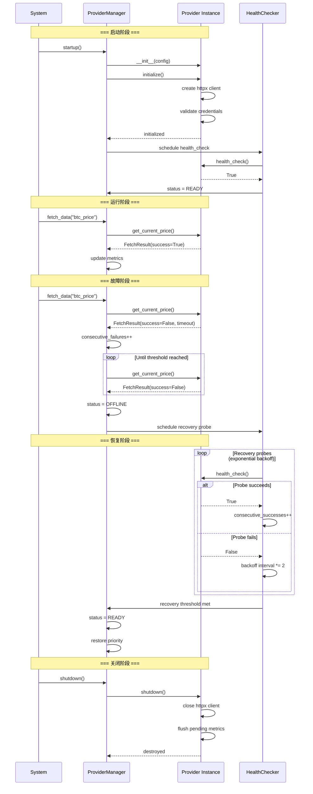
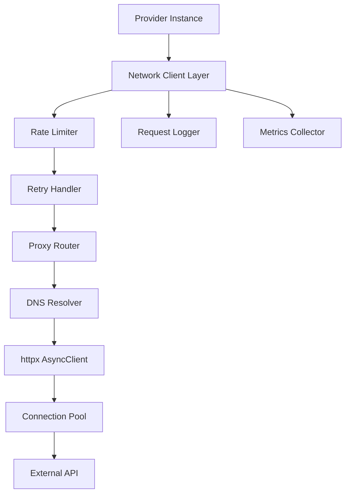

# Provider 多数据源架构

## 概述

本文档定义 BTC 全市场智能研究平台的 Provider 抽象层架构。系统运行于中国大陆网络环境，任何外部 API 都可能随时失效，因此「多数据源、高可用、自动故障切换」是最高级别的基础架构要求。

核心设计原则：
- **零耦合**：业务层不直接依赖任何具体 Provider
- **可替换**：任意 Provider 停止服务不影响系统整体
- **可观测**：每个 Provider 具备完整健康状态与评分
- **可配置**：代理、超时、重试、限流等均可独立配置
- **可扩展**：新增 Provider 仅需实现接口 + 注册配置

---

## 目录

1. [Provider 抽象层设计](#1-provider-抽象层设计)
2. [Provider 分类体系](#2-provider-分类体系)
3. [统一接口定义](#3-统一接口定义)
4. [Provider 注册与发现机制](#4-provider-注册与发现机制)
5. [Provider 配置格式](#5-provider-配置格式)
6. [Provider 生命周期管理](#6-provider-生命周期管理)
7. [网络层设计](#7-网络层设计)

---

## 1. Provider 抽象层设计

### 1.1 分层架构



### 1.2 BaseProvider ABC 类设计

```python
from abc import ABC, abstractmethod
from dataclasses import dataclass, field
from datetime import datetime
from enum import Enum
from typing import Any, Optional
from uuid import UUID


class ProviderStatus(Enum):
    """Provider 运行状态枚举。"""
    INITIALIZING = "initializing"
    HEALTH_CHECKING = "health_checking"
    READY = "ready"
    RUNNING = "running"
    DEGRADED = "degraded"
    OFFLINE = "offline"
    RECOVERING = "recovering"
    DISABLED = "disabled"
    DESTROYED = "destroyed"


class HealthState(Enum):
    """Provider 健康状态枚举。"""
    ONLINE = "online"
    DEGRADED = "degraded"
    SLOW = "slow"
    RATE_LIMITED = "rate_limited"
    AUTH_ERROR = "auth_error"
    NETWORK_ERROR = "network_error"
    DATA_ERROR = "data_error"
    OFFLINE = "offline"
    DISABLED = "disabled"


@dataclass
class ProviderConfig:
    """Provider 配置数据类。"""
    name: str
    enabled: bool = True
    priority: int = 1
    base_url: str = ""
    api_key: Optional[str] = None
    api_secret: Optional[str] = None
    timeout: float = 10.0
    connect_timeout: float = 5.0
    read_timeout: float = 10.0
    write_timeout: float = 10.0
    retry_count: int = 3
    retry_backoff_base: float = 1.0
    retry_backoff_max: float = 60.0
    rate_limit: int = 60           # requests per window
    rate_limit_window: int = 60    # seconds
    proxy: Optional[str] = None    # http://, https://, socks5://
    dns_resolver: Optional[str] = None
    headers: dict[str, str] = field(default_factory=dict)
    keep_alive: bool = True
    max_connections: int = 20
    verify_ssl: bool = True
    extra: dict[str, Any] = field(default_factory=dict)


@dataclass
class ProviderMetadata:
    """Provider 元信息。"""
    provider_id: UUID
    name: str
    category: str               # market / onchain / etf / derivatives / ...
    description: str
    supported_symbols: list[str]
    supported_intervals: list[str]
    data_coverage_start: Optional[datetime] = None
    documentation_url: Optional[str] = None
    version: str = "1.0.0"


@dataclass
class FetchResult:
    """统一数据获取结果封装。"""
    success: bool
    data: Any = None
    error: Optional[str] = None
    error_code: Optional[str] = None
    provider_name: str = ""
    fetch_time: datetime = field(default_factory=datetime.utcnow)
    observation_time: Optional[datetime] = None
    latency_ms: float = 0.0
    quality_status: str = "VERIFIED"  # VERIFIED / ESTIMATED / STALE / CONFLICT / INVALID
    metadata: dict[str, Any] = field(default_factory=dict)


class BaseProvider(ABC):
    """所有 Provider 的顶层抽象基类。

    设计约束：
    - 子类必须实现所有 @abstractmethod
    - 子类不得持有业务逻辑，仅负责数据获取与格式转换
    - 子类不得直接写入数据库，由 Service 层统一处理
    """

    def __init__(self, config: ProviderConfig):
        self._config = config
        self._status = ProviderStatus.INITIALIZING
        self._health_state = HealthState.OFFLINE
        self._metadata: Optional[ProviderMetadata] = None
        self._client = None  # httpx.AsyncClient
        self._consecutive_failures: int = 0
        self._consecutive_successes: int = 0
        self._last_success_time: Optional[datetime] = None
        self._last_failure_time: Optional[datetime] = None
        self._total_requests: int = 0
        self._total_failures: int = 0

    @property
    def name(self) -> str:
        return self._config.name

    @property
    def status(self) -> ProviderStatus:
        return self._status

    @property
    def health_state(self) -> HealthState:
        return self._health_state

    @property
    def priority(self) -> int:
        return self._config.priority

    # ---- 生命周期方法 ----

    @abstractmethod
    async def initialize(self) -> None:
        """初始化 Provider：创建 HTTP Client、验证配置、建立连接池。"""
        ...

    @abstractmethod
    async def health_check(self) -> bool:
        """执行健康检查，返回 True 表示可用。"""
        ...

    @abstractmethod
    async def shutdown(self) -> None:
        """优雅关闭：释放连接池、清理资源。"""
        ...

    # ---- 元信息 ----

    @abstractmethod
    def get_metadata(self) -> ProviderMetadata:
        """返回 Provider 元信息。"""
        ...

    @abstractmethod
    def get_supported_data_types(self) -> list[str]:
        """返回该 Provider 支持的数据类型列表。"""
        ...

    # ---- 统一请求封装 ----

    async def _request(
        self,
        method: str,
        path: str,
        params: Optional[dict] = None,
        headers: Optional[dict] = None,
    ) -> FetchResult:
        """底层 HTTP 请求封装（含重试、限流、超时处理）。

        子类通过此方法发起所有 HTTP 请求，
        框架自动处理：Rate Limiting、Retry、Timeout、Error Classification。
        """
        ...
```

### 1.3 分类基类继承关系

```mermaid
classDiagram
    class BaseProvider {
        <<abstract>>
        +initialize()
        +health_check()
        +shutdown()
        +get_metadata()
        +get_supported_data_types()
        #_request()
    }

    class BaseMarketProvider {
        <<abstract>>
        +get_current_price(symbol)
        +get_ohlcv(symbol, interval, start, end)
        +get_volume(symbol, interval)
        +get_market_cap(symbol)
        +get_order_book(symbol, depth)
        +get_spread(symbol)
        +get_cvd(symbol, interval)
        +get_ath(symbol)
    }

    class BaseOnChainProvider {
        <<abstract>>
        +get_mvrv(date)
        +get_realized_cap(date)
        +get_sopr(date)
        +get_nupl(date)
        +get_puell_multiple(date)
        +get_rhodl(date)
        +get_reserve_risk(date)
        +get_active_addresses(date)
        +get_hodl_waves(date)
        +get_exchange_flow(date)
    }

    class BaseExchangeFlowProvider {
        <<abstract>>
        +get_exchange_reserve(date)
        +get_netflow(date)
        +get_inflow(date)
        +get_outflow(date)
        +get_stablecoin_flow(date)
        +get_whale_flow(date)
    }

    class BaseETFProvider {
        <<abstract>>
        +get_daily_flow(date)
        +get_net_flow(period)
        +get_cumulative_flow(start, end)
        +get_holdings(date)
    }

    class BaseDerivativeProvider {
        <<abstract>>
        +get_funding_rate(symbol)
        +get_open_interest(symbol)
        +get_liquidation(symbol, period)
        +get_long_short_ratio(symbol)
        +get_basis(symbol)
        +get_premium(symbol)
        +get_taker_buy_sell(symbol)
        +get_derivative_cvd(symbol)
    }

    class BaseOptionsProvider {
        <<abstract>>
        +get_options_oi(symbol)
        +get_options_volume(symbol)
        +get_implied_volatility(symbol)
        +get_put_call_ratio(symbol)
        +get_skew(symbol)
        +get_gamma_exposure(symbol)
        +get_expiration_data(symbol)
    }

    class BaseMacroProvider {
        <<abstract>>
        +get_dxy(date)
        +get_fed_rate(date)
        +get_treasury_yield(maturity, date)
        +get_real_yield(date)
        +get_cpi(date)
        +get_pce(date)
        +get_unemployment(date)
        +get_nfp(date)
        +get_gdp(date)
        +get_m2(date)
        +get_fed_balance_sheet(date)
        +get_global_liquidity(date)
    }

    class BaseSentimentProvider {
        <<abstract>>
        +get_fear_greed(date)
        +get_google_trends(keyword)
        +get_news_sentiment(period)
        +get_social_sentiment(period)
    }

    BaseProvider <|-- BaseMarketProvider
    BaseProvider <|-- BaseOnChainProvider
    BaseProvider <|-- BaseExchangeFlowProvider
    BaseProvider <|-- BaseETFProvider
    BaseProvider <|-- BaseDerivativeProvider
    BaseProvider <|-- BaseOptionsProvider
    BaseProvider <|-- BaseMacroProvider
    BaseProvider <|-- BaseSentimentProvider
```



### 1.4 统一方法签名规范

所有 Provider 方法必须遵循以下规范：

| 规范项 | 要求 |
|--------|------|
| 返回类型 | 统一返回 `FetchResult` 或 `list[FetchResult]` |
| 异步 | 所有 I/O 方法必须为 `async def` |
| 参数命名 | snake_case，时间参数统一为 `datetime` 类型 |
| 时间时区 | 所有时间参数和返回值均为 UTC |
| 错误处理 | 方法内不抛出异常，通过 `FetchResult.success` 标识 |
| 幂等性 | 相同参数多次调用返回一致结果 |
| 超时 | 遵循 `ProviderConfig` 中的超时配置 |
| 日志 | 关键操作必须记录结构化日志 |

---

## 2. Provider 分类体系

### 2.1 八大 Provider 类别总览

> **注**：数据库 ENUM `provider_category` 包含 9 个值（详见 09-core-tables.md）：MARKET / ONCHAIN / EXCHANGE_FLOW / ETF / DERIVATIVES / OPTIONS / MACRO / SENTIMENT / NEWS。其中 NEWS 为预留类别（当前新闻数据通过 Sentiment Provider 采集），未来可独立拆分。

| 类别 | 基类 | 数据类型 | 更新频率 | 典型 Provider |
|------|------|----------|----------|---------------|
| 市场行情 | `BaseMarketProvider` | BTC Price, OHLCV, Volume, Market Cap, ATH, Order Book, Spread, CVD | 1m / 5m / 1h | Binance, Coinbase, OKX, Kraken, Bybit |
| 链上数据 | `BaseOnChainProvider` | MVRV, Realized Cap, SOPR, NUPL, Puell, RHODL, Reserve Risk, Active Addresses, HODL Waves | 1h / 1d | Glassnode, CryptoQuant, IntoTheBlock |
| 交易所资金流 | `BaseExchangeFlowProvider` | Exchange Reserve, Netflow, Inflow, Outflow, Stablecoin Flow, Whale Flow | 1h / 1d | CryptoQuant, Glassnode, Whale Alert |
| ETF | `BaseETFProvider` | Daily Inflow/Outflow, Net Flow, 7D/30D/90D, Cumulative, Holdings | 1d | Farside, SoSoValue, BitMEX Research |
| 衍生品 | `BaseDerivativeProvider` | Funding Rate, OI, Liquidation, Long/Short Ratio, Basis, Premium, Taker Buy/Sell, CVD | 5m / 1h | Binance Futures, Bybit, Coinglass, OKX |
| 期权 | `BaseOptionsProvider` | OI, Volume, IV, Put/Call, Skew, Gamma, Expiration | 1h / 1d | Deribit, OKX Options, Coinglass |
| 宏观 | `BaseMacroProvider` | DXY, Fed Rate, 2Y/10Y, Real Yield, CPI, PCE, Unemployment, NFP, GDP, M2, Fed Balance Sheet | 1d | FRED, Trading Economics, Investing.com |
| 情绪 | `BaseSentimentProvider` | Fear & Greed, Google Trends, News Sentiment, Social Sentiment | 1h / 1d | Alternative.me, Google Trends, LunarCrush |

### 2.2 各类别数据覆盖详情

#### MarketDataProvider — 市场行情

| 数据项 | 方法 | 返回类型 | 说明 |
|--------|------|----------|------|
| BTC 当前价格 | `get_current_price()` | `PriceData` | 最新成交价 + 时间戳 |
| OHLCV K线 | `get_ohlcv()` | `list[Candle]` | 支持 1m/5m/15m/1h/4h/1d/1w |
| 成交量 | `get_volume()` | `VolumeData` | 24h 成交量 |
| 市值 | `get_market_cap()` | `MarketCapData` | 流通市值 |
| 历史最高价 | `get_ath()` | `ATHData` | ATH + 日期 + 回撤百分比 |
| 订单簿 | `get_order_book()` | `OrderBookData` | 买卖盘深度 |
| 价差 | `get_spread()` | `SpreadData` | Bid-Ask Spread |
| CVD | `get_cvd()` | `CVDData` | 累计成交量差 |

#### OnChainProvider — 链上数据

| 数据项 | 方法 | 返回类型 | 说明 |
|--------|------|----------|------|
| MVRV | `get_mvrv()` | `OnChainMetric` | 市值/已实现市值比 |
| Realized Cap | `get_realized_cap()` | `OnChainMetric` | 已实现市值 |
| SOPR | `get_sopr()` | `OnChainMetric` | 花费产出利润率 |
| aSOPR | `get_asopr()` | `OnChainMetric` | 调整后 SOPR |
| LTH-SOPR | `get_lth_sopr()` | `OnChainMetric` | 长期持有者 SOPR |
| NUPL | `get_nupl()` | `OnChainMetric` | 未实现净利润率 |
| Puell Multiple | `get_puell_multiple()` | `OnChainMetric` | 矿工收入倍数 |
| RHODL | `get_rhodl()` | `OnChainMetric` | RHODL 比率 |
| Reserve Risk | `get_reserve_risk()` | `OnChainMetric` | 储备风险 |
| Realized Profit/Loss | `get_realized_profit_loss()` | `OnChainMetric` | 已实现盈亏 |
| LTH/STH Supply | `get_supply_by_holder()` | `OnChainMetric` | 长短期持有者供应量 |
| Active Addresses | `get_active_addresses()` | `OnChainMetric` | 活跃地址数 |
| New Addresses | `get_new_addresses()` | `OnChainMetric` | 新增地址数 |
| Transaction Count | `get_transaction_count()` | `OnChainMetric` | 交易笔数 |
| HODL Waves | `get_hodl_waves()` | `OnChainMetric` | 持币时间分布 |
| Coin Days Destroyed | `get_coin_days_destroyed()` | `OnChainMetric` | 币天销毁 |
| Dormancy | `get_dormancy()` | `OnChainMetric` | 休眠度 |
| Supply Last Active | `get_supply_last_active()` | `OnChainMetric` | 最后活跃供应 |

#### ExchangeFlowProvider — 交易所资金流

| 数据项 | 方法 | 返回类型 |
|--------|------|----------|
| Exchange Reserve | `get_exchange_reserve()` | `ExchangeFlowData` |
| Netflow | `get_netflow()` | `ExchangeFlowData` |
| Inflow | `get_inflow()` | `ExchangeFlowData` |
| Outflow | `get_outflow()` | `ExchangeFlowData` |
| Stablecoin Flow | `get_stablecoin_flow()` | `ExchangeFlowData` |
| Whale Flow | `get_whale_flow()` | `ExchangeFlowData` |
| Miner Flow | `get_miner_flow()` | `ExchangeFlowData` |

#### ETFProvider — ETF 数据

| 数据项 | 方法 | 返回类型 |
|--------|------|----------|
| 每日流入 | `get_daily_inflow()` | `ETFFlowData` |
| 每日流出 | `get_daily_outflow()` | `ETFFlowData` |
| 净流量 | `get_net_flow()` | `ETFFlowData` |
| 7D/30D/90D | `get_period_flow()` | `ETFFlowData` |
| 累计流量 | `get_cumulative_flow()` | `ETFFlowData` |
| ETF 持仓量 | `get_holdings()` | `ETFHoldingsData` |

#### DerivativeProvider — 衍生品

| 数据项 | 方法 | 返回类型 |
|--------|------|----------|
| Funding Rate | `get_funding_rate()` | `FundingData` |
| Open Interest | `get_open_interest()` | `OpenInterestData` |
| Liquidation | `get_liquidation()` | `LiquidationData` |
| Long/Short Ratio | `get_long_short_ratio()` | `RatioData` |
| Basis | `get_basis()` | `BasisData` |
| Premium | `get_premium()` | `PremiumData` |
| Taker Buy/Sell | `get_taker_buy_sell()` | `TakerData` |
| Derivative CVD | `get_derivative_cvd()` | `CVDData` |

#### OptionsProvider — 期权

| 数据项 | 方法 | 返回类型 |
|--------|------|----------|
| Options OI | `get_options_oi()` | `OptionsOIData` |
| Options Volume | `get_options_volume()` | `OptionsVolumeData` |
| Implied Volatility | `get_implied_volatility()` | `IVData` |
| Put/Call Ratio | `get_put_call_ratio()` | `PutCallData` |
| Volatility Skew | `get_skew()` | `SkewData` |
| Gamma Exposure | `get_gamma_exposure()` | `GammaData` |
| Expiration | `get_expiration_data()` | `ExpirationData` |

#### MacroProvider — 宏观经济

| 数据项 | 方法 | 返回类型 | 更新频率 |
|--------|------|----------|----------|
| DXY | `get_dxy()` | `MacroDataPoint` | 日 |
| Fed Rate | `get_fed_rate()` | `MacroDataPoint` | 会议日 |
| 2Y Treasury | `get_treasury_yield("2y")` | `MacroDataPoint` | 日 |
| 10Y Treasury | `get_treasury_yield("10y")` | `MacroDataPoint` | 日 |
| Real Yield | `get_real_yield()` | `MacroDataPoint` | 日 |
| CPI | `get_cpi()` | `MacroDataPoint` | 月 |
| PCE | `get_pce()` | `MacroDataPoint` | 月 |
| Unemployment | `get_unemployment()` | `MacroDataPoint` | 月 |
| NFP | `get_nfp()` | `MacroDataPoint` | 月 |
| GDP | `get_gdp()` | `MacroDataPoint` | 季 |
| M2 | `get_m2()` | `MacroDataPoint` | 月 |
| Fed Balance Sheet | `get_fed_balance_sheet()` | `MacroDataPoint` | 周 |
| Global Liquidity | `get_global_liquidity()` | `MacroDataPoint` | 月 |

> **宏观数据特殊要求**：必须区分 `observation_date`（数据所属期）、`release_date`（首次发布日期）、`revision_date`（修订日期），防止 Look-ahead Bias。

#### SentimentProvider — 市场情绪

| 数据项 | 方法 | 返回类型 |
|--------|------|----------|
| Fear & Greed Index | `get_fear_greed()` | `SentimentData` |
| Google Trends | `get_google_trends()` | `TrendsData` |
| News Sentiment | `get_news_sentiment()` | `NewsSentimentData` |
| Social Sentiment | `get_social_sentiment()` | `SocialSentimentData` |

---

## 3. 统一接口定义

### 3.1 核心数据类型定义

```python
from dataclasses import dataclass
from datetime import datetime
from decimal import Decimal
from enum import Enum
from typing import Optional


@dataclass
class PriceData:
    """价格数据。"""
    symbol: str                    # e.g., "BTC/USDT"
    price: Decimal                 # 当前价格
    bid: Optional[Decimal]         # 买一价
    ask: Optional[Decimal]         # 卖一价
    timestamp: datetime            # 数据观测时间 (UTC)
    source: str                    # Provider 名称


@dataclass
class Candle:
    """K 线数据。"""
    symbol: str
    interval: str                  # 1m, 5m, 15m, 1h, 4h, 1d, 1w
    open_time: datetime
    close_time: datetime
    open: Decimal
    high: Decimal
    low: Decimal
    close: Decimal
    volume: Decimal
    quote_volume: Optional[Decimal] = None
    trade_count: Optional[int] = None


@dataclass
class OnChainMetric:
    """链上指标通用结构。"""
    metric_name: str               # e.g., "mvrv", "sopr"
    value: Decimal
    date: datetime                 # 数据所属日期
    resolution: str = "1d"         # 1h / 1d
    source: str = ""
    metadata: dict = field(default_factory=dict)


@dataclass
class FundingData:
    """资金费率数据。"""
    symbol: str
    funding_rate: Decimal          # 当期费率
    predicted_rate: Optional[Decimal] = None
    next_funding_time: Optional[datetime] = None
    timestamp: datetime = None
    source: str = ""


@dataclass
class ExchangeFlowData:
    """交易所资金流数据。"""
    exchange: Optional[str]        # 具体交易所，None 表示全网
    flow_type: str                 # inflow / outflow / netflow / reserve
    amount_btc: Decimal
    amount_usd: Optional[Decimal] = None
    date: datetime = None
    source: str = ""


@dataclass
class ETFFlowData:
    """ETF 资金流数据。"""
    fund_name: str                 # e.g., "IBIT", "FBTC"
    flow_type: str                 # daily_inflow / daily_outflow / net / cumulative
    amount_usd: Decimal
    amount_btc: Optional[Decimal] = None
    date: datetime = None
    period: Optional[str] = None   # 7d / 30d / 90d
    source: str = ""


@dataclass
class MacroDataPoint:
    """宏观经济数据点。"""
    indicator: str                 # e.g., "cpi", "fed_rate", "dxy"
    value: Decimal
    observation_date: datetime     # 数据所属期
    release_date: Optional[datetime] = None   # 首次发布日期
    revision_date: Optional[datetime] = None  # 修订日期
    unit: str = ""                 # percent / index / billions
    source: str = ""


@dataclass
class SentimentData:
    """情绪数据通用结构。"""
    indicator: str                 # fear_greed / social_score / news_score
    value: float                   # 0-100 或 -1 ~ 1
    label: Optional[str] = None    # "Extreme Greed" / "Fear" 等
    timestamp: datetime = None
    source: str = ""
```

### 3.2 完整接口列表（按类别）

#### BaseMarketProvider 接口

```python
class BaseMarketProvider(BaseProvider):
    """市场行情 Provider 基类。"""

    @abstractmethod
    async def get_current_price(self, symbol: str = "BTC/USDT") -> FetchResult:
        """获取当前价格。返回 FetchResult[data=PriceData]"""
        ...

    @abstractmethod
    async def get_ohlcv(
        self,
        symbol: str = "BTC/USDT",
        interval: str = "1h",
        start: Optional[datetime] = None,
        end: Optional[datetime] = None,
        limit: int = 500,
    ) -> FetchResult:
        """获取 K 线数据。返回 FetchResult[data=list[Candle]]"""
        ...

    @abstractmethod
    async def get_volume(
        self, symbol: str = "BTC/USDT", interval: str = "24h"
    ) -> FetchResult:
        """获取成交量。返回 FetchResult[data=VolumeData]"""
        ...

    @abstractmethod
    async def get_market_cap(self, symbol: str = "BTC") -> FetchResult:
        """获取市值。返回 FetchResult[data=MarketCapData]"""
        ...

    @abstractmethod
    async def get_ath(self, symbol: str = "BTC") -> FetchResult:
        """获取历史最高价。返回 FetchResult[data=ATHData]"""
        ...

    @abstractmethod
    async def get_order_book(
        self, symbol: str = "BTC/USDT", depth: int = 20
    ) -> FetchResult:
        """获取订单簿。返回 FetchResult[data=OrderBookData]"""
        ...

    @abstractmethod
    async def get_spread(self, symbol: str = "BTC/USDT") -> FetchResult:
        """获取买卖价差。返回 FetchResult[data=SpreadData]"""
        ...

    @abstractmethod
    async def get_cvd(
        self, symbol: str = "BTC/USDT", interval: str = "1h"
    ) -> FetchResult:
        """获取累计成交量差 (CVD)。返回 FetchResult[data=CVDData]"""
        ...

    @abstractmethod
    async def get_batch_ohlcv(
        self,
        symbol: str,
        interval: str,
        start: datetime,
        end: datetime,
    ) -> FetchResult:
        """批量获取历史 K 线（用于历史同步）。"""
        ...
```

#### BaseOnChainProvider 接口

```python
class BaseOnChainProvider(BaseProvider):
    """链上数据 Provider 基类。"""

    @abstractmethod
    async def get_mvrv(self, date: Optional[datetime] = None) -> FetchResult:
        """MVRV Ratio。"""
        ...

    @abstractmethod
    async def get_realized_cap(self, date: Optional[datetime] = None) -> FetchResult:
        """已实现市值。"""
        ...

    @abstractmethod
    async def get_sopr(self, date: Optional[datetime] = None) -> FetchResult:
        """SOPR（花费产出利润率）。"""
        ...

    @abstractmethod
    async def get_asopr(self, date: Optional[datetime] = None) -> FetchResult:
        """调整后 SOPR。"""
        ...

    @abstractmethod
    async def get_lth_sopr(self, date: Optional[datetime] = None) -> FetchResult:
        """长期持有者 SOPR。"""
        ...

    @abstractmethod
    async def get_nupl(self, date: Optional[datetime] = None) -> FetchResult:
        """NUPL（未实现净利润率）。"""
        ...

    @abstractmethod
    async def get_puell_multiple(self, date: Optional[datetime] = None) -> FetchResult:
        """Puell Multiple。"""
        ...

    @abstractmethod
    async def get_rhodl(self, date: Optional[datetime] = None) -> FetchResult:
        """RHODL Ratio。"""
        ...

    @abstractmethod
    async def get_reserve_risk(self, date: Optional[datetime] = None) -> FetchResult:
        """Reserve Risk。"""
        ...

    @abstractmethod
    async def get_realized_profit_loss(self, date: Optional[datetime] = None) -> FetchResult:
        """已实现盈亏。"""
        ...

    @abstractmethod
    async def get_supply_by_holder(self, date: Optional[datetime] = None) -> FetchResult:
        """LTH/STH Supply 分布。"""
        ...

    @abstractmethod
    async def get_active_addresses(self, date: Optional[datetime] = None) -> FetchResult:
        """活跃地址数。"""
        ...

    @abstractmethod
    async def get_new_addresses(self, date: Optional[datetime] = None) -> FetchResult:
        """新增地址数。"""
        ...

    @abstractmethod
    async def get_transaction_count(self, date: Optional[datetime] = None) -> FetchResult:
        """链上交易笔数。"""
        ...

    @abstractmethod
    async def get_hodl_waves(self, date: Optional[datetime] = None) -> FetchResult:
        """HODL Waves 分布。"""
        ...

    @abstractmethod
    async def get_coin_days_destroyed(self, date: Optional[datetime] = None) -> FetchResult:
        """币天销毁 (CDD)。"""
        ...

    @abstractmethod
    async def get_dormancy(self, date: Optional[datetime] = None) -> FetchResult:
        """休眠度。"""
        ...

    @abstractmethod
    async def get_metric_history(
        self, metric: str, start: datetime, end: datetime
    ) -> FetchResult:
        """批量获取某链上指标的历史序列。"""
        ...
```

#### BaseETFProvider 接口

```python
class BaseETFProvider(BaseProvider):
    """ETF 数据 Provider 基类。"""

    @abstractmethod
    async def get_daily_flow(self, date: Optional[datetime] = None) -> FetchResult:
        """获取指定日期 ETF 每日净流入/流出。返回 list[ETFFlowData]"""
        ...

    @abstractmethod
    async def get_net_flow(
        self, period: str = "7d", end_date: Optional[datetime] = None
    ) -> FetchResult:
        """获取指定周期净流量。period: 1d/7d/30d/90d"""
        ...

    @abstractmethod
    async def get_cumulative_flow(
        self, start: datetime, end: datetime
    ) -> FetchResult:
        """获取累计流量序列。"""
        ...

    @abstractmethod
    async def get_holdings(self, date: Optional[datetime] = None) -> FetchResult:
        """获取 ETF 持仓量 (BTC)。"""
        ...

    @abstractmethod
    async def get_all_funds_flow(self, date: Optional[datetime] = None) -> FetchResult:
        """获取所有 ETF 基金的分基金流量明细。"""
        ...
```

#### BaseDerivativeProvider 接口

```python
class BaseDerivativeProvider(BaseProvider):
    """衍生品 Provider 基类。"""

    @abstractmethod
    async def get_funding_rate(
        self, symbol: str = "BTC/USDT", limit: int = 1
    ) -> FetchResult:
        """获取资金费率（当前/历史）。"""
        ...

    @abstractmethod
    async def get_open_interest(
        self, symbol: str = "BTC/USDT"
    ) -> FetchResult:
        """获取未平仓合约量。"""
        ...

    @abstractmethod
    async def get_liquidation(
        self, symbol: str = "BTC/USDT", period: str = "1h"
    ) -> FetchResult:
        """获取清算数据。"""
        ...

    @abstractmethod
    async def get_long_short_ratio(
        self, symbol: str = "BTC/USDT"
    ) -> FetchResult:
        """获取多空比。"""
        ...

    @abstractmethod
    async def get_basis(self, symbol: str = "BTC/USDT") -> FetchResult:
        """获取基差。"""
        ...

    @abstractmethod
    async def get_premium(self, symbol: str = "BTC/USDT") -> FetchResult:
        """获取溢价率。"""
        ...

    @abstractmethod
    async def get_taker_buy_sell(
        self, symbol: str = "BTC/USDT", interval: str = "1h"
    ) -> FetchResult:
        """获取主动买卖量。"""
        ...

    @abstractmethod
    async def get_derivative_cvd(
        self, symbol: str = "BTC/USDT", interval: str = "1h"
    ) -> FetchResult:
        """获取衍生品 CVD。"""
        ...
```

#### BaseOptionsProvider 接口

```python
class BaseOptionsProvider(BaseProvider):
    """期权 Provider 基类。"""

    @abstractmethod
    async def get_options_oi(self, symbol: str = "BTC") -> FetchResult:
        """期权未平仓量。"""
        ...

    @abstractmethod
    async def get_options_volume(self, symbol: str = "BTC") -> FetchResult:
        """期权成交量。"""
        ...

    @abstractmethod
    async def get_implied_volatility(self, symbol: str = "BTC") -> FetchResult:
        """隐含波动率。"""
        ...

    @abstractmethod
    async def get_put_call_ratio(self, symbol: str = "BTC") -> FetchResult:
        """Put/Call Ratio。"""
        ...

    @abstractmethod
    async def get_skew(self, symbol: str = "BTC") -> FetchResult:
        """波动率偏斜。"""
        ...

    @abstractmethod
    async def get_gamma_exposure(self, symbol: str = "BTC") -> FetchResult:
        """Gamma 敞口。"""
        ...

    @abstractmethod
    async def get_expiration_data(self, symbol: str = "BTC") -> FetchResult:
        """到期日数据。"""
        ...
```

#### BaseMacroProvider 接口

```python
class BaseMacroProvider(BaseProvider):
    """宏观经济 Provider 基类。"""

    @abstractmethod
    async def get_dxy(self, date: Optional[datetime] = None) -> FetchResult:
        """美元指数。"""
        ...

    @abstractmethod
    async def get_fed_rate(self, date: Optional[datetime] = None) -> FetchResult:
        """联邦基金利率。"""
        ...

    @abstractmethod
    async def get_treasury_yield(
        self, maturity: str = "10y", date: Optional[datetime] = None
    ) -> FetchResult:
        """国债收益率。maturity: 2y / 5y / 10y / 30y"""
        ...

    @abstractmethod
    async def get_real_yield(self, date: Optional[datetime] = None) -> FetchResult:
        """实际收益率（TIPS）。"""
        ...

    @abstractmethod
    async def get_cpi(self, date: Optional[datetime] = None) -> FetchResult:
        """CPI 消费者物价指数。"""
        ...

    @abstractmethod
    async def get_pce(self, date: Optional[datetime] = None) -> FetchResult:
        """PCE 个人消费支出。"""
        ...

    @abstractmethod
    async def get_unemployment(self, date: Optional[datetime] = None) -> FetchResult:
        """失业率。"""
        ...

    @abstractmethod
    async def get_nfp(self, date: Optional[datetime] = None) -> FetchResult:
        """非农就业。"""
        ...

    @abstractmethod
    async def get_gdp(self, date: Optional[datetime] = None) -> FetchResult:
        """GDP。"""
        ...

    @abstractmethod
    async def get_m2(self, date: Optional[datetime] = None) -> FetchResult:
        """M2 货币供应量。"""
        ...

    @abstractmethod
    async def get_fed_balance_sheet(self, date: Optional[datetime] = None) -> FetchResult:
        """美联储资产负债表。"""
        ...

    @abstractmethod
    async def get_global_liquidity(self, date: Optional[datetime] = None) -> FetchResult:
        """全球流动性指数。"""
        ...

    @abstractmethod
    async def get_macro_series(
        self, indicator: str, start: datetime, end: datetime
    ) -> FetchResult:
        """批量获取宏观指标历史序列。"""
        ...
```

#### BaseSentimentProvider 接口

```python
class BaseSentimentProvider(BaseProvider):
    """市场情绪 Provider 基类。"""

    @abstractmethod
    async def get_fear_greed(self, date: Optional[datetime] = None) -> FetchResult:
        """恐惧贪婪指数 (0-100)。"""
        ...

    @abstractmethod
    async def get_google_trends(
        self, keyword: str = "bitcoin", period: str = "7d"
    ) -> FetchResult:
        """Google Trends 搜索热度。"""
        ...

    @abstractmethod
    async def get_news_sentiment(self, period: str = "24h") -> FetchResult:
        """新闻情绪评分。"""
        ...

    @abstractmethod
    async def get_social_sentiment(self, period: str = "24h") -> FetchResult:
        """社交媒体情绪评分。"""
        ...
```

### 3.3 Service 层调用规范

业务层通过 Service 调用 Provider，不直接依赖具体 Provider：

```python
class MarketService:
    """市场行情服务 — 业务层唯一入口。"""

    def __init__(self, registry: ProviderRegistry):
        self._registry = registry

    async def get_btc_price(self) -> FetchResult:
        """获取 BTC 价格（自动选择最优 Provider + Failover）。"""
        providers = self._registry.get_providers(
            category="market",
            data_type="current_price",
        )
        return await self._execute_with_failover(providers, "get_current_price")

    async def _execute_with_failover(
        self, providers: list[BaseProvider], method: str, **kwargs
    ) -> FetchResult:
        """按优先级执行，失败自动切换。"""
        ...
```

---

## 4. Provider 注册与发现机制

### 4.1 ProviderRegistry 设计

```python
from typing import Optional, Type
import importlib
import pkgutil


class ProviderRegistry:
    """Provider 注册中心（单例模式）。

    职责：
    1. 管理所有已注册 Provider 实例
    2. 按类别/数据类型/优先级查询 Provider
    3. 支持运行时动态启用/禁用
    4. 支持自动扫描注册
    """

    _instance: Optional["ProviderRegistry"] = None

    def __new__(cls) -> "ProviderRegistry":
        if cls._instance is None:
            cls._instance = super().__new__(cls)
            cls._instance._providers: dict[str, BaseProvider] = {}
            cls._instance._categories: dict[str, list[str]] = {}
        return cls._instance

    def register(self, provider: BaseProvider, category: str) -> None:
        """注册 Provider 实例。"""
        ...

    def unregister(self, provider_name: str) -> None:
        """注销 Provider。"""
        ...

    def get_provider(self, name: str) -> Optional[BaseProvider]:
        """按名称获取 Provider。"""
        ...

    def get_providers(
        self,
        category: Optional[str] = None,
        data_type: Optional[str] = None,
        enabled_only: bool = True,
    ) -> list[BaseProvider]:
        """按条件查询 Provider 列表（已按优先级排序）。"""
        ...

    def enable_provider(self, name: str) -> None:
        """运行时启用 Provider。"""
        ...

    def disable_provider(self, name: str) -> None:
        """运行时禁用 Provider。"""
        ...

    def update_priority(self, name: str, new_priority: int) -> None:
        """动态更新 Provider 优先级。"""
        ...

    def auto_discover(self, package_path: str = "app.providers") -> None:
        """自动扫描 providers/ 目录，发现并注册所有 Provider。"""
        ...

    def load_from_config(self, config: dict) -> None:
        """从 YAML 配置文件加载并注册 Provider。"""
        ...
```

### 4.2 自动扫描注册流程



### 4.3 Provider 发现规则

| 规则 | 说明 |
|------|------|
| 目录约定 | `backend/app/providers/{category}/` |
| 文件命名 | `{provider_name}_provider.py`（小写 + 下划线） |
| 类命名 | `{ProviderName}Provider`（PascalCase） |
| 自动识别 | 扫描所有继承 `BaseProvider` 子类的非抽象类 |
| 配置驱动 | 只有 YAML 中 `enabled: true` 的才会实例化 |
| 冲突处理 | 同名 Provider 以配置为准，代码级重复报错 |

### 4.4 运行时动态管理

```python
# 管理后台 API 示例
@router.post("/providers/{name}/enable")
async def enable_provider(name: str):
    registry = ProviderRegistry()
    registry.enable_provider(name)
    return {"status": "enabled", "provider": name}

@router.post("/providers/{name}/disable")
async def disable_provider(name: str):
    registry = ProviderRegistry()
    registry.disable_provider(name)
    return {"status": "disabled", "provider": name}

@router.put("/providers/{name}/priority")
async def update_priority(name: str, priority: int):
    registry = ProviderRegistry()
    registry.update_priority(name, priority)
    audit_log.record(action="priority_change", provider=name, new_value=priority)
    return {"status": "updated"}
```

---

## 5. Provider 配置格式

### 5.1 完整 YAML 配置示例

```yaml
# config/providers.yaml
# Provider 配置文件 — 声明式注册所有数据源

version: "1.0"

# 全局默认配置（各 Provider 可覆盖）
defaults:
  timeout: 10
  connect_timeout: 5
  read_timeout: 10
  retry_count: 3
  retry_backoff_base: 1.0
  retry_backoff_max: 60.0
  rate_limit: 60
  rate_limit_window: 60
  keep_alive: true
  max_connections: 20
  verify_ssl: true

providers:
  # ======== 市场行情 ========
  market:
    binance:
      enabled: true
      priority: 1
      base_url: "https://api.binance.com"
      api_key: "${BINANCE_API_KEY}"
      api_secret: "${BINANCE_API_SECRET}"
      timeout: 10
      retry_count: 3
      rate_limit: 1200        # requests per minute
      proxy: null             # 直连
      headers:
        User-Agent: "BTC-Platform/1.0"
      supported_symbols: ["BTC/USDT", "BTC/USDC"]
      supported_intervals: ["1m", "5m", "15m", "1h", "4h", "1d", "1w"]
      websocket_url: "wss://stream.binance.com:9443/ws"

    okx:
      enabled: true
      priority: 2
      base_url: "https://www.okx.com"
      api_key: "${OKX_API_KEY}"
      api_secret: "${OKX_API_SECRET}"
      api_passphrase: "${OKX_API_PASSPHRASE}"
      timeout: 12
      rate_limit: 600
      proxy: "http://127.0.0.1:7890"   # 需要代理
      supported_symbols: ["BTC/USDT", "BTC-USDT"]
      supported_intervals: ["1m", "5m", "15m", "1h", "4h", "1d"]

    coinbase:
      enabled: true
      priority: 3
      base_url: "https://api.coinbase.com"
      api_key: "${COINBASE_API_KEY}"
      timeout: 15
      rate_limit: 300
      proxy: "socks5://127.0.0.1:1080"
      supported_symbols: ["BTC/USD", "BTC/USDT"]

    kraken:
      enabled: true
      priority: 4
      base_url: "https://api.kraken.com"
      api_key: "${KRAKEN_API_KEY}"
      api_secret: "${KRAKEN_API_SECRET}"
      timeout: 10
      rate_limit: 60
      proxy: "http://127.0.0.1:7890"

    bybit:
      enabled: false          # 暂时禁用
      priority: 5
      base_url: "https://api.bybit.com"
      timeout: 10
      rate_limit: 120

  # ======== 链上数据 ========
  onchain:
    glassnode:
      enabled: true
      priority: 1
      base_url: "https://api.glassnode.com/v1"
      api_key: "${GLASSNODE_API_KEY}"
      timeout: 30
      rate_limit: 30          # 免费版限制
      proxy: "http://127.0.0.1:7890"
      resolution: "24h"

    cryptoquant:
      enabled: true
      priority: 2
      base_url: "https://api.cryptoquant.com/v1"
      api_key: "${CRYPTOQUANT_API_KEY}"
      timeout: 20
      rate_limit: 60
      proxy: "http://127.0.0.1:7890"

    intotheblock:
      enabled: true
      priority: 3
      base_url: "https://api.intotheblock.com"
      api_key: "${INTOTHEBLOCK_API_KEY}"
      timeout: 20
      rate_limit: 100
      proxy: null

  # ======== 交易所资金流 ========
  exchange_flow:
    cryptoquant_flow:
      enabled: true
      priority: 1
      base_url: "https://api.cryptoquant.com/v1"
      api_key: "${CRYPTOQUANT_API_KEY}"
      timeout: 20
      rate_limit: 60
      proxy: "http://127.0.0.1:7890"

    glassnode_flow:
      enabled: true
      priority: 2
      base_url: "https://api.glassnode.com/v1"
      api_key: "${GLASSNODE_API_KEY}"
      timeout: 30
      rate_limit: 30
      proxy: "http://127.0.0.1:7890"

  # ======== ETF ========
  etf:
    farside:
      enabled: true
      priority: 1
      base_url: "https://farside.co.uk"
      timeout: 30
      rate_limit: 10
      proxy: "http://127.0.0.1:7890"
      scrape_mode: true       # 网页抓取模式

    sosovalue:
      enabled: true
      priority: 2
      base_url: "https://api.sosovalue.com"
      api_key: "${SOSVALUE_API_KEY}"
      timeout: 20
      rate_limit: 30
      proxy: "http://127.0.0.1:7890"

  # ======== 衍生品 ========
  derivatives:
    binance_futures:
      enabled: true
      priority: 1
      base_url: "https://fapi.binance.com"
      api_key: "${BINANCE_API_KEY}"
      api_secret: "${BINANCE_API_SECRET}"
      timeout: 10
      rate_limit: 2400
      proxy: null

    coinglass:
      enabled: true
      priority: 2
      base_url: "https://open-api.coinglass.com"
      api_key: "${COINGLASS_API_KEY}"
      timeout: 15
      rate_limit: 30
      proxy: "http://127.0.0.1:7890"

    bybit_derivatives:
      enabled: true
      priority: 3
      base_url: "https://api.bybit.com"
      timeout: 10
      rate_limit: 120
      proxy: "socks5://127.0.0.1:1080"

  # ======== 期权 ========
  options:
    deribit:
      enabled: true
      priority: 1
      base_url: "https://www.deribit.com/api/v2"
      timeout: 15
      rate_limit: 120
      proxy: "http://127.0.0.1:7890"

    okx_options:
      enabled: true
      priority: 2
      base_url: "https://www.okx.com"
      api_key: "${OKX_API_KEY}"
      timeout: 12
      rate_limit: 600
      proxy: "http://127.0.0.1:7890"

  # ======== 宏观 ========
  macro:
    fred:
      enabled: true
      priority: 1
      base_url: "https://api.stlouisfed.org/fred"
      api_key: "${FRED_API_KEY}"
      timeout: 20
      rate_limit: 120
      proxy: "http://127.0.0.1:7890"

    trading_economics:
      enabled: false
      priority: 2
      base_url: "https://api.tradingeconomics.com"
      api_key: "${TRADING_ECONOMICS_KEY}"
      timeout: 20
      rate_limit: 60
      proxy: "http://127.0.0.1:7890"

  # ======== 情绪 ========
  sentiment:
    alternative_me:
      enabled: true
      priority: 1
      base_url: "https://api.alternative.me"
      timeout: 10
      rate_limit: 30
      proxy: null

    lunarcrush:
      enabled: true
      priority: 2
      base_url: "https://lunarcrush.com/api4"
      api_key: "${LUNARCRUSH_API_KEY}"
      timeout: 15
      rate_limit: 60
      proxy: "http://127.0.0.1:7890"

# ======== Failover 全局配置 ========
failover:
  recovery_threshold: 3       # 连续成功 N 次才恢复
  min_observation_window: 300 # 最小观察窗口（秒）
  max_retry_interval: 3600   # 最大重试间隔（秒）
  anti_flapping:
    enabled: true
    cooldown_period: 300      # 切换冷却期（秒）
    backoff_multiplier: 2.0   # 退避乘数

# ======== 健康检查配置 ========
health_check:
  interval: 60                # 健康检查间隔（秒）
  timeout: 10                 # 健康检查超时
  failure_threshold: 3        # 连续失败 N 次标记为 OFFLINE
  recovery_threshold: 3       # 连续成功 N 次恢复为 ONLINE
```

### 5.2 配置加载与环境变量解析

```python
import os
import re
import yaml
from pathlib import Path


class ConfigLoader:
    """配置加载器 — 支持环境变量插值。"""

    ENV_PATTERN = re.compile(r"\$\{(\w+)\}")

    @classmethod
    def load(cls, config_path: str = "config/providers.yaml") -> dict:
        """加载 YAML 配置并解析环境变量引用。"""
        raw = Path(config_path).read_text(encoding="utf-8")
        resolved = cls._resolve_env_vars(raw)
        return yaml.safe_load(resolved)

    @classmethod
    def _resolve_env_vars(cls, text: str) -> str:
        """将 ${VAR_NAME} 替换为环境变量值。"""
        def replacer(match):
            var_name = match.group(1)
            value = os.environ.get(var_name, "")
            if not value:
                # 不抛异常，允许 key 为空（Provider 可能不需要 key）
                return ""
            return value
        return cls.ENV_PATTERN.sub(replacer, text)
```

---

## 6. Provider 生命周期管理

### 6.1 生命周期状态定义

| 状态 | 说明 | 可接收请求 | 触发条件 |
|------|------|-----------|----------|
| INITIALIZING | 正在初始化 | 否 | Provider 创建时 |
| HEALTH_CHECKING | 正在执行健康检查 | 否 | 初始化完成 / 恢复探测 |
| READY | 就绪待命 | 是 | 健康检查通过 |
| RUNNING | 正常运行中 | 是 | 开始处理请求 |
| DEGRADED | 性能降级 | 是（限流） | 响应变慢 / 部分失败 |
| OFFLINE | 离线不可用 | 否 | 连续失败超阈值 |
| RECOVERING | 恢复探测中 | 否 | OFFLINE 后开始探测 |
| DISABLED | 管理员手动禁用 | 否 | 手动操作 |
| DESTROYED | 已销毁 | 否 | 系统关闭 |

### 6.2 状态转换图



### 6.3 生命周期管理时序



---

## 7. 网络层设计

### 7.1 架构总览



### 7.2 httpx AsyncClient 配置

```python
import httpx
from typing import Optional


class NetworkClientFactory:
    """为每个 Provider 创建独立的 httpx AsyncClient。"""

    @staticmethod
    def create_client(config: ProviderConfig) -> httpx.AsyncClient:
        """根据 Provider 配置创建 HTTP 客户端。"""

        # 超时配置
        timeout = httpx.Timeout(
            connect=config.connect_timeout,
            read=config.read_timeout,
            write=config.write_timeout,
            pool=config.timeout,
        )

        # 连接池配置
        limits = httpx.Limits(
            max_connections=config.max_connections,
            max_keepalive_connections=config.max_connections // 2,
            keepalive_expiry=30.0 if config.keep_alive else 0.0,
        )

        # 代理配置
        proxy = config.proxy  # None 表示直连

        # 自定义请求头
        headers = {
            "User-Agent": "BTC-Platform/1.0",
            "Accept": "application/json",
            **config.headers,
        }

        client = httpx.AsyncClient(
            base_url=config.base_url,
            timeout=timeout,
            limits=limits,
            proxy=proxy,
            headers=headers,
            verify=config.verify_ssl,
            follow_redirects=True,
            http2=True,  # 启用 HTTP/2 多路复用
        )

        return client
```

### 7.3 代理配置策略

每个 Provider 独立代理配置，支持多种协议：

| 代理类型 | 配置格式 | 使用场景 |
|----------|----------|----------|
| 直连 | `proxy: null` | 国内可直连的 API |
| HTTP Proxy | `proxy: "http://127.0.0.1:7890"` | 常规代理 |
| HTTPS Proxy | `proxy: "https://proxy:port"` | 加密代理 |
| SOCKS5 | `proxy: "socks5://127.0.0.1:1080"` | 透明代理 |
| SOCKS5H | `proxy: "socks5h://127.0.0.1:1080"` | DNS 通过代理解析 |

> **设计原则**：不能要求整个系统只能使用一个网络出口。不同 Provider 可配置不同代理线路，实现多线路冗余。

### 7.4 重试策略

```python
import asyncio
import random


class RetryPolicy:
    """指数退避 + Jitter 重试策略。"""

    def __init__(
        self,
        max_retries: int = 3,
        backoff_base: float = 1.0,
        backoff_max: float = 60.0,
        jitter: bool = True,
        retryable_status_codes: set[int] = None,
    ):
        self.max_retries = max_retries
        self.backoff_base = backoff_base
        self.backoff_max = backoff_max
        self.jitter = jitter
        self.retryable_status_codes = retryable_status_codes or {
            429, 500, 502, 503, 504
        }

    def get_delay(self, attempt: int) -> float:
        """计算第 N 次重试的延迟时间。

        公式：min(backoff_max, backoff_base * 2^attempt) + random_jitter
        """
        delay = min(self.backoff_max, self.backoff_base * (2 ** attempt))
        if self.jitter:
            delay += random.uniform(0, delay * 0.1)
        return delay

    def is_retryable(self, status_code: Optional[int], error: Optional[Exception]) -> bool:
        """判断是否应该重试。"""
        if status_code and status_code in self.retryable_status_codes:
            return True
        if isinstance(error, (httpx.TimeoutException, httpx.ConnectError)):
            return True
        return False
```

**重试策略矩阵**：

| 错误类型 | 是否重试 | 最大重试次数 | 退避策略 | 重试后行为 |
|----------|----------|-------------|----------|-----------|
| HTTP 429 | 是 | 2 | Retry-After header 或指数退避 | 降频 |
| HTTP 500 | 是 | 3 | 指数退避 | Failover |
| HTTP 502/503 | 是 | 2 | 短退避 | 立即 Failover |
| Timeout | 是 | 1 | 无 | Failover |
| DNS Failure | 否 | 0 | — | 立即 Failover + 标记网络问题 |
| Connection Refused | 是 | 2 | 指数退避 | Failover |
| HTTP 403 | 否 | 0 | — | 标记不可用 |
| Auth Error (401) | 否 | 0 | — | 标记 + 通知管理员 |
| Data Format Error | 否 | 0 | — | 停止使用 + 通知 |
| SSL Error | 是 | 1 | 无 | Failover |

### 7.5 Rate Limiting（令牌桶算法）

```python
import asyncio
import time


class TokenBucketRateLimiter:
    """令牌桶限流器 — 每个 Provider 独立实例。

    特点：
    - 允许突发流量（桶满时）
    - 平滑长期请求速率
    - 异步友好
    """

    def __init__(self, rate: int, window: int):
        """
        Args:
            rate: 窗口内允许的最大请求数
            window: 时间窗口（秒）
        """
        self.rate = rate
        self.window = window
        self.tokens = float(rate)
        self.last_refill = time.monotonic()
        self._lock = asyncio.Lock()

    async def acquire(self) -> float:
        """获取一个令牌。返回等待时间（秒），0 表示无需等待。"""
        async with self._lock:
            self._refill()
            if self.tokens >= 1.0:
                self.tokens -= 1.0
                return 0.0
            else:
                wait_time = (1.0 - self.tokens) / (self.rate / self.window)
                await asyncio.sleep(wait_time)
                self._refill()
                self.tokens -= 1.0
                return wait_time

    def _refill(self) -> None:
        """根据流逝时间补充令牌。"""
        now = time.monotonic()
        elapsed = now - self.last_refill
        self.tokens = min(self.rate, self.tokens + elapsed * (self.rate / self.window))
        self.last_refill = now


class SlidingWindowRateLimiter:
    """滑动窗口限流器 — 更精确的限制。

    适用于严格限流的 API（如 Glassnode 免费版）。
    """

    def __init__(self, max_requests: int, window_seconds: int):
        self.max_requests = max_requests
        self.window_seconds = window_seconds
        self._requests: list[float] = []
        self._lock = asyncio.Lock()

    async def acquire(self) -> None:
        """等待直到可以发送请求。"""
        async with self._lock:
            now = time.monotonic()
            # 清理过期记录
            self._requests = [
                t for t in self._requests
                if now - t < self.window_seconds
            ]
            if len(self._requests) >= self.max_requests:
                # 等待最早的请求过期
                wait_time = self.window_seconds - (now - self._requests[0])
                await asyncio.sleep(wait_time)
                self._requests = [
                    t for t in self._requests
                    if time.monotonic() - t < self.window_seconds
                ]
            self._requests.append(time.monotonic())
```

### 7.6 自定义 DNS 解析

```python
import socket
import httpx


class CustomDNSResolver:
    """自定义 DNS 解析器。

    应用场景：
    - 系统 DNS 被污染时使用自定义 DNS
    - 指定 IP 直连绕过 DNS 解析
    - DNS 缓存减少解析耗时
    """

    def __init__(self, dns_server: Optional[str] = None, cache_ttl: int = 300):
        self.dns_server = dns_server
        self.cache_ttl = cache_ttl
        self._cache: dict[str, tuple[str, float]] = {}

    async def resolve(self, hostname: str) -> str:
        """解析域名为 IP 地址（带缓存）。"""
        ...

    def get_transport(self) -> httpx.AsyncHTTPTransport:
        """返回使用自定义 DNS 的 transport。"""
        ...
```

### 7.7 请求头自定义

```python
class HeaderManager:
    """请求头管理器。

    每个 Provider 可配置独立的请求头，包括：
    - User-Agent 伪装
    - API Key 注入方式（Header / Query Param）
    - 自定义签名头
    - Content-Type
    - Referer（网页抓取模式）
    """

    @staticmethod
    def build_headers(config: ProviderConfig, endpoint: str) -> dict[str, str]:
        """构建最终请求头。"""
        headers = {
            "User-Agent": "BTC-Platform/1.0",
            "Accept": "application/json",
            "Accept-Encoding": "gzip, deflate",
            "Connection": "keep-alive" if config.keep_alive else "close",
        }
        # 合并 Provider 自定义头
        headers.update(config.headers)
        # 注入 API Key（如果通过 Header 方式）
        if config.api_key and "Authorization" not in headers:
            headers["Authorization"] = f"Bearer {config.api_key}"
        return headers
```

### 7.8 Keep Alive 与连接池

| 参数 | 默认值 | 说明 |
|------|--------|------|
| `max_connections` | 20 | 每个 Provider 最大并发连接数 |
| `max_keepalive_connections` | 10 | 保持活跃的最大连接数 |
| `keepalive_expiry` | 30s | Keep Alive 超时时间 |
| `http2` | true | 启用 HTTP/2 多路复用 |
| `follow_redirects` | true | 自动跟随重定向 |

### 7.9 网络层错误分类

```python
class NetworkErrorClassifier:
    """将底层网络错误分类为统一的错误类型。"""

    @staticmethod
    def classify(error: Exception) -> str:
        """返回错误分类标识。"""
        if isinstance(error, httpx.ConnectTimeout):
            return "CONNECT_TIMEOUT"
        elif isinstance(error, httpx.ReadTimeout):
            return "READ_TIMEOUT"
        elif isinstance(error, httpx.WriteTimeout):
            return "WRITE_TIMEOUT"
        elif isinstance(error, httpx.PoolTimeout):
            return "POOL_TIMEOUT"
        elif isinstance(error, httpx.ConnectError):
            return "CONNECTION_REFUSED"
        elif isinstance(error, httpx.TooManyRedirects):
            return "TOO_MANY_REDIRECTS"
        elif isinstance(error, httpx.DecodingError):
            return "DATA_FORMAT_ERROR"
        elif isinstance(error, socket.gaierror):
            return "DNS_FAILURE"
        elif isinstance(error, httpx.HTTPStatusError):
            return f"HTTP_{error.response.status_code}"
        else:
            return "UNKNOWN_ERROR"
```

---

## 附录 A：目录结构

```
backend/app/providers/
├── __init__.py
├── base/
│   ├── __init__.py
│   ├── base_provider.py          # BaseProvider ABC
│   ├── base_market.py            # BaseMarketProvider
│   ├── base_onchain.py           # BaseOnChainProvider
│   ├── base_exchange_flow.py     # BaseExchangeFlowProvider
│   ├── base_etf.py               # BaseETFProvider
│   ├── base_derivative.py        # BaseDerivativeProvider
│   ├── base_options.py           # BaseOptionsProvider
│   ├── base_macro.py             # BaseMacroProvider
│   └── base_sentiment.py         # BaseSentimentProvider
├── market/
│   ├── __init__.py
│   ├── binance_provider.py
│   ├── okx_provider.py
│   ├── coinbase_provider.py
│   ├── kraken_provider.py
│   └── bybit_provider.py
├── onchain/
│   ├── __init__.py
│   ├── glassnode_provider.py
│   ├── cryptoquant_provider.py
│   └── intotheblock_provider.py
├── exchange_flow/
│   ├── __init__.py
│   └── ...
├── etf/
│   ├── __init__.py
│   ├── farside_provider.py
│   └── sosovalue_provider.py
├── derivatives/
│   ├── __init__.py
│   ├── binance_futures_provider.py
│   ├── coinglass_provider.py
│   └── bybit_derivatives_provider.py
├── options/
│   ├── __init__.py
│   ├── deribit_provider.py
│   └── okx_options_provider.py
├── macro/
│   ├── __init__.py
│   ├── fred_provider.py
│   └── trading_economics_provider.py
└── sentiment/
    ├── __init__.py
    ├── alternative_me_provider.py
    └── lunarcrush_provider.py
```

## 附录 B：Provider 实现检查清单

每个新 Provider 实现前必须确认：

- [ ] 继承正确的分类基类
- [ ] 实现所有 `@abstractmethod`
- [ ] 配置已添加到 `providers.yaml`
- [ ] 环境变量已添加到 `.env.example`
- [ ] 健康检查方法可正确探测
- [ ] 代理配置适配中国大陆网络
- [ ] Rate Limit 配置匹配 API 文档
- [ ] 错误处理覆盖所有网络异常类型
- [ ] 返回数据格式符合统一类型定义
- [ ] 单元测试覆盖正常/异常场景
