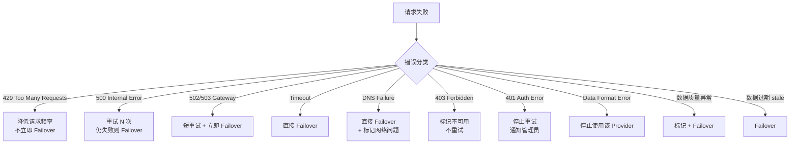
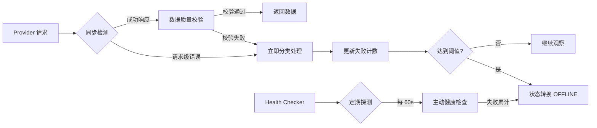
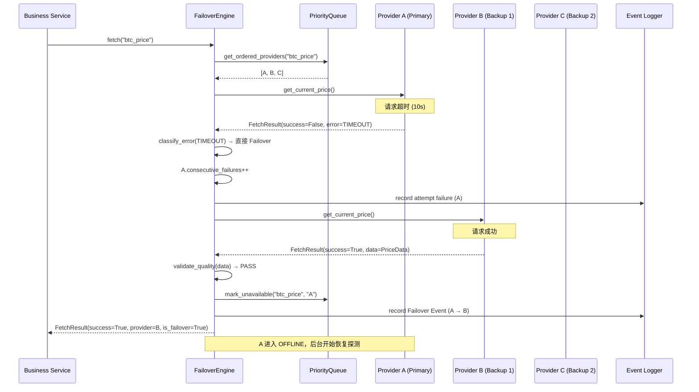
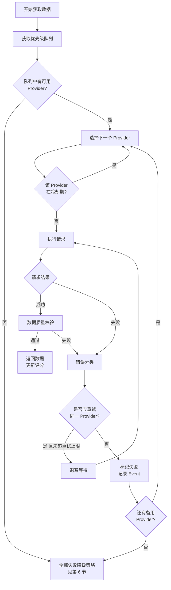
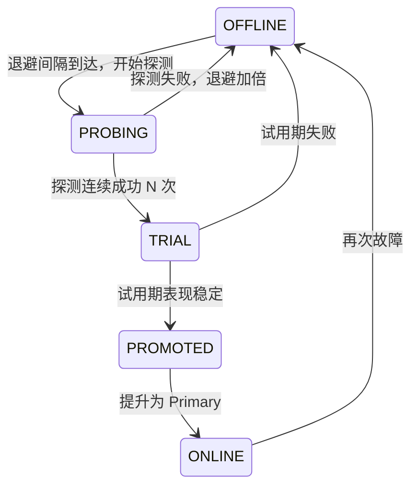
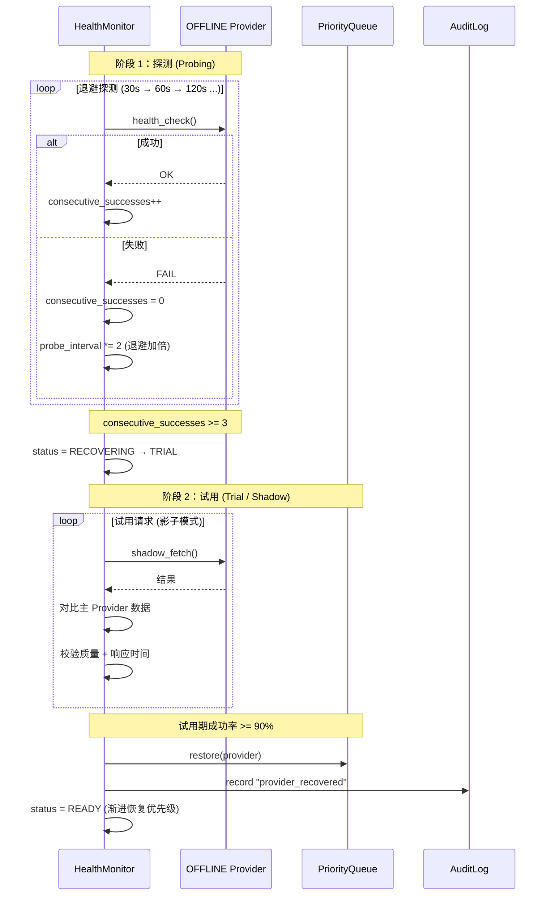
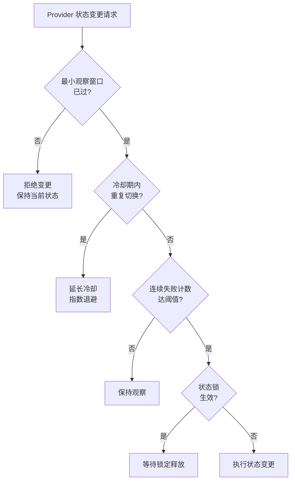
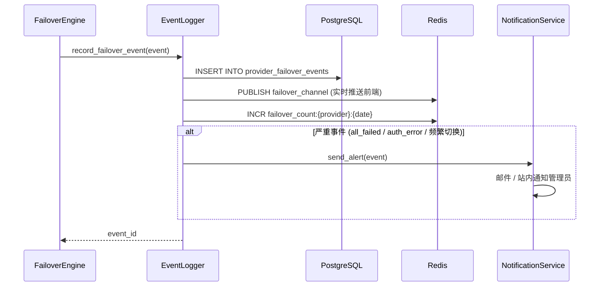
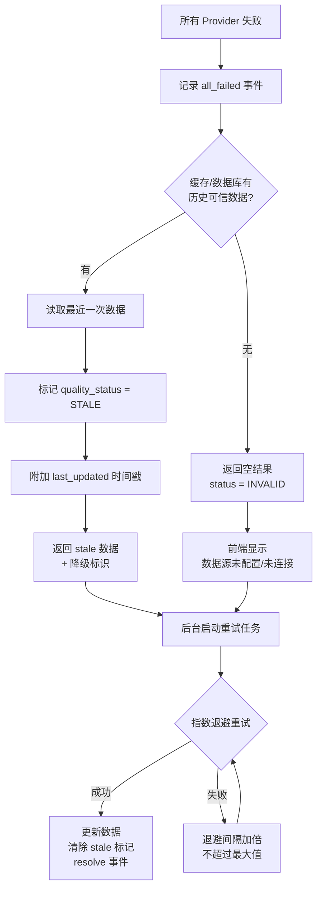
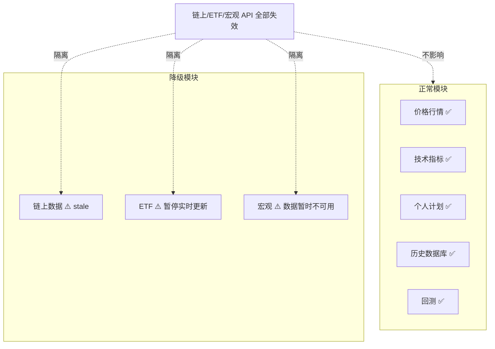

# 自动故障切换架构

## 概述

本文档定义 BTC 全市场智能研究平台的自动故障切换（Failover）机制。系统运行于中国大陆网络环境，**假设任何一个 Provider 都可能随时失效**是架构的基本前提，而非异常情况。

核心目标：
- **自动检测** → **自动切换** → **自动恢复** → **故障可追踪**
- 任何单一数据接口失效，不能让系统整体停止工作
- 所有 Provider 失败时，绝不生成假数据
- 避免 Provider 在好/坏状态间反复抖动

关联文档：
- [04-provider-architecture.md](./04-provider-architecture.md) — Provider 抽象层与分类
- [06-provider-health-scoring.md](./06-provider-health-scoring.md) — 健康评分与状态机
- [07-data-flow-architecture.md](./07-data-flow-architecture.md) — 数据流与降级运行

---

## 目录

1. [故障检测策略](#1-故障检测策略)
2. [优先级队列与自动切换流程](#2-优先级队列与自动切换流程)
3. [Recovery Threshold 机制](#3-recovery-threshold-机制)
4. [防抖动（Anti-Flapping）设计](#4-防抖动anti-flapping设计)
5. [Failover Event 记录](#5-failover-event-记录)
6. [全部 Provider 失败时的降级策略](#6-全部-provider-失败时的降级策略)

---

## 1. 故障检测策略

### 1.1 错误分类处理总则

不同类型的错误必须采用不同的处理策略，**严禁统一无脑重试**，避免 CPU 和网络资源耗尽。



### 1.2 错误处理策略矩阵

| 错误类型 | HTTP 状态码 | 重试策略 | Failover | Provider 状态标记 | 管理员通知 | 说明 |
|----------|-------------|----------|----------|-------------------|-----------|------|
| **限流** | 429 | 遵循 `Retry-After`，指数退避 | ❌ 不立即 | `RATE_LIMITED` | 频繁时通知 | 降低请求频率，退避后重试 |
| **服务器错误** | 500 | 重试 N 次（默认 3） | ✅ 重试失败后 | `DEGRADED` | 否 | 服务端临时故障 |
| **网关错误** | 502 / 503 / 504 | 短重试（1-2 次） | ✅ 立即 | `DEGRADED` | 否 | 服务不可用，快速切换 |
| **连接超时** | — | 重试 1 次 | ✅ 直接 | `NETWORK_ERROR` | 否 | 网络链路问题 |
| **读取超时** | — | 重试 1 次 | ✅ 直接 | `SLOW` / `NETWORK_ERROR` | 否 | 响应过慢 |
| **DNS 失败** | — | ❌ 不重试 | ✅ 直接 | `NETWORK_ERROR` | 是（网络问题） | DNS 污染或解析失败 |
| **连接拒绝** | — | 重试 2 次 | ✅ | `NETWORK_ERROR` | 否 | 端口不可达 |
| **禁止访问** | 403 | ❌ 不重试 | ✅ | `DISABLED` | 是 | 区域限制 / IP 封禁 |
| **认证失败** | 401 | ❌ 不无限重试 | ✅ | `AUTH_ERROR` | 是（改 Key） | API Key 失效 |
| **数据格式错误** | 200（解析失败） | ❌ 不重试 | ✅ | `DATA_ERROR` | 是 | API 结构变更 |
| **数据质量异常** | 200（校验失败） | ❌ 不重试 | ✅ | `DATA_ERROR` | 否 | 数值越界 / 逻辑错误 |
| **数据过期** | 200（stale） | ❌ 不重试 | ✅ | `DEGRADED` | 否 | 数据时间戳过旧 |
| **空数据** | 200（empty） | 重试 1 次 | ✅ | `DATA_ERROR` | 否 | 返回空结果 |
| **SSL/TLS 错误** | — | 重试 1 次 | ✅ | `NETWORK_ERROR` | 否 | 证书问题 |

### 1.3 数据质量异常检测

即使 HTTP 请求成功（200），仍需对数据进行质量校验，异常时触发 Failover：

```python
class DataQualityValidator:
    """数据质量校验器 — 在 Failover 决策前运行。"""

    def validate_price(self, data: PriceData) -> QualityResult:
        """校验价格数据。"""
        checks = [
            self._check_not_null(data.price),
            self._check_positive(data.price),
            self._check_range(data.price, min_val=1_000, max_val=10_000_000),
            self._check_not_stale(data.timestamp, max_age_seconds=60),
            self._check_deviation(data.price, reference="median", threshold=0.05),
        ]
        return self._aggregate(checks)

    def _check_not_stale(self, timestamp: datetime, max_age_seconds: int) -> bool:
        """检查数据是否过期。"""
        age = (datetime.utcnow() - timestamp).total_seconds()
        return age <= max_age_seconds

    def _check_deviation(
        self, value: Decimal, reference: str, threshold: float
    ) -> bool:
        """检查与其他 Provider 的偏差是否超阈值。"""
        ...
```

**数据质量异常类型**：

| 异常类型 | 检测规则 | 处理动作 |
|----------|----------|----------|
| 空值 / null | 关键字段缺失 | Failover + 标记 DATA_ERROR |
| 负值 / 零值 | 价格 ≤ 0 | Failover + 记录冲突 |
| 数值越界 | 超出合理范围（如 BTC < 1000） | Failover + 标记 DATA_ERROR |
| 数据过期 | `fetch_time - observation_time` 超阈值 | Failover + 标记 stale |
| 大幅偏差 | 与 Median 偏差 > 5% | Failover + 标记 conflict |
| 精度异常 | 小数位异常 / 单位错误 | Failover + 通知管理员 |
| 时间倒流 | 数据时间早于已有数据 | 拒绝写入 + 记录 |

### 1.4 故障检测触发时机



---

## 2. 优先级队列与自动切换流程

### 2.1 优先级队列数据结构

每一种数据类型维护一个独立的、按优先级排序的 Provider 队列：

```python
from dataclasses import dataclass, field
from typing import Optional
import heapq


@dataclass(order=True)
class PrioritizedProvider:
    """优先级队列中的 Provider 条目。

    排序键：(effective_priority, -health_score, name)
    - effective_priority: 数值越小优先级越高
    - health_score: 取负使得分数越高越靠前
    """
    effective_priority: int
    neg_health_score: int = field(compare=True)
    name: str = field(compare=True)
    provider: object = field(compare=False, default=None)
    locked: bool = field(compare=False, default=False)   # 管理员锁定
    enabled: bool = field(compare=False, default=True)


class ProviderPriorityQueue:
    """按数据类型组织的 Provider 优先级队列。

    每种数据类型（如 btc_price, mvrv, etf_flow）对应一个队列。
    """

    def __init__(self):
        # data_type -> list[PrioritizedProvider]
        self._queues: dict[str, list[PrioritizedProvider]] = {}

    def build_queue(self, data_type: str, providers: list) -> None:
        """构建/重建某数据类型的优先级队列。"""
        ...

    def get_ordered_providers(self, data_type: str) -> list[PrioritizedProvider]:
        """返回按优先级排序的可用 Provider 列表。"""
        ...

    def reorder_by_score(self, data_type: str) -> None:
        """基于健康评分重排队列（跳过 locked 的 Provider）。"""
        ...

    def mark_unavailable(self, data_type: str, provider_name: str) -> None:
        """临时将 Provider 移出可用队列。"""
        ...

    def restore(self, data_type: str, provider_name: str) -> None:
        """恢复 Provider 到队列（按原优先级或评分）。"""
        ...
```

**优先级来源**：

| 来源 | 说明 | 优先级 |
|------|------|--------|
| 静态配置 | `providers.yaml` 中的 `priority` 字段 | 基础值 |
| 健康评分 | 动态评分调整 `effective_priority` | 自动计算 |
| 管理员锁定 | `locked: true` 时锁定为固定优先级 | 最高，不参与自动调整 |

### 2.2 自动切换流程（时序图）



### 2.3 切换决策树



### 2.4 FailoverEngine 核心逻辑

```python
class FailoverEngine:
    """自动故障切换引擎。

    职责：
    1. 按优先级依次尝试 Provider
    2. 错误分类与重试决策
    3. 触发 Failover 并记录事件
    4. 数据质量校验
    5. 更新 Provider 状态与评分
    """

    def __init__(
        self,
        registry: ProviderRegistry,
        health_monitor: ProviderHealthMonitor,
        event_logger: FailoverEventLogger,
        config: FailoverConfig,
    ):
        self._registry = registry
        self._health = health_monitor
        self._logger = event_logger
        self._config = config

    async def fetch_with_failover(
        self,
        data_type: str,
        method_name: str,
        **kwargs,
    ) -> FetchResult:
        """带自动 Failover 的数据获取入口。"""
        providers = self._registry.get_providers_by_priority(data_type)

        for entry in providers:
            provider = entry.provider

            # 跳过冷却期中的 Provider
            if self._health.is_in_cooldown(provider.name):
                continue

            # 跳过已禁用的 Provider
            if not provider.enabled:
                continue

            result = await self._attempt_with_retry(
                provider, method_name, data_type, **kwargs
            )

            if result.success and self._validate_quality(data_type, result.data):
                self._health.record_success(provider.name, result.latency_ms)
                return result

            # 失败处理
            self._health.record_failure(provider.name, result.error_code)
            self._logger.record_attempt_failure(data_type, provider.name, result)

            # 判断是否需要将该 Provider 移出队列
            if self._should_mark_offline(provider.name, result.error_code):
                self._health.mark_offline(provider.name, result.error_code)
                self._logger.record_failover_event(
                    data_type=data_type,
                    original_provider=provider.name,
                    reason=result.error_code,
                    error_detail=result.error,
                )

        # 所有 Provider 失败
        return self._handle_all_failed(data_type)

    async def _attempt_with_retry(
        self, provider, method_name: str, data_type: str, **kwargs
    ) -> FetchResult:
        """单 Provider 的重试逻辑（遵循错误分类策略）。"""
        policy = RetryPolicy(
            max_retries=provider.config.retry_count,
            backoff_base=provider.config.retry_backoff_base,
        )
        method = getattr(provider, method_name)

        for attempt in range(policy.max_retries + 1):
            result = await method(**kwargs)
            if result.success:
                return result
            if not policy.is_retryable(result.error_code, None):
                return result  # 不可重试，直接返回
            if attempt < policy.max_retries:
                await asyncio.sleep(policy.get_delay(attempt))

        return result
```

---

## 3. Recovery Threshold 机制

### 3.1 恢复原则

Provider 从 OFFLINE 恢复为 Primary **不能立即切回**，必须满足 Recovery Threshold：

- ✅ **连续成功 N 次**（默认 3 次，可配置）
- ✅ **响应时间恢复正常范围**（不超过基线的 1.5 倍）
- ✅ **数据质量检查通过**（校验合格）
- ✅ **度过最小观察窗口**（防抖动，见第 4 节）

### 3.2 恢复三阶段流程



| 阶段 | 名称 | 行为 | 进入条件 | 退出条件 |
|------|------|------|----------|----------|
| 1 | **探测 (Probing)** | 后台定期发送轻量健康检查请求，不影响生产流量 | OFFLINE 且退避间隔到达 | 连续成功 N 次 → 试用；失败 → 退避加倍 |
| 2 | **试用 (Trial)** | 作为**影子 Provider** 接收真实请求，但结果不直接返回给业务（用于对比验证） | 探测成功达标 | 试用期数据质量稳定 → 提升；异常 → 回退 OFFLINE |
| 3 | **提升 (Promotion)** | 恢复为可用 Provider，参与优先级排序；若原为 Primary 则渐进恢复 | 试用期通过 | 完全恢复 → ONLINE |

### 3.3 恢复配置参数

```python
@dataclass
class RecoveryConfig:
    """恢复机制配置。"""
    recovery_threshold: int = 3           # 连续成功 N 次才恢复
    probe_interval_initial: int = 30      # 首次探测间隔（秒）
    probe_interval_max: int = 3600        # 最大探测间隔（秒，1小时）
    probe_backoff_multiplier: float = 2.0 # 探测退避乘数
    trial_request_count: int = 5          # 试用期请求数
    trial_success_rate: float = 0.9       # 试用期最低成功率
    response_time_tolerance: float = 1.5  # 响应时间容忍倍数（相对基线）
    min_observation_window: int = 300     # 最小观察窗口（秒）
```

### 3.4 恢复探测时序



---

## 4. 防抖动（Anti-Flapping）设计

### 4.1 问题背景

网络不稳定的环境中，Provider 可能频繁在「好/坏」之间切换。若无防抖动机制，会导致：
- 优先级队列频繁重排，系统不稳定
- 恢复探测消耗资源
- Failover Event 日志爆炸
- 前端数据源标识频繁跳变

### 4.2 四大防抖动机制



| 机制 | 说明 | 默认参数 |
|------|------|----------|
| **最小观察窗口** | 状态变更后，窗口期内不允许再次变更 | 5 分钟（300s） |
| **指数退避恢复间隔** | 每次恢复失败，下次探测间隔加倍 | 30s → 60s → 120s ... 最大 1h |
| **连续失败计数器** | 只有连续失败达阈值才切换，单次失败不触发 | 3 次 |
| **状态锁定机制** | 关键 Provider 可锁定状态，避免频繁变更 | 管理员配置 |

### 4.3 防抖动实现

```python
class AntiFlappingGuard:
    """防抖动守卫。"""

    def __init__(self, config: AntiFlappingConfig):
        self._config = config
        # provider_name -> last_state_change_time
        self._last_change: dict[str, datetime] = {}
        # provider_name -> consecutive_flap_count
        self._flap_count: dict[str, int] = {}
        # provider_name -> cooldown_until
        self._cooldown: dict[str, datetime] = {}

    def can_change_state(self, provider_name: str) -> bool:
        """判断是否允许状态变更。"""
        now = datetime.utcnow()

        # 冷却期检查
        if provider_name in self._cooldown:
            if now < self._cooldown[provider_name]:
                return False

        # 最小观察窗口检查
        if provider_name in self._last_change:
            elapsed = (now - self._last_change[provider_name]).total_seconds()
            if elapsed < self._config.min_observation_window:
                return False

        return True

    def record_state_change(self, provider_name: str) -> None:
        """记录状态变更，更新冷却期。"""
        now = datetime.utcnow()
        self._last_change[provider_name] = now

        # 检测抖动：短时间内多次变更
        self._flap_count[provider_name] = self._flap_count.get(provider_name, 0) + 1

        # 指数退避冷却期
        cooldown = self._config.cooldown_period * (
            self._config.backoff_multiplier ** (self._flap_count[provider_name] - 1)
        )
        cooldown = min(cooldown, self._config.max_cooldown)
        self._cooldown[provider_name] = now + timedelta(seconds=cooldown)

    def is_in_cooldown(self, provider_name: str) -> bool:
        """是否处于冷却期。"""
        if provider_name not in self._cooldown:
            return False
        return datetime.utcnow() < self._cooldown[provider_name]

    def reset_flap_count(self, provider_name: str) -> None:
        """Provider 稳定运行一段时间后重置抖动计数。"""
        self._flap_count[provider_name] = 0
```

### 4.4 抖动计数与退避对照

| 抖动次数 | 冷却期（base=300s, multiplier=2） | 说明 |
|----------|-----------------------------------|------|
| 第 1 次 | 300s（5 分钟） | 首次切换 |
| 第 2 次 | 600s（10 分钟） | 疑似抖动 |
| 第 3 次 | 1200s（20 分钟） | 明显抖动 |
| 第 4 次 | 2400s（40 分钟） | 严重抖动 |
| 第 5 次+ | 3600s（最大 1 小时） | 封顶，等待管理员介入 |

---

## 5. Failover Event 记录

### 5.1 事件数据结构

所有故障切换事件必须持久化到数据库 `provider_failover_events` 表，用于审计与追溯。

```python
@dataclass
class FailoverEvent:
    """故障切换事件。"""
    event_id: UUID                    # 事件唯一 ID
    timestamp: datetime               # 事件发生时间 (UTC)
    data_type: str                    # 数据类型，如 "btc_price"
    original_provider: str            # 原 Provider
    new_provider: Optional[str]       # 切换后的 Provider（全失败时为 None）
    reason: str                       # 切换原因（错误分类）
    error_detail: str                 # 错误详情
    recovery_action: str              # auto_failover / manual / degraded / stale
    retry_count: int                  # 切换前重试次数
    latency_ms: float                 # 失败请求耗时
    resolved_at: Optional[datetime]   # 恢复时间（未恢复为 None）
    resolved_by: Optional[str]        # 恢复方式（auto / manual）
    is_all_failed: bool = False       # 是否全部 Provider 失败
    quality_status: str = "unknown"   # VERIFIED / ESTIMATED / STALE / CONFLICT / INVALID
    metadata: dict = field(default_factory=dict)
```

### 5.2 事件示例（JSON）

```json
{
  "event_id": "550e8400-e29b-41d4-a716-446655440000",
  "timestamp": "2026-09-27T08:15:32.123456Z",
  "data_type": "btc_price",
  "original_provider": "binance",
  "new_provider": "okx",
  "reason": "timeout",
  "error_detail": "Connection timed out after 10s (ReadTimeout)",
  "recovery_action": "auto_failover",
  "retry_count": 1,
  "latency_ms": 10003.5,
  "resolved_at": null,
  "resolved_by": null,
  "is_all_failed": false,
  "quality_status": "VERIFIED",
  "metadata": {
    "http_status": null,
    "attempt_index": 1,
    "total_providers": 4,
    "consecutive_failures": 3,
    "triggered_cooldown": true,
    "cooldown_seconds": 300
  }
}
```

### 5.3 事件类型枚举

| reason 值 | 触发场景 | recovery_action |
|-----------|----------|-----------------|
| `timeout` | 连接/读取超时 | `auto_failover` |
| `dns_failure` | DNS 解析失败 | `auto_failover` |
| `http_500` | 服务器内部错误 | `auto_failover` |
| `http_502` / `http_503` | 网关/服务不可用 | `auto_failover` |
| `http_429` | 限流 | `rate_limit_backoff` |
| `http_403` | 禁止访问 | `disable_provider` |
| `auth_error` | 认证失败 | `notify_admin` |
| `data_format_error` | 数据格式错误 | `disable_provider` |
| `data_quality` | 数据质量异常 | `auto_failover` |
| `data_stale` | 数据过期 | `auto_failover` |
| `all_failed` | 全部 Provider 失败 | `degraded` |
| `recovered` | Provider 恢复 | `restore_provider` |

### 5.4 事件记录时序



### 5.5 事件生命周期（未决 → 已解决）

Failover Event 创建时 `resolved_at = null`（未决），当原 Provider 恢复后自动更新：

```python
class FailoverEventLogger:
    """故障切换事件记录器。"""

    async def record_failover_event(self, **kwargs) -> UUID:
        """记录新的 Failover 事件（未决状态）。"""
        ...

    async def resolve_event(
        self, event_id: UUID, resolved_by: str = "auto"
    ) -> None:
        """标记事件已解决（Provider 恢复时调用）。"""
        ...

    async def get_unresolved_events(
        self, data_type: Optional[str] = None
    ) -> list[FailoverEvent]:
        """查询所有未解决的事件。"""
        ...

    async def get_statistics(
        self, start: datetime, end: datetime
    ) -> FailoverStats:
        """统计区间内的故障切换情况（供数据质量中心展示）。"""
        ...
```

---

## 6. 全部 Provider 失败时的降级策略

### 6.1 核心原则

当某一数据类型的**所有 Provider 全部失败**时，系统必须：

1. ✅ 使用**最近一次可信数据**（从缓存 / 数据库读取）
2. ✅ 标记数据为 **stale**
3. ✅ 前端显示**最后更新时间** + 「数据暂时无法更新」
4. ✅ 后台**继续重试**（指数退避，不超过最大间隔）
5. ✅ 记录**故障事件**（`is_all_failed = true`）
6. ❌ **绝不生成假数据**（随机 / 模拟 / 硬编码 / 静态 JSON）

### 6.2 降级决策流程



### 6.3 降级数据返回结构

```python
@dataclass
class DegradedResult:
    """降级结果封装。"""
    success: bool = True            # 有历史数据时仍为 True
    data: Any = None                # 最近一次可信数据
    quality_status: str = "STALE"   # STALE / INVALID
    is_degraded: bool = True
    last_updated: Optional[datetime] = None   # 数据最后更新时间
    stale_duration_seconds: float = 0.0        # 已过时多久
    message: str = "数据暂时无法更新，显示最近一次可信数据"
    all_providers_failed: bool = True
    retry_scheduled: bool = True
    next_retry_at: Optional[datetime] = None
```

### 6.4 前端降级展示契约

后端返回降级数据时，前端必须按以下规则展示：

| 场景 | 后端 `quality_status` | 前端展示 |
|------|----------------------|----------|
| 正常实时数据 | `verified` | 正常数值 + 「数据源一致」 |
| 有历史可信数据 | `stale` | 数值 + ⚠️「数据暂时无法更新」+「最后成功更新：XX:XX」 |
| 无任何数据 | `unavailable` | 「数据源未配置」或「当前 Provider 未连接」（**不显示假数字**） |
| 多源冲突 | `conflict` | 数值 + 「数据源存在异常差异，当前结果仅供参考」 |

> **反面示例（严禁）**：`BTC = ERROR`、`BTC = 0`、`BTC = 随机数`、页面整体报错崩溃。

### 6.5 局部故障隔离（降级运行）

某一类数据的 Provider 全部失效，**不能影响其他模块**。系统必须支持降级运行：



| 故障范围 | 降级行为 | 不受影响的模块 |
|----------|----------|----------------|
| 链上 API 全部失效 | 链上模块显示 stale / 暂停更新 | 价格、技术指标、个人计划、历史库、回测 |
| ETF API 全部失效 | 只关闭 ETF 模块实时更新 | 其他所有模块正常 |
| 宏观 API 全部失效 | 宏观状态显示「数据暂时不可用」 | 首页不整体报错 |
| 行情 API 全部失效 | 价格显示最近可信值 + stale | 历史数据、回测、计划仍可查看 |

### 6.6 后台重试策略

```python
class DegradedRetryScheduler:
    """全失败后的后台重试调度器。"""

    def __init__(self, config: RecoveryConfig):
        self._config = config
        self._retry_state: dict[str, RetryState] = {}

    async def schedule_retry(self, data_type: str) -> None:
        """调度某数据类型的后台重试（指数退避）。"""
        state = self._retry_state.setdefault(data_type, RetryState())

        while not state.recovered:
            delay = min(
                self._config.probe_interval_initial * (
                    self._config.probe_backoff_multiplier ** state.attempt
                ),
                self._config.probe_interval_max,  # 封顶，防止无限增长
            )
            await asyncio.sleep(delay)

            result = await self._try_all_providers(data_type)
            if result.success:
                state.recovered = True
                await self._clear_stale_flag(data_type)
                await self._resolve_failover_events(data_type)
            else:
                state.attempt += 1

    async def _try_all_providers(self, data_type: str) -> FetchResult:
        """重新尝试所有 Provider（包括之前 OFFLINE 的）。"""
        ...
```

**重试间隔序列**（base=30s, multiplier=2, max=3600s）：

```
30s → 60s → 120s → 240s → 480s → 960s → 1920s → 3600s (封顶) → 3600s → ...
```

---

## 附录 A：Failover 配置完整示例

```yaml
# config/failover.yaml
failover:
  enabled: true

  # 恢复阈值
  recovery:
    recovery_threshold: 3         # 连续成功 N 次才恢复
    probe_interval_initial: 30    # 首次探测间隔（秒）
    probe_interval_max: 3600      # 最大探测间隔（秒）
    probe_backoff_multiplier: 2.0
    trial_request_count: 5        # 试用期请求数
    trial_success_rate: 0.9       # 试用期最低成功率
    response_time_tolerance: 1.5  # 响应时间容忍倍数

  # 防抖动
  anti_flapping:
    enabled: true
    min_observation_window: 300   # 最小观察窗口（秒）
    cooldown_period: 300          # 基础冷却期（秒）
    backoff_multiplier: 2.0       # 冷却退避乘数
    max_cooldown: 3600            # 最大冷却期（秒）
    consecutive_failure_threshold: 3

  # 降级策略
  degradation:
    use_last_trusted_data: true   # 使用最近可信数据
    max_stale_age_seconds: 86400  # 最大可接受的 stale 数据年龄
    retry_max_interval: 3600      # 后台重试最大间隔
    never_generate_fake_data: true # 强制：绝不生成假数据

  # 错误分类策略（可覆盖全局默认）
  error_policies:
    http_429:
      retry: true
      retry_max: 2
      failover: false
      action: "rate_limit_backoff"
    http_500:
      retry: true
      retry_max: 3
      failover: true
      action: "auto_failover"
    http_502:
      retry: true
      retry_max: 2
      failover: true
      action: "auto_failover"
    timeout:
      retry: true
      retry_max: 1
      failover: true
      action: "auto_failover"
    dns_failure:
      retry: false
      failover: true
      action: "auto_failover"
      mark_network_issue: true
    http_403:
      retry: false
      failover: true
      action: "disable_provider"
      notify_admin: true
    auth_error:
      retry: false
      failover: true
      action: "notify_admin"
    data_format_error:
      retry: false
      failover: true
      action: "disable_provider"
      notify_admin: true
```

## 附录 B：Failover 测试用例清单

对应需求文档第四十节测试要求，Failover 必须覆盖以下场景：

- [ ] 主 Provider 断开 → 备用 Provider 自动接管
- [ ] 备用 Provider 也断开 → 第三 Provider 接管
- [ ] 所有 Provider 断开 → 系统不产生假数据，返回 stale
- [ ] 429 限流 → 降频而非立即切换
- [ ] 500 错误 → 重试 N 次后切换
- [ ] 超时 → 直接切换
- [ ] DNS 故障 → 直接切换 + 标记网络问题
- [ ] 认证失败 → 不无限重试 + 通知管理员
- [ ] 数据格式错误 → 停止使用 + 通知
- [ ] 数据质量异常 → 切换 + 记录冲突
- [ ] Provider 恢复 → 探测 → 试用 → 提升为 Primary
- [ ] 抖动场景 → 防抖动机制生效，冷却期不误切换
- [ ] 局部故障 → 其他模块正常运行（降级隔离）
- [ ] 断网 → 显示最近可信数据 + stale 标记
