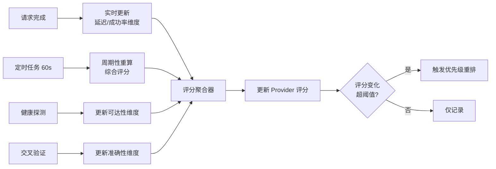
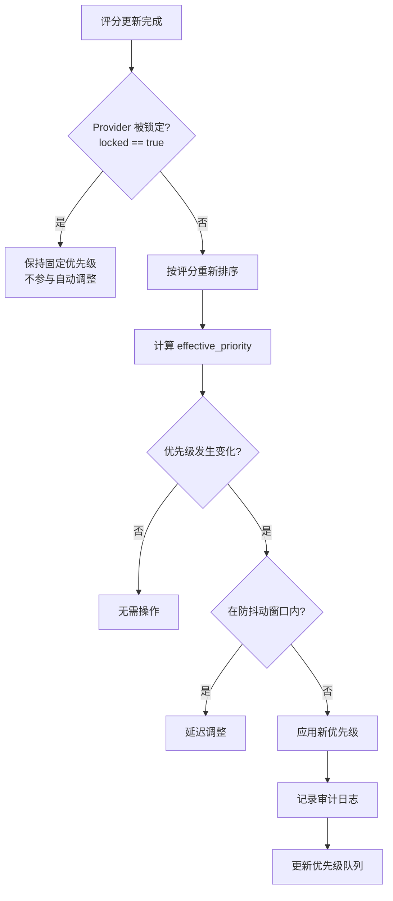
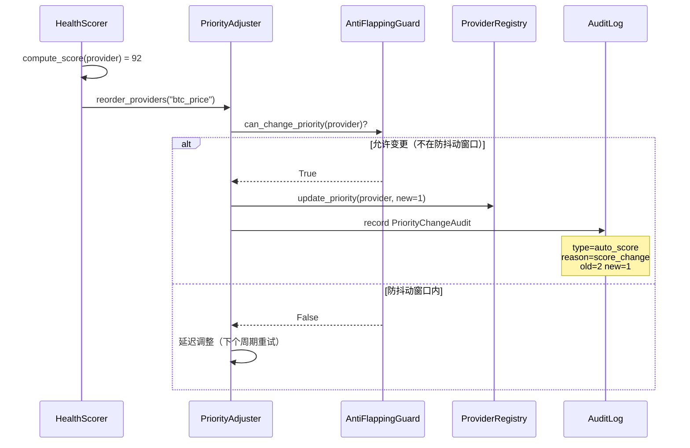
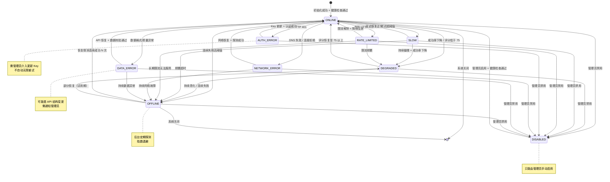
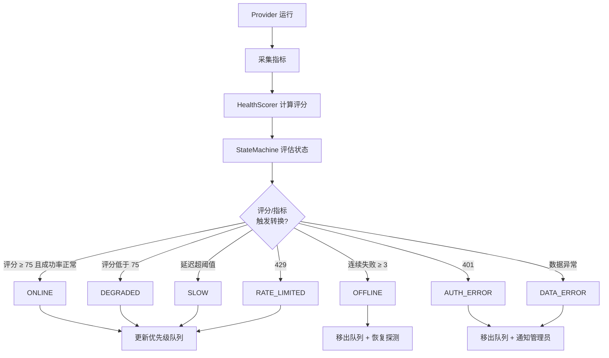
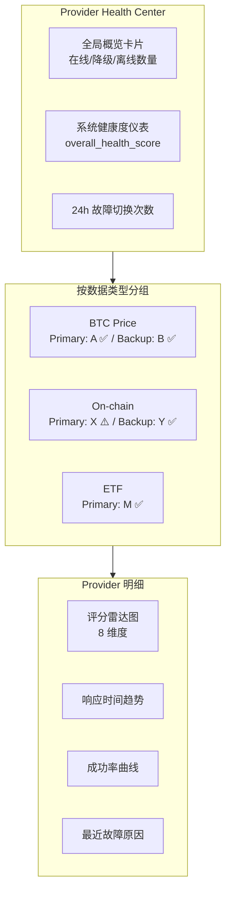

# Provider 健康评分机制

## 概述

本文档定义 BTC 全市场智能研究平台的 Provider 健康评分（Health Scoring）系统。系统不使用固定优先级，而是通过多维度动态评分实时评估每个 Provider 的健康状况，并据此自动调整优先级排序。

核心设计目标：
- **量化健康**：将 Provider 状态抽象为 0-100 的综合评分
- **动态调优**：基于评分自动排序，让最优 Provider 优先服务
- **可干预**：管理员可手动锁定优先级，锁定项不参与自动调整
- **可观测**：完整健康监控面板，让用户知道「现在的数据从哪里来」
- **防抖动**：评分变化平滑，避免优先级频繁跳变

关联文档：
- [04-provider-architecture.md](./04-provider-architecture.md) — Provider 抽象层
- [05-failover-architecture.md](./05-failover-architecture.md) — 故障切换与状态机

---

## 目录

1. [评分维度与权重](#1-评分维度与权重)
2. [评分算法](#2-评分算法)
3. [动态优先级调整](#3-动态优先级调整)
4. [健康状态机](#4-健康状态机)
5. [健康监控面板数据结构](#5-健康监控面板数据结构)

---

## 1. 评分维度与权重

### 1.1 八大评分维度

| 维度 | 权重 | 说明 | 数据来源 | 评分方向 |
|------|------|------|----------|----------|
| **数据准确性** | 15% | 与其他 Provider 交叉验证的一致性 | 交叉验证偏差 | 偏差越小分越高 |
| **响应速度** | 15% | 平均响应时间（ms） | 请求延迟统计 | 越快分越高 |
| **稳定性** | 20% | 连续正常运行时间 | Uptime 统计 | 运行越久分越高 |
| **成功率** | 20% | 过去 24h 请求成功率 | 请求日志 | 成功率越高分越高 |
| **数据完整性** | 10% | 返回数据的字段完整度 | 字段校验 | 字段越全分越高 |
| **历史故障率** | 10% | 过去 7 天故障次数 | Failover Event | 故障越少分越高 |
| **数据时效性** | 5% | 数据延迟（observation_time vs fetch_time） | 时间戳对比 | 延迟越小分越高 |
| **网络可达性** | 5% | 从当前网络环境的连通性 | 健康探测 | 可达性越高分越高 |
| **合计** | **100%** | | | |

### 1.2 各维度评分细则

#### 数据准确性（Accuracy）— 15%

基于多源交叉验证，计算某 Provider 返回值与多源 Median 的偏差：

```
deviation = |provider_value - median(all_providers)| / median(all_providers)

accuracy_score = max(0, 100 - deviation * 1000)   # 偏差 10% 时得 0 分
```

| 偏差范围 | 评分 | 判定 |
|----------|------|------|
| < 0.1% | 100 | 高度一致 |
| 0.1% - 1% | 90-99 | 正常 |
| 1% - 5% | 50-90 | 需关注 |
| > 5% | 0-50 | 异常，标记 conflict |

#### 响应速度（Latency）— 15%

基于加权移动平均响应时间，映射到 0-100：

```
latency_score = clamp(100 - (avg_latency_ms - baseline) / scale, 0, 100)
```

| 响应时间 | 评分 | 判定 |
|----------|------|------|
| < 100ms | 100 | 优秀 |
| 100-500ms | 80-99 | 良好 |
| 500-1000ms | 60-80 | 一般 |
| 1-3s | 30-60 | 偏慢 |
| > 3s | 0-30 | 很慢，可能触发 SLOW 状态 |

#### 稳定性（Stability）— 20%

基于连续正常运行时间（Uptime）：

```
stability_score = min(100, consecutive_uptime_hours / target_hours * 100)
# target_hours 默认 168（7天）
```

#### 成功率（Success Rate）— 20%

过去 24 小时请求成功率：

```
success_rate = successful_requests / total_requests * 100
success_score = success_rate   # 直接映射
```

#### 数据完整性（Completeness）— 10%

返回数据的字段完整度：

```
completeness_score = present_fields / expected_fields * 100
```

#### 历史故障率（Reliability）— 10%

过去 7 天故障次数反向映射：

```
reliability_score = max(0, 100 - failure_count_7d * penalty_per_failure)
# penalty_per_failure 默认 10
```

#### 数据时效性（Timeliness）— 5%

数据延迟（数据观测时间与抓取时间的差异）：

```
data_delay = fetch_time - observation_time
timeliness_score = max(0, 100 - data_delay_seconds / max_acceptable_delay * 100)
```

#### 网络可达性（Reachability）— 5%

从当前网络环境（中国大陆）的连通性探测：

```
reachability_score = successful_probes / total_probes * 100
```

### 1.3 权重可配置

```yaml
# config/health_scoring.yaml
scoring:
  weights:
    accuracy: 0.15
    latency: 0.15
    stability: 0.20
    success_rate: 0.20
    completeness: 0.10
    reliability: 0.10
    timeliness: 0.05
    reachability: 0.05

  # 各维度参数
  params:
    latency_baseline_ms: 100
    latency_scale_ms: 50
    stability_target_hours: 168
    reliability_penalty_per_failure: 10
    accuracy_deviation_penalty: 1000
    timeliness_max_delay_seconds: 300
```

---

## 2. 评分算法

### 2.1 综合评分公式

综合评分采用**加权求和**，每个维度先归一化到 0-100：

```
final_score = Σ (dimension_score[i] × weight[i])

其中 i ∈ {accuracy, latency, stability, success_rate,
          completeness, reliability, timeliness, reachability}
```

### 2.2 加权移动平均（WMA）

对于时序性维度（响应速度、成功率），采用加权移动平均，近期数据权重更高：

```python
class WeightedMovingAverage:
    """加权移动平均 — 近期数据权重更高。"""

    def __init__(self, window_size: int = 100, decay_factor: float = 0.95):
        self.window_size = window_size
        self.decay_factor = decay_factor
        self._values: list[tuple[datetime, float]] = []

    def add(self, value: float, timestamp: datetime) -> None:
        """添加数据点。"""
        self._values.append((timestamp, value))
        if len(self._values) > self.window_size:
            self._values.pop(0)

    def compute(self) -> float:
        """计算加权移动平均。

        权重按时间指数衰减：w[i] = decay_factor^(n-i)
        越新的数据点权重越大。
        """
        if not self._values:
            return 0.0

        n = len(self._values)
        weighted_sum = 0.0
        weight_total = 0.0

        for i, (ts, value) in enumerate(self._values):
            weight = self.decay_factor ** (n - i - 1)
            weighted_sum += value * weight
            weight_total += weight

        return weighted_sum / weight_total if weight_total > 0 else 0.0
```

### 2.3 时间衰减因子

除了 WMA，综合评分本身也应用时间衰减，让近期表现主导评分：

```python
import math


class TimeDecayScorer:
    """时间衰减评分器。

    评分 = 历史评分 × 衰减因子 + 最新评分 × (1 - 衰减因子)
    衰减因子随时间间隔增大而减小（旧数据影响降低）。
    """

    def __init__(self, half_life_minutes: float = 60.0):
        # 半衰期：60 分钟后旧评分权重减半
        self.half_life_seconds = half_life_minutes * 60

    def decay_factor(self, elapsed_seconds: float) -> float:
        """计算衰减因子 (0-1)。

        公式：decay = 0.5^(elapsed / half_life)
        """
        return math.pow(0.5, elapsed_seconds / self.half_life_seconds)

    def update_score(
        self, old_score: float, new_score: float, elapsed_seconds: float
    ) -> float:
        """更新时间衰减评分。"""
        decay = self.decay_factor(elapsed_seconds)
        return old_score * decay + new_score * (1 - decay)
```

### 2.4 评分范围与等级

评分范围为 **0-100**，映射到质量等级：

| 评分范围 | 等级 | 颜色标识 | 系统行为 |
|----------|------|----------|----------|
| 90 - 100 | 优秀 (Excellent) | 🟢 绿色 | 优先作为 Primary |
| 75 - 89 | 良好 (Good) | 🟢 绿色 | 正常参与排序 |
| 60 - 74 | 一般 (Fair) | 🟡 黄色 | 降优先级，标记 DEGRADED 倾向 |
| 40 - 59 | 较差 (Poor) | 🟠 橙色 | 大幅降优先级 |
| 20 - 39 | 很差 (Bad) | 🔴 红色 | 接近 OFFLINE，仅兜底 |
| 0 - 19 | 极差 (Critical) | 🔴 红色 | 移出可用队列 |

### 2.5 评分更新频率



| 维度 | 更新触发 | 更新频率 |
|------|----------|----------|
| 响应速度 | 每次请求完成 | 实时 |
| 成功率 | 每次请求完成 | 实时 |
| 数据准确性 | 交叉验证完成 | 每次多源获取 |
| 数据完整性 | 数据校验完成 | 实时 |
| 数据时效性 | 数据入库时 | 实时 |
| 稳定性 | 定时任务 | 每 60s |
| 历史故障率 | 定时任务 | 每 5 分钟 |
| 网络可达性 | 健康探测 | 每 60s |
| **综合评分** | 定时聚合 | 每 60s |

### 2.6 评分计算完整流程

```python
class HealthScorer:
    """Provider 健康评分计算器。"""

    def __init__(self, config: ScoringConfig):
        self._config = config
        self._wma: dict[str, WeightedMovingAverage] = {}
        self._decay = TimeDecayScorer(half_life_minutes=60)

    def compute_score(self, provider_name: str, metrics: ProviderMetrics) -> float:
        """计算某 Provider 的综合健康评分 (0-100)。"""
        weights = self._config.weights

        dimension_scores = {
            "accuracy": self._score_accuracy(metrics),
            "latency": self._score_latency(metrics),
            "stability": self._score_stability(metrics),
            "success_rate": self._score_success_rate(metrics),
            "completeness": self._score_completeness(metrics),
            "reliability": self._score_reliability(metrics),
            "timeliness": self._score_timeliness(metrics),
            "reachability": self._score_reachability(metrics),
        }

        final_score = sum(
            dimension_scores[dim] * getattr(weights, dim)
            for dim in dimension_scores
        )

        return round(clamp(final_score, 0, 100), 2)

    def update_with_decay(
        self, provider_name: str, new_score: float
    ) -> float:
        """应用时间衰减更新最终评分。"""
        old = self._get_last_score(provider_name)
        elapsed = self._elapsed_since_last(provider_name)
        updated = self._decay.update_score(old, new_score, elapsed)
        self._save_score(provider_name, updated)
        return updated
```

---

## 3. 动态优先级调整

### 3.1 基于评分自动排序

系统根据综合评分自动调整 Provider 的 `effective_priority`：



### 3.2 优先级计算规则

```python
class PriorityAdjuster:
    """动态优先级调整器。"""

    def reorder_providers(
        self, data_type: str, providers: list[ProviderScore]
    ) -> list[ProviderScore]:
        """基于评分重排 Provider 优先级。

        规则：
        1. locked 的 Provider 保持其配置的固定优先级
        2. 非 locked 的 Provider 按综合评分降序排列
        3. OFFLINE / DISABLED 状态的 Provider 排在最后
        4. 评分相同时，保持原配置优先级顺序（稳定性）
        """
        locked = [p for p in providers if p.locked]
        unlocked = [p for p in providers if not p.locked]
        unavailable = [
            p for p in unlocked
            if p.status in (ProviderStatus.OFFLINE, ProviderStatus.DISABLED)
        ]
        available = [p for p in unlocked if p not in unavailable]

        # 可用 Provider 按评分降序
        available.sort(key=lambda p: (-p.score, p.config_priority))
        # 不可用排最后
        unavailable.sort(key=lambda p: p.config_priority)

        return locked + available + unavailable
```

### 3.3 管理员手动锁定

管理员可锁定某 Provider 的优先级，锁定后**不参与自动调整**：

```python
@dataclass
class ProviderScore:
    """Provider 评分与优先级状态。"""
    provider_name: str
    data_type: str
    score: float                    # 综合评分 0-100
    config_priority: int            # 配置的静态优先级
    effective_priority: int         # 实际生效的优先级
    locked: bool = False            # 是否被管理员锁定
    lock_reason: Optional[str] = None
    locked_by: Optional[str] = None
    locked_at: Optional[datetime] = None
```

**锁定使用场景**：

| 场景 | 锁定操作 | 原因 |
|------|----------|------|
| 主数据源固定 | 锁定 Primary 为最高优先级 | 保证核心数据源稳定 |
| 付费高级 API | 锁定为高优先级 | 已付费，优先使用 |
| 临时排障 | 锁定某 Provider 为低优先级 | 已知问题，暂时降权 |
| 合规要求 | 锁定数据源顺序 | 数据来源合规性要求 |

### 3.4 优先级变更审计日志

所有优先级变更（自动或手动）必须记录审计日志：

```python
@dataclass
class PriorityChangeAudit:
    """优先级变更审计记录。"""
    audit_id: UUID
    timestamp: datetime
    provider_name: str
    data_type: str
    old_priority: int
    new_priority: int
    change_type: str               # auto_score / manual_lock / manual_unlock / manual_set
    trigger_reason: str            # score_change / admin_action / recovery / failover
    old_score: float
    new_score: float
    changed_by: str                # "system" / admin_user_id
    metadata: dict = field(default_factory=dict)
```



### 3.5 优先级与 Failover 协同

动态优先级调整与故障切换机制协同工作：

| 事件 | 优先级变化 | 评分变化 |
|------|-----------|----------|
| Provider 成功响应 | 评分↑，可能升优先级 | 成功率↑、延迟维度更新 |
| Provider 超时/失败 | 评分↓，可能降优先级 | 成功率↓、故障率↑ |
| Provider 进入 OFFLINE | 排到队列末尾 | 综合评分大幅下降 |
| Provider 恢复（Recovery） | 渐进恢复优先级 | 试用期内评分逐步回升 |
| 管理员锁定 | 固定为锁定优先级 | 评分仍计算但不影响优先级 |

---

## 4. 健康状态机

### 4.1 状态列表与定义

| 状态 | 含义 | 图标 | 是否可用 |
|------|------|------|----------|
| `ONLINE` | 完全正常 | ✅ | 是 |
| `DEGRADED` | 性能降级（部分指标恶化） | ⚠️ | 是（降权） |
| `SLOW` | 响应过慢 | 🐌 | 是（降权） |
| `RATE_LIMITED` | 触发限流 (429) | ⏳ | 是（降频） |
| `AUTH_ERROR` | 认证失败 (401) | 🔑 | 否 |
| `NETWORK_ERROR` | 网络错误（DNS/连接） | 🌐 | 否 |
| `DATA_ERROR` | 数据格式/质量错误 | 📛 | 否 |
| `OFFLINE` | 离线不可用 | ❌ | 否 |
| `DISABLED` | 管理员禁用 | 🚫 | 否 |

### 4.2 健康状态机（Mermaid）



### 4.3 状态转换条件详表

| 当前状态 | 目标状态 | 进入条件 | 系统行为 |
|----------|----------|----------|----------|
| ONLINE | DEGRADED | 综合评分 < 75 或成功率 < 95% | 降低优先级，继续服务 |
| ONLINE | SLOW | 平均延迟 > `slow_threshold`（默认 3s） | 降优先级，标记慢 |
| ONLINE | RATE_LIMITED | 收到 HTTP 429 | 降低请求频率，退避 |
| ONLINE | AUTH_ERROR | 收到 HTTP 401 / Key 无效 | 移出队列，通知管理员 |
| ONLINE | NETWORK_ERROR | DNS 失败 / 连接拒绝 | 移出队列，标记网络问题 |
| ONLINE | DATA_ERROR | 数据格式/质量校验失败 | 移出队列，通知管理员 |
| ONLINE | OFFLINE | 连续失败 >= `failure_threshold`（默认 3） | 移出队列，启动恢复探测 |
| DEGRADED | ONLINE | 评分恢复 >= 75 且成功率 >= 95% | 恢复正常优先级 |
| DEGRADED | OFFLINE | 连续失败 >= 阈值 | 移出队列 |
| SLOW | ONLINE | 平均延迟恢复到阈值内 | 恢复优先级 |
| RATE_LIMITED | ONLINE | 限流解除且降频生效 | 恢复请求频率 |
| AUTH_ERROR | ONLINE | Key 更新 + 认证成功 | 恢复服务（需管理员操作） |
| NETWORK_ERROR | ONLINE | 网络恢复 + 探测连续成功 | 恢复服务 |
| DATA_ERROR | ONLINE | API 恢复 + 数据校验通过 | 恢复服务 |
| OFFLINE | ONLINE | 恢复探测连续成功 N 次（Recovery Threshold） | 渐进恢复优先级 |
| 任意 | DISABLED | 管理员手动禁用 | 立即移出队列 |
| DISABLED | ONLINE | 管理员启用 + 健康检查通过 | 恢复服务 |

### 4.4 状态转换阈值配置

```yaml
# config/health_scoring.yaml
health_states:
  thresholds:
    degraded_score: 75          # 评分低于此值 → DEGRADED
    offline_score: 20           # 评分低于此值 → OFFLINE 倾向
    success_rate_min: 0.95      # 最低成功率
    slow_latency_ms: 3000       # 延迟超过此值 → SLOW
    consecutive_failure: 3      # 连续失败次数 → OFFLINE
    consecutive_success: 3      # 连续成功次数 → 恢复
    rate_limit_backoff: 60      # 限流后退避秒数
    auth_error_notify: true     # 认证错误是否通知管理员
    data_error_notify: true     # 数据错误是否通知管理员
```

### 4.5 状态机与健康评分联动



---

## 5. 健康监控面板数据结构

对应需求文档第四节「Provider 健康检查系统」与第三十一节「数据质量中心」，设计完整的 Data Provider Health Center 数据模型。

### 5.1 Provider 健康档案

每个 Provider 必须暴露以下健康信息：

```python
@dataclass
class ProviderHealth:
    """Provider 健康档案 — 监控面板核心数据结构。"""

    # ---- 基础标识 ----
    provider_id: UUID
    provider_name: str              # Provider 名称
    category: str                   # market / onchain / etf / ...
    data_types: list[str]           # 支持的数据类型

    # ---- 状态 ----
    status: HealthState             # ONLINE / DEGRADED / ... / DISABLED
    is_enabled: bool                # 当前是否启用
    is_backup: bool                 # 是否是备用 Provider
    is_primary: bool                # 是否是主 Provider
    current_priority: int           # 当前优先级
    locked: bool                    # 优先级是否锁定

    # ---- 评分 ----
    health_score: float             # 综合评分 0-100
    score_breakdown: dict[str, float]  # 各维度评分明细
    score_trend: str                # rising / stable / falling

    # ---- 响应与延迟 ----
    avg_latency_ms: float           # 平均响应时间
    p95_latency_ms: float           # P95 响应时间
    last_latency_ms: float          # 最近一次响应时间
    data_delay_seconds: float       # 数据延迟

    # ---- 成功率与失败统计 ----
    last_success_time: Optional[datetime]   # 最近成功时间
    last_failure_time: Optional[datetime]   # 最近失败时间
    consecutive_failures: int               # 连续失败次数
    consecutive_successes: int              # 连续成功次数
    today_failures: int                     # 今日失败次数
    success_rate_1h: float                  # 过去 1 小时成功率
    success_rate_24h: float                 # 过去 24 小时成功率
    failure_count_7d: int                   # 过去 7 天故障次数

    # ---- HTTP 与限流 ----
    last_http_status: Optional[int]         # 最近 HTTP 状态码
    is_rate_limited: bool                   # API 限流状态
    rate_limit_remaining: Optional[int]     # 剩余配额

    # ---- 数据质量 ----
    data_completeness: float                # 数据完整性 (0-1)
    data_accuracy: float                    # 数据准确性 (0-1)
    data_quality_status: str                # verified / estimated / stale / conflict

    # ---- 网络 ----
    network_reachable: bool                 # 网络可达性
    proxy_in_use: Optional[str]             # 当前使用的代理
    last_error_reason: Optional[str]        # 最近一次故障原因

    # ---- 时间戳 ----
    uptime_seconds: float                   # 连续运行时间
    last_health_check: datetime             # 最近健康检查时间
    updated_at: datetime                    # 数据更新时间
```

### 5.2 数据质量中心聚合视图

数据质量中心需要按数据类型聚合展示所有 Provider 状态（对应需求第三十一节）：

```python
@dataclass
class DataTypeHealth:
    """按数据类型聚合的健康视图。

    示例展示：
    BTC Price
      Primary：Provider A ✅
      Backup：Provider B ✅
      Backup：Provider C ✅
    """
    data_type: str                       # btc_price / mvrv / etf_flow ...
    display_name: str                    # 中文显示名
    primary_provider: Optional[ProviderHealthSummary]
    backup_providers: list[ProviderHealthSummary]
    active_provider: str                 # 当前实际使用的 Provider
    is_failover_active: bool             # 是否处于故障切换状态
    data_status: str                     # verified / stale / conflict / unavailable
    last_updated: Optional[datetime]
    total_providers: int
    available_providers: int
    unresolved_failover_events: int      # 未解决的切换事件数


@dataclass
class ProviderHealthSummary:
    """Provider 健康摘要（列表展示用）。"""
    provider_name: str
    status: HealthState
    status_icon: str                     # ✅ / ⚠️ / ❌
    health_score: float
    avg_latency_ms: float
    success_rate_24h: float
    is_primary: bool
    is_enabled: bool
```

### 5.3 健康中心总览面板

```python
@dataclass
class HealthCenterOverview:
    """Provider Health Center 总览。"""
    # 全局统计
    total_providers: int                 # Provider 总数
    online_count: int                    # ONLINE 数量
    degraded_count: int                  # DEGRADED 数量
    offline_count: int                   # OFFLINE 数量
    disabled_count: int                  # DISABLED 数量
    error_count: int                     # 各类错误状态总数

    # 健康度
    overall_health_score: float          # 全局平均健康评分
    system_availability: float           # 系统可用性 (%)

    # 故障切换统计
    failover_count_24h: int              # 24h 内切换次数
    unresolved_events: int               # 未解决事件数
    all_failed_data_types: list[str]     # 全部 Provider 失败的数据类型

    # 数据覆盖
    data_types_total: int                # 数据类型总数
    data_types_healthy: int              # 健康的数据类型数
    data_types_stale: int                # stale 数据类型数
    data_types_unavailable: int          # 不可用数据类型数

    # 明细
    providers: list[ProviderHealth]
    data_type_health: list[DataTypeHealth]
    updated_at: datetime
```

### 5.4 监控面板 API 数据结构（JSON 示例）

```json
{
  "overview": {
    "total_providers": 18,
    "online_count": 14,
    "degraded_count": 2,
    "offline_count": 1,
    "disabled_count": 1,
    "overall_health_score": 88.5,
    "system_availability": 99.2,
    "failover_count_24h": 3,
    "unresolved_events": 1
  },
  "data_type_health": [
    {
      "data_type": "btc_price",
      "display_name": "BTC 价格",
      "data_status": "verified",
      "is_failover_active": false,
      "active_provider": "binance",
      "last_updated": "2026-09-27T08:15:32Z",
      "primary_provider": {
        "provider_name": "binance",
        "status": "online",
        "status_icon": "✅",
        "health_score": 96.5,
        "avg_latency_ms": 45,
        "success_rate_24h": 0.998,
        "is_primary": true
      },
      "backup_providers": [
        {
          "provider_name": "okx",
          "status": "online",
          "status_icon": "✅",
          "health_score": 92.1,
          "avg_latency_ms": 120,
          "success_rate_24h": 0.995,
          "is_primary": false
        },
        {
          "provider_name": "coinbase",
          "status": "degraded",
          "status_icon": "⚠️",
          "health_score": 68.3,
          "avg_latency_ms": 850,
          "success_rate_24h": 0.92,
          "is_primary": false
        }
      ]
    },
    {
      "data_type": "mvrv",
      "display_name": "MVRV 链上指标",
      "data_status": "stale",
      "is_failover_active": true,
      "active_provider": "cryptoquant",
      "last_updated": "2026-09-27T06:00:00Z",
      "unresolved_failover_events": 1,
      "primary_provider": {
        "provider_name": "glassnode",
        "status": "offline",
        "status_icon": "❌",
        "health_score": 15.0,
        "avg_latency_ms": 0,
        "success_rate_24h": 0.45,
        "is_primary": true
      }
    }
  ],
  "updated_at": "2026-09-27T08:15:35Z"
}
```

### 5.5 前端展示契约

监控面板前端（数据源中心 / 数据质量页）应展示：



| 展示项 | 数据来源字段 | 用户价值 |
|--------|--------------|----------|
| 状态图标 ✅/⚠️/❌ | `status_icon` | 一眼看出健康度 |
| 综合评分 | `health_score` | 量化健康 |
| 评分雷达图 | `score_breakdown` | 8 维度明细 |
| 响应时间趋势 | `avg_latency_ms` 历史 | 性能变化 |
| 成功率曲线 | `success_rate_24h` 历史 | 稳定性 |
| 当前数据源 | `active_provider` | 「数据从哪里来」 |
| 故障切换状态 | `is_failover_active` | 是否正在用备用源 |
| 数据状态 | `data_status` | verified/stale/conflict |
| 最近故障原因 | `last_error_reason` | 快速定位问题 |
| 最后更新时间 | `last_updated` | 数据新鲜度 |

### 5.6 健康数据存储表映射

| 数据模型字段 | 数据库表 | 说明 |
|--------------|----------|------|
| ProviderHealth（实时状态） | `provider_health` | 当前健康快照 |
| 请求统计（成功率/延迟） | `provider_requests` | 请求级明细 |
| 故障切换事件 | `provider_failover_events` | Failover 历史 |
| Provider 配置 | `providers` | 静态配置 + 动态状态 |
| 优先级变更审计 | `audit_logs` | 审计追溯 |
| 综合评分历史 | `provider_health`（时序） | 评分趋势 |

---

## 附录 A：健康检查任务调度

```python
class ProviderHealthMonitor:
    """Provider 健康监控器。

    职责：
    1. 定期主动健康探测（每 60s）
    2. 被动采集请求指标（实时）
    3. 计算综合评分
    4. 驱动状态机转换
    5. 触发优先级调整
    6. 更新监控面板数据
    """

    async def run_periodic_check(self) -> None:
        """定期健康检查任务（由 Scheduler 调度，每 60s）。"""
        for provider in self._registry.all_providers():
            if provider.status == HealthState.DISABLED:
                continue

            # 主动探测
            reachable = await provider.health_check()

            # 采集指标
            metrics = self._collect_metrics(provider.name)

            # 计算评分
            score = self._scorer.compute_score(provider.name, metrics)
            score = self._scorer.update_with_decay(provider.name, score)

            # 驱动状态机
            new_state = self._state_machine.evaluate(provider, score, metrics)
            if new_state != provider.health_state:
                await self._transition_state(provider, new_state, score)

    def _collect_metrics(self, provider_name: str) -> ProviderMetrics:
        """聚合某 Provider 的所有维度指标。"""
        ...
```

## 附录 B：评分维度快速参考卡

| 维度 | 权重 | 满分条件 | 零分条件 | 更新频率 |
|------|------|----------|----------|----------|
| 数据准确性 | 15% | 偏差 < 0.1% | 偏差 > 10% | 每次多源获取 |
| 响应速度 | 15% | < 100ms | > 5s | 实时 |
| 稳定性 | 20% | 连续运行 7 天 | 刚启动/频繁中断 | 每 60s |
| 成功率 | 20% | 100% | 0% | 实时 |
| 数据完整性 | 10% | 字段 100% | 字段大量缺失 | 实时 |
| 历史故障率 | 10% | 7 天 0 故障 | 7 天 >= 10 故障 | 每 5 分钟 |
| 数据时效性 | 5% | 延迟 < 1s | 延迟 > 5min | 实时 |
| 网络可达性 | 5% | 探测 100% 成功 | 探测全失败 | 每 60s |
