# 数据流架构

## 概述

本文档定义 BTC 全市场智能研究平台的端到端数据流架构。数据流是系统的「血液循环」，从外部 API 采集原始数据，经过校验、存储、标准化、缓存，最终驱动计算引擎并输出到前端。

核心设计原则：
- **本地优先**：历史数据本地长期保存，不依赖第三方实时 API
- **双存储**：Raw Data（原始）+ Normalized Data（标准化）并存
- **可追溯**：每条数据都知道来源、抓取时间、观测时间
- **断点续传**：历史数据同步可恢复，支持补洞
- **交叉验证**：重要数据多源验证，冲突可记录
- **一致性保障**：绝不用错误数据覆盖正确数据

关联文档：
- [04-provider-architecture.md](./04-provider-architecture.md) — Provider 数据源
- [05-failover-architecture.md](./05-failover-architecture.md) — 故障切换与降级
- [06-provider-health-scoring.md](./06-provider-health-scoring.md) — 健康评分

---

## 目录

1. [端到端数据流图](#1-端到端数据流图)
2. [实时数据流](#2-实时数据流)
3. [批量历史数据流](#3-批量历史数据流)
4. [数据标准化管道](#4-数据标准化管道)
5. [交叉验证流程](#5-交叉验证流程)
6. [数据一致性保障](#6-数据一致性保障)

---

## 1. 端到端数据流图

### 1.1 主数据流管道

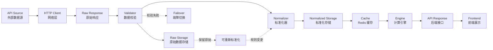

### 1.2 数据流分层职责

| 层 | 组件 | 职责 | 数据存储 |
|----|------|------|----------|
| 采集层 | HTTP Client | 发起请求、处理网络异常 | — |
| 原始层 | Raw Response | 保留未修改的原始响应 | `raw_*_data` 表 |
| 校验层 | Validator | 格式/质量校验、触发 Failover | — |
| 标准化层 | Normalizer | 统一字段/单位/时间/精度 | `normalized_*` 表 |
| 缓存层 | Cache (Redis) | 热数据缓存、加速读取 | Redis |
| 计算层 | Engine | 指标/周期/估值/风险计算 | `indicators`、`cycle_states` 等 |
| 服务层 | API Response | 对外接口、聚合数据 | — |
| 展示层 | Frontend | 可视化、数据源标识 | — |

### 1.3 完整数据流（含双存储）

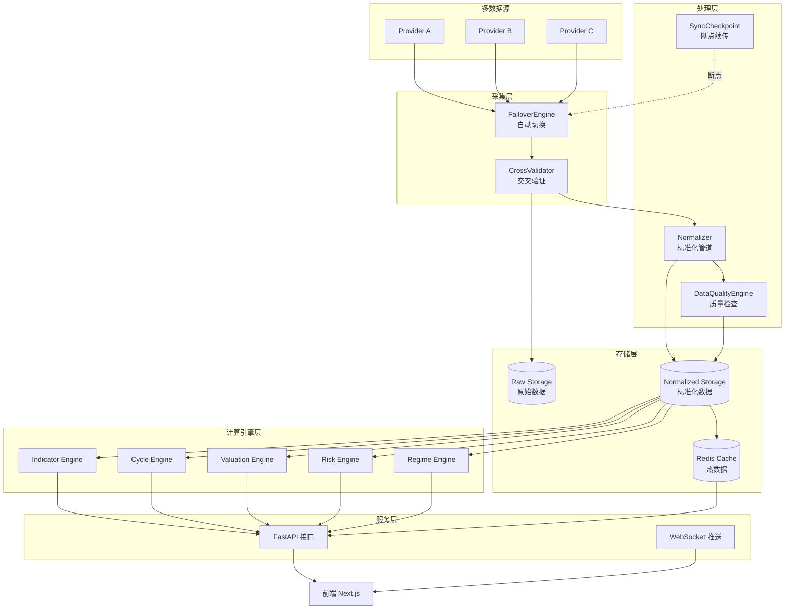

---

## 2. 实时数据流

### 2.1 实时数据采集策略

系统采用「定时轮询 + WebSocket 推送」双模式采集实时数据，不同数据类型采用不同频率。

| 数据类型 | 采集方式 | 频率 | 说明 |
|----------|----------|------|------|
| BTC 现货价格 | WebSocket + 轮询 | 实时 / 1m | 交易所 WS 优先，轮询兜底 |
| OHLCV K线 (1m) | 轮询 | 1 分钟 | 每分钟收盘后采集 |
| OHLCV K线 (5m) | 轮询 | 5 分钟 | |
| OHLCV K线 (1h) | 轮询 | 1 小时 | |
| OHLCV K线 (1d) | 轮询 | 每日 | UTC 0 点收盘后 |
| 衍生品 (Funding/OI) | 轮询 | 5m / 1h | Funding 每 8h 结算 |
| 清算数据 | WebSocket + 轮询 | 实时 / 5m | 剧烈波动时高频 |
| 链上指标 | 轮询 | 1h / 1d | 链上确认有延迟 |
| ETF 流量 | 轮询 | 1d | 每日更新 |
| 宏观数据 | 轮询 | 1d / 事件触发 | 数据发布日采集 |
| 情绪指标 | 轮询 | 1h / 1d | Fear&Greed 每日 |

### 2.2 定时轮询数据流

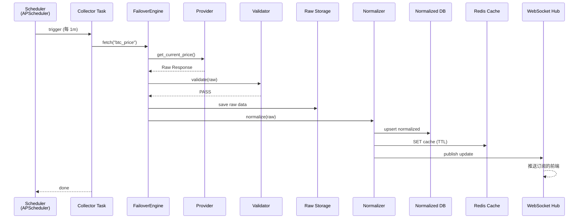

### 2.3 WebSocket 实时推送流

对于支持 WebSocket 的交易所（如 Binance），优先使用 WS 获取实时数据：

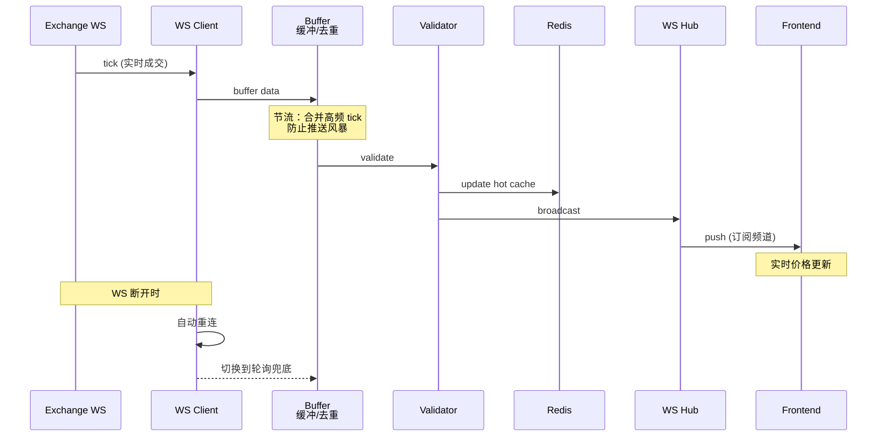

**WebSocket 可靠性设计**：

| 机制 | 说明 |
|------|------|
| 自动重连 | 断开后指数退避重连 |
| 心跳保活 | 定期发送 ping，检测连接活性 |
| 轮询兜底 | WS 不可用时自动降级为轮询 |
| 数据去重 | 消息 ID 去重，防止重复入库 |
| 节流合并 | 高频 tick 合并，降低推送压力 |
| 断线补洞 | 重连后补齐缺失区间数据 |

### 2.4 Redis 缓存策略

```python
class CacheStrategy:
    """Redis 缓存策略。

    原则：缓存只是加速层，数据库才是长期数据源。
    缓存绝不能成为唯一数据源。
    """

    CACHE_CONFIG = {
        "btc_price":       {"ttl": 60,      "key": "price:btc:current"},
        "ohlcv_1m":        {"ttl": 120,     "key": "ohlcv:btc:1m:latest"},
        "market_overview": {"ttl": 300,     "key": "market:overview"},
        "funding_rate":    {"ttl": 300,     "key": "derivatives:funding:btc"},
        "fear_greed":      {"ttl": 3600,    "key": "sentiment:fear_greed"},
        "mvrv":            {"ttl": 3600,    "key": "onchain:mvrv:latest"},
        "homepage_data":   {"ttl": 60,      "key": "homepage:aggregate"},
    }

    async def get_or_fetch(self, data_type: str, fetch_fn) -> Any:
        """缓存优先，未命中则回源。"""
        config = self.CACHE_CONFIG[data_type]
        cached = await self._redis.get(config["key"])
        if cached and not self._is_stale(cached):
            return self._deserialize(cached)
        # 缓存未命中，回源（触发完整数据流）
        data = await fetch_fn()
        await self._redis.setex(config["key"], config["ttl"], self._serialize(data))
        return data
```

**缓存失效策略**：

| 策略 | 触发条件 | 行为 |
|------|----------|------|
| TTL 过期 | 到达设定时间 | 自动失效，下次回源 |
| 主动更新 | 新数据入库 | 覆盖缓存 |
| stale 标记 | 全部 Provider 失败 | 保留旧值 + 标记 stale |
| 版本失效 | 数据版本变更 | 清除相关缓存 |

### 2.5 前端 WebSocket 订阅

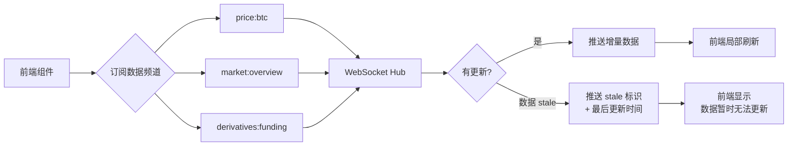

前端订阅协议：

```typescript
// 前端 WebSocket 订阅消息格式
interface SubscribeMessage {
  action: "subscribe" | "unsubscribe";
  channels: string[];      // ["price:btc", "market:overview"]
}

// 服务端推送消息格式
interface DataUpdateMessage {
  channel: string;
  data: any;
  quality_status: "VERIFIED" | "ESTIMATED" | "STALE" | "CONFLICT" | "INVALID";
  source_provider: string;        // 当前数据源
  is_failover: boolean;           // 是否备用源
  observation_time: string;       // 数据观测时间
  last_updated: string;           // 最后更新时间
  fetch_time: string;
}
```

---

## 3. 批量历史数据流

### 3.1 历史数据同步原则

**核心要求**（对应需求第八、十二、十三节）：

1. 历史数据一旦抓取成功，立即保存到本地数据库
2. 查看历史数据（2017/2018/2019...）直接读本地库，不重新请求 API
3. 同步任务支持断点续传（Checkpoint），崩溃后从断点继续
4. 支持数据补洞（Gap Detection + Auto Fill）
5. 支持暂停、继续、重试、跳过、重新同步

### 3.2 历史数据同步流程

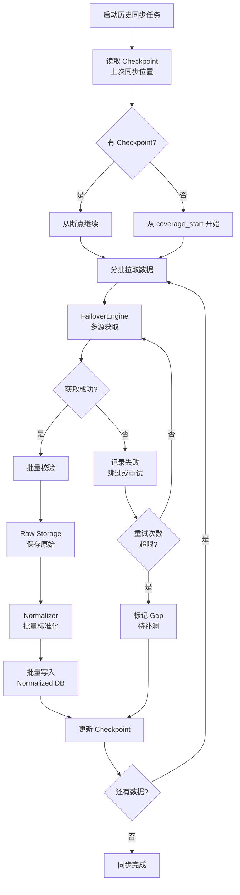

### 3.3 断点续传（Checkpoint）机制

```python
@dataclass
class SyncCheckpoint:
    """同步检查点 — 对应 sync_checkpoints 表。"""
    checkpoint_id: UUID
    task_name: str                  # e.g., "ohlcv_1d_sync"
    data_type: str                  # e.g., "ohlcv"
    symbol: str                     # e.g., "BTC/USDT"
    provider_name: str              # 使用的 Provider
    last_synced_time: datetime      # 已同步到的时间点
    start_time: datetime            # 同步起点
    target_end_time: datetime       # 同步目标终点
    status: str                     # running / paused / completed / failed
    records_synced: int             # 已同步记录数
    records_failed: int             # 失败记录数
    last_error: Optional[str]       # 最近错误
    created_at: datetime
    updated_at: datetime


class CheckpointManager:
    """断点续传管理器。"""

    async def save_checkpoint(self, checkpoint: SyncCheckpoint) -> None:
        """保存检查点（每批次后调用）。"""
        ...

    async def load_checkpoint(self, task_name: str) -> Optional[SyncCheckpoint]:
        """加载检查点，用于恢复。"""
        ...

    async def resume_from_checkpoint(self, task_name: str) -> datetime:
        """返回应该从哪个时间点继续。

        崩溃恢复逻辑：
        - 读取 last_synced_time
        - 从 last_synced_time + interval 继续
        """
        ...
```

**断点续传示例**（对应需求第十二节）：

```
已同步到：2021-05-01
    ↓ 程序崩溃
重新启动：
    ↓ 读取 Checkpoint
从：2021-05-02 继续（不从头开始）
```

### 3.4 数据补洞（Gap Detection + Auto Fill）

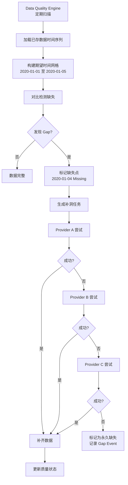

**补洞检测算法**：

```python
class GapDetector:
    """数据缺口检测器。"""

    async def detect_gaps(
        self,
        data_type: str,
        symbol: str,
        interval: str,
        start: datetime,
        end: datetime,
    ) -> list[Gap]:
        """检测时间序列中的缺口。"""
        # 1. 生成期望的时间网格
        expected = self._build_time_grid(start, end, interval)
        # 2. 查询实际存在的时间点
        actual = await self._query_existing_timestamps(data_type, symbol, start, end)
        # 3. 求差集
        missing = set(expected) - set(actual)
        # 4. 合并连续缺口
        return self._merge_consecutive_gaps(sorted(missing))

    async def auto_fill(self, gaps: list[Gap]) -> FillResult:
        """自动补洞 — 按 Provider 优先级依次尝试。"""
        ...


@dataclass
class Gap:
    """数据缺口。"""
    data_type: str
    symbol: str
    gap_start: datetime
    gap_end: datetime
    expected_records: int
    missing_records: int
    detected_at: datetime
    fill_status: str = "pending"    # pending / filled / permanent_missing
```

### 3.5 批量写入优化

历史数据同步涉及大量写入，需要优化性能：

```python
class BatchWriter:
    """批量写入优化器。"""

    def __init__(self, batch_size: int = 1000, flush_interval: float = 5.0):
        self.batch_size = batch_size
        self.flush_interval = flush_interval
        self._buffer: list = []

    async def add(self, record: NormalizedRecord) -> None:
        """添加到缓冲区，达到批次大小时自动 flush。"""
        self._buffer.append(record)
        if len(self._buffer) >= self.batch_size:
            await self.flush()

    async def flush(self) -> None:
        """批量写入数据库。

        优化手段：
        1. COPY 批量插入（PostgreSQL）
        2. 事务批处理
        3. 幂等 UPSERT（ON CONFLICT DO UPDATE）
        4. 时序表分区写入（TimescaleDB hypertable）
        """
        if not self._buffer:
            return
        async with self._db.transaction():
            await self._db.bulk_insert(self._buffer)
        self._buffer.clear()
```

**批量写入优化手段**：

| 优化手段 | 说明 | 适用场景 |
|----------|------|----------|
| COPY 批量插入 | PostgreSQL COPY 协议，比逐条 INSERT 快 10x+ | 大批量历史导入 |
| 事务批处理 | 多记录单事务提交，减少 fsync | 所有批量写入 |
| 幂等 UPSERT | `ON CONFLICT DO UPDATE`，避免重复 | 重跑同步任务 |
| 时序分区 | TimescaleDB hypertable 按时间分区 | 时序数据 |
| 异步缓冲 | 内存缓冲 + 定时 flush | 高频写入 |
| 关闭索引延迟重建 | 大批量导入时先禁用索引 | 初始化全量导入 |

---

## 4. 数据标准化管道

### 4.1 双存储设计

对应需求第九节，所有重要数据同时保存 **Raw Data** 和 **Normalized Data**：

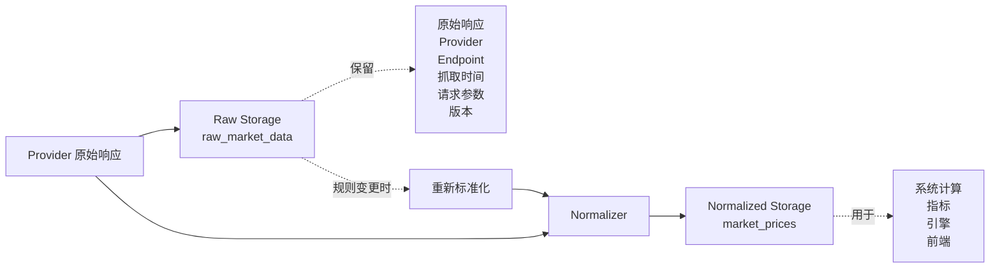

**双存储价值**：Provider 更换或标准化规则变更时，可基于 Raw Data 重新分析历史数据，无需重新请求 API。

### 4.2 Raw Data 存储结构

```python
@dataclass
class RawDataRecord:
    """原始数据记录 — 对应 raw_*_data 表。

    必须尽可能保留所有原始信息。
    """
    raw_id: UUID
    provider_name: str              # Provider
    api_endpoint: str               # API Endpoint
    request_params: dict            # 请求参数
    request_headers: dict           # 请求头（脱敏）
    raw_response: str               # 原始响应（JSON/原始格式）
    response_format: str            # json / xml / csv / html
    http_status: int                # HTTP 状态
    fetch_time: datetime            # 抓取时间
    observation_time: Optional[datetime]  # 数据时间
    data_type: str                  # 数据类型
    symbol: str                     # 交易对
    unit: str                       # 单位
    fields: list[str]               # 字段列表
    schema_version: str             # 版本
    quality_status: str             # 状态
    created_at: datetime
```

### 4.3 Normalizer 标准化职责

```python
class DataNormalizer:
    """数据标准化器。

    职责：统一不同 Provider 的数据格式差异。
    """

    def normalize(self, raw: RawDataRecord) -> NormalizedRecord:
        """将原始数据标准化。"""
        return NormalizedRecord(
            # 1. 统一字段名
            fields=self._map_field_names(raw),
            # 2. 统一单位（如价格统一到 USDT，数量统一到 BTC）
            values=self._normalize_units(raw),
            # 3. 统一时间格式（全部转 UTC ISO8601）
            timestamp=self._normalize_time(raw),
            # 4. 统一精度（Decimal，固定小数位）
            precision=self._normalize_precision(raw),
            # 5. 保留数据溯源
            source_id=raw.provider_name,
            observation_time=raw.observation_time,
            fetch_time=raw.fetch_time,
        )

    def _map_field_names(self, raw: RawDataRecord) -> dict:
        """字段名映射：不同 Provider 的字段名统一到标准名。

        例如：
        Binance:  "c" (close price)
        Coinbase: "price"
        OKX:      "close"
        → 统一为: "close"
        """
        ...

    def _normalize_units(self, raw: RawDataRecord) -> dict:
        """单位标准化。

        例如：
        - 价格：统一到 USDT/USD
        - 数量：satoshi → BTC (÷ 1e8)
        - 金额：不同量纲统一
        - 比率：百分比 → 小数
        """
        ...

    def _normalize_time(self, raw: RawDataRecord) -> datetime:
        """时间标准化。

        - 时间戳（秒/毫秒）→ datetime
        - 各时区 → UTC
        - 字符串格式 → ISO8601
        """
        ...
```

### 4.4 标准化规则配置化

标准化规则不硬编码，而是配置驱动，支持不同 Provider 的字段映射：

```yaml
# config/normalization.yaml
normalization:
  version: "1.0"

  # OHLCV 标准化规则
  ohlcv:
    field_mapping:
      binance:
        open_time: 0      # 数组索引
        open: 1
        high: 2
        low: 3
        close: 4
        volume: 5
      coinbase:
        open_time: "time"
        open: "open"
        high: "high"
        low: "low"
        close: "close"
        volume: "volume"
      okx:
        open_time: "ts"
        open: "o"
        high: "h"
        low: "l"
        close: "c"
        volume: "vol"

    unit_rules:
      timestamp: "ms_to_utc"      # 毫秒时间戳转 UTC
      price: "decimal_8"          # 8 位小数
      volume: "decimal_8"
      price_quote: "USDT"         # 计价货币

  # 链上指标标准化
  onchain:
    field_mapping:
      glassnode:
        value: "v"
        time: "t"
      cryptoquant:
        value: "data.value"
        time: "data.date"
    unit_rules:
      value: "decimal_auto"
      timestamp: "s_to_utc"

  # 宏观数据标准化
  macro:
    # 必须区分三个日期（防止未来数据泄漏）
    date_fields:
      observation_date: "observation_date"  # 数据所属期
      release_date: "release_date"          # 首次发布
      revision_date: "revision_date"        # 修订
    unit_rules:
      value: "decimal_auto"
      # 单位标准化
      cpi: "index_1982_84"
      m2: "billions_usd"
      fed_balance_sheet: "billions_usd"
```

### 4.5 支持重新标准化

当标准化规则变更时，可基于 Raw Data 重新标准化，无需重新请求 API：

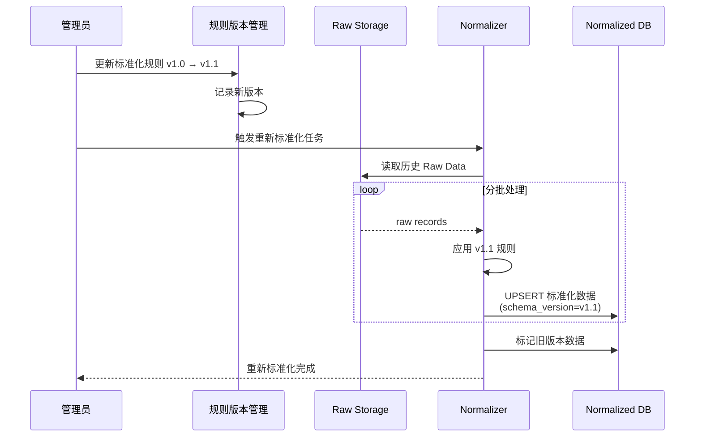

```python
class ReNormalizationTask:
    """重新标准化任务。"""

    async def reprocess(
        self,
        data_type: str,
        rule_version: str,
        start: Optional[datetime] = None,
        end: Optional[datetime] = None,
    ) -> ReProcessResult:
        """基于 Raw Data 重新标准化。

        场景：
        - Provider API 字段变更
        - 单位换算规则修正
        - 发现历史标准化 bug
        """
        ...
```

---

## 5. 交叉验证流程

### 5.1 交叉验证原则

对应需求第七节，对于价格、成交量、资金流、ETF、链上等重要数据，必须支持 Cross Validation：

- 多源同时获取同一数据点
- 计算 Median / VWAP / Deviation
- 偏差阈值判断：`VERIFIED`（一致）/ `CONFLICT`（冲突）
- 冲突必须记录，**不能偷偷选择一个**

### 5.2 交叉验证流程

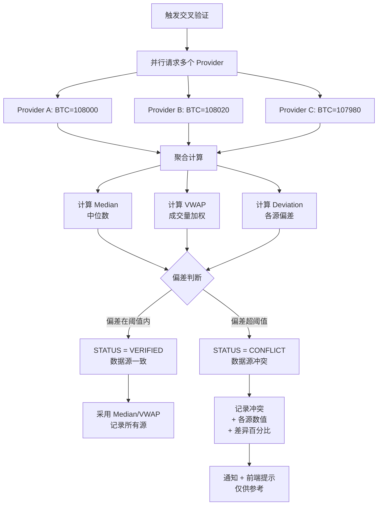

### 5.3 交叉验证算法

```python
from statistics import median
from decimal import Decimal


class CrossValidator:
    """多源交叉验证器。"""

    def __init__(self, config: CrossValidationConfig):
        self._config = config

    async def validate(
        self, data_type: str, symbol: str
    ) -> CrossValidationResult:
        """对某数据点执行多源交叉验证。"""
        # 1. 并行获取多个 Provider 的数据
        values = await self._fetch_from_multiple_providers(data_type, symbol)

        if len(values) < 2:
            return CrossValidationResult(
                status="insufficient_sources",
                message="数据源不足，无法交叉验证",
            )

        # 2. 计算 Median（中位数）
        median_value = median([v.value for v in values])

        # 3. 计算 VWAP（成交量加权平均，若有权重）
        vwap_value = self._compute_vwap(values)

        # 4. 计算每个源的偏差
        deviations = {
            v.provider: abs(v.value - median_value) / median_value
            for v in values
        }
        max_deviation = max(deviations.values())

        # 5. 阈值判断
        threshold = self._config.get_threshold(data_type)
        if max_deviation <= threshold:
            status = "VERIFIED"
        else:
            status = "CONFLICT"

        return CrossValidationResult(
            status=status,
            median_value=median_value,
            vwap_value=vwap_value,
            max_deviation=max_deviation,
            source_values=values,
            deviations=deviations,
            threshold=threshold,
        )

    def _compute_vwap(self, values: list) -> Decimal:
        """成交量加权平均价。"""
        total_weight = sum(v.weight for v in values if v.weight)
        if total_weight == 0:
            return median([v.value for v in values])
        return sum(v.value * v.weight for v in values) / total_weight
```

### 5.4 交叉验证结果结构

```python
@dataclass
class SourceValue:
    """单个数据源的值。"""
    provider: str
    value: Decimal
    weight: Optional[Decimal] = None    # 权重（如成交量）
    observation_time: Optional[datetime] = None
    deviation: Optional[float] = None    # 与 median 的偏差


@dataclass
class CrossValidationResult:
    """交叉验证结果。"""
    status: str                         # VERIFIED / CONFLICT / insufficient_sources
    median_value: Optional[Decimal] = None
    vwap_value: Optional[Decimal] = None
    max_deviation: float = 0.0          # 最大偏差（小数）
    mean_deviation: float = 0.0
    threshold: float = 0.0
    source_values: list[SourceValue] = field(default_factory=list)
    deviations: dict[str, float] = field(default_factory=dict)
    conflicting_sources: list[str] = field(default_factory=list)
    message: str = ""
    validated_at: datetime = field(default_factory=datetime.utcnow)
```

### 5.5 偏差阈值配置

不同数据类型容忍的偏差不同：

```yaml
# config/cross_validation.yaml
cross_validation:
  enabled: true
  min_sources: 2              # 最少数据源数量

  thresholds:
    btc_price: 0.005          # 价格偏差 0.5% 内为 VERIFIED
    volume: 0.02              # 成交量偏差 2%（各源统计口径不同）
    market_cap: 0.01          # 市值偏差 1%
    funding_rate: 0.05        # 资金费率偏差 5%（结算时点不同）
    open_interest: 0.03       # 持仓量偏差 3%
    mvrv: 0.02                # 链上指标偏差 2%
    etf_flow: 0.05            # ETF 流量偏差 5%（各源统计差异大）
    fear_greed: 0.10          # 情绪指数偏差 10%（算法不同）

  # 冲突处理
  on_conflict:
    strategy: "use_median"    # 采用中位数，但记录所有源
    record_conflict: true     # 必须记录冲突
    notify_threshold: 0.10    # 偏差超 10% 时通知
    frontend_hint: "数据源存在异常差异，当前结果仅供参考"
```

### 5.6 冲突记录与通知

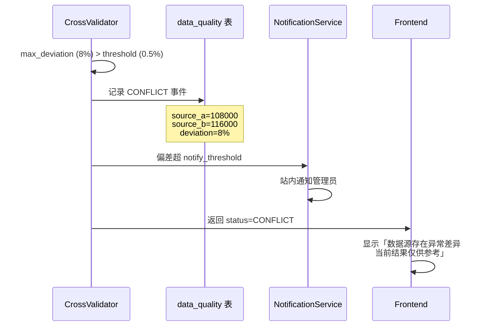

**前端展示契约**：

| 验证状态 | 前端展示 |
|----------|----------|
| `VERIFIED` | 「数据源一致」✅ |
| `CONFLICT` | 「数据源存在异常差异，当前结果仅供参考」⚠️ |
| `insufficient_sources` | 「数据源不足，无法交叉验证」 |

---

## 6. 数据一致性保障

### 6.1 一致性核心原则

对应需求第一、十一、十四节，数据一致性必须保障：

1. **事务性写入**：Raw + Normalized 原子写入
2. **幂等性设计**：重复写入不产生脏数据
3. **版本号/时间戳去重**：防止重复和乱序
4. **不能用错误数据覆盖正确数据**：核心红线
5. **绝不生成假数据**：无数据时明确标记，不伪造

### 6.2 事务性写入

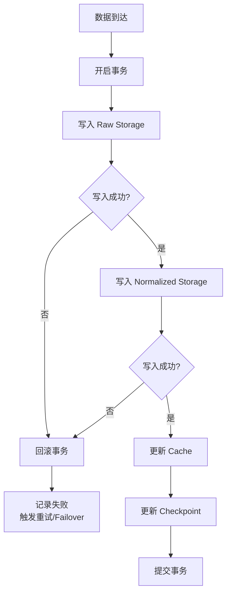

```python
class TransactionalWriter:
    """事务性数据写入器。"""

    async def write(self, raw: RawDataRecord, normalized: NormalizedRecord) -> None:
        """Raw + Normalized 原子写入。

        任一失败则整体回滚，保证一致性。
        """
        async with self._db.transaction():
            # 1. 幂等写入 Raw（基于唯一键）
            await self._upsert_raw(raw)
            # 2. 幂等写入 Normalized（含版本/时间戳检查）
            await self._upsert_normalized(normalized)
            # 3. 更新 Checkpoint
            await self._update_checkpoint(normalized)
        # 事务提交后更新缓存（缓存非关键，可异步）
        await self._update_cache(normalized)
```

### 6.3 幂等性设计

同步任务可能重跑，必须保证幂等（重复执行结果一致）：

```sql
-- 幂等 UPSERT：基于唯一键（data_type + symbol + observation_time + source_id）
INSERT INTO market_prices (
    symbol, interval, observation_time, open, high, low, close, volume,
    source_id, fetch_time, quality_status, schema_version
)
VALUES ($1, $2, $3, $4, $5, $6, $7, $8, $9, $10, $11, $12)
ON CONFLICT (symbol, interval, observation_time, source_id)
DO UPDATE SET
    open = EXCLUDED.open,
    high = EXCLUDED.high,
    low = EXCLUDED.low,
    close = EXCLUDED.close,
    volume = EXCLUDED.volume,
    fetch_time = EXCLUDED.fetch_time,
    -- 关键：只有新数据质量不低于旧数据才更新
    quality_status = CASE
        WHEN quality_rank(EXCLUDED.quality_status) >= quality_rank(market_prices.quality_status)
        THEN EXCLUDED.quality_status
        ELSE market_prices.quality_status
    END,
    updated_at = NOW();
```

### 6.4 版本号/时间戳去重

```python
class DeduplicationGuard:
    """去重与乱序防护。

    防止：
    1. 重复写入同一数据点
    2. 旧数据覆盖新数据（乱序到达）
    3. 低质量数据覆盖高质量数据
    """

    # 质量状态优先级（越高越可信）
    QUALITY_RANK = {
        "VERIFIED": 4,     # 多源验证一致
        "ESTIMATED": 3,    # 单源可信
        "CONFLICT": 2,     # 多源冲突
        "STALE": 1,        # 过期数据
        "INVALID": 0,      # 数据校验失败或无数据
    }

    def should_update(
        self,
        existing: NormalizedRecord,
        incoming: NormalizedRecord,
    ) -> bool:
        """判断是否应该用新数据覆盖旧数据。

        核心规则：不能用错误数据覆盖正确数据。
        """
        # 规则 1：时间戳更新的数据优先
        if incoming.observation_time < existing.observation_time:
            # 旧数据到达，不能覆盖新数据
            return False

        # 规则 2：质量更高的数据优先
        incoming_rank = self.QUALITY_RANK[incoming.quality_status]
        existing_rank = self.QUALITY_RANK[existing.quality_status]
        if incoming_rank < existing_rank:
            # 低质量数据不能覆盖高质量数据
            return False

        # 规则 3：版本号更高的优先
        if incoming.schema_version < existing.schema_version:
            return False

        return True
```

### 6.5 「不能用错误数据覆盖正确数据」保障

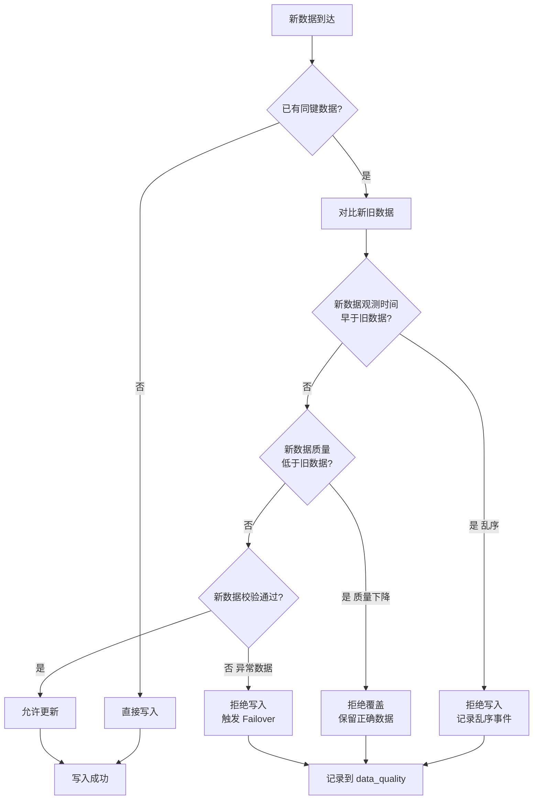

### 6.6 数据质量状态流转

每条数据都带有 `quality_status`，其状态流转如下：

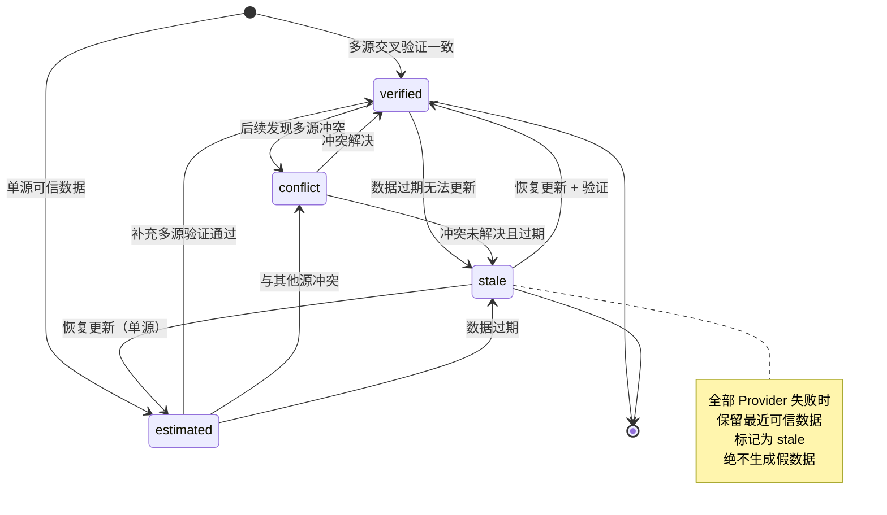

| quality_status | 含义 | 前端标识 | 数据来源 |
|----------------|------|----------|----------|
| `VERIFIED` | 多源验证一致 | 「数据源一致」 | 交叉验证通过 |
| `ESTIMATED` | 单源可信估算 | 显示数据源 | 单一 Provider |
| `CONFLICT` | 多源冲突 | 「数据源存在异常差异」 | 交叉验证偏差超阈值 |
| `STALE` | 过期数据 | 「数据暂时无法更新」 | 全部 Provider 失败 |
| `INVALID` | 数据校验失败或无数据 | 「数据源未配置 / 数据不可用」 | 从未获取成功或校验失败 |

### 6.7 数据溯源（Lineage）

对应需求「所有数据都能够追溯」，每条标准化数据都能追溯到原始来源：

```python
@dataclass
class NormalizedRecord:
    """标准化数据记录 — 所有核心数据的通用字段。

    对应需求第三十六节：所有核心数据必须包含溯源字段。
    """
    # ---- 数据本体 ----
    data_type: str
    symbol: str
    observation_time: datetime      # 数据观测时间（必填）
    value: Any

    # ---- 溯源字段（必填）----
    source_id: str                  # 数据来源 Provider
    fetch_time: datetime            # 抓取时间
    created_at: datetime            # 入库时间
    updated_at: datetime            # 更新时间
    quality_status: str             # 质量状态
    schema_version: str             # 标准化规则版本

    # ---- 关联原始数据 ----
    raw_data_id: Optional[UUID]     # 关联的 Raw Data 记录

    # ---- 交叉验证 ----
    cross_validation_status: Optional[str] = None
    validation_sources: list[str] = field(default_factory=list)
```

**溯源链路**：

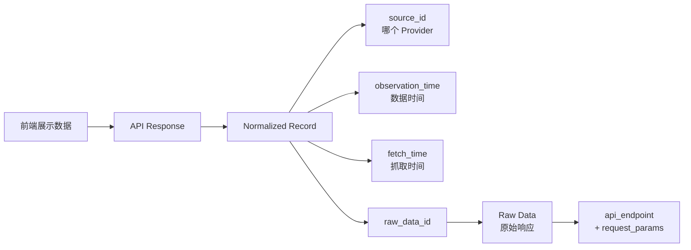

用户点击任何数据，都能一路追溯到：**哪个 Provider → 哪个 API → 什么时间抓取 → 原始响应是什么**。

---

## 附录 A：数据流全链路时序图

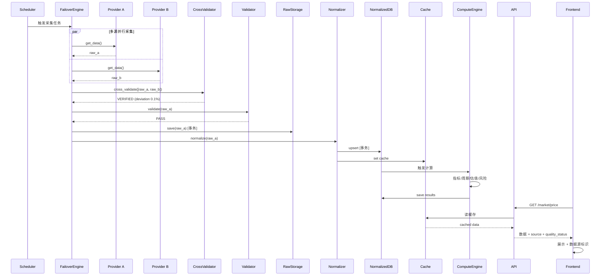

## 附录 B：数据流关键设计决策

| 决策点 | 选择 | 理由 |
|--------|------|------|
| 实时采集方式 | WebSocket 优先 + 轮询兜底 | WS 实时性高，轮询保证可用性 |
| 存储模式 | Raw + Normalized 双存储 | 支持重新标准化，数据可追溯 |
| 缓存角色 | Redis 仅作加速层 | 数据库才是长期数据源 |
| 历史数据 | 本地库优先，不重复请求 API | API 可能失效，本地数据永久可用 |
| 写入方式 | 事务性 UPSERT | 保证一致性 + 幂等 |
| 冲突处理 | 记录所有源，采用 Median | 不偷偷选一个，可追溯 |
| 无数据时 | 标记 STALE/INVALID | 绝不生成假数据 |
| 覆盖规则 | 高质量不被低质量覆盖 | 保护正确数据 |
| 标准化规则 | 配置化 + 版本化 | 支持规则变更时重新处理 |
| 补洞策略 | 多源依次尝试 | 单源失败不影响补洞 |

## 附录 C：数据库表映射

| 数据流阶段 | 数据库表 | 说明 |
|------------|----------|------|
| Raw 存储 | `raw_market_data` 等 | 原始响应 |
| Normalized 存储 | `market_prices`、`candles`、`onchain_metrics`、`etf_flows`、`derivatives`、`options_data`、`macro_series`、`sentiment` | 标准化数据 |
| 订单簿 | `orderbooks` | 深度数据 |
| 交易所流量 | `exchange_flows` | 资金流 |
| 断点续传 | `sync_checkpoints` | 同步检查点 |
| 数据质量 | `data_quality` | 质量记录、Gap、冲突 |
| 计算结果 | `indicators`、`cycle_states`、`risk_scores`、`market_regimes` | 引擎输出 |
| 任务调度 | `system_jobs` | 采集任务 |
