# 08 - 数据库 ER 设计

## 1. 设计原则

### 1.1 TimescaleDB Hypertable 策略

所有时序数据使用 TimescaleDB hypertable 管理，遵循以下规则：

- **分区键选择**：`observation_time` 作为主分区键（时间维度），高频写入表额外使用 `symbol` 或 `provider_id` 作为空间维度
- **Chunk 时间间隔**：根据数据频率选择 —— tick 级 1 天，分钟级 7 天，小时级 30 天，日级 1 年
- **空间分区数**：默认 8-16 个 chunk，根据 symbol 基数调整

### 1.2 公共字段规范

所有时序数据表必须包含以下公共字段：

| 字段 | 类型 | 说明 |
|------|------|------|
| `source_id` | UUID NOT NULL | 数据来源 Provider ID，外键引用 providers(id) |
| `observation_time` | TIMESTAMPTZ NOT NULL | 数据实际观测时间（业务时间） |
| `fetch_time` | TIMESTAMPTZ NOT NULL DEFAULT NOW() | 数据抓取/接收时间 |
| `created_at` | TIMESTAMPTZ NOT NULL DEFAULT NOW() | 记录创建时间 |
| `updated_at` | TIMESTAMPTZ NOT NULL DEFAULT NOW() | 记录最后更新时间 |
| `quality_status` | VARCHAR(20) NOT NULL DEFAULT 'VERIFIED' | 数据质量状态：VERIFIED / ESTIMATED / STALE / CONFLICT / INVALID |

### 1.3 Raw Data 与 Normalized Data 分离存储

```
┌─────────────────────────────────────────────────────────┐
│  Provider API Response                                   │
│  ┌──────────────────────────────────────┐               │
│  │  raw_* 表                             │               │
│  │  - 完整 JSON 原始响应                  │               │
│  │  - 保留所有原始字段                    │               │
│  │  - 记录请求参数和响应头                │               │
│  │  - 支持数据重放和重新标准化            │               │
│  └──────────────────────────────────────┘               │
│                     ↓ ETL Pipeline                       │
│  ┌──────────────────────────────────────┐               │
│  │  标准化表 (market_prices, candles...) │               │
│  │  - 统一字段命名                        │               │
│  │  - 统一时间格式                        │               │
│  │  - 统一计量单位                        │               │
│  │  - 交叉验证后的 quality_status         │               │
│  └──────────────────────────────────────┘               │
└─────────────────────────────────────────────────────────┘
```

### 1.4 Provider 追溯性

所有核心数据必须能追溯到具体 Provider：
- 每条记录通过 `source_id` 关联 `providers` 表
- Provider 注册信息永久保留，即使已禁用
- Raw 表保存完整请求上下文（endpoint、参数、响应头）

### 1.5 数据版本管理

- 模型版本通过 `model_versions` 表管理，不可覆盖
- 策略版本通过 `strategy_versions` 表管理
- 回测结果绑定具体的模型版本 + 策略版本 + 数据快照时间
- 宏观数据区分 `observation_date`、`release_date`、`revision_date`

---

## 2. 完整 ER 图

### 2.1 Provider 管理组

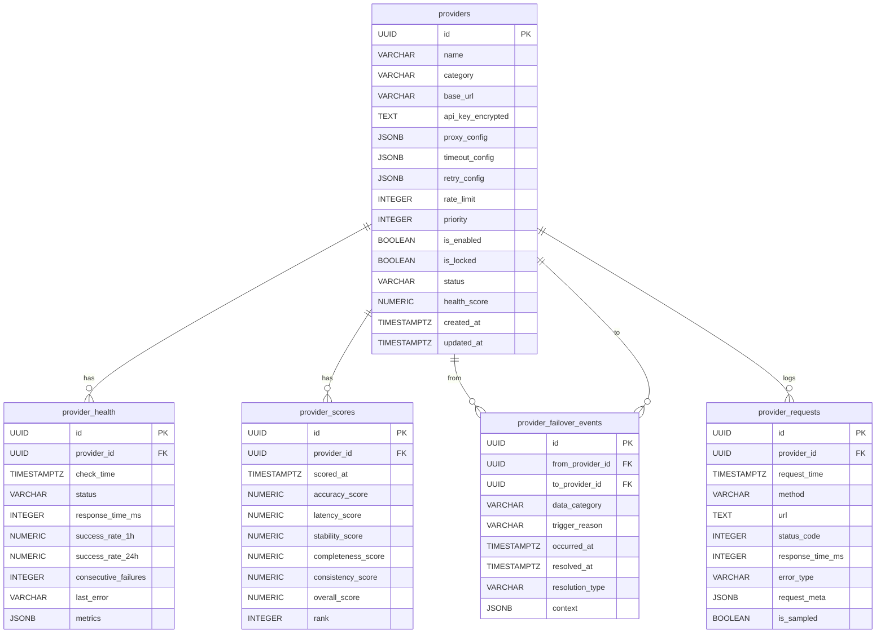

### 2.2 原始数据组

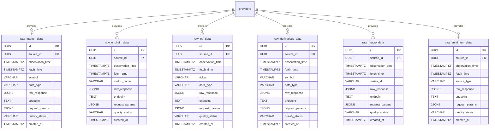

### 2.3 标准化市场数据组

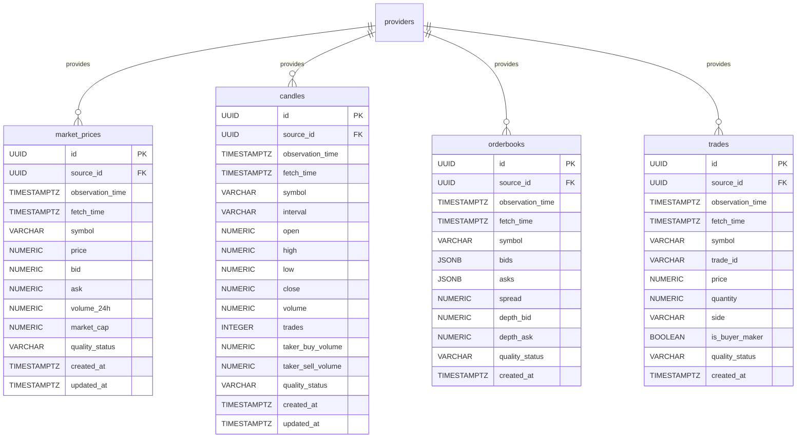

### 2.4 链上数据组

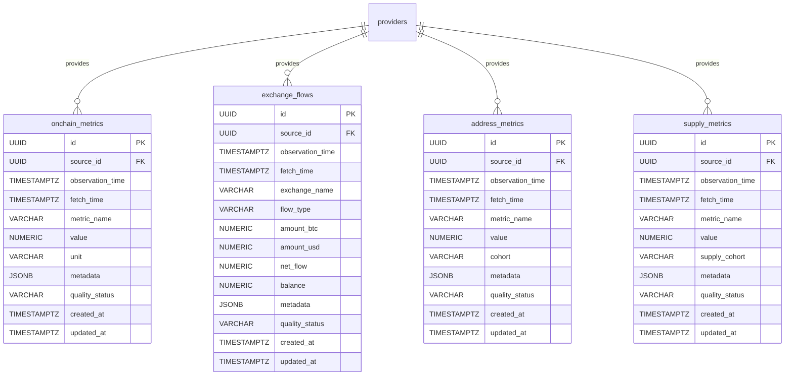

### 2.5 ETF 数据组

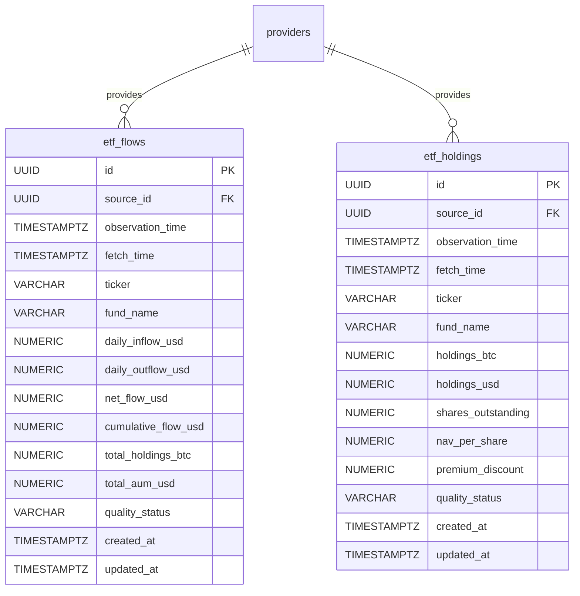

### 2.6 衍生品数据组

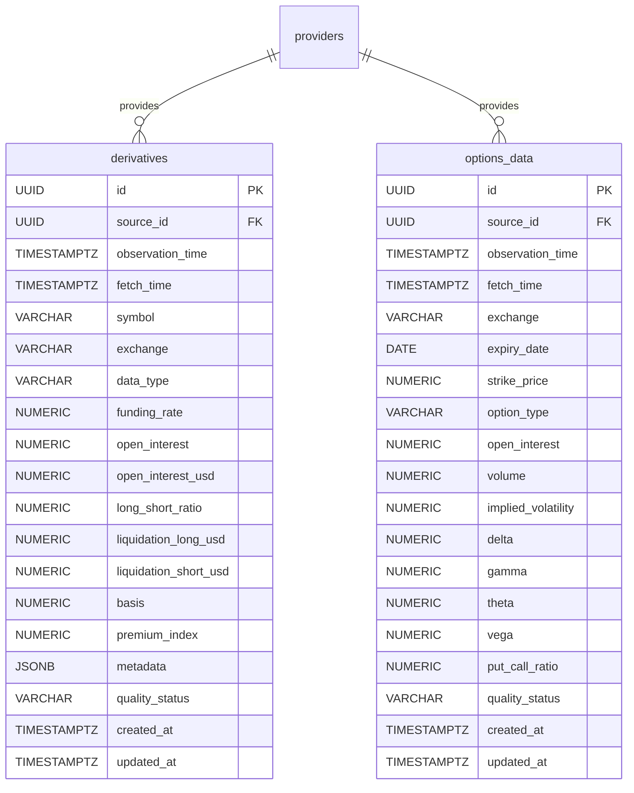

### 2.7 宏观数据组

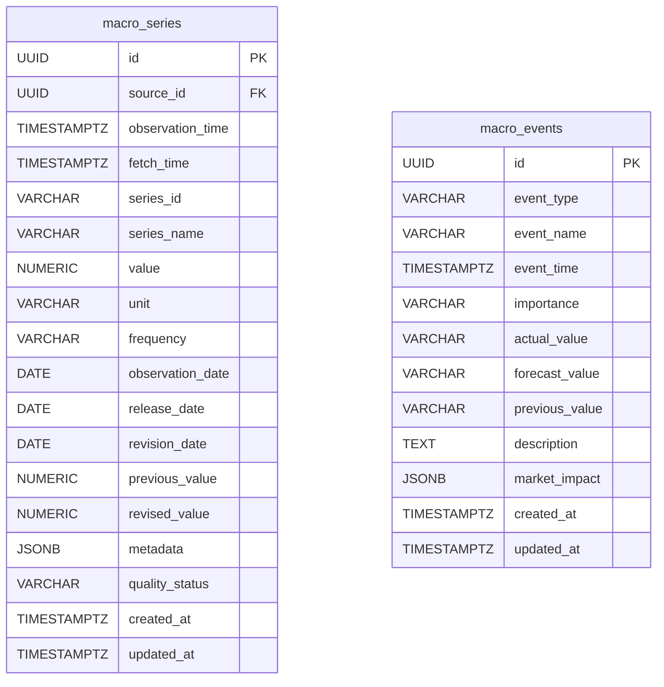

### 2.8 情绪数据组

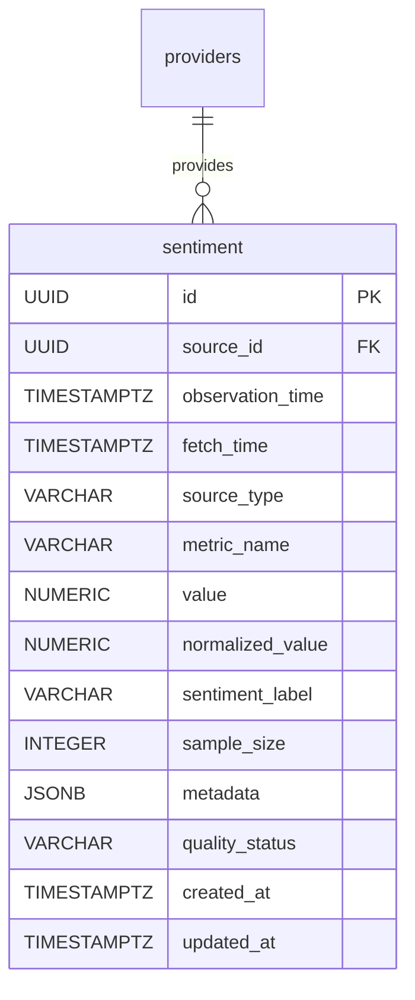

### 2.9 指标与引擎输出组

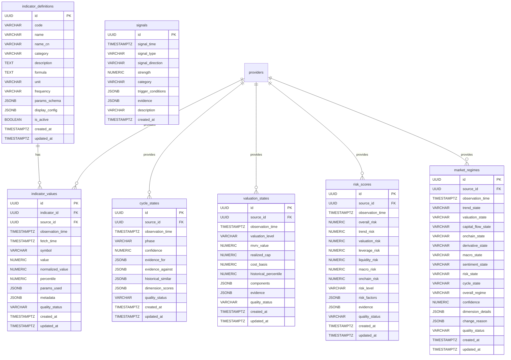

### 2.10 模型管理组

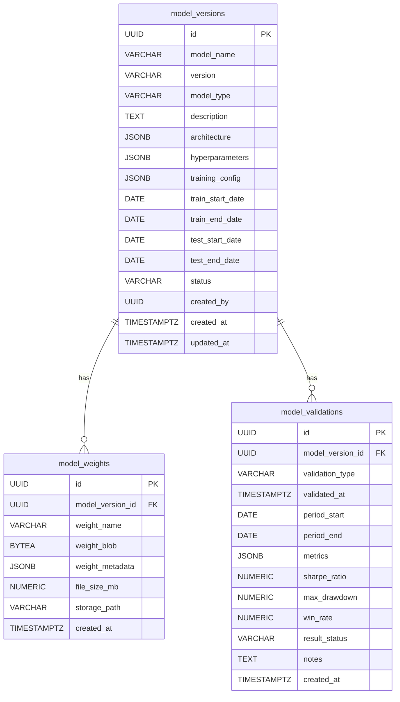

### 2.11 回测组

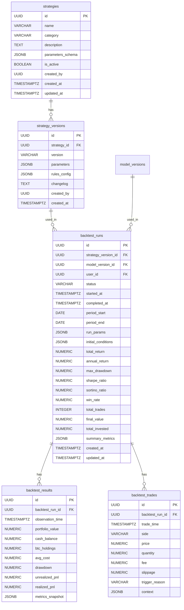

### 2.12 用户数据组

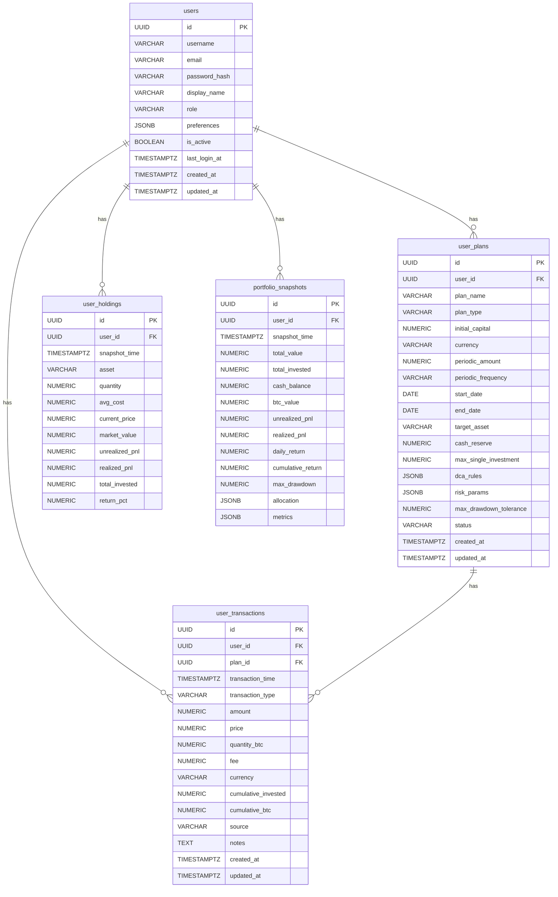

### 2.13 系统数据组

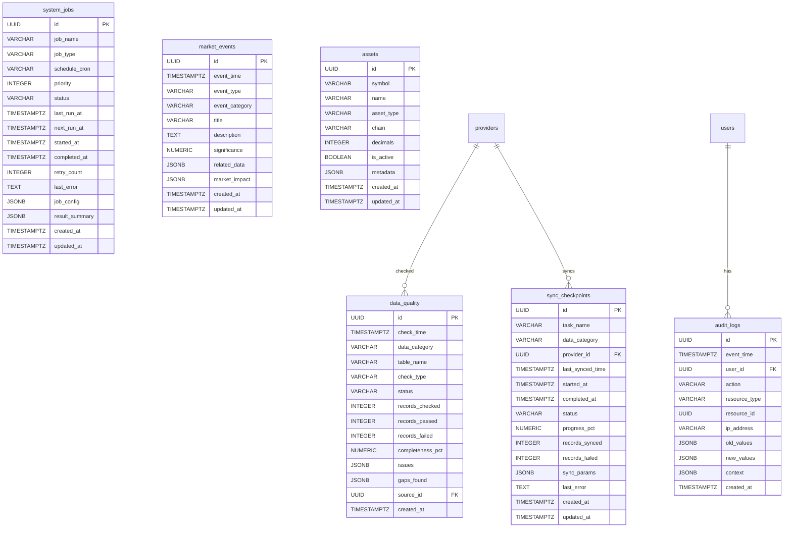

---

## 3. 表分组设计详解

### Group 1：Provider 管理

| 表名 | 用途 | 类型 | 预估数据量 |
|------|------|------|-----------|
| `providers` | Provider 注册信息、配置、当前状态 | 普通表 | <100 行 |
| `provider_health` | Provider 健康状态快照（每分钟采集） | Hypertable | ~50M 行/年 |
| `provider_scores` | Provider 综合评分历史（每小时计算） | Hypertable | ~1M 行/年 |
| `provider_failover_events` | 故障切换事件记录 | Hypertable | 低频，<10K/年 |
| `provider_requests` | 请求日志（采样存储，10%） | Hypertable | ~100M 行/年 |

**设计要点**：
- `providers` 为配置表，数量少但关联度极高，几乎所有数据表都通过 `source_id` 引用
- `provider_health` 高频写入，chunk_interval = 1 天，空间分区按 provider_id
- `provider_requests` 采样存储，仅保留 10% 的成功请求，100% 的失败请求
- `provider_failover_events` 记录完整的故障切换链路和恢复过程

### Group 2：原始数据

| 表名 | 用途 | 类型 | 保留策略 |
|------|------|------|---------|
| `raw_market_data` | 市场行情 API 原始响应 | Hypertable | 180 天后压缩，1 年后归档 |
| `raw_onchain_data` | 链上数据 API 原始响应 | Hypertable | 365 天后压缩 |
| `raw_etf_data` | ETF 数据 API 原始响应 | Hypertable | 365 天后压缩 |
| `raw_derivatives_data` | 衍生品数据 API 原始响应 | Hypertable | 180 天后压缩 |
| `raw_macro_data` | 宏观数据 API 原始响应 | Hypertable | 永久保留 |
| `raw_sentiment_data` | 情绪数据 API 原始响应 | Hypertable | 180 天后压缩 |

**设计要点**：
- 所有 raw 表核心字段为 `raw_response JSONB`，保留完整的 API 响应
- 支持数据重放：Provider 更换后可重新从 raw 数据生成标准化数据
- 使用 GIN 索引支持 JSONB 内部字段查询
- `endpoint` 和 `request_params` 记录完整请求上下文

### Group 3：标准化市场数据

| 表名 | 用途 | 类型 | 分区策略 |
|------|------|------|---------|
| `market_prices` | 标准化实时价格 | Hypertable | time: 1天, space: symbol |
| `candles` | OHLCV K线数据 | Hypertable | time: 7天, space: symbol |
| `orderbooks` | 订单簿快照 | Hypertable | time: 1天, space: symbol |
| `trades` | 逐笔成交（可选） | Hypertable | time: 1天, space: symbol |

**设计要点**：
- `candles` 通过 `interval` 字段区分不同时间粒度（1m, 5m, 15m, 1h, 4h, 1d, 1w）
- `market_prices` 为最频繁写入的表，需要优化写入性能
- `trades` 表数据量巨大，仅保留近期数据（90 天），使用 Continuous Aggregate 生成统计
- `orderbooks` 保存 top 50 档位快照，JSONB 存储

### Group 4：链上数据

| 表名 | 用途 | 类型 | 分区策略 |
|------|------|------|---------|
| `onchain_metrics` | 通用链上指标时序 | Hypertable | time: 30天, space: metric_name |
| `exchange_flows` | 交易所资金流入流出 | Hypertable | time: 30天 |
| `address_metrics` | 地址活跃指标 | Hypertable | time: 30天 |
| `supply_metrics` | 供应分布指标 | Hypertable | time: 30天 |

**设计要点**：
- `onchain_metrics` 使用通用 metric_name + value 模式，灵活支持任意链上指标
- 通过 `metadata JSONB` 存储指标特有的附加信息
- 链上数据通常为日频或小时频，数据量相对可控
- `exchange_flows` 按交易所维度记录，支持汇总

### Group 5：ETF 数据

| 表名 | 用途 | 类型 | 分区策略 |
|------|------|------|---------|
| `etf_flows` | ETF 资金流（日频） | Hypertable | time: 1年 |
| `etf_holdings` | ETF 持仓快照（日频） | Hypertable | time: 1年 |

**设计要点**：
- ETF 数据为日频，chunk_interval 设为 1 年
- 按 ticker 区分不同 ETF 产品（IBIT, FBTC, GBTC 等）
- 记录净流入、净流出、累计流量、总持仓
- 支持聚合查询：7D/30D/90D 资金流

### Group 6：衍生品数据

| 表名 | 用途 | 类型 | 分区策略 |
|------|------|------|---------|
| `derivatives` | 资金费率/OI/清算等 | Hypertable | time: 7天, space: symbol |
| `options_data` | 期权链数据 | Hypertable | time: 30天 |

**设计要点**：
- `derivatives` 使用 `data_type` 区分不同衍生品数据类型
- 按 exchange + symbol 维度记录，支持跨交易所比较
- `options_data` 记录完整的期权链（expiry + strike + type）
- 高频数据（funding_rate 每 8 小时，OI 每 5 分钟）

### Group 7：宏观数据

| 表名 | 用途 | 类型 | 分区策略 |
|------|------|------|---------|
| `macro_series` | 宏观经济指标时序 | Hypertable | time: 1年 |
| `macro_events` | 宏观事件日历 | 普通表 | — |

**设计要点**：
- `macro_series` 严格区分三个时间概念：
  - `observation_date`：数据所属期间
  - `release_date`：数据发布日期（回测时使用此日期避免未来数据泄漏）
  - `revision_date`：数据修订日期
- 支持数据修订追踪：`previous_value` 和 `revised_value`
- `macro_events` 为事件日历，非时序表

### Group 8：情绪数据

| 表名 | 用途 | 类型 | 分区策略 |
|------|------|------|---------|
| `sentiment` | 情绪指标时序 | Hypertable | time: 30天 |

**设计要点**：
- 通用结构支持多种情绪源：Fear & Greed、Google Trends、Social Sentiment、News
- `normalized_value` 将不同量纲的情绪指标统一到 0-100 范围
- `sample_size` 记录样本量，用于评估可信度
- `sentiment_label` 提供人类可读标签：extreme_fear / fear / neutral / greed / extreme_greed

### Group 9：指标与引擎输出

| 表名 | 用途 | 类型 | 分区策略 |
|------|------|------|---------|
| `indicator_definitions` | 指标定义字典 | 普通表 | — |
| `indicator_values` | 指标计算结果时序 | Hypertable | time: 30天, space: indicator_id |
| `cycle_states` | 市场周期状态变化 | Hypertable | time: 1年 |
| `valuation_states` | 估值状态变化 | Hypertable | time: 1年 |
| `risk_scores` | 风险评分时序 | Hypertable | time: 30天 |
| `market_regimes` | 综合市场状态 | Hypertable | time: 1年 |
| `signals` | 信号事件 | Hypertable | time: 30天 |

**设计要点**：
- `indicator_definitions` 为配置表，定义所有可计算的指标
- `indicator_values` 为通用指标存储，通过 `indicator_id` 关联定义
- `market_regimes` 是最关键的输出表，每次状态变化都保存完整快照
- `signals` 记录所有引擎产生的信号事件（不用于自动交易）

### Group 10：模型管理

| 表名 | 用途 | 类型 | 预估数据量 |
|------|------|------|-----------|
| `model_versions` | 模型版本注册 | 普通表 | <1000 行 |
| `model_weights` | 模型参数/权重存储 | 普通表 | <5000 行 |
| `model_validations` | 模型验证结果 | 普通表 | <10000 行 |

**设计要点**：
- 模型版本一旦创建不可修改，只能创建新版本
- `model_weights` 支持两种存储模式：小权重存 BYTEA，大权重存文件路径
- `model_validations` 记录 In-Sample、Out-of-Sample、Walk-Forward 验证结果
- 所有验证必须记录测试区间和数据快照

### Group 11：回测

| 表名 | 用途 | 类型 | 分区策略 |
|------|------|------|---------|
| `strategies` | 策略定义 | 普通表 | — |
| `strategy_versions` | 策略版本 | 普通表 | — |
| `backtest_runs` | 回测运行记录 | 普通表 | — |
| `backtest_results` | 回测结果详情（时序） | Hypertable | time: 1年 |
| `backtest_trades` | 回测交易明细 | Hypertable | time: 1年 |

**设计要点**：
- `backtest_runs` 关联具体的 strategy_version + model_version，确保可复现
- `backtest_results` 记录每个时间点的组合净值
- `backtest_trades` 记录每笔模拟交易的详细信息
- 回测严格防止未来数据泄漏，通过 `observation_time` 过滤

### Group 12：用户数据

| 表名 | 用途 | 类型 | 分区策略 |
|------|------|------|---------|
| `users` | 用户账户 | 普通表 | — |
| `user_plans` | 资金计划配置 | 普通表 | — |
| `user_transactions` | 交易记录 | Hypertable | time: 1年 |
| `user_holdings` | 持仓快照 | Hypertable | time: 1年 |
| `portfolio_snapshots` | 组合净值快照 | Hypertable | time: 1年 |

**设计要点**：
- `user_plans` 支持完整的定投计划配置，包括加仓规则（JSONB）
- `user_transactions` 记录每笔买卖，支持手工录入和导入
- `portfolio_snapshots` 每日生成，用于绘制资产曲线
- 用户数据绝不因 Provider 故障而丢失

### Group 13：系统数据

| 表名 | 用途 | 类型 | 分区策略 |
|------|------|------|---------|
| `data_quality` | 数据质量检查记录 | Hypertable | time: 30天 |
| `sync_checkpoints` | 同步断点状态 | 普通表 | — |
| `system_jobs` | 系统任务注册 | 普通表 | — |
| `audit_logs` | 审计日志 | Hypertable | time: 30天 |
| `market_events` | 市场事件时间线 | Hypertable | time: 1年 |
| `assets` | 资产定义字典 | 普通表 | — |

**设计要点**：
- `data_quality` 记录每次质量检查的结果，包括缺失、冲突、异常
- `sync_checkpoints` 支持断点续传，记录每个同步任务的进度
- `system_jobs` 为任务调度注册表
- `audit_logs` 记录所有管理操作，不可修改
- `assets` 为资产字典，BTC 为主资产

---

## 4. 索引策略

### 4.1 TimescaleDB Hypertable 分区键选择

| 数据频率 | chunk_time_interval | space_column | num_chunks |
|----------|-------------------|--------------|------------|
| Tick（<1s） | 1 day | symbol | 16 |
| 秒级（1-60s） | 1 day | symbol | 8 |
| 分钟级（1-15m） | 7 days | symbol | 8 |
| 小时级 | 30 days | metric_name | 4 |
| 日级 | 1 year | — | 2 |

### 4.2 B-Tree 索引（精确查询）

```sql
-- 高频查询模式：按 symbol + 时间范围
CREATE INDEX idx_candles_symbol_time ON candles (symbol, observation_time DESC);

-- Provider 追溯
CREATE INDEX idx_market_prices_source ON market_prices (source_id, observation_time DESC);

-- 用户数据
CREATE INDEX idx_user_transactions_user_time ON user_transactions (user_id, transaction_time DESC);
CREATE INDEX idx_user_plans_user ON user_plans (user_id);

-- 外键索引
CREATE INDEX idx_provider_health_provider ON provider_health (provider_id, check_time DESC);
```

### 4.3 BRIN 索引（时间范围扫描）

```sql
-- 适用于大块时序数据的全表时间范围扫描
CREATE INDEX idx_candles_time_brin ON candles USING BRIN (observation_time) WITH (pages_per_range = 32);
CREATE INDEX idx_trades_time_brin ON trades USING BRIN (observation_time) WITH (pages_per_range = 64);
CREATE INDEX idx_raw_market_time_brin ON raw_market_data USING BRIN (fetch_time) WITH (pages_per_range = 128);
```

**适用场景**：
- 数据按时间顺序写入
- 查询为大范围时间扫描（如：获取过去 1 年所有日线数据）
- 表数据量大，B-Tree 索引占用空间过多

### 4.4 GIN 索引（JSONB 字段）

```sql
-- Raw 数据查询
CREATE INDEX idx_raw_market_response ON raw_market_data USING GIN (raw_response jsonb_path_ops);

-- Metadata 查询
CREATE INDEX idx_onchain_metadata ON onchain_metrics USING GIN (metadata jsonb_path_ops);

-- 配置查询
CREATE INDEX idx_providers_proxy ON providers USING GIN (proxy_config);
CREATE INDEX idx_user_plans_dca ON user_plans USING GIN (dca_rules jsonb_path_ops);
```

### 4.5 复合索引设计原则

1. **最左前缀原则**：将区分度最高的列放在前面
2. **覆盖索引**：高频查询尽量使用覆盖索引避免回表
3. **部分索引**：对高频条件使用 WHERE 子句缩小索引范围

```sql
-- 部分索引示例：仅索引活跃 Provider
CREATE INDEX idx_providers_active ON providers (category, priority) WHERE is_enabled = true;

-- 覆盖索引示例：价格查询
CREATE INDEX idx_prices_cover ON market_prices (symbol, observation_time DESC) INCLUDE (price, quality_status);

-- 条件索引：仅索引异常状态
CREATE INDEX idx_data_quality_issues ON data_quality (check_time DESC) WHERE status != 'OK';
```

---

## 5. 数据保留与降采样策略

### 5.1 Continuous Aggregates（连续聚合）

#### 市场数据降采样链路

```
原始 Tick (market_prices)
    ↓ [1分钟聚合]
1m candles
    ↓ [5分钟聚合]
5m candles
    ↓ [1小时聚合]
1h candles
    ↓ [1天聚合]
1d candles
    ↓ [1周聚合]
1w candles
```

```sql
-- 1分钟连续聚合
CREATE MATERIALIZED VIEW candles_1m
WITH (timescaledb.continuous) AS
SELECT
    time_bucket('1 minute', observation_time) AS bucket,
    symbol,
    first(price, observation_time) AS open,
    max(price) AS high,
    min(price) AS low,
    last(price, observation_time) AS close,
    sum(volume_24h) AS volume,
    count(*) AS trades
FROM market_prices
GROUP BY bucket, symbol;

-- 1小时连续聚合（从1分钟）
CREATE MATERIALIZED VIEW candles_1h
WITH (timescaledb.continuous) AS
SELECT
    time_bucket('1 hour', bucket) AS bucket,
    symbol,
    first(open, bucket) AS open,
    max(high) AS high,
    min(low) AS low,
    last(close, bucket) AS close,
    sum(volume) AS volume,
    sum(trades) AS trades
FROM candles_1m
GROUP BY bucket, symbol;

-- 日线连续聚合（从小时线）
CREATE MATERIALIZED VIEW candles_1d
WITH (timescaledb.continuous) AS
SELECT
    time_bucket('1 day', bucket) AS bucket,
    symbol,
    first(open, bucket) AS open,
    max(high) AS high,
    min(low) AS low,
    last(close, bucket) AS close,
    sum(volume) AS volume,
    sum(trades) AS trades
FROM candles_1h
GROUP BY bucket, symbol;
```

#### 链上数据降采样

```sql
-- 链上指标日聚合
CREATE MATERIALIZED VIEW onchain_daily
WITH (timescaledb.continuous) AS
SELECT
    time_bucket('1 day', observation_time) AS bucket,
    metric_name,
    avg(value) AS avg_value,
    max(value) AS max_value,
    min(value) AS min_value,
    last(value, observation_time) AS last_value,
    count(*) AS samples
FROM onchain_metrics
GROUP BY bucket, metric_name;
```

### 5.2 Retention Policy（数据保留策略）

| 数据类别 | 原始精度保留期 | 压缩后保留期 | 聚合数据保留期 |
|----------|--------------|-------------|--------------|
| Tick 数据（trades） | 90 天 | 1 年 | 永久（聚合） |
| 秒级数据（market_prices） | 30 天 | 2 年 | 永久（聚合） |
| 分钟级 K 线 | 180 天 | 永久 | 永久 |
| 小时级 K 线 | 永久 | 永久 | 永久 |
| 日级 K 线 | 永久 | 永久 | 永久 |
| Raw 响应数据 | 180 天 | 3 年 | — |
| Provider 请求日志 | 30 天 | 90 天 | — |
| 审计日志 | 1 年 | 5 年 | — |
| 回测结果 | 永久 | 永久 | — |
| 用户数据 | 永久 | 永久 | — |

```sql
-- 自动保留策略
SELECT add_retention_policy('trades', INTERVAL '90 days');
SELECT add_retention_policy('provider_requests', INTERVAL '30 days');
SELECT add_retention_policy('raw_market_data', INTERVAL '180 days');
```

### 5.3 Compression Policy（压缩策略）

```sql
-- 设置压缩参数
ALTER TABLE market_prices SET (
    timescaledb.compress,
    timescaledb.compress_segmentby = 'symbol',
    timescaledb.compress_orderby = 'observation_time DESC'
);

ALTER TABLE candles SET (
    timescaledb.compress,
    timescaledb.compress_segmentby = 'symbol,interval',
    timescaledb.compress_orderby = 'observation_time DESC'
);

ALTER TABLE onchain_metrics SET (
    timescaledb.compress,
    timescaledb.compress_segmentby = 'metric_name',
    timescaledb.compress_orderby = 'observation_time DESC'
);

ALTER TABLE derivatives SET (
    timescaledb.compress,
    timescaledb.compress_segmentby = 'symbol,data_type',
    timescaledb.compress_orderby = 'observation_time DESC'
);

-- 自动压缩策略：超过 7 天的数据自动压缩
SELECT add_compression_policy('market_prices', INTERVAL '7 days');
SELECT add_compression_policy('candles', INTERVAL '7 days');
SELECT add_compression_policy('onchain_metrics', INTERVAL '30 days');
SELECT add_compression_policy('derivatives', INTERVAL '7 days');
SELECT add_compression_policy('trades', INTERVAL '3 days');
SELECT add_compression_policy('raw_market_data', INTERVAL '7 days');
SELECT add_compression_policy('raw_onchain_data', INTERVAL '30 days');
SELECT add_compression_policy('provider_health', INTERVAL '7 days');
SELECT add_compression_policy('provider_requests', INTERVAL '3 days');
SELECT add_compression_policy('data_quality', INTERVAL '30 days');
SELECT add_compression_policy('audit_logs', INTERVAL '30 days');
```

### 5.4 连续聚合刷新策略

```sql
-- 1分钟聚合：每1分钟刷新
SELECT add_continuous_aggregate_policy('candles_1m',
    start_offset => INTERVAL '1 hour',
    end_offset => INTERVAL '1 minute',
    schedule_interval => INTERVAL '1 minute'
);

-- 1小时聚合：每5分钟刷新
SELECT add_continuous_aggregate_policy('candles_1h',
    start_offset => INTERVAL '1 day',
    end_offset => INTERVAL '5 minutes',
    schedule_interval => INTERVAL '5 minutes'
);

-- 日线聚合：每1小时刷新
SELECT add_continuous_aggregate_policy('candles_1d',
    start_offset => INTERVAL '7 days',
    end_offset => INTERVAL '1 hour',
    schedule_interval => INTERVAL '1 hour'
);
```

### 5.5 数据归档策略

```
热数据（Hot）    ：最近 7 天  → SSD 存储，无压缩，全索引
温数据（Warm）   ：7-90 天   → SSD 存储，压缩，保留索引
冷数据（Cold）   ：90天-1年  → HDD 存储，压缩，最小索引
归档数据（Archive）：>1 年   → 对象存储/备份，仅聚合可查询
```

---

## 6. 表关系总结

### 6.1 核心外键关系图

```mermaid
erDiagram
    providers ||--o{ raw_market_data : "source_id"
    providers ||--o{ raw_onchain_data : "source_id"
    providers ||--o{ raw_etf_data : "source_id"
    providers ||--o{ raw_derivatives_data : "source_id"
    providers ||--o{ raw_macro_data : "source_id"
    providers ||--o{ raw_sentiment_data : "source_id"
    providers ||--o{ market_prices : "source_id"
    providers ||--o{ candles : "source_id"
    providers ||--o{ onchain_metrics : "source_id"
    providers ||--o{ etf_flows : "source_id"
    providers ||--o{ derivatives : "source_id"
    providers ||--o{ sentiment : "source_id"
    providers ||--o{ indicator_values : "source_id"
    providers ||--o{ provider_health : "provider_id"
    providers ||--o{ provider_scores : "provider_id"
    providers ||--o{ sync_checkpoints : "provider_id"

    users ||--o{ user_plans : "user_id"
    users ||--o{ user_transactions : "user_id"
    users ||--o{ user_holdings : "user_id"
    users ||--o{ portfolio_snapshots : "user_id"
    users ||--o{ audit_logs : "user_id"
    users ||--o{ backtest_runs : "user_id"

    user_plans ||--o{ user_transactions : "plan_id"

    strategies ||--o{ strategy_versions : "strategy_id"
    strategy_versions ||--o{ backtest_runs : "strategy_version_id"
    model_versions ||--o{ backtest_runs : "model_version_id"
    model_versions ||--o{ model_weights : "model_version_id"
    model_versions ||--o{ model_validations : "model_version_id"
    backtest_runs ||--o{ backtest_results : "backtest_run_id"
    backtest_runs ||--o{ backtest_trades : "backtest_run_id"

    indicator_definitions ||--o{ indicator_values : "indicator_id"
```

### 6.2 数据流向

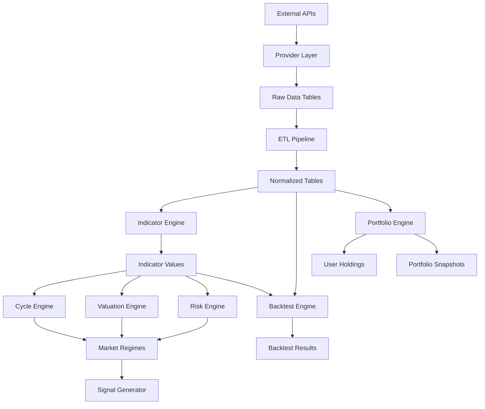

---

## 7. 性能估算

### 7.1 数据量预估（运行 5 年后）

| 表名 | 写入频率 | 每行大小 | 5 年数据量 | 5 年存储 |
|------|---------|---------|-----------|---------|
| market_prices | 1/s | ~200B | ~158M | ~30GB |
| candles | 1/min per interval | ~150B | ~50M | ~7GB |
| trades | 10/s | ~120B | ~1.6B | ~180GB |
| raw_market_data | 1/10s | ~2KB | ~16M | ~30GB |
| onchain_metrics | 1/h per metric | ~200B | ~900K | ~0.2GB |
| derivatives | 1/5min | ~250B | ~5M | ~1.2GB |
| provider_health | 1/min per provider | ~300B | ~2.6M | ~0.8GB |
| indicator_values | 1/h per indicator | ~200B | ~4.4M | ~0.9GB |

**总预估存储**：压缩前 ~250GB，压缩后 ~60GB

### 7.2 查询性能目标

| 查询类型 | 目标响应时间 |
|----------|------------|
| 当前价格（缓存命中） | <5ms |
| 最近 1 天 K 线 | <50ms |
| 最近 1 年日线 | <200ms |
| 历史全量日线（2015-今） | <1s |
| 链上指标查询（30 天） | <100ms |
| Provider 健康状态 | <10ms |
| 用户资产组合 | <50ms |
| 回测运行（10 年） | <60s |
