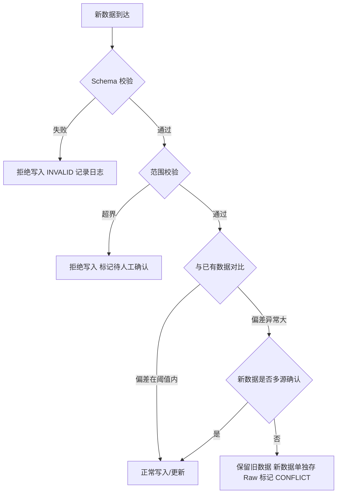
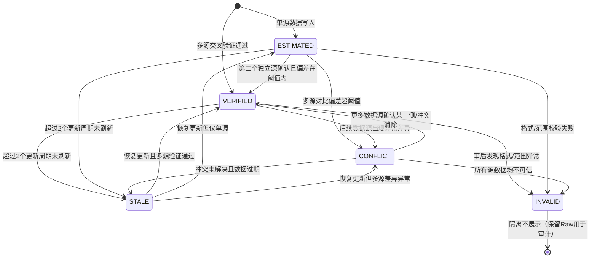
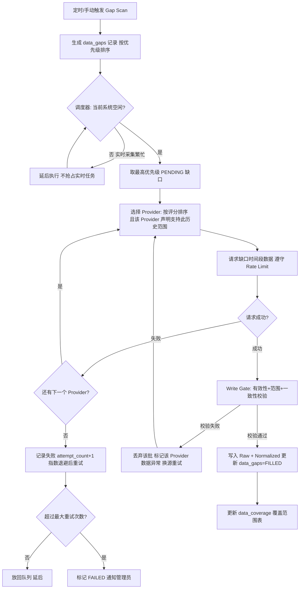
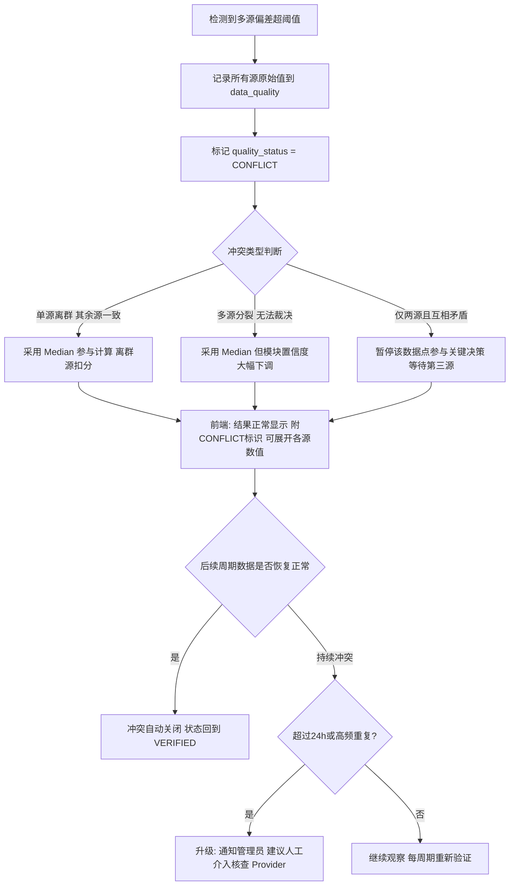
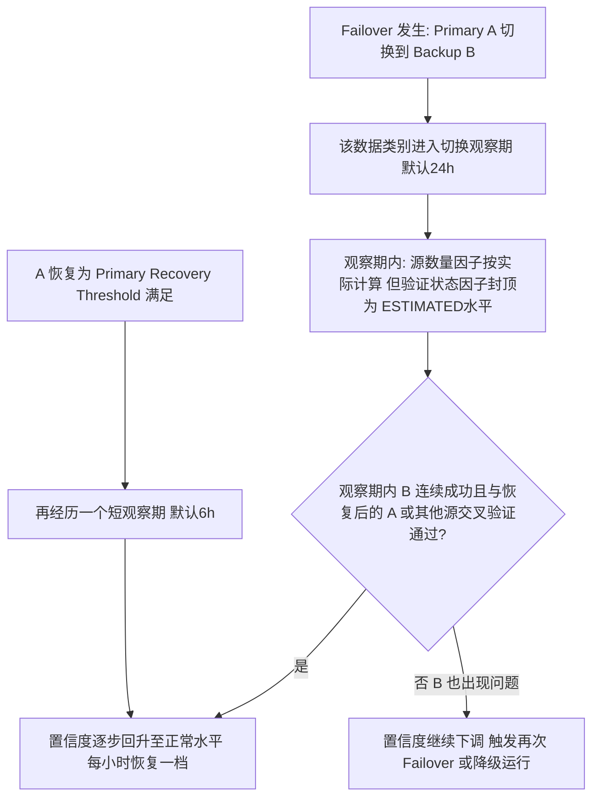

# 数据质量机制（Data Quality Engine）

> 文档编号：10
> 所属系统：BTC 全市场智能研究平台
> 关联模块：`backend/app/engines/quality/`、`backend/app/providers/`、数据质量中心（前端）
> 核心原则：**数据可靠性优先于算法复杂度，真实数据优先于漂亮结果**

---

## 概述

本系统运行于中国大陆网络环境，**任何一个 Provider 都可能随时失效，这是常态而非异常**。数据质量引擎（Data Quality Engine，以下简称 DQE）是整个平台的"守门员"：它负责回答一个根本问题——

> **"当前展示给用户的每一个数字，是否可信？可信到什么程度？来自哪里？"**

DQE 覆盖数据的完整生命周期：**采集 → 验证 → 存储 → 展示 → 监控 → 修复（补洞）**，确保：

1. 任何假数据都无法进入系统；
2. 任何错误数据无法悄悄覆盖正确数据；
3. 任何数据异常都能被主动发现并提示用户；
4. 任何缺失数据都能被自动检测并尝试补齐；
5. 每个指标都能追溯到自己原始数据来源。

---

## 目录

- [1. 数据质量原则](#1-数据质量原则)
- [2. 数据质量维度](#2-数据质量维度)
- [3. 数据质量状态机](#3-数据质量状态机)
- [4. 自动补洞机制（Gap Detection + Auto Fill）](#4-自动补洞机制gap-detection--auto-fill)
- [5. 交叉验证规则](#5-交叉验证规则)
- [6. 数据冲突处理](#6-数据冲突处理)
- [7. 数据质量评分与报告](#7-数据质量评分与报告)
- [8. 数据质量中心 UI 设计（信息架构）](#8-数据质量中心-ui-设计信息架构)
- [9. 置信度系统](#9-置信度系统)
- [附录 A：data_quality 表设计](#附录-adata_quality-表设计)

---

## 1. 数据质量原则

以下五条为**不可违背的硬性原则**，任何模块（采集、计算、展示、AI 解释）都必须遵守：

### 1.1 绝不使用假数据

**禁止清单**（在 Production 环境中，无论何种理由）：

| 禁止行为 | 说明 |
|---|---|
| 随机数据 | `random()`、噪声生成器输出冒充真实值 |
| 模拟数据 | 仿真/演练数据混入生产库 |
| 硬编码数据 | 代码中写死 `price = 105000` 之类的兜底值 |
| 伪造 ETF / 链上 / 情绪数据 | 用估算值冒充真实观测值 |
| 伪造预测结果 | 无统计依据的"99% 准确""必涨"等 |
| 假 API / 静态 JSON 假装实时 | 返回固定文件内容冒充实时数据 |

**正确做法**：当没有真实数据时，系统必须明确显示：

- 「数据源未配置」
- 「当前 Provider 未连接」
- 「数据暂时无法更新，最后成功更新：XX:XX」

**测试环境例外**：允许使用独立的 `MockProvider`，但必须满足：
1. MockProvider 只在 `ENV=testing` 时可实例化（生产环境导入即抛异常）；
2. Mock 数据写入独立的 `mock_*` 表或独立 schema，**物理隔离**于真实数据库；
3. 每条 Mock 数据 `source_id` 指向明确的 mock 数据源记录，可追溯。

### 1.2 不能用错误数据悄悄覆盖正确数据

所有写入 Normalized 表的操作必须经过**写入前校验闸门（Write Gate）**：



关键规则：

- **UPSERT 必须带守卫条件**：更新已有记录时，若新值与旧值偏差超过该数据类别的"剧变阈值"（如 BTC 价格 1 分钟内变动 > 20%），且新值只有单源支持，则**不覆盖**，改为标记冲突、保留双方原始值；
- 真实极端行情（如闪崩）通过**多源同时确认**放行：≥ 2 个独立 Provider 数值接近，即视为真实；
- 所有覆盖行为写入 `audit_logs`（旧值、新值、来源、时间、原因）。

### 1.3 数据异常必须主动提示用户

- 异常不允许"静默吞掉"。任何 `quality_status != VERIFIED` 的数据在前端展示时必须带状态标识（详见第 3 节）；
- 后端产生告警事件（`system_jobs` / 告警表），数据质量中心聚合展示；
- 高频/严重告警（如某类别全部 Provider 失效、冲突率突增）通过管理通道通知管理员。

### 1.4 所有核心指标必须知道自己的数据来源

每条核心数据记录必须携带溯源五元组：

```
source_id          -- 来自哪个 Provider
observation_time   -- 数据观测时间（数据描述的时刻）
fetch_time         -- 数据抓取时间（系统拿到数据的时刻）
quality_status     -- 当前质量状态
rule_version       -- 标准化规则版本（见文档 11）
```

前端任何指标卡片可逐级展开：**结论 → 因子 → 原始数值 → 数据来源 + 抓取时间 + 质量状态**。

### 1.5 必须保留原始数据和标准化数据

Raw Data（原始 API 响应）与 Normalized Data（标准化数据）双存储。Raw 数据**永不因标准化出错而丢失**，是争议仲裁与重新分析的唯一依据。详细设计见《11-historical-data.md》。

---

## 2. 数据质量维度

DQE 从五个正交维度评估每一份数据：

| 维度 | 定义 | 检测方法 | 报警/降级阈值（默认值，可按数据类别配置） |
|---|---|---|---|
| **完整性** Completeness | 数据是否存在缺失（时间段空洞、字段为空） | Gap Detection：按 `expected_interval` 扫描时间序列连续性；NULL 率统计 | 核心价格数据连续缺失 > 3 条报警；辅助数据连续缺失 > 10 条报警；单批 NULL 率 > 5% 降级 |
| **准确性** Accuracy | 数据是否正确（在合理范围内、与事实一致） | 交叉验证（多源 Median 对比）、范围检查（min/max/环比）、历史分布检查（Z-score） | 与 Median 偏差 > 0.5%（价格类）标记 CONFLICT；超出物理范围（价格 ≤ 0）标记 INVALID |
| **一致性** Consistency | 多源数据之间是否一致；同类数据前后口径是否一致 | Median / VWAP 对比、标准差计算、单位与精度核对 | 多源标准差 > 该类别阈值（价格 0.3%、成交量 15%）标记 CONFLICT |
| **时效性** Timeliness | 数据是否过期 | `now() - observation_time` 与预期更新周期对比 | 超过 2 个更新周期标记 STALE（如 1m K 线超过 2 分钟未更新） |
| **有效性** Validity | 数据格式、类型、单位是否符合 Schema | Pydantic Schema Validation、类型检查、单位检查、时间戳格式检查 | 任何字段校验失败即拒绝进入 Normalized 表，记 INVALID 事件 |

### 2.1 各维度检测的执行时机

| 时机 | 检测维度 | 说明 |
|---|---|---|
| API 响应到达时（同步） | 有效性、准确性（范围检查） | 快速失败，脏数据不落 Normalized 表 |
| 写入前（同步） | 准确性（剧变守卫）、一致性（与近期数据对比） | Write Gate，见 1.2 |
| 多源数据聚合时（同步） | 一致性、准确性（交叉验证） | 见第 5 节 |
| 每次读取展示时（实时计算） | 时效性 | `observation_time` vs `now()`，轻量计算 |
| 定时批处理（异步） | 完整性（Gap 扫描）、准确性（历史分布）、全维度评分 | 见第 4、7 节 |

### 2.2 阈值配置管理

所有阈值存储在 `data_quality_rules` 配置表中，按 `(data_category, metric, timeframe)` 三级粒度配置，**禁止硬编码在业务代码中**：

```
示例：
(market, btc_price, 1m)     -> cross_validation_threshold: 0.5%
(market, btc_volume, 1d)    -> cross_validation_threshold: 15%
(onchain, mvrv, 1d)         -> cross_validation_threshold: 3%
(macro, cpi, 1mo)           -> staleness_threshold: 35d
```

---

## 3. 数据质量状态机

每条标准化数据（以及每个指标模块的聚合状态）都携带 `quality_status`，取值于以下五态：



### 3.1 状态定义与系统行为

| 状态 | 进入条件 | 系统行为 | 前端展示 |
|---|---|---|---|
| **VERIFIED** | ≥ 2 个独立 Provider 数据到位，交叉验证偏差在阈值内，Schema 有效，未过期 | 正常参与所有计算（指标、周期、估值、风险、回测）；正常展示 | 绿色标识「数据源一致」；默认不显眼，点击可看来源详情 |
| **ESTIMATED** | 仅单源数据，未获得交叉验证（其他 Provider 未配置/失效/尚未返回） | 参与计算，但**该数据类别置信度上限受限**（见第 9 节）；标记等待后续源确认 | 黄色标识「单源数据，未交叉验证」；显示当前 Provider 名称 |
| **STALE** | `now() - observation_time` 超过 2 个预期更新周期，且所有 Provider 均无法刷新 | **继续使用最近一次可信数据**参与展示；相关模块计算结果标注降级；后台持续重试（指数退避）；不生成任何插值假数据 | 橙色标识「数据暂时无法更新」+「最后成功更新：XX:XX」；禁止显示 ERROR 或空白 |
| **CONFLICT** | 多源数据偏差超过一致性阈值，无法自动裁决 | **不偷偷选择任何一个源**；记录所有冲突源原始值；参与计算时默认采用 Median 并标注；触发冲突处理流程（第 6 节） | 红色标识「数据源存在异常差异，当前结果仅供参考」；可展开查看各源数值与偏差 |
| **INVALID** | Schema 校验失败、超出物理范围（价格 ≤ 0、比率 > 1 等）、明显伪造特征 | 拒绝进入 Normalized 计算链；原始响应保留在 Raw 表；计入 Provider 健康扣分；连续 INVALID 触发 Provider 降级/停用 | **不展示该数据点**；数据缺口由 Gap 机制处理；管理端可见异常明细 |

### 3.2 状态转换的实现要点

- 状态是**计算属性 + 持久化快照**的结合：时效性（STALE）由读取时实时计算，其余状态在写入/验证时持久化到 `quality_status` 字段；
- INVALID 不是删除：原始数据保留在 Raw 表用于审计和 Provider 归因；
- CONFLICT → VERIFIED 的自动恢复需要**新证据**（更多数据源到位或后续周期数据回归正常），不允许仅凭时间流逝自动"洗白"；
- 状态机的每次迁移记录到 `data_quality_events`（谁、何时、从什么状态、到什么状态、触发原因）。

---

## 4. 自动补洞机制（Gap Detection + Auto Fill）

数据库出现空洞是常态（Provider 失效期间的采集缺口、初始同步不完整、写入失败等）。系统必须自动发现并补齐。

### 4.1 Gap Detection（缺失检测）

**检测原理**：每种时序数据都有 `expected_interval`（1m/5m/1h/1d/1mo），按预期时间轴与实际记录对比找出空洞。

**检测方式**：

1. **定时全量扫描**：低峰期（如每日 04:00）按数据类别扫描，使用 `time_bucket_gapfill` / LAG 窗口函数高效找出缺口段：

```sql
-- 示例：找出 1h K 线的缺口（简化）
SELECT time_bucket_gapfill('1 hour', ts) AS bucket,
       locf(close) IS NULL AS is_gap
FROM candles
WHERE symbol = 'BTCUSDT' AND timeframe = '1h'
  AND ts BETWEEN $start AND $end
GROUP BY bucket
HAVING locf(close) IS NULL;
```

2. **增量边界扫描**：每次采集任务完成后，只扫描最近 N 个周期（快速，秒级）；
3. **覆盖范围表驱动**：`data_coverage`（见文档 11 第 5 节）中 `actual_records < expected_records` 时触发定向扫描。

**检测结果落库**：写入 `data_gaps` 表：

| 字段 | 说明 |
|---|---|
| gap_id | 主键 |
| data_category / metric / symbol / timeframe | 缺口定位 |
| gap_start / gap_end | 缺口时间范围 |
| expected_records / missing_records | 应有/缺失条数 |
| status | PENDING / FILLING / FILLED / UNSUPPORTED / FAILED |
| attempt_count / last_attempt_at | 重试次数与时间 |
| priority | 由数据类别决定（见 4.2） |

### 4.2 补洞优先级

| 优先级 | 数据类别 | 理由 |
|---|---|---|
| P0 | 核心价格数据（OHLCV、Price、Volume） | 一切指标、回测、周期分析的地基 |
| P1 | 链上数据（MVRV、SOPR、Exchange Flow 等） | 估值与链上引擎的输入 |
| P1 | 衍生品数据（Funding、OI、Liquidation） | 风险引擎的输入 |
| P2 | ETF 数据 | 资金流分析输入，日频，缺失影响有限 |
| P2 | 宏观数据 | 低频，且需注意 Revision（见文档 11） |
| P3 | 情绪数据（Fear & Greed、Trends） | 辅助性质，容忍度最高 |

### 4.3 补洞流程



**关键规则**：

- **多 Provider 轮询补洞**：同一缺口按 Provider 评分依次尝试；一个 Provider 失败立即换下一个，不在单源上反复重试浪费配额；
- **补洞数据同样过 Write Gate**：补洞不是"填进去再说"，历史补进来的数据同样执行范围校验，并与缺口边界两侧的已有数据做连续性检查（如补洞段首尾价格与相邻记录跳变 > 阈值则标记 CONFLICT 待人工复核）；
- **UNSUPPORTED 状态**：若所有 Provider 均不提供该历史段数据（如某交易所 2015 年前无数据），标记 `UNSUPPORTED`，前端如实显示"该时段历史数据不可用"，**绝不插值伪造**。

### 4.4 补洞失败处理

| 场景 | 处理 |
|---|---|
| 单次请求失败（网络/超时） | 换下一个 Provider；全部失败则 `attempt_count+1`，指数退避（1h → 4h → 24h） |
| Provider 返回但数据不合格 | 丢弃该批数据，计入该 Provider 健康扣分，换源重试 |
| 重试超过上限（默认 5 次） | 状态 → FAILED，通知管理员，前端覆盖热力图显示该段为"尝试补齐失败" |
| Provider 确认无此历史数据 | 状态 → UNSUPPORTED，不再重试（除非管理员新增了支持该范围的 Provider） |
| 跳过（管理员手动） | 状态 → SKIPPED，记录操作人与原因到 `audit_logs` |

### 4.5 补洞任务调度

- **低优先级运行**：补洞任务在调度器中的优先级低于所有实时采集任务；实时任务需要资源时，补洞任务主动让出（暂停当前批次，checkpoint 已保证不丢进度）；
- **空闲时执行**：默认仅在系统空闲窗口（实时采集任务间隔期 + 每日低峰时段）执行；
- **限速保护**：补洞请求同样受每个 Provider 独立的 Rate Limit 约束，且补洞使用的配额上限默认为 Provider 配额的 30%（可配置），保留 70% 给实时采集；
- **手动触发**：管理员可在后台对指定数据类别/时间段手动发起补洞（如新接入一个覆盖 2013 年历史的 Provider 后）。

---

## 5. 交叉验证规则

交叉验证（Cross Validation）是判定 VERIFIED / CONFLICT 的核心机制。

### 5.1 按数据类别的验证规则

| 数据类别 | 验证方法 | 阈值与说明 |
|---|---|---|
| **价格（Spot Price / OHLCV Close）** | 多源 Median；计算每个源相对 Median 的偏差；可辅以成交量加权 VWAP 对比 | 任一源偏差 > **0.5%** → 该源标记离群；≥ 2 个源离群或源间最大偏差 > 1% → 整体标记 CONFLICT。正常小偏差（不同交易所真实价差）→ VERIFIED |
| **成交量 Volume** | 多源对比，但**允许较大偏差** | 不同交易所统计口径不同（是否含做市、是否含衍生品）。阈值放宽至 **15%**；只做趋势一致性检查（方向是否一致），超阈值记录差异但不轻易判 CONFLICT，标注「口径差异，仅供参考」 |
| **链上数据（MVRV/SOPR/Netflow 等）** | 不同 Provider 计算方法可能不同（如 LTH 定义、交易所地址集合），**记录差异而非强制裁决** | 偏差 > 3% 时记录双方数值与差异率；只要**趋势方向一致**仍可标记 VERIFIED（附注"多源趋势一致，绝对值存在口径差异"）；方向相反 → CONFLICT |
| **ETF 净流入** | 对比多个来源（Farside / SoSoValue / 发行方官网等）的日度净流入 | 单日偏差 > 5% → CONFLICT；ETF 数据是官方披露值，理论上多源应完全一致，偏差大说明某源解析错误 |
| **衍生品（Funding / OI）** | 多交易所数据本身就是不同市场，不做跨所裁决；做**同所跨源**验证 | 同一交易所的 Funding，两个 Provider 偏差 > 0.01%（绝对值）→ 视为解析错误 → CONFLICT |
| **宏观数据** | 以官方源（FRED 等）为准绳，聚合源对比 | 聚合源与官方源不一致时，以官方源为准并记录聚合源偏差；宏观数据必须区分 observation/release/revision 日期（防止未来数据泄漏） |
| **情绪数据** | 单源为主，无强制交叉验证 | 只做范围检查（Fear&Greed ∈ [0,100]）与环比合理性检查；默认状态为 ESTIMATED |

### 5.2 验证频率

| 数据类型 | 验证时机 | 方式 |
|---|---|---|
| 实时数据 | **每次采集都验证** | 采集聚合层拿到多源快照后立即计算 Median/偏差（毫秒级，内存计算） |
| 准实时（1m/5m K 线） | 每根 K 线收盘时 | 多源收盘价对比 |
| 历史数据（补洞/批量同步写入时） | 写入时批量验证 | 与已有多源数据对比；单源历史数据标记 ESTIMATED |
| 历史数据（例行审计） | 每日低峰批处理 | 抽样全维度复核，发现历史数据被上游修订（宏观数据常见）时记录 Revision 事件 |

### 5.3 验证结果记录

所有验证结果写入 `data_quality` 表（设计见附录 A），至少包含：

- 参与验证的每个源：`source_id`、原始值、相对 Median 偏差、是否离群；
- 聚合结果：median、vwap、stddev、max_deviation_pct；
- 判定结论：`quality_status`（VERIFIED / CONFLICT）与判定依据（触发了哪条规则）；
- 最终采用值及采用策略（median / official_source / manual）。

**任何验证都不允许"悄悄选择"**：即使采用 Median，被判定离群的源的原始值也必须完整保留，供事后审计。

---

## 6. 数据冲突处理

### 6.1 冲突处理原则

1. **发现冲突时不偷偷选择一个**——所有冲突源的原始值全部保留；
2. 数据标记 `quality_status = CONFLICT`，前端明确提示；
3. 冲突事件写入 `data_quality_events`，并计入相关 Provider 的健康评分；
4. **频繁冲突升级**：同一 Provider 在 24h 内触发冲突 > N 次（默认 5 次）→ 自动降低其评分与优先级 → 仍持续冲突则自动停用并通知管理员。

### 6.2 冲突处理流程



### 6.3 冲突解决策略（按优先顺序）

| 策略 | 适用场景 | 说明 |
|---|---|---|
| **等待更多数据源确认** | 只有 2 个源且矛盾；或某源刚切换 | 最安全。期间采用 Median 但降低置信度，前端明示 |
| **使用 Median** | ≥ 3 个源，个别离群 | 默认自动策略。离群源保留记录并扣健康分 |
| **官方源优先** | 宏观、ETF 等有权威披露源的数据 | 官方源与聚合源冲突时以官方源为准 |
| **人工介入** | 冲突持续 > 24h、高频重复、或涉及资金计划/回测的关键数据 | 管理端提供冲突工作台：并排展示各源原始值 + Raw 响应，管理员可裁定采用值（裁定记录进 `audit_logs`，且原始值不被覆盖） |

### 6.4 前端展示规范

- 数据源一致：`✅ 数据源一致（3/3 Provider 验证通过）`
- 存在冲突：`⚠️ 数据源存在异常差异，当前结果仅供参考`
  - 点击展开：Provider A = 108,000 / Provider B = 108,020 / Provider C = 112,500（离群 +4.1%）/ 采用值 = 108,020（Median）/ 判定时间
- 冲突期间的派生结果（周期判断、风险评分等）必须继承冲突标识，**不允许冲突在上游、下游却显示正常**。

---

## 7. 数据质量评分与报告

### 7.1 质量评分模型

每个数据类别（market / onchain / etf / derivatives / options / macro / sentiment，可细化到 metric 级）维护一个 **0-100 的质量评分**：

```
QualityScore = 完整性 × 30% + 准确性 × 25% + 一致性 × 20% + 时效性 × 15% + 有效性 × 10%
```

| 因子 | 权重 | 子分计算方式（0-100） |
|---|---|---|
| 完整性 | 30% | `100 × (1 - 近30天缺失记录数 / 应有记录数)`；存在未补齐 FAILED 缺口额外扣分 |
| 准确性 | 25% | `100 × (1 - 近30天离群/INVALID 记录数 / 总记录数)` |
| 一致性 | 20% | `100 × (1 - 近30天 CONFLICT 周期数 / 已验证周期数)` |
| 时效性 | 15% | 按更新延迟分布计分：延迟 ≤ 1 周期得满分，每多 1 个周期线性扣分，STALE 期间得 0 |
| 有效性 | 10% | `100 × (1 - Schema 校验失败次数 / 总请求次数)` |

评分随时间滚动计算（默认窗口 30 天），每小时更新一次快照存入 `data_quality_scores`，用于绘制质量趋势曲线。

### 7.2 评分等级与告警

| 评分区间 | 等级 | 系统行为 |
|---|---|---|
| 90 - 100 | 优秀 | 正常 |
| 75 - 89 | 良好 | 数据质量中心黄色提示 |
| 60 - 74 | 及格 | 相关模块置信度上限被压制（见第 9 节）；记录告警 |
| < 60 | 不合格 | **主动告警通知管理员**；相关模块前端显著提示"数据质量不佳，结论仅供参考"；依赖该类别的自动决策（信号生成）暂停 |

### 7.3 质量报告

| 报告 | 频率 | 内容 |
|---|---|---|
| 小时报（轻量，仅落库） | 每小时 | 各类别评分快照、STALE/CONFLICT 事件计数、Provider 失败率 Top N |
| 日报 | 每日 08:00 | 全维度评分与趋势、缺口新增/补齐/失败统计、冲突明细、Provider 排名变化、告警汇总 |
| 周报 | 每周一 | 覆盖率变化、质量趋势、需要人工处理事项清单（FAILED 缺口、持续冲突、低分 Provider） |

报告持久化存储（`data_quality_reports`），支持历史回看——这本身也是"所有历史结果都能回放"原则的一部分。

---

## 8. 数据质量中心 UI 设计（信息架构）

数据质量中心是普通用户和管理员了解"数据现在从哪来、可不可信"的统一入口（对应需求文档第三十一节）。

### 8.1 页面信息架构

```
数据质量中心 /quality
├── ① 总览横幅
│   ├── 系统整体数据健康分（各类别评分加权）
│   ├── 当前活跃告警数（严重/警告/提示）
│   └── 一句话状态：「32/34 个数据源正常，2 个降级运行」
│
├── ② 数据源状态总览（按数据类别分组）
│   ├── BTC Price
│   │   ├── Primary:  Provider A ✅ 延迟 32ms  最近更新 12:00:03
│   │   ├── Backup 1: Provider B ✅ 延迟 85ms  最近更新 12:00:05
│   │   └── Backup 2: Provider C ⚠ RATE_LIMITED  最近失败 11:42
│   ├── On-chain
│   │   ├── Primary:  Provider X ⚠ DEGRADED（今日失败 12 次）
│   │   └── Backup 1: Provider Y ✅
│   ├── ETF / Derivatives / Macro / Sentiment ...（同构展示）
│   └── 每行可展开：24h 成功率曲线、失败原因分布、切换历史
│
├── ③ 接口延迟监控
│   ├── 各 Provider P50/P95 延迟（实时曲线）
│   └── 慢源自动标注（> 阈值显示 SLOW）
│
├── ④ 数据缺失统计
│   ├── 各类别缺口数（PENDING / FILLING / FILLED / FAILED / UNSUPPORTED）
│   ├── 最近补齐记录 与 当前补洞任务进度
│   └── 入口：手动触发补洞（管理员）
│
├── ⑤ 数据冲突列表
│   ├── 时间 / 类别 / 涉及 Provider / 偏差幅度 / 当前状态 / 采用策略
│   └── 展开：各源原始值并排对比 + Raw 响应查看（管理员）+ 人工裁定入口
│
├── ⑥ Provider 排名
│   ├── 综合评分排行（准确性/速度/稳定性/一致性分项）
│   ├── 近期排名变化（↑↓ 与自动切换次数关联）
│   └── 入口：锁定/解锁优先级、手动切换、一键测试全部 Provider
│
├── ⑦ 历史数据同步进度
│   ├── 各同步任务：进度条、当前 checkpoint 位置、速率、预计完成时间
│   └── 任务控制：暂停 / 继续 / 重试 / 跳过
│
└── ⑧ 数据覆盖范围热力图
    ├── X 轴：时间（2013 → 今），Y 轴：数据类别 × 时间粒度
    ├── 颜色：覆盖率（绿 ≥99% / 黄 ≥95% / 红 <95% / 灰 = UNSUPPORTED）
    └── 悬停：具体缺口段列表，点击可触发补洞
```

### 8.2 展示要求

- **普通用户视角**：首屏只需要看懂三件事——"数据源是否正常"（红绿灯）、"有没有需要注意的数据问题"（告警条）、"每个数字来自哪里"（点击任何指标可跳转溯源）；专业细节默认折叠；
- **管理员视角**：提供完整操作面（测试、切换、锁定、补洞、裁定冲突），所有操作写 `audit_logs`；
- 任何状态变化（Provider 切换、新告警）通过前端实时通道（WebSocket/SSE）推送，不依赖用户刷新。

---

## 9. 置信度系统

置信度（Confidence）回答的问题是：**"基于当前数据，这个模块的结论有多大把握？"**（对应需求文档第四十五节）。它与质量评分的区别：评分衡量"数据本身好不好"，置信度衡量"当前这一刻的结论可不可靠"。

### 9.1 置信度计算

每个模块（链上 / ETF / 宏观 / 衍生品 / 周期 / 估值 / 风险 / 综合状态）输出结论时必须附带置信度（0-100%）：

```
Confidence = w1 × 源数量因子 + w2 × 数据新鲜度因子 + w3 × 验证状态因子
           + w4 × 历史可靠性因子 + w5 × 质量评分因子
```

| 因子 | 默认权重 | 计算方式 |
|---|---|---|
| Provider 数量 | 20% | 当前实际参与验证的独立源数 / 配置源数。3/3 → 100；2/3 → 80；1/3 → 50 |
| 数据新鲜度 | 25% | 延迟 ≤ 1 周期 → 100；每超 1 个周期递减；STALE → 按 stale 时长指数衰减至 30 封顶 |
| 交叉验证状态 | 25% | VERIFIED → 100；ESTIMATED → 70；CONFLICT → 40；INVALID → 0（该因子缺位） |
| 历史可靠性 | 15% | 该类别近 90 天 VERIFIED 占比（Provider 长期稳定的类别得分高） |
| 质量评分 | 15% | 直接引用第 7 节的 QualityScore |

模块聚合规则：模块依赖多份数据时，置信度按**加权平均 + 短板压制**计算——任一关键输入（如链上模块的 MVRV）为 CONFLICT/STALE，模块置信度上限被压制（× 0.7），防止"其他数据都很好"掩盖关键数据异常。

### 9.2 Provider 切换后置信度自动降低



- 切换瞬间置信度**阶跃下降**（默认 -20%），之后随新 Provider 连续成功验证**渐进回升**，不允许瞬间恢复满分——这与 Provider 恢复的 Recovery Threshold 机制（连续成功 N 次才提升回 Primary）保持一致，避免抖动；
- 切换事件、置信度变化全程记录，历史回放的"当时视角"能看到**当时**的置信度，而不是事后修正值。

### 9.3 置信度在前端的展示

| 区间 | 展示 | 文案示例 |
|---|---|---|
| ≥ 85% | 绿色实心徽标 | 「链上状态：Confidence 96% — 多源验证，数据新鲜」 |
| 60% - 84% | 黄色徽标 | 「宏观状态：Confidence 72% — 数据源 CPI 更新延迟」 |
| 30% - 59% | 橙色徽标 + 提示 | 「Confidence 45% — 关键数据存在冲突，结论仅供参考」 |
| < 30% | 红色徽标 + 弱化结论 | 「Confidence 22% — 数据严重不足，当前无法可靠判断」（模块降级展示，不输出强结论） |

强制规则：

1. 每个模块级结论**必须**显示置信度，不允许隐藏；
2. 点击置信度可展开因子明细（哪个因子拉低了分数、涉及哪个 Provider、什么时间发生）；
3. 置信度 < 30% 时，模块**禁止输出确定性表述**（如"确认顶部"），只能输出"数据不足，无法可靠判断"；
4. AI 解释助手引用模块结论时，必须同时引用其置信度与数据状态，禁止只报结论不报把握。

---

## 附录 A：data_quality 表设计

```sql
CREATE TABLE data_quality (
    id                 BIGSERIAL PRIMARY KEY,
    data_category      TEXT NOT NULL,          -- market/onchain/etf/derivatives/options/macro/sentiment
    metric             TEXT NOT NULL,          -- btc_price / mvrv / etf_net_flow ...
    symbol             TEXT,                   -- BTCUSDT（宏观等可为空）
    timeframe          TEXT,                   -- 1m/5m/1h/1d/1mo
    observation_time   TIMESTAMPTZ NOT NULL,   -- 被验证数据点的观测时间
    validated_at       TIMESTAMPTZ NOT NULL DEFAULT now(),
    source_count       SMALLINT NOT NULL,      -- 参与验证的源数量
    source_details     JSONB NOT NULL,         -- [{source_id, raw_value, deviation_pct, is_outlier}, ...]
    median_value       NUMERIC(30, 10),
    vwap_value         NUMERIC(30, 10),
    stddev_value       NUMERIC(30, 10),
    max_deviation_pct  NUMERIC(10, 6),
    quality_status     TEXT NOT NULL,          -- VERIFIED/ESTIMATED/STALE/CONFLICT/INVALID
    adopted_value      NUMERIC(30, 10),        -- 最终采用值
    adopted_strategy   TEXT,                   -- median/official_source/single_source/manual
    rule_id            TEXT,                   -- 触发的验证规则标识
    rule_version       TEXT,                   -- 验证规则版本
    notes              TEXT,
    created_at         TIMESTAMPTZ NOT NULL DEFAULT now()
);

CREATE INDEX idx_dq_category_time ON data_quality (data_category, metric, observation_time DESC);
CREATE INDEX idx_dq_status ON data_quality (quality_status) WHERE quality_status = 'CONFLICT';
```

配套表：

| 表 | 用途 |
|---|---|
| `data_quality_rules` | 按 (category, metric, timeframe) 存储的可配置阈值与规则 |
| `data_quality_events` | 状态机迁移事件流（含冲突升级、Provider 停用触发） |
| `data_quality_scores` | 小时级评分快照（趋势曲线数据源） |
| `data_quality_reports` | 日报/周报持久化 |
| `data_gaps` | 缺口记录与补洞任务状态（见 4.1） |

---

## 与其他文档的关系

| 文档 | 关系 |
|---|---|
| 《11-historical-data.md》 | 双存储（Raw + Normalized）、断点续传、覆盖范围表是 DQE 的数据基础；Gap Detection 结果驱动补洞同步任务 |
| Provider 架构相关文档 | Provider 健康评分消费 DQE 的 INVALID/CONFLICT 计数；Failover 事件触发置信度观察期 |
| 回测/模型相关文档 | 回测必须记录所用数据的质量状态与 `rule_version`；CONFLICT/INVALID 区段的回测结果需标注数据风险 |
