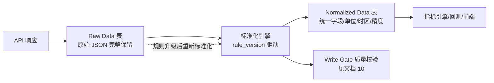
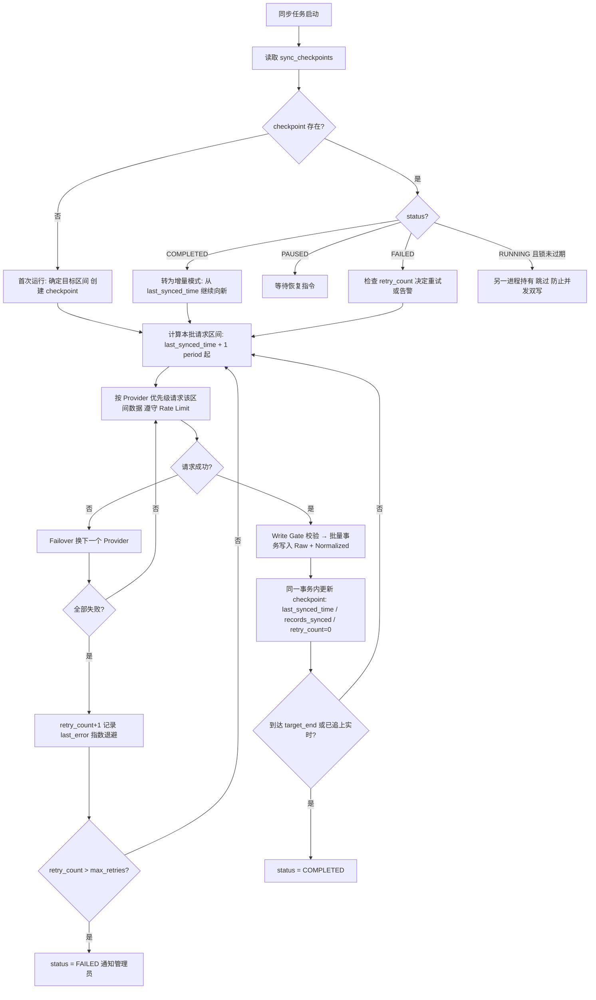
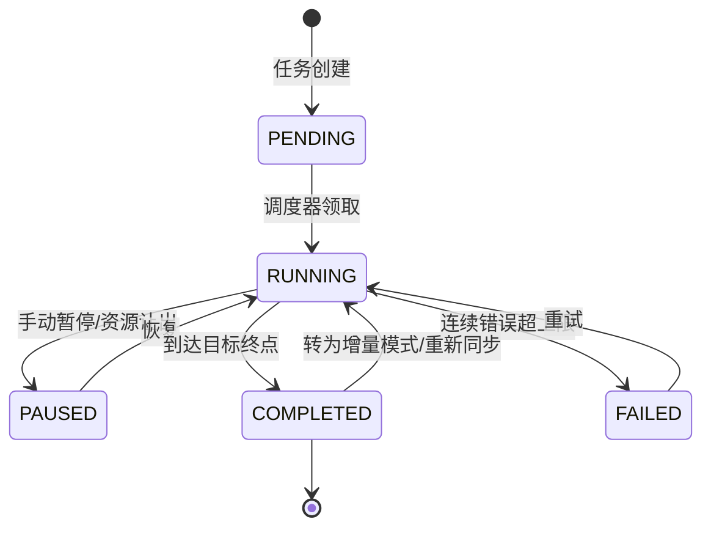
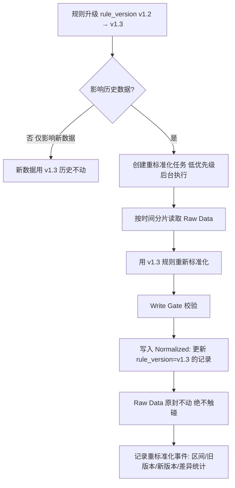
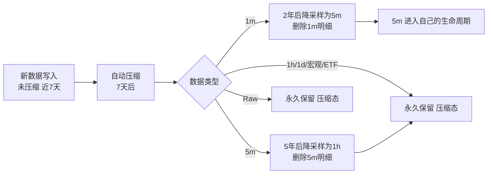
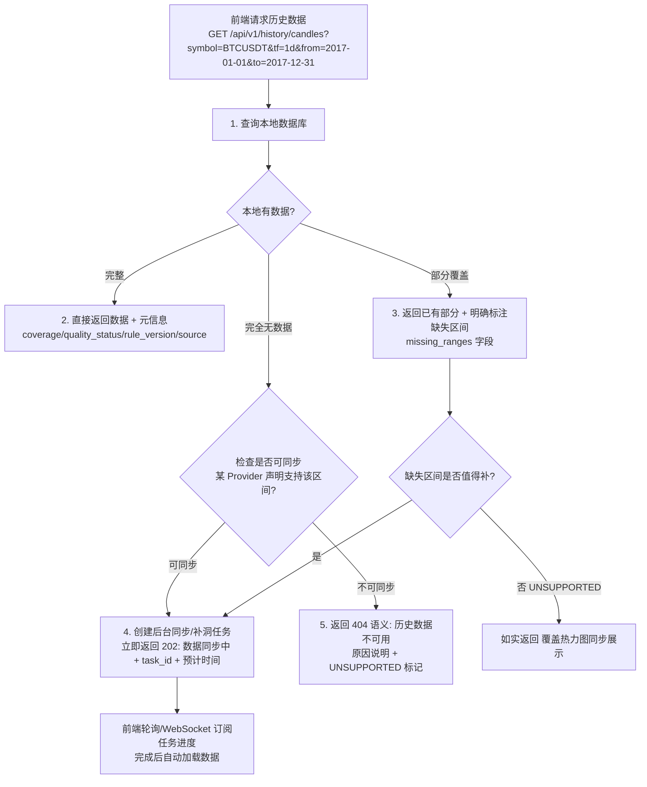

# 历史数据保存机制（Historical Data Architecture）

> 文档编号：11
> 所属系统：BTC 全市场智能研究平台
> 关联模块：`backend/app/providers/`、`backend/app/scheduler/`、PostgreSQL + TimescaleDB
> 核心原则：**历史数据一旦获取，永久属于本地；第三方 API 只负责"送新数据进来"**

---

## 概述

第三方 API 最大的问题是：**今天能访问，明天可能不能访问**。本平台计划长期运行 5-10 年以上，持续积累 BTC 全周期历史数据。因此历史数据体系必须做到：

1. **本地优先**：所有历史查询直接读本地数据库，不依赖第三方接口存活；
2. **双存储**：Raw（原始响应）+ Normalized（标准化数据），Provider 更换后可重新分析历史；
3. **可恢复**：任何同步任务支持断点续传，程序崩溃不丢进度、不重复劳动；
4. **可追踪**：数据覆盖范围随时可量化，缺口自动发现、自动补齐；
5. **可演进**：标准化规则、模型版本、数据版本三者绑定，回测结果永久可复现；
6. **可持续**：存储分级、压缩、降采样策略保证 10 年尺度下存储与性能可控。

---

## 目录

- [1. 本地优先原则](#1-本地优先原则)
- [2. 双存储架构（Raw + Normalized）](#2-双存储架构raw--normalized)
- [3. 断点续传（Checkpoint）机制](#3-断点续传checkpoint机制)
- [4. 历史数据同步任务管理](#4-历史数据同步任务管理)
- [5. 数据覆盖范围追踪](#5-数据覆盖范围追踪)
- [6. 数据版本管理](#6-数据版本管理)
- [7. 数据保留策略](#7-数据保留策略)
- [8. 历史数据 API 设计原则](#8-历史数据-api-设计原则)

---

## 1. 本地优先原则

这是整个系统**最重要的设计原则之一**，所有历史数据相关功能都建立在它之上。

### 1.1 原则陈述

| # | 规则 | 说明 |
|---|---|---|
| 1 | 历史数据一旦获取，**永久保存在本地数据库** | 除非触发明确的保留策略（第 7 节），否则不删除、不依赖远端存在 |
| 2 | 查看历史数据时**直接读本地**，不请求第三方 API | K 线图拖动到 2017 年、历史回放 2020-03-16、回测 2015-2026，全部走本地查询 |
| 3 | 第三方 API **只用于**：获取新数据、补充缺失数据、交叉验证实时数据 | API 是"数据入口"，不是"数据存放地" |
| 4 | API 全部失效 ≠ 历史功能失效 | 断网时历史查询、指标回看、回测、回放全部正常，仅实时数据标记 STALE |

### 1.2 为什么这是最高优先级

- **可用性**：中国大陆网络环境下，任何国外 API 随时可能超时、被限流、区域封锁或永久停服。历史数据在本地，系统就拥有了不可剥夺的资产；
- **性能**：本地 TimescaleDB 查询毫秒级返回，远端 API 受网络与限流影响不可控；
- **成本**：避免每次页面浏览都消耗 API 配额；
- **可复现性**：回测与历史回放要求"当时视角"数据不可变，只有本地持久化才能保证；
- **数据积累**：许多 Provider 自身的历史数据也会滚动删除（如只保留最近 2 年），系统持续落库等于抢救性保存。

### 1.3 读写路径总览

```mermaid
graph TB
    subgraph 写入路径（仅后台采集任务）
        A[Provider API] -->|新数据/补洞数据| B[Raw Data 表]
        B --> C[标准化引擎]
        C --> D[Normalized Data 表]
        D --> E[更新 Checkpoint 与 Coverage]
    end
    subgraph 读取路径（所有前端请求）
        F[前端历史数据请求] --> G[API 服务层]
        G --> H[(本地数据库)]
        H -->|有数据| I[直接返回]
        H -->|无数据| J[返回缺失状态 + 触发后台同步评估]
    end
    X[第三方 API] -.->|读取路径绝不触碰| F
```

---

## 2. 双存储架构（Raw + Normalized）

### 2.1 架构总览



### 2.2 Raw Data 表设计

Raw 表的目标：**多年以后回看，仍能完整还原"当时 API 到底返回了什么"**。

```sql
CREATE TABLE raw_market_data (   -- 其余类别同构：raw_onchain / raw_etf / ...
    id              BIGSERIAL,
    provider_id     TEXT NOT NULL,          -- 数据来源 Provider
    api_endpoint    TEXT NOT NULL,          -- 完整请求路径
    request_params  JSONB,                  -- 请求参数（symbol, interval, startTime...）
    request_headers JSONB,                  -- 关键请求头（脱敏后：User-Agent、Accept 等，绝不含 API Key）
    http_status     SMALLINT,               -- HTTP 状态码
    response_headers JSONB,                 -- 关键响应头（Date、X-RateLimit-*、Content-Type）
    response_body   JSONB NOT NULL,         -- 原始响应体，一个字段都不改
    response_hash   CHAR(64),               -- 响应体 SHA-256，用于去重与完整性校验
    observation_time TIMESTAMPTZ,           -- 数据描述的时间（从响应中解析）
    fetch_time      TIMESTAMPTZ NOT NULL DEFAULT now(),  -- 抓取时刻
    byte_size       INTEGER,                -- 响应体大小（存储统计）
    created_at      TIMESTAMPTZ NOT NULL DEFAULT now()
);
SELECT create_hypertable('raw_market_data', 'fetch_time', chunk_time_interval => INTERVAL '7 days');
```

设计要点：

- **只追加（append-only）**：Raw 表永不 UPDATE、永不因标准化错误而修改；
- **API Key 等凭据绝不入库**，请求头仅保留诊断必需的非敏感字段；
- 按 `fetch_time` 分 hypertable chunk，配合压缩策略（第 7 节）；
- `response_hash` 支持幂等：同一响应重复抓取时跳过重复落库。

### 2.3 Normalized Data 表设计

Normalized 表的目标：**全系统统一口径，计算引擎无需关心数据来自哪个 Provider**。

统一化四要素：

| 要素 | 规则 |
|---|---|
| 统一字段名 | 所有 Provider 的 `lastPrice`/`last`/`close`/`c` → 统一 `close`；字段字典集中维护在标准化规则中 |
| 统一单位 | 计价货币统一 **USD**（USDT 计价明确标注并按规则换算或并存）；数量单位统一 **BTC**；比率统一**百分比或小数并全库一致**；链上金额统一 USD |
| 统一时间格式 | 全库 **UTC `TIMESTAMPTZ`**；Provider 返回的毫秒/秒/字符串时间在标准化层统一转换；`observation_time` 与 `fetch_time` 分离保留 |
| 统一精度 | 价格 `NUMERIC(20,8)`（ satoshi 级）；比率 `NUMERIC(20,10)`；禁止 FLOAT 参与存储（避免累计误差影响回测复现） |

```sql
CREATE TABLE candles (              -- 示例：标准化 K 线（物理表结构详见 09-core-tables.md）
    id              UUID PRIMARY KEY DEFAULT gen_random_uuid(),
    source_id       UUID NOT NULL REFERENCES providers(id),
    observation_time TIMESTAMPTZ NOT NULL,   -- K 线开盘时间（UTC）
    fetch_time      TIMESTAMPTZ NOT NULL DEFAULT now(),
    symbol          VARCHAR(20) NOT NULL,
    interval        candle_interval NOT NULL,  -- 1m/5m/15m/1h/4h/1d/1w/1M
    open            NUMERIC(20,8) NOT NULL,
    high            NUMERIC(20,8) NOT NULL,
    low             NUMERIC(20,8) NOT NULL,
    close           NUMERIC(20,8) NOT NULL,
    volume          NUMERIC(24,4),   -- BTC 计
    quote_volume    NUMERIC(24,4),   -- USD/USDT 计
    trades          INTEGER,
    quality_status  quality_status NOT NULL DEFAULT 'ESTIMATED',
    created_at      TIMESTAMPTZ NOT NULL DEFAULT now(),
    updated_at      TIMESTAMPTZ NOT NULL DEFAULT now()
);
SELECT create_hypertable('candles', 'observation_time', chunk_time_interval => INTERVAL '30 days');
```

每条 Normalized 记录均携带溯源五元组（`source_id / observation_time / fetch_time / quality_status / rule_version`），满足"所有核心指标必须知道自己的数据来源"。

### 2.4 为什么需要双存储

| 场景 | 只有 Normalized 的后果 | 双存储的收益 |
|---|---|---|
| Provider 更换 / 停服 | 历史标准化口径断层，无法追溯原始语义 | Raw 完整保留，新 Provider 数据可与历史 Raw 对齐分析 |
| 标准化规则发现 bug | 错误被固化，无法修复历史 | 用新 `rule_version` 对 Raw 重新标准化，历史可修复 |
| 上游 API 修改字段含义 | 无据可查，数据静默失真 | 对比历史 Raw 响应即可发现字段语义变更 |
| 数据冲突仲裁 | 各源标准化值已丢失原始上下文 | 回到 Raw 层核对解析是否正确 |
| 审计与回放 | "当时系统看到了什么"无法证明 | Raw + fetch_time 完整还原当时输入 |

**成本权衡**：Raw 存储占用大于 Normalized，但通过压缩（第 7 节）可将 7 天以上的 Raw JSONB 压缩至原大小的 5-15%，10 年尺度可承受（估算见 7.4）。

---

## 3. 断点续传（Checkpoint）机制

历史数据同步**绝不允许**"一次性全部下载、失败后从头开始"。

### 3.1 sync_checkpoints 表设计

```sql
-- 物理表结构详见 09-core-tables.md，以下为简化示例
CREATE TABLE sync_checkpoints (
    id                UUID PRIMARY KEY DEFAULT gen_random_uuid(),
    task_name         VARCHAR(100) NOT NULL,  -- 关联 system_jobs 任务名，如 market_1h_backfill
    data_category     provider_category,      -- market/onchain/etf/...
    provider_id       UUID REFERENCES providers(id),
    symbol            VARCHAR(20) NOT NULL DEFAULT 'BTCUSDT',
    last_synced_time  TIMESTAMPTZ,            -- 已成功写入的最新数据时间点
    target_end_time   TIMESTAMPTZ,            -- 任务目标区间终点
    started_at        TIMESTAMPTZ,
    completed_at      TIMESTAMPTZ,
    status            sync_status NOT NULL DEFAULT 'IDLE',
                      -- IDLE/SYNCING/PAUSED/COMPLETED/FAILED/RETRY
    progress_pct      NUMERIC(5,2) DEFAULT 0,
    records_synced    INTEGER NOT NULL DEFAULT 0,
    records_failed    INTEGER NOT NULL DEFAULT 0,
    records_skipped   INTEGER NOT NULL DEFAULT 0,
    sync_params       JSONB,                  -- Provider 游标、分页 token、批次大小等扩展信息
    batch_size        INTEGER DEFAULT 500,
    retry_count       INTEGER NOT NULL DEFAULT 0,
    max_retries       INTEGER NOT NULL DEFAULT 3,
    last_error        TEXT,
    last_error_time   TIMESTAMPTZ,
    error_history     JSONB DEFAULT '[]',
    created_at        TIMESTAMPTZ NOT NULL DEFAULT now(),
    updated_at        TIMESTAMPTZ NOT NULL DEFAULT now()
);
```

### 3.2 同步流程



**关键实现规则**：

1. **原子推进**：数据写入与 checkpoint 更新必须在**同一数据库事务**内提交——崩溃时要么"这批数据+进度"都在，要么都不在，绝不出现"进度推进了但数据没写入"或"数据写入了但进度丢失导致重复拉取"；
2. **崩溃恢复**：进程重启后从 checkpoint 的 `last_synced_time + 1 period` 继续，例如同步到 2021-05-01 后崩溃，重启从 2021-05-02 继续；
3. **幂等写入**：Normalized 表通过唯一索引含 `(symbol, interval, observation_time, source_id)`，使用 `INSERT ... ON CONFLICT DO UPDATE`（带 Write Gate 守卫条件，见文档 10 §1.2），重复拉取不产生脏数据；
4. **并发控制**：通过 Redis 分布式锁防止调度器重启导致同一 checkpoint 被两个 worker 并发执行；锁带超时自动释放（防止进程被 kill 后死锁）；
5. **连续错误熔断**：`retry_count` 超过 `max_retries`（默认 3）自动进入 FAILED/RETRY 状态，避免无限重试耗尽 CPU 与网络资源；任何一次成功即重置计数器。

### 3.3 支持的操作

| 操作 | 语义 | checkpoint 变化 |
|---|---|---|
| **暂停 PAUSE** | 停止调度该任务，保留进度 | status → PAUSED，其余不变 |
| **继续 RESUME** | 从暂停点恢复 | status → SYNCING，retry_count 清零 |
| **重试 RETRY** | FAILED 后重新尝试当前位置 | status → RETRY，retry_count 清零，位置不变 |
| **跳过 SKIP** | 放弃当前批次/区段，位置前移一个批次 | last_synced_time 前移，被跳过区段登记为 data_gap（由补洞机制后续处理） |
| **重新同步 RESYNC** | 指定时间区间强制重拉（如上游修订了数据） | 新建反向/区间 checkpoint；重拉数据经 Write Gate 后更新 Normalized，**Raw 追加新记录不覆盖旧记录** |
| **补洞 GAP FILL** | 针对 data_gaps 中的缺口区间同步 | 独立 gap-fill checkpoint；完成后更新 data_gaps 与 coverage（见文档 10 §4） |

---

## 4. 历史数据同步任务管理

### 4.1 任务类型

| 类型 | 说明 | 触发方式 |
|---|---|---|
| **初始全量同步（Backfill）** | 系统部署后，把每个 Provider 可提供的全部历史拉回本地（BTC 价格最早可追溯至 2010-2011 年） | 手动/部署脚本一次性创建，后台长期低速执行 |
| **增量同步（Incremental）** | 持续把新产生的数据落库，保持 checkpoint 追上实时 | 定时调度（按各数据更新频率） |
| **补洞同步（Gap Fill）** | 修复检测到的历史缺口 | 由 Gap Detection 自动创建，空闲时执行 |
| **重同步（Resync）** | 上游修订数据（宏观常见）或标准化规则升级需要重拉 | 手动或宏观 Revision 事件自动触发 |

### 4.2 任务优先级

优先级决定资源竞争时的调度顺序（数字越小越优先）：

```
0  实时数据采集（最高，永不被历史任务抢占）
1  核心价格数据同步（market_1m / 5m / 1h / 1d）
2  链上数据（onchain_1h / daily）
3  ETF 数据（etf_daily）
4  衍生品（derivatives_5m / funding / oi）
5  宏观（macro_daily，含 Revision 检查）
6  情绪（sentiment_daily）
7  历史全量回填（最低，只用空闲配额）
```

### 4.3 任务调度策略

| 任务 | 调度策略 |
|---|---|
| 初始全量同步 | 后台**低优先级**长驻任务：使用每个 Provider 配额的 ≤30%；实时采集需要资源时立即让出（当前批次完成后挂起）；夜间低峰自动提速 |
| 增量同步 | 按数据更新频率定时触发：1m 数据每分钟、1h 数据每小时 +5 分钟缓冲、日度数据每日固定时刻 + 随机抖动（避免整点请求洪峰）；同一 checkpoint 同一时刻只允许一个实例 |
| 补洞同步 | 仅在空闲窗口执行（实时任务间隔期 + 每日低峰），优先级低于所有增量任务 |

所有任务统一登记在 `system_jobs` 表，支持运行/暂停/恢复/重试/失败/跳过/手动执行，管理端可视化控制。

### 4.4 任务状态机



### 4.5 批量写入优化

- **批量 INSERT**：默认 **1000 条/批**（1m 高频数据可调至 5000；日度数据按实际批量）；使用 `COPY` 或多值 `INSERT` 而非逐条提交；
- **事务控制**：一个批次 = 一个事务 = 数据写入 + checkpoint 更新原子提交；批次过大导致事务过长的，按时间分片拆小；
- **写入去重**：依赖主键 `ON CONFLICT` 幂等；Raw 表利用 `response_hash` 跳过重复响应；
- **TimescaleDB 适配**：批量写入按 chunk 时间有序排列后提交，减少跨 chunk 事务开销；回填期间可临时关闭非必要压缩策略。

### 4.6 Rate Limit 尊重

- 每个 Provider 独立配置：每秒/每分钟请求上限、并发数、配额分配（实时 vs 历史回填）；
- 客户端令牌桶限速，**主动**不超限，而不是依赖服务端 429 后才退避；
- 收到 429：读取 `Retry-After` / `X-RateLimit-*` 响应头，指数退避，并临时下调该 Provider 的历史任务配额；
- 多 Provider 并行回填时各自独立限速，互不影响；
- 原则：**宁可回填慢，不可触发封禁**——被封禁的 Provider 会让实时采集一起失效。

---

## 5. 数据覆盖范围追踪

系统必须随时能回答："每种数据，我本地到底存了哪段时间？完整度如何？"

### 5.1 data_coverage 表设计

```sql
CREATE TABLE data_coverage (
    id                  BIGSERIAL PRIMARY KEY,
    data_category       TEXT NOT NULL,      -- market/onchain/etf/...
    data_type           TEXT NOT NULL,      -- candles/mvrv/etf_net_flow/...
    symbol              TEXT NOT NULL DEFAULT 'BTCUSDT',
    timeframe           TEXT,
    provider_id         TEXT NOT NULL,
    earliest_date       TIMESTAMPTZ,        -- 本地已有数据最早时间
    latest_date         TIMESTAMPTZ,        -- 本地已有数据最新时间
    provider_earliest   TIMESTAMPTZ,        -- 该 Provider 声称可提供的最早时间
    expected_interval   INTERVAL NOT NULL,  -- 预期数据间隔
    actual_records      BIGINT NOT NULL DEFAULT 0,
    expected_records    BIGINT NOT NULL DEFAULT 0,
    coverage_percentage NUMERIC(6,3),       -- actual / expected × 100
    open_gaps           INTEGER DEFAULT 0,  -- 未补齐缺口数
    unsupported_gaps    INTEGER DEFAULT 0,  -- 确认不可获得的缺口数
    last_scan_at        TIMESTAMPTZ,
    updated_at          TIMESTAMPTZ NOT NULL DEFAULT now(),
    UNIQUE (data_category, data_type, symbol, timeframe, provider_id)
);
```

维护方式：

- 每次同步批次提交后**增量更新**对应行（cheap）；
- 每日低峰由 Gap Scan **全量校准**（准确，纠正漂移）；
- `expected_records` 按 `(latest - earliest) / expected_interval` 计算，扣除该数据类别的合法空窗（如 ETF 数据 2024-01 之前不存在——这不是缺口，是历史事实，登记为 `UNSUPPORTED`）。

### 5.2 前端展示：时间轴热力图

```
              2013   2014   2015   2016   2017   2018   2019   2020   2021   2022   2023   2024   2025   2026
价格 1m       ░░░░░  ░░░░░  ▓▓▓▓▓  █████  █████  █████  █████  █████  █████  █████  █████  █████  █████  █████
价格 1h       ░░░░░  █████  █████  █████  █████  █████  █████  █████  █████  █▓███  █████  █████  █████  █████
链上 MVRV     ░░░░░  ░░░░░  █████  █████  █████  █████  █████  █▓███  █████  █████  █████  █████  █████  █████
ETF 净流入    ▒▒▒▒▒  ▒▒▒▒▒  ▒▒▒▒▒  ▒▒▒▒▒  ▒▒▒▒▒  ▒▒▒▒▒  ▒▒▒▒▒  ▒▒▒▒▒  ▒▒▒▒▒  ▒▒▒▒▒  ████▓  █████  █████  █████
宏观 CPI      █████  █████  █████  █████  █████  █████  █████  █████  █████  █████  █████  █████  █████  █▓███

图例：█ ≥99% 覆盖   ▓ 95-99%   ░ <95% 或同步中   ▒ 该时段数据在世界上不存在（UNSUPPORTED）
```

- 悬停任意格：显示精确覆盖率、缺口段列表、数据来源 Provider；
- 点击缺口段：查看补洞任务状态 / 手动触发补洞（管理员）；
- 与数据质量中心（文档 10 §8）共用同一覆盖数据源。

### 5.3 覆盖不足自动触发补洞

```
规则：coverage_percentage < 阈值（默认 99%，1m 数据 98%）
  且 open_gaps > 0
  → 自动创建/提升对应 data_gaps 优先级
  → 补洞调度器在空闲窗口按文档 10 §4 流程执行
```

---

## 6. 数据版本管理

长期运行的系统，标准化规则一定会演进（字段口径修正、单位换算规则变化、清洗逻辑升级）。版本管理的目标：**规则可以升级，历史可以重算，但一切可追溯、可对比、可复现。**

### 6.1 标准化规则版本化（rule_version）

- 标准化规则（字段映射、单位换算、精度、清洗、异常处理）以**声明式配置 + 代码**形式集中管理，每次变更发布新版本号（语义化：`v1.2.0`）；
- 每条 Normalized 记录写入时携带当时的 `rule_version`；
- 规则版本登记表：

```sql
CREATE TABLE normalization_rule_versions (
    rule_version    TEXT PRIMARY KEY,
    data_category   TEXT NOT NULL,
    description     TEXT NOT NULL,       -- 变更说明
    rule_snapshot   JSONB NOT NULL,      -- 该版本完整规则快照（可复现）
    effective_from  TIMESTAMPTZ NOT NULL,
    created_at      TIMESTAMPTZ NOT NULL DEFAULT now()
);
```

### 6.2 重新标准化（Re-normalization）



强制规则：

1. **重新标准化绝不覆盖、绝不修改 Raw Data**——Raw 是历史事实，重算只发生在 Normalized 层；
2. 重标准化是**幂等的后台任务**，同样走 checkpoint 断点续传；
3. 重标准化前后的差异统计（受影响记录数、数值变化分布）落库并通知管理员复核。

### 6.3 版本对比

- 支持对同一时间区间生成 **v1.2 vs v1.3 对比报告**：抽样记录的旧值/新值/差异率，重点展示差异超过阈值的记录；
- 对比通过后才允许将新版本设为默认，并将旧版本 Normalized 数据批量迁移（迁移期间双版本并存，指标引擎按任务指定版本读取）。

### 6.4 模型版本与数据版本绑定

**回测结果必须永久可复现**，因此每次回测运行记录完整版本指纹：

```sql
-- backtest_runs 表关键字段
model_version      TEXT,   -- 模型/策略版本
rule_version_set   JSONB,  -- 本次回测各类别数据使用的标准化规则版本
data_snapshot_at   TIMESTAMPTZ,  -- 数据快照时间（此后补洞/重算不影响已发布结果）
data_quality_ref   JSONB   -- 回测区间内各数据类别的质量评分/CONFLICT 区段引用
```

- 回测结果与 `(model_version, rule_version_set, data_snapshot)` 三元组绑定；
- 数据后续被重标准化或补洞后，**旧回测结果不被修改**——用户可选择"用最新数据重跑"生成新结果，两个结果并排对比；
- 若某次回测所依赖的数据版本已被升级，前端在该结果上标注「基于旧版数据（rule v1.2），当前数据已升级至 v1.3，建议重跑验证」。

---

## 7. 数据保留策略

目标：在 5-10 年运行尺度下，存储成本与查询性能可持续。

### 7.1 分级保留规则

| 数据类型 | 保留策略 | 说明 |
|---|---|---|
| **Raw Data** | **永久保留**（存储空间允许时） | 不可再生资产；7 天以上自动压缩后占用极小 |
| **Normalized 1m** | 热数据保留 **2 年**，之后**降采样为 5m** 并删除 1m 明细 | 2 年前的 1m 数据极少被直接查询；5m 聚合可由 1m 无损派生（OHLCV 可聚合） |
| **Normalized 5m** | 保留 **5 年**，之后降采样为 **1h** | 同上 |
| **Normalized 1h / 1d** | **永久保留** | 体量小（1d 数据 10 年仅 3650 行/类别），是长周期分析的骨架 |
| **宏观 / ETF / 链上日度** | **永久保留** | 低频高价值 |
| **data_quality / 事件 / 评分快照** | 明细保留 2 年，聚合（日级）永久 | 质量趋势长期可回看 |

**降采样规则**：

- 降采样是**派生**而非丢弃：1m → 5m 采用标准 OHLCV 聚合（open=首、high=最大、low=最小、close=末、volume=求和），聚合结果标记 `derived_from='1m'`；
- 降采样任务执行前校验源数据完整性（覆盖率 ≥ 98%），残缺区段先触发补洞，补不齐则保留残缺标记，**不用插值填补**；
- 删除 1m 明细前，对应降采样结果必须已生成并通过校验（同一事务保证）；
- 若未来需要更久远的 1m 数据且 Provider 仍提供，可重新回填（Raw 永久保留的类别甚至可本地重算）。

### 7.2 TimescaleDB 压缩策略

```sql
-- 所有 hypertable 统一策略（示例：candles）
ALTER TABLE candles SET (
    timescaledb.compress,
    timescaledb.compress_segmentby = 'symbol, interval',
    timescaledb.compress_orderby = 'observation_time DESC'
);
SELECT add_compression_policy('candles', INTERVAL '7 days');   -- 7 天以上自动压缩
SELECT add_retention_policy('candles', INTERVAL '2 years');    -- 1m 表配合降采样后启用
-- Raw 表：7 天以上压缩，无保留期限（永久）
SELECT add_compression_policy('raw_market_data', INTERVAL '7 days');
```

- **7 天以上数据自动压缩**：时序数据列式压缩通常可达 90%+ 压缩率；
- 压缩 chunk 仍可直接查询（解压透明），满足"任意历史日期可查"；
- 热点数据（近 7 天）保持未压缩，保证实时页面查询性能。

### 7.3 存储生命周期总览



### 7.4 存储空间估算（BTC 单品种，10 年尺度）

按每行 Normalized ≈ 150 B（压缩后 ≈ 15 B）、Raw 响应平均 ≈ 2 KB（压缩后 ≈ 200 B）估算：

| 数据 | 记录量（10 年） | 未压缩 | 压缩后 |
|---|---|---|---|
| 1m K 线（保留近 2 年） | ≈ 105 万行 | ≈ 160 MB | ≈ 16 MB |
| 5m K 线（保留近 5 年 + 更早降采样） | ≈ 130 万行 | ≈ 200 MB | ≈ 20 MB |
| 1h K 线（永久） | ≈ 8.8 万行 | ≈ 13 MB | ≈ 2 MB |
| 1d K 线 + 链上/ETF/宏观/情绪日度（永久） | ≈ 数十万行 | ≈ 100 MB | ≈ 15 MB |
| 衍生品（funding 8h、OI 1h 等，永久聚合） | ≈ 百万行级 | ≈ 300 MB | ≈ 40 MB |
| Raw Data（永久，压缩） | ≈ 千万行级 | ≈ 20 GB | ≈ **2-3 GB** |
| **合计（10 年）** | — | — | **< 5 GB** |

结论：单品种 BTC 全类别数据 10 年累计压缩后 **5 GB 以内**，普通 VPS/家用 NAS 即可长期承载。未来扩展多品种时按线性放大评估，Raw 永久保留策略在存储紧张时可配置为"仅保留有争议/审计价值的 Raw"。

---

## 8. 历史数据 API 设计原则

### 8.1 请求处理流程



### 8.2 强制规则

1. **绝不返回假数据填补空白**——缺失就是缺失，响应中用 `missing_ranges` 显式表达，前端图表断线/置灰显示，不插值、不平推、不画"看起来连续"的线；
2. **响应必带数据元信息**：每段数据的 `source_id`、`quality_status`、`rule_version`、`coverage`，前端据此渲染状态标识与溯源入口；
3. **同步中状态是一等公民**：返回 `202 Accepted + task_id`，前端展示"数据同步中（预计 X 分钟）"与进度，而不是转圈或报错；同步任务本身走第 3/4 节的 checkpoint 与限速体系；
4. **读路径零外部依赖**：历史数据 API 在任何情况下都不向第三方 API 发起同步请求（后台同步任务是异步的、独立的）；
5. **回放与回测同规则**：历史回放（任意日期"当时视角"）与回测引擎读取数据走同一套 API/服务层，天然继承"无未来数据泄漏"约束——`observation_time`/`release_date` 过滤在服务层强制执行（宏观数据只能取 `release_date ≤ 回放日期` 的值，且优先使用修订前版本，见文档 10 §5.1 宏观条目）。

### 8.3 响应示例（部分覆盖场景）

```json
{
  "data": [ { "observation_time": "2017-01-01T00:00:00Z", "open": 998.0, "...": "..." } ],
  "meta": {
    "symbol": "BTCUSDT",
    "interval": "1d",
    "requested_range": ["2017-01-01", "2017-12-31"],
    "covered_range":   ["2017-01-01", "2017-09-14"],
    "missing_ranges":  [["2017-09-15", "2017-12-31"]],
    "coverage_percentage": 69.9,
    "quality_status": "ESTIMATED",
    "rule_version": "v1.2.0",
    "sources": ["provider_a"],
    "backfill_task": { "task_id": "gap_fill_1024", "status": "PENDING" }
  }
}
```

---

## 与其他文档的关系

| 文档 | 关系 |
|---|---|
| 《10-data-quality.md》 | 本文所有写入路径均经过 DQE 的 Write Gate；`data_coverage` 为 Gap Detection 提供输入；补洞任务执行流程定义在文档 10 §4 |
| Provider 架构文档 | Provider 必须声明其历史数据能力（最早可查时间、单次最大返回量、Rate Limit），这是回填与"是否可同步"判断的依据 |
| 数据库设计文档 | 本文的表结构（raw_* / candles / sync_checkpoints / data_coverage / normalization_rule_versions）纳入全局 ER 设计 |
| 回测架构文档 | 回测运行必须记录 `(model_version, rule_version_set, data_snapshot_at)` 版本指纹，保证结果永久可复现 |
| 备份恢复文档 | Raw + Normalized + checkpoint + coverage 全部纳入备份范围；恢复后由覆盖校准任务验证完整性 |
