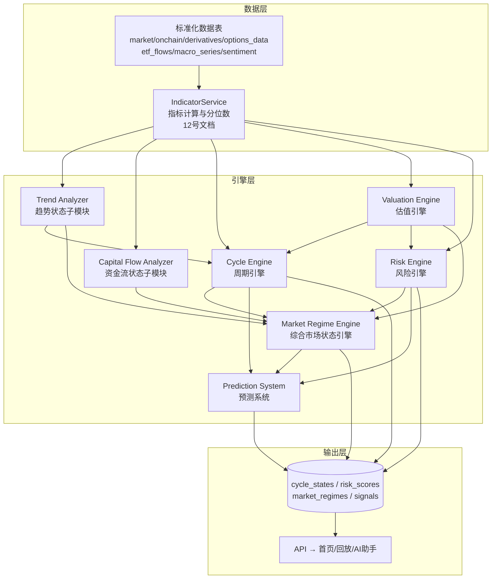
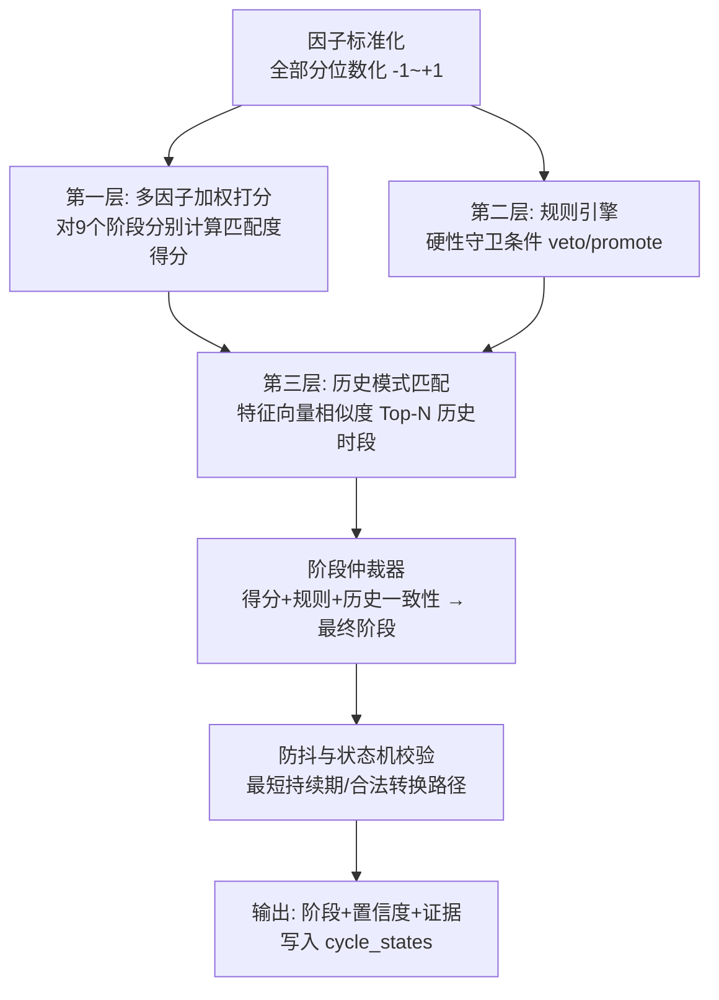
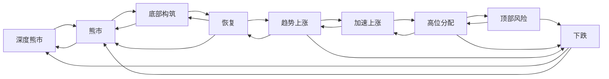
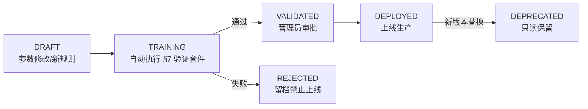

# 13. 模型架构（Model Architecture）

> **文档定位**：定义系统全部业务计算引擎的架构——Cycle Engine（周期）、Valuation Engine（估值）、Risk Engine（风险）、Market Regime Engine（综合状态）、Prediction System（预测）以及模型版本管理与验证框架。
>
> **对应需求**：需求文档第十六~十九节、第二十五~二十六节、第四十三节、第四十五~四十六节。
>
> **相关文档**：指标口径 → `12-indicator-dictionary.md`；回测/Point-in-Time → `14-backtest-architecture.md`；表结构 → 数据库 ER 设计文档（`cycle_states`, `risk_scores`, `market_regimes`, `signals`, `model_versions`, `model_weights`）。

---

## 0. 总体设计原则

1. **描述性输出，禁止指令性输出**：所有引擎输出「状态 + 证据 + 置信度」，**永不输出 BUY/SELL**（需求文档第十九节）。系统只做研究、模拟与提醒，不做投资建议（第四十七节）。
2. **一切结论可解释**：每个引擎输出必须携带完整证据链——支持证据、反向证据、每条证据的数据来源与质量状态。用户可以从任何结论一路点击展开到原始数据（第二十八~二十九节）。
3. **分位数打分，拒绝硬编码阈值**：引擎内部评分基于指标历史分位数（12 号文档 §4.1），历史经验阈值（如 MVRV>3.5）仅作为证据文案展示，不作为分支条件硬编码。**特别禁止按「四年周期/减半日期」硬编码阶段判断**（第十六节）。
4. **数据置信度传导**：输入指标质量降级（STALE/CONFLICT/缺失）→ 对应因子权重自动衰减 → 输出置信度下降 → 前端明示「XX 数据不可用，当前判断置信度降低」（第四十四~四十五节）。
5. **模型版本化**：任何参数/权重/规则变更必须产生新 model_version，历史结论永久关联其产生时的版本（第四十三、四十六节）。
6. **Point-in-Time**：引擎既能实时计算（as_of=None），也能对任意历史时刻重算（as_of=T），回放模式下只允许消费 T 时刻已知数据（第二十四~二十五节）。

### 0.1 引擎依赖拓扑



调度顺序（每日计算流水线，UTC 收盘后）：`IndicatorService 重算日度指标 → Trend/CF 子模块 → Valuation → Risk → Cycle → Regime → Prediction`。Cycle Engine 依赖 Valuation 输出，Regime 依赖全部引擎输出，顺序不可颠倒。任一上游失败：下游使用最近一次有效结果并标记 STALE 降级，不中断整体流水线。

### 0.2 统一输出 Schema（可解释性契约）

所有引擎输出遵循统一结构（写入各自结果表的 `evidence JSONB` 字段）：

```json
{
  "state": "状态枚举值",
  "score": 0.0,                     // 归一化评分 -1~1 或 0~100，按引擎定义
  "confidence": 0.82,               // 置信度 0~1（受数据质量调节）
  "model_version": "cycle-v1.3.0",
  "as_of": "2026-09-27T00:00:00Z",
  "supporting_evidence": [
    {
      "factor": "MVRV 历史分位 92%",
      "indicator_code": "onchain.mvrv",
      "value": 3.1, "percentile": 92,
      "contribution": +0.18,         // 对最终评分的贡献
      "quality_status": "VERIFIED",
      "source_id": "provider_a",
      "observation_time": "...", "fetch_time": "..."
    }
  ],
  "contradicting_evidence": [ /* 同上结构，contribution 为负 */ ],
  "data_gaps": ["etf_net_flow: 数据源未配置"],   // 缺失维度显式声明
  "similar_historical": [ /* 历史相似时段，仅 Cycle/Prediction 输出 */ ]
}
```

前端「点击展开所有原因」即渲染 `supporting_evidence` / `contradicting_evidence` 列表；AI 解释助手只允许引用该结构中的事实，禁止编造（第二十七节）。

### 0.3 因子评分与融合的通用数学约定

- **因子标准化**：每个因子先转换为 `f ∈ [-1, +1]` 的方向化分数。转换方式：分位数映射 `f = 2 × percentile/100 − 1`（正向指标），反向指标取负；
- **权重**：每个因子权重 `w_i ≥ 0`，Σw_i = 1（按可用数据动态归一化：某因子缺失时，其余因子权重按比例放大，同时 confidence 按缺失权重占比下调）；
- **数据质量衰减**：`w_i' = w_i × q_i`，q_i 为质量系数（VERIFIED=1.0, ESTIMATED=0.9, STALE=0.5, CONFLICT=0.5），衰减后重新归一化；
- **维度聚合**：维度分 = Σ(w_i' × f_i) / Σw_i'；
- **置信度**：`confidence = base_confidence × data_coverage × quality_factor`，其中 data_coverage = 可用因子权重和 / 全部因子权重和；
- **状态判定**：维度分落入状态区间（区间边界属于模型参数，版本化管理），并要求**最短持续期**（防抖，见各引擎）。

---

## 1. Cycle Engine（市场周期引擎）

对应需求文档第十六节。目标：综合识别 BTC 当前所处市场阶段，输出阶段 + 置信度 + 证据，**禁止简单按「四年周期」硬编码**。

### 1.1 输入

| 输入组 | 具体因子（指标代码见 12 号文档） | 作用 |
|---|---|---|
| 价格趋势 | price_to_ma(200d/365d/200w)、MA 排列状态、MACD、ADX、Drawdown_ATH | 趋势方向与强度 |
| 链上行为 | ΔLTH Supply(90d)、LTH-SOPR、SOPR 7DMA、CDD/Dormancy(30d)、HODL Waves 长期组占比、Puell Multiple | 筹码积累/派发行为 |
| 估值水平 | MVRV 分位、NUPL 分位、Reserve Risk 分位（来自 Valuation Engine 输出） | 周期位置锚 |
| 资金流 | ETF Net Flow(30d/90d 累计)、Exchange Netflow、Stablecoin Supply 变化 | 增量资金方向 |
| 衍生品 | Funding 年化分位、OI/MCap 分位、年化基差分位 | 杠杆情绪 |
| 宏观背景 | Fed 政策周期状态、Global Liquidity 变化率、M2 YoY | 流动性环境 |
| 情绪热度 | Fear&Greed、Google Trends 分位、Social Volume 分位、New Addresses 分位 | 散户参与度 |

> 减半日期**不作为输入因子**，仅在「历史相似阶段」检索中作为描述性标签展示（例如标注相似时段距离其减半的时间），杜绝硬编码周期论。

### 1.2 阶段定义（9 阶段）

| # | 阶段代码 | 阶段名 | 典型特征描述（证据画像，非判定规则） |
|---|---|---|---|
| 1 | DEEP_BEAR | 深度熊市 | 价格远低于长期均线；MVRV/NUPL 历史极低分位；LTH 仍在派发但速率衰减；情绪冰点、社交热度历史低位；成交与波动萎缩 |
| 2 | BEAR | 熊市 | 下跌趋势中（低于 200DMA 且均线空头排列）；反弹被卖压压制（SOPR 反弹至 1 受阻）；Realized Loss 反复放大 |
| 3 | BOTTOM_BUILDING | 底部构筑 | 价格横盘/缓慢回升；ΔLTH Supply 由负转正（吸筹）；Exchange Reserve 下降；Realized Cap 增速触底；情绪仍冷但不再恶化 |
| 4 | RECOVERY | 恢复 | 站回长期均线附近；MVRV/NUPL 脱离极低分位回到中性；ETF/交易所资金流转正；宏观流动性改善配合 |
| 5 | UPTREND | 趋势上涨 | 均线多头排列且 ADX 走强；LTH 停止派发转为增持；Funding 温和为正；增量资金持续（ETF 净流入、稳定币增长） |
| 6 | ACCELERATION | 加速上涨 | 价格远离长期均线（乖离率历史高分位）；HV 抬升；散户热度快速上升（Google Trends/Social Volume）；Funding 走高 |
| 7 | DISTRIBUTION | 高位分配 | 价格高位滞涨/宽幅震荡；LTH-CDD 与 LTH-SOPR 抬升（老币派发）；Taker/CVD 与价格背离；情绪极度贪婪 |
| 8 | TOP_RISK | 顶部风险 | 估值极端分位 + 杠杆极端（Funding/OI 高分位）+ 派发证据密集 + 流动性边际收紧；多数顶部因子同时触发 |
| 9 | DECLINE | 下跌 | 趋势反转确认（跌破关键均线且反抽失败）；Realized Loss 放大；清算潮；资金净流出 |

每个阶段在 `model_versions.parameters` 中保存其**证据画像权重向量**（该阶段下各因子的期望方向与权重），用于打分与历史相似匹配。

### 1.3 识别算法（三层融合）



**第一层：多因子加权打分。** 对每个阶段 s，计算匹配度 `Score(s) = Σ_i w_i(s) × agreement(f_i, expected_i(s))`，其中 `expected_i(s)` 是阶段 s 画像中因子 i 的期望方向/区间，agreement 输出 0~1。得到 9 个阶段的匹配度分布（softmax 归一化后即为各阶段概率，直接展示给用户：「趋势上涨 62% / 加速上涨 23% / …」）。

**第二层：规则引擎（守卫条件）。** 少量高置信规则用于否决/提升，规则本身版本化存储（`model_versions.parameters.rules`）：
- VETO 类：如「价格低于 200W MA 且 MVRV 分位 < 10%」→ 禁止输出 ACCELERATION/TOP_RISK；
- PROMOTE 类：如「ΔLTH Supply(90d) 转正 且 Realized Cap 增速触底回升 且 Drawdown > −30% 收窄中」→ BOTTOM_BUILDING 匹配度加成；
- 每条规则携带自然语言解释模板，触发时直接进入证据链（普通用户可读）。
- **红线**：规则中禁止出现「距减半 N 天」「周期第 N 年」类时间硬编码；规则总数控制在 ≤ 20 条，防止规则堆叠过拟合。

**第三层：历史模式匹配。** 将当前特征向量（全部因子分位数，约 40 维）与历史每日特征库做相似度检索（余弦相似度 + 欧氏距离混合，标准化后等权；权重可版本化）：
- 输出 Top 5 历史相似时段（起止日期、当时阶段、其后 90/180/365 天实际走势——仅事后视角展示，回放模式隐藏未来部分）；
- 相似时段的后续阶段分布作为第一层打分的先验修正（权重 20%，可配置）；
- 样本不足（相似度 > 阈值的历史时段 < 3 个）时该层失效，confidence 相应下调并提示「历史可比样本不足」。

**阶段仲裁器**：综合三层结果输出最终阶段；当第一层 Top1 与 Top2 概率差 < 10pp 时，输出「阶段过渡期」标记（如 `UPTREND(过渡中→ACCELERATION)`），置信度封顶 0.6——诚实表达不确定性。

### 1.4 输出（写入 `cycle_states`）

| 字段 | 说明 |
|---|---|
| stage | 9 阶段枚举 + 过渡标记 |
| stage_probabilities | JSONB，9 阶段完整概率分布 |
| confidence | 0~1，受数据覆盖/质量/仲裁分歧调节 |
| supporting_evidence / contradicting_evidence | §0.2 证据链结构 |
| similar_historical | Top 5 相似时段（日期区间、相似度、后续走势） |
| triggered_rules | 命中的守卫规则及其解释文案 |
| model_version / as_of / created_at | 版本与时间戳 |

### 1.5 状态转换约束（防抖状态机）

合法转换路径（未列出的转换视为非法，必须经过中间阶段）：



- **最短持续期**：任何阶段确认后至少维持 7 天（TOP_RISK 例外为 3 天，风险预警需要更快响应）；
- **转换确认**：跨阶段转换需连续 3 个交易日新阶段得分占优才生效（TOP_RISK 与 DECLINE 进入仅需 1 日确认——风险方向宁快勿慢）；
- **非法转换处理**：得分显示应跳到非法目标阶段时，输出「过渡期」标记并等待路径经过合法中间态，同时在证据中说明「市场结构变化快于阶段模型，判断置信度降低」；
- 每次实际阶段变化写入 `signals` 表（type=CYCLE_CHANGE），驱动前端通知与事件时间线。

### 1.6 禁止事项清单

1. 禁止「减半后 12~18 个月必是牛市」类硬编码；减半数据仅可在证据文案中作为历史背景描述；
2. 禁止输出 BUY/SELL/加仓/清仓指令（输出「阶段 + 证据」，决策属于用户与其资金计划规则）；
3. 禁止在无链上数据时伪造周期判断——链上因子缺失 >50% 权重时，confidence 强制 ≤ 0.4 且前端提示降级；
4. 禁止隐藏反向证据（contradicting_evidence 为空需真实为空，不得截断）。

---

## 2. Valuation Engine（估值引擎）

对应需求文档第十七节。目标：输出描述性估值状态（深度低估/低估/合理/偏高/极端高估）+ 多维度评分 + 证据。**任何估值状态都不能解释成「未来一定上涨」**——输出文案模板强制包含「估值是历史统计位置，不构成对未来价格的保证」。

### 2.1 输入与维度划分（5 维度独立评分）

| 维度 | 权重(默认) | 因子（指标代码） | 打分逻辑 |
|---|---|---|---|
| D1 链上估值 | 30% | MVRV 分位、NUPL 分位、Reserve Risk 分位 | 分位越高越「高估」：score = 均值(分位映射)，方向为负向（高估减分） |
| D2 成本基础 | 25% | Realized Price 乖离、200W MA 乖离、STH 成本基础乖离 | 价格相对各类成本线的位置；跌破 Realized Price / 200W MA → 深度低估方向 |
| D3 周期位置 | 20% | Drawdown_ATH 分位、Cycle Engine 阶段（作为先验）、HODL Waves 长期组占比 | 深回撤 + 底部/积累阶段 → 低估方向 |
| D4 长期趋势 | 15% | Realized Cap 增速分位、Global Liquidity 变化率、M2 YoY 分位 | 衡量「便宜是否有基本面配合」：流动性改善时低估更可信 |
| D5 波动调整 | 10% | HV30 分位、DVOL 分位 | 极端高波动时对估值判断打折（噪声大），并将 score 向中性收缩 10%~20% |

### 2.2 历史分位计算规范

- 全部采用 12 号文档 §4.1 方法：MVRV/NUPL/Reserve Risk 用 FULL_HISTORY + EXPANDING_FROM(2017) 双口径（两者分位差 >15pp 时取均值并标记口径敏感）；
- 分位计算排除 quality_status IN (STALE, CONFLICT) 的历史样本日；
- 每个分位必须附带样本数与样本起始日，样本 < 365 天 → 该因子标记「样本不足」，权重减半。

### 2.3 融合与状态判定

```
valuation_score = Σ_d (w_d × score_d)   // score_d ∈ [-1, +1]，-1 = 极度低估，+1 = 极度高估
```

| 状态 | 分数区间(默认参数，版本化) | 普通用户文案模板 |
|---|---|---|
| DEEP_UNDERVALUED 深度低估 | [-1.0, -0.6) | 「按历史标准，当前价格处于罕见的便宜区域。历史上类似位置长周期表现较好，但便宜不等于立刻上涨，还可能继续下跌」 |
| UNDERVALUED 低估 | [-0.6, -0.2) | 「当前估值低于历史平均水平，处于相对便宜区域」 |
| FAIR 合理 | [-0.2, +0.2) | 「当前估值处于历史中间区域，无明显贵贱」 |
| OVERVALUED 偏高 | [+0.2, +0.6) | 「当前估值高于历史平均水平，市场情绪与资金推动明显」 |
| EXTREME_OVERVALUED 极端高估 | [+0.6, +1.0] | 「按历史标准，当前处于极端昂贵区域。历史上类似位置之后大多出现深度回调，但顶部无法精确预测，极端状态可持续数月」 |

### 2.4 重要约束（红线）

1. **禁止因果承诺**：所有输出文案模板（普通模式 + AI 助手引用）不得出现「必涨」「抄底」「安全」字样；文案模板本身存储在 `model_versions.parameters.templates`，审查后版本化；
2. **估值 ≠ 择时**：估值状态变化不产生 `signals` 交易信号，仅产生 VALUATION_CHANGE 状态记录事件；
3. **结构漂移承认**：ETF 时代（2024+）资金结构与 2017/2021 不同，专业模式必须展示「双口径分位」（全历史 vs 2017 起）并在差异大时提示口径敏感；
4. 输出（写入 `market_regimes.valuation_state` 及估值专表）遵循 §0.2 证据链 Schema，D1~D5 每个维度可独立展开查看因子明细。

---

## 3. Risk Engine（风险引擎）

对应需求文档第十八节。目标：独立于估值/周期的风险度量，输出 7 个风险维度 + 每个维度可展开的全部原因。**风险引擎宁敏勿钝**：进入高风险的确认期短（1 日），退出高风险需连续 3 日缓解。

### 3.1 风险因子清单（11 因子 → 7 输出维度）

| 输出维度 | 风险因子 | 计算方法 | 阈值参考（分位数口径，版本化参数） | 因子权重 | 数据来源 |
|---|---|---|---|---|---|
| Trend Risk | 趋势破坏 | 价格跌破 50/200DMA 数量、均线死叉、MACD 零轴下死叉 → 破坏计数映射 0~1 | 跌破双线+死叉 → ≥0.7 | 0.5 | candles |
| Trend Risk | 回撤深度 | Drawdown_ATH 分位（越深越接近历史恐慌区，但注意：深回撤同时意味着风险已释放，此处度量「短期急跌」：30d 内回撤速率分位） | 30d 回撤速率 >90 分位 → 0.8+ | 0.5 | market_prices |
| Valuation Risk | 估值过热 | Valuation Engine score 正向部分直接映射 | score > +0.6 → 1.0 线性 | 1.0 | Valuation Engine |
| Leverage Risk | 杠杆拥挤 | OI/MCap 分位 × Funding 年化分位 联合映射 | 双 >90 分位 → ≥0.8 | 0.4 | derivatives |
| Leverage Risk | Funding 极端 | \|年化 Funding\| 分位（正负对称：极端负值=逼空风险） | >95 分位 → 0.9 | 0.3 | derivatives |
| Leverage Risk | 清算连锁 | 24h 清算额分位 + 估算清算热力密集区距现价距离（12 号文档 §7.9） | 密集区距离 <3% → +0.3 加成 | 0.3 | derivatives |
| Liquidity Risk | 盘口流动性 | Spread 分位（反向）+ Depth ±2% 分位（反向） | Spread >90 分位或 Depth <10 分位 → ≥0.7 | 0.4 | orderbooks |
| Liquidity Risk | 资金撤离 | ETF 连续净流出天数分位 + Exchange Netflow 转正持续度 + 稳定币余额下降 | ETF 连续 5 日流出 → 0.6+ | 0.3 | etf_flows / exchange_flows |
| Liquidity Risk | 波动异常 | HV30 分位 + ATR% 分位 + DVOL 分位 | 双 >90 → ≥0.8 | 0.3 | candles / options_data |
| Macro Risk | 宏观冲击 | 事件窗口风险（CPI/NFP/FOMC 前后 48h → 基线 +0.3）+ DXY/VIX/Real Yield 急变分位 + 政策周期紧缩状态 | VIX >90 分位 → 0.7+ | 1.0 | macro_series |
| On-chain Risk | 链上异常 | LTH-CDD(30d) 分位（派发）+ 鲸鱼交易所流入分位 + Miner Outflow(MPI) 分位 + 沉睡币苏醒事件 | 任一 >95 分位 → 该子项 0.9 | 1.0 | onchain_metrics / exchange_flows |
| （拥挤度并入 Leverage/Sentiment） | 市场拥挤度 | LSR 账户比分位 + Google Trends 分位 + Social 狂热指数分位 + New Addresses 分位 | 双 >90 → ≥0.7 | 计入 Leverage Risk 0.2 权重的独立子维度 | derivatives / sentiment / onchain |

> 需求文档列出的 11 个风险因子（估值/波动/杠杆/Funding/OI/Liquidation/流动性/宏观/链上异常/市场拥挤度/回撤）全部覆盖：波动风险并入 Liquidity Risk 的「波动异常」子项与 Trend Risk；回撤风险并入 Trend Risk；市场拥挤度作为 Leverage Risk 的独立子维度并在输出中单独可展开。

### 3.2 综合评分算法

```
dimension_score_d = Σ(w_i × f_i) / Σ(w_i)          // 每维度 0~1，f_i 为因子风险度
overall_raw = Σ(W_d × dimension_score_d)            // 维度权重 W_d（默认）：
    // Trend 0.20 / Valuation 0.15 / Leverage 0.20 / Liquidity 0.15 / Macro 0.15 / On-chain 0.15
overall = min(overall_raw × 1.0 + max_bonus, 1.0)   // 最大值限制规则：
    // max_bonus = 0.15 × max(dimension_score_d)  当任一维度 ≥0.8 时触发
    // ——防止「单维度极端风险被均值稀释」：任何单一维度爆表都必须推高 Overall
```

| Overall 区间 | 风险等级 | 普通用户文案 |
|---|---|---|
| [0, 0.15) | VERY_LOW 极低风险 | 「当前多维度风险指标处于历史极低水平」 |
| [0.15, 0.30) | LOW 低风险 | 「风险指标偏低，市场相对平静」 |
| [0.30, 0.50) | MODERATE 中等风险 | 「风险中性，个别维度需要留意」 |
| [0.50, 0.70) | HIGH 高风险 | 「多个风险维度高于历史平均，波动可能加大」 |
| [0.70, 0.85) | VERY_HIGH 极高风险 | 「多数风险维度处于历史高位，历史上类似状态常伴随剧烈波动」 |
| [0.85, 1.0] | EXTREME 极端风险 | 「风险指标全面极端，历史上类似状态多出现在危机或狂热高潮期」 |

### 3.3 输出（写入 `risk_scores`）

- 7 个维度分 + Overall + 等级 + confidence + 证据链（§0.2）；
- **每个风险维度可点击展开**：渲染该维度全部因子的当前值、分位、贡献度、阈值距离、数据来源与质量状态——对应需求「点击任何风险维度可查看所有原因」；
- 风险等级上穿 HIGH/VERY_HIGH/EXTREME 时写入 `signals`（type=RISK_ALERT），驱动通知与事件时间线；
- Risk Score 同时作为下游消费者：定投模拟的风险调整（15 号文档 §3）、Prediction 的特征、回测策略条件（14 号文档）。

### 3.4 降级规则

- 衍生品数据全部失效 → Leverage Risk 标记「数据不可用」，Overall 用剩余维度归一化，confidence ×0.8，前端明示；
- 期权/盘口（短历史数据）缺失 → 相关子因子跳过而非置零（置零会虚假降低风险）；
- **任何情况下禁止用「历史均值」冒充当前风险值**——缺失就是缺失，显式声明。

---

## 4. Market Regime Engine（综合市场状态引擎）

对应需求文档第十九节。定位：**唯一面向用户的「当前市场怎么样」总出口**，融合全部子状态为描述性 Market Regime，不输出 BUY/SELL。

### 4.1 输入九维

| 维度 | 状态来源 | 状态枚举（描述性） | 默认权重 |
|---|---|---|---|
| Trend State | Trend Analyzer（价格/MA/ADX/MACD） | STRONG_UP / UP / NEUTRAL / DOWN / STRONG_DOWN | 0.15 |
| Valuation State | Valuation Engine | DEEP_UNDERVALUED … EXTREME_OVERVALUED（映射到 -1~+1） | 0.10 |
| Capital Flow State | Capital Flow Analyzer（ETF+Exchange+Stablecoin） | STRONG_INFLOW / INFLOW / NEUTRAL / OUTFLOW / STRONG_OUTFLOW | 0.15 |
| On-chain State | 链上行为合成（ΔLTH、SOPR、CDD、HODL Waves） | ACCUMULATION / NEUTRAL_ACC / NEUTRAL / NEUTRAL_DIST / DISTRIBUTION | 0.15 |
| Derivative State | 衍生品合成（Funding、OI、基差、LSR、清算） | CALM / MILD_BULL / OVERHEATED / MILD_BEAR / STRESSED | 0.10 |
| Macro State | 宏观合成（政策周期、流动性、DXY/VIX/Real Yield） | SUPPORTIVE / NEUTRAL / HEADWIND / CRISIS | 0.10 |
| Sentiment State | 情绪合成（F&G、Trends、News、Social） | EXTREME_FEAR / FEAR / NEUTRAL / GREED / EXTREME_GREED | 0.10 |
| Risk State | Risk Engine Overall | VERY_LOW / LOW / MODERATE / HIGH / VERY_HIGH / EXTREME（反向映射） | 0.10 |
| Cycle State | Cycle Engine 阶段 | 9 阶段（映射到周期坐标 -1~+1） | 0.05 |

各维度自身也是「多因子加权 → 状态」的小引擎，实现与 §0.3 一致；每个维度输出自己的证据链，Regime 页面九宫格每格可展开。

### 4.2 融合方法

1. 每个维度状态映射为标量 `v_d ∈ [-1, +1]`（映射表版本化，例如 EXTREME_FEAR=-0.9, STRONG_UP=+0.9）；
2. `regime_score = Σ w_d × v_d × q_d / Σ w_d × q_d`（q_d 为维度数据质量系数）；
3. regime_score 结合 Risk State 与 Cycle State 做**定性修正**（规则版本化）：
   - Risk = EXTREME → 强制 regime 标签附加「高风险环境」后缀，无论 score；
   - Cycle = TOP_RISK 且 score > 0 → 输出「晚周期过热（顶部风险）」而非简单「牛市」；
4. **Market Regime 标签体系**（描述性，非指令性）：

| regime_score | Regime 标签 | 普通用户解读模板 |
|---|---|---|
| [+0.6, +1.0] | 强势多头环境 | 「趋势、资金、情绪多数向好；若 Risk 同时偏高，提示行情可能处于过热后段」 |
| [+0.2, +0.6) | 温和多头环境 | 「市场偏强但动能一般」 |
| (-0.2, +0.2) | 中性震荡环境 | 「多空力量均衡，方向不明，历史上此阶段假突破多」 |
| (-0.6, -0.2] | 温和空头环境 | 「市场偏弱，反弹缺乏资金配合」 |
| [-1.0, -0.6) | 强势空头环境 | 「趋势、资金、情绪全面转弱；若估值同时深度低估，历史上属于恐慌底部特征区」 |

5. **一致性/分歧度**：九维状态的方向一致性（同向维度权重占比）作为 confidence 基础；维度严重分歧（如趋势强多头 + 链上派发）时输出「市场分歧加大」标记——分歧本身是重要信息，不得掩盖。

### 4.3 持久化与可回看（强制）

- **每次变化都保存**：`market_regimes` 表按日追加快照（无论是否变化），字段：date, regime_label, regime_score, 九维状态(JSONB), 九维证据链(JSONB), confidence, model_version, data_coverage, created_at；
- 状态变化事件另写 `signals`（type=REGIME_CHANGE），带 before/after；
- **用户可回看任意历史日期系统当时的判断**：历史回放页（14 号文档 §5）直接读取该日 `market_regimes` 行——注意读取的是**当时实际产生的记录**（as-run），若需要「以今天的模型重算历史」则走离线重算任务并明确标记 re-computed，两种模式在 UI 上必须区分；
- `market_regimes` 行永久关联 model_version，模型升级不覆盖历史（第四十三节）。

---

## 5. Prediction System（预测系统）

对应需求文档第二十六节。定位：**概率化、附带完整统计披露的短期展望**，宁可输出「无法可靠预测」也不输出虚假确定性。

### 5.1 输出定义

| 输出项 | 定义 | 强制伴随披露 |
|---|---|---|
| 上涨/横盘/下跌概率 | 未来 N 天（默认 30，可选 7/90）收益率 > +5% / ∈ [-5%, +5% / < -5% 的概率（阈值版本化） | 三者之和 = 100%，明确标注阈值定义 |
| 预计波动区间 | 基于 HV30/DVOL 与历史相似时段的 50% 概率区间 [P_low, P_high] | 区间构造方法说明 |
| 风险区间 | 10% 分位下界（尾部风险）：「有 10% 的历史相似情形跌幅超过 X%」 | 样本数 |
| 置信度 | 模型置信 × 数据覆盖 × 历史校准度 | 校准曲线（预测 60% 的事件实际发生频率） |
| 历史相似状态 | Top 5 相似时段（复用 Cycle Engine §1.3 第三层检索）+ 各自后续 N 天实际走势 | 相似度、样本数 |

### 5.2 模型方法（基线 → 演进路线）

- **v1 基线：历史条件频率法（无参数、完全可解释）**——当前特征向量（Regime 九维 + Risk 等级 + 估值分位 + 周期阶段）→ 历史相似日检索 → 相似日后 N 天实际收益的频率分布即概率输出。优点：零黑箱、样本可列举、天然满足披露要求；
- **v2 演进：Logistic / GBDT 分类器**（上涨/横盘/下跌三分类），特征 = v1 特征 + 指标分位数全集；要求 SHAP 特征贡献进入证据链后方可上线；
- 两版本并行 A/B（§7），线上默认展示校准度更优者；任何 ML 模型未通过 §7 验证框架禁止上线；
- 模型训练严格 Walk-Forward（滚动训练窗 + 前向验证窗），训练/验证代码与数据版本快照固化到 model_version。

### 5.3 强制披露与拒答机制

每次预测输出必须完整显示（需求文档原文要求）：

```
样本数量：37 个历史相似时段
历史模型表现：过去 12 个月三分类准确率 46%（基线 38%），Brier Score 0.21
测试区间：2015-01 ~ 2025-06（Walk-Forward）
模型版本：pred-v1.2.0
置信区间：上涨概率 52% ± 9%（bootstrap 80% CI）
不确定性说明：当前处于 CPI 发布窗口 / ETF 数据缺失 / 历史相似样本不足（如适用，逐条列出）
```

**拒答条件（满足任一即输出「当前无法可靠预测」并说明原因）**：
1. 历史相似样本 < 10 个；
2. 数据覆盖 < 60%（关键维度大面积缺失/降级）；
3. 模型近 90 天滚动校准度显著恶化（Brier > 基线 + 20%）；
4. 处于极端事件窗口（单日清算 >99.5 分位、VIX >95 分位等，模型自认失效区）；
5. 模型版本未通过最近一次定期验证（§7）。

**禁止事项**（红线，写入文案审查规则）：禁止「99% 准确」「100% 暴涨」「精准抄底」「精准逃顶」及一切等价表述；概率输出禁止四舍五入到 >90% 或 <10%（截断展示，防止虚假确定性）；预测记录永久保存（`signals` type=PREDICTION），到期自动回填实际结果供用户核查命中率——**预测的历史成绩单公开可查**。

---

## 6. 模型版本管理

对应需求文档第四十三、四十六节。原则：**模型版本不能被覆盖；回测结果必须永久对应模型版本和数据版本**。

### 6.1 `model_versions` 表

| 字段 | 类型 | 说明 |
|---|---|---|
| id | bigserial | 主键 |
| engine | varchar | cycle / valuation / risk / regime / prediction / dca_rules / sentiment_nlp |
| version | varchar | 语义化版本 semver：MAJOR（结构变更）.MINOR（权重/参数变更）.PATCH（文案/修复） |
| status | varchar | DRAFT / TRAINING / VALIDATED / DEPLOYED / DEPRECATED / REJECTED（同 engine 同时只有一个 DEPLOYED） |
| created_at | timestamptz | 创建时间 |
| parameters | jsonb | 全部参数快照：权重、阈值、区间边界、规则集、文案模板、特征列表 |
| training_period | daterange | 训练/拟合区间（Walk-Forward 记录全部窗口） |
| test_period | daterange | 样本外测试区间 |
| performance_metrics | jsonb | 验证指标（各引擎定义见 §7.3） |
| data_version | jsonb | 依赖数据快照指纹：{表名: {min_observation_time, max_observation_time, row_count, quality_summary}} |
| changelog | text | 变更说明（相对上一版本改了什么、为什么） |
| parent_version | varchar | 上一版本号（版本链） |
| activated_at / retired_at | timestamptz | 生效/退役时间 |
| approved_by | varchar | 审批人（管理员） |

### 6.2 版本生命周期



- 版本不可变：DEPLOYED 后 parameters 禁止 UPDATE，只能发新版本；数据库层加触发器强制；
- 引擎每次计算输出都写入所用 model_version → 任何历史结论可精确复现（同版本 + 同数据 = 同结果，这是回放可信的基础）；
- **回测结果三元绑定**：`backtest_runs` 记录 (strategy_version, model_version, data_version)，缺一即视为无效回测（14 号文档 §2.6）；
- 数据版本指纹：回测/验证运行前对依赖表计算指纹存入 data_version，之后数据回补（补洞）不改变已存指纹，但重跑会产生新指纹——保证「回测结果永久对应数据版本」。

### 6.3 `model_weights` 表（权重明细，供审计与可视化）

按 (model_version_id, factor_code, dimension, weight, quality_decay_rule) 展开存储，前端「专业模式」展示模型权重（需求文档第二十八节要求专业模式显示模型权重）时直接查询此表，禁止前端硬编码权重。

---

## 7. 模型验证框架

对应需求文档第二十五、四十六节。所有引擎版本从 TRAINING → VALIDATED → DEPLOYED 必须通过本套件；DEPLOYED 版本每季度定期重验，失败则降级 confidence 并通知管理员。

### 7.1 数据分割策略

| 策略 | 定义 | 用途 |
|---|---|---|
| In-Sample (IS) | 2015-01 ~ T-24M（如 2015~2024-06） | 参数拟合、规则制定 |
| Out-of-Sample (OOS) | 最近 24 个月滚动（2024-07 ~ 今） | 上线前硬性验证，**拟合参数时禁止触碰** |
| Walk-Forward | 训练窗 36M，验证窗 6M，步进 6M，滚动至最新 | 模拟真实使用场景的连续验证 |
| 极端行情测试集 | 固定事件窗（下表） | 压力测试，每版本必跑 |

极端行情测试窗（版本化维护，可持续追加）：

| 事件 | 窗口 | 检验点 |
|---|---|---|
| 2020-03 流动性危机 | 2020-03-01 ~ 2020-04-15 | Risk 应达 EXTREME；Cycle 不得误判为「牛市回调结束」过早 |
| 2020-10~2021-04 牛市启动 | 2020-10-01 ~ 2021-04-15 | Cycle 应在 RECOVERY→UPTREND 路径上，无长期卡在 BEAR |
| 2021-05 5·19 崩盘 | 2021-05-01 ~ 2021-06-15 | Risk 预警及时性；Regime 转换不迟滞 >7 天 |
| 2021-09~11 周期顶部 | 2021-09-01 ~ 2021-11-30 | Cycle 应进入 DISTRIBUTION/TOP_RISK；Valuation 应为高估区 |
| 2022-05 LUNA | 2022-05-01 ~ 2022-06-15 | Risk EXTREME；On-chain Risk 应捕获 Realized Loss 尖峰 |
| 2022-06 三箭资本 | 2022-06-10 ~ 2022-07-10 | 同上 |
| 2022-11 FTX | 2022-11-01 ~ 2022-12-15 | 链上异常因子应触发（交易所流出/鲸鱼活动） |
| 2023-03 银行业危机 | 2023-03-08 ~ 2023-04-07 | Macro Risk 应响应（VIX/DXY），BTC 逆势上涨时 Regime 应体现「避险分流」分歧 |
| 2024-01~03 ETF 上市 | 2024-01-11 ~ 2024-03-31 | 新数据源接入时 confidence 变化合理，无跳变 |
| 2024-08-05 套息平仓 | 2024-08-01 ~ 2024-08-15 | Risk 单日升级能力 |
| 2025-02~04 深回调 | 2025-02-01 ~ 2025-04-30 | Cycle 不得在回撤中直接跳到 DEEP_BEAR（路径合法性） |

### 7.2 验证方法

1. **参数敏感性测试**：对每个数值参数（权重 ±20%、阈值 ±1 个分位档、窗口 ±30%）做网格扰动，记录输出状态变化率。要求：单参数扰动下，历史每日阶段/状态判定变化率 < 15%；若某参数轻微扰动导致结论大变 → 该参数处结论不可靠，标记「参数敏感」并在专业模式披露；
2. **状态稳定性**：统计历史全区间状态切换频率，Cycle 阶段年均切换次数应在合理带（4~12 次/年，过密 = 噪声，过疏 = 迟钝）；
3. **校准验证（Prediction 专用）**：可靠性曲线（预测概率分桶 vs 实际频率）、Brier Score 对比无条件基线（历史频率）、要求 Brier 优于基线 ≥5% 才可上线；
4. **一致性检验**：Cycle/Valuation/Risk/Regime 之间的逻辑一致性（如 Regime=强势多头 而 Cycle=深度熊市 → 矛盾率 <2%，矛盾时段必须能在证据链中找到解释）；
5. **降级行为测试**：模拟任一数据组缺失（对应 Provider 全挂），验证 confidence 下降、状态不跳变、无崩溃、无伪造值；
6. **Point-in-Time 泄漏测试**：验证套件运行时对 as_of 历史重算，断言所有消费的记录 fetch_time ≤ as_of（与 14 号文档 §2.5 检测器共用）。

### 7.3 各引擎通过标准（performance_metrics 内容）

| 引擎 | 核心验证指标 | 通过标准（默认，版本化） |
|---|---|---|
| Cycle | 阶段判定与人工标注历史周期的一致性（2015~今 5 轮周期专家标注集）；阶段切换滞后天数 | 一致率 ≥75%；顶部/底部阶段确认滞后 ≤45 天 |
| Valuation | 极端高估/深度低估状态的后续 365d 收益分布分离度 | 高估组 vs 低估组 365d 收益均值差显著（bootstrap p<0.05） |
| Risk | 高风险状态（≥HIGH）后 30d 最大回撤 vs 低风险状态后 30d | 高风险组回撤分布显著更差；极端行情测试集捕获率 ≥80% |
| Regime | 九维一致性、REGIME_CHANGE 后 30d 波动方向验证 | 状态切换后 30d 收益方向与标签一致率 ≥55%（弱于预测要求，因描述性定位） |
| Prediction | §7.2.3 校准指标 | Brier 优于基线 ≥5%；拒答机制在极端窗口正确触发 |

### 7.4 「在什么情况下有效」声明（强制输出）

每个 DEPLOYED 版本必须附带 effectiveness_statement（存于 performance_metrics，前端模型页展示），模板：

```
本版本 Cycle Engine（cycle-v1.3.0）：
- 验证区间：2015-01 ~ 2025-06（Walk-Forward，训练窗 36M/验证窗 6M）
- 在以下情况有效：日线级别数据完整、链上数据覆盖 ≥70%、非极端事件后 48h 内
- 在以下情况可靠性下降：宏观数据大面积修订期、新数据源接入初期（ETF 类 <90 天历史）、
  单日波动 >15% 的极端行情后 3 日内
- 已知弱点：对 V 型反转的确认滞后（历史平均 12 天）；2024 后 ETF 资金流权重可能低估
- 历史成绩单：阶段一致率 78%（标注集），顶部确认平均滞后 23 天，底部确认平均滞后 31 天
```

---

## 8. 引擎公共基础设施

### 8.1 代码组织（backend/app/engines/）

```
engines/
├── base/
│   ├── engine_base.py        # EngineBase：as_of 语义、证据链构建、版本加载、降级处理
│   ├── factor.py             # 因子标准化/分位数映射/质量衰减（§0.3 实现）
│   ├── evidence.py           # EvidenceChain 构建器（§0.2 Schema）
│   └── versioning.py         # model_versions 读写、版本校验、不可变保护
├── cycle/                    # Cycle Engine（打分器/规则引擎/相似检索/状态机）
├── valuation/
├── risk/
├── regime/                   # 含 trend_analyzer / capital_flow_analyzer 子模块
├── quality/                  # 数据置信度评估（引擎侧消费口径）
└── prediction/
```

所有引擎继承 EngineBase，统一获得：as_of 时间语义（实时/回放）、证据链输出、版本加载、数据缺失降级——保证五个引擎行为一致且新引擎可低成本接入。

### 8.2 计算触发与幂等

- 每日流水线（§0.1）+ 事件触发（Risk 每小时评估、清算/Funding 极端事件即时重估）；
- 同一 (engine, as_of, model_version, data_fingerprint) 的计算结果幂等：重复触发返回缓存结果；
- 历史重算（口径升级、补洞后）走独立离线任务，结果写入 re-computed 标记，不覆盖 as-run 历史（§4.3）。

### 8.3 与 AI 解释助手的边界

AI 助手（需求文档第二十七节）只能消费本架构输出的结构化证据链：回答「为什么风险变高」时逐条引用 supporting_evidence 中的因子、数值、来源、时间，并区分「事实（数据）/ 统计结果（分位）/ 模型判断（状态与置信度）/ 反向证据 / 不确定性」五类标签。引擎证据链字段设计已按此五类可分类（contribution、quality_status、confidence、contradicting_evidence、data_gaps），AI 层禁止访问原始数据库自行「找理由」。
