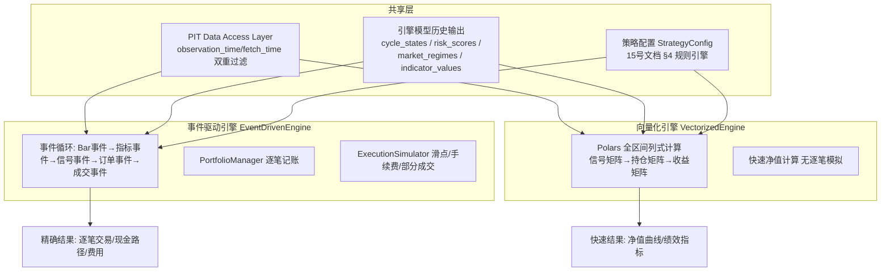
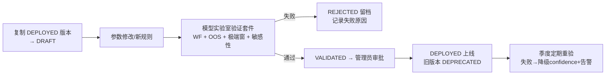

# 14. 回测架构（Backtest Architecture）

> **文档定位**：定义 Backtest Engine、防未来数据泄漏机制（强制要求）、回测参数与输出指标、历史回放系统、策略实验室与模型实验室的完整架构。
>
> **对应需求**：需求文档第二十三~二十五节（回测/回放/防泄漏）、第四十六节（模型不能只追求历史收益）、第二十~二十二节（回测服务的资金计划场景）。
>
> **相关文档**：策略/规则的配置模型 → `15-portfolio-architecture.md`；引擎模型版本 → `13-model-architecture.md` §6；Point-in-Time 指标语义 → `12-indicator-dictionary.md` §11.3。

---

## 1. 回测引擎设计

### 1.1 双引擎架构

系统同时提供两种回测内核，共享同一套 Point-in-Time 数据访问层（§2）与指标/模型输出，二者对同一策略必须给出一致结果（一致性作为 CI 断言，容差 < 0.1%）：



### 1.2 事件驱动引擎（Event-Driven）——精确模式

模拟真实交易流程，是**结果权威来源**（写入 `backtest_results` 的正式记录）：

| 组件 | 职责 |
|---|---|
| EventQueue | 按时间序派发事件：`BarEvent`（K线收盘）→ `IndicatorEvent`（指标/引擎输出就绪）→ `SignalEvent`（规则引擎产生意向）→ `OrderEvent`（组合校验后生成订单）→ `FillEvent`（成交模拟回报） |
| DataHandler | 唯一数据入口，强制走 PIT 层（§2.1）；按当前模拟时间逐步「释放」数据，架构上杜绝越界访问 |
| Strategy | 消费 IndicatorEvent，按 StrategyConfig（15 号文档 §4 规则引擎）产生 SignalEvent；策略无状态副作用，同一输入必产生同一输出 |
| PortfolioManager | 现金账户 + BTC 持仓逐笔记账；校验资金充足性、最大单次投入、现金储备下限（15 号文档 §1 计划参数）；计算每日净值快照 |
| ExecutionSimulator | 成交价 = 信号 Bar 收盘价 × (1 ± slippage)；手续费 = 成交额 × fee_rate；DCA 类市价单默认全额成交（日级流动性充足假设），单笔 > 当日成交额 1% 时按 VWAP 分拆并记录冲击成本 |
| Clock | 模拟时钟，支持 1d 步进（DCA 回测默认）与 1h 步进（高频策略）；事件时间严格单调 |

**成交假设（必须写入回测报告）**：信号在 Bar 收盘时产生，成交按**同 Bar 收盘价 + 滑点**或**次 Bar 开盘价**（可配置，默认次 Bar 开盘，更保守）；禁止「按当日最低价成交」类乐观假设。

### 1.3 向量化引擎（Vectorized）——快速模式

用于参数扫描与策略对比：全部信号逻辑表达为 Polars 列式运算（条件矩阵 → 仓位矩阵 → 收益率矩阵 → 净值曲线），单策略 2015~今 全区间回测目标 < 2 秒，支持千级参数组合网格并行。

限制（在结果中显式标注 `engine=vectorized, approximate=true`）：不模拟逐笔现金路径与部分成交；手续费按成交额固定比例近似；**只用于筛选，最终结论必须用事件驱动引擎复核**。

### 1.4 模式选择策略

| 场景 | 引擎 | 理由 |
|---|---|---|
| 用户资金计划正式回测（我的计划页） | Event-Driven | 结果权威、逐笔可查 |
| 策略实验室参数网格扫描 | Vectorized | 速度 |
| 网格扫描后的 Top-N 参数精算 | Event-Driven | 精确复核 |
| 多策略同期对比 | Vectorized 初筛 + Event-Driven 终版 | 兼顾 |
| 模型实验室 A/B 与 Walk-Forward | 两者按用途混用 | 同 §1.1 一致性约束 |

---

## 2. 防未来数据泄漏机制（强制要求）

对应需求文档第二十五节。这是回测系统最高优先级约束，违反任何一条的回测结果视为无效。

### 2.1 Point-in-Time 数据库视图

- 所有含时间语义的标准化数据表（`market_prices`, `candles`, `onchain_metrics`, `derivatives`, `etf_flows`, `macro_series`, `sentiment`, `indicator_values`, `cycle_states`, `risk_scores`, `market_regimes`）均具备 `observation_time` 与 `fetch_time` 双字段；
- 为每张表建立 PIT 视图/函数：

```sql
-- 通用 PIT 查询函数（每表实例化）
CREATE FUNCTION pit_onchain(as_of timestamptz) RETURNS SETOF onchain_metrics AS $$
  SELECT DISTINCT ON (observation_time, metric_code) *
  FROM onchain_metrics
  WHERE fetch_time <= as_of          -- 当时系统「已经拿到」的数据
    AND observation_time <= as_of    -- 数据所属时间不超前
  ORDER BY observation_time, metric_code, fetch_time DESC;  -- 同 observation 取当时最新版本
$$ LANGUAGE sql STABLE;
```

- **DataHandler 只允许调用 `pit_*` 接口**，代码审查规则（CI 静态检查）：backtest 包内出现对原始表的直接 SELECT 即构建失败；
- 同一 observation_time 存在多版本（修订）时，PIT 函数返回 `fetch_time <= as_of` 中最新的一版——即「当时系统能看到的版本」，而非最终修订版。

### 2.2 宏观数据三时间轴（强制）

`macro_series` 表结构强制包含：

| 字段 | 含义 | 示例（2022-06 CPI） |
|---|---|---|
| observation_date | 数据所属期间 | 2022-06-01（6 月 CPI） |
| release_date | 官方首次发布时间 | 2022-07-13 |
| revision_date | 修订时间（可多次，多行版本） | 2022-08-10（修订版） |
| version | 版本号（1=首发，2+=修订） | 1 |
| value | 该版本数值 | 9.1% (YoY) |

规则：
1. 回测中 as_of=2022-07-01 时，6 月 CPI **不可见**（release_date 2022-07-13 > as_of）；
2. as_of=2022-07-20 时可见 version=1；as_of=2022-09-01 时可见 version=2；
3. **禁止使用修订后数据模拟过去**——修订版本行只增不删（audit），PIT 函数按 release/revision 时间过滤版本；
4. 采集层义务：MacroProvider 抓取时若 API 提供修订历史（FRED 支持 vintage 查询）必须全量保存；仅提供最新值的 Provider，其历史修订不可回溯——此类数据标记 `vintage_complete=false`，回测报告中披露该局限。

### 2.3 其他泄漏类型防范

| 泄漏类型 | 场景 | 防范机制 |
|---|---|---|
| Look-ahead Bias | 用当日收盘价产生信号并按当日收盘成交 | 默认次 Bar 开盘成交（§1.2）；日级信号仅使用已收盘 Bar |
| Revision Leakage | 宏观数据修订（§2.2）、链上数据回填修正 | fetch_time 过滤；链上 Provider 回填修正同样产生新 fetch_time 版本行 |
| Survivorship Bias | 交易所/ETF 下架后数据消失 | Provider 停用不删除历史数据；ETF 基金列表含已退市基金（如已关闭的 ETF 保留至退市日）；回测报告标注数据覆盖完整性 |
| Data Snooping | 反复用同一 OOS 区间调参导致隐性过拟合 | ① OOS 区间访问审计：模型实验室记录每次触碰 OOS 的实验（`experiment_log` 计数）；② 同一版本验证失败 ≥3 次 → 强制扩大验证窗并披露试验次数；③ 结果页展示「本版本累计实验次数」提示多重检验风险 |
| Indicator Leakage | 指标用全历史统计量（如全样本分位数）计算历史某日的值 | `indicator_values` 的分位数在**每日任务中按当时可得历史**计算并落库（as-run）；回测直接消费落库值，禁止回测时重算全样本分位 |
| Model Leakage | 回测中使用「今天训练」的模型判断历史 | 两种模式显式区分：**as-run 模式**（消费历史当日实际产生的 cycle_states/risk_scores/market_regimes 行）与 **re-computed 模式**（用指定 model_version 重算历史，报告必须标注 `recomputed=true` 且该版本训练区间与回测区间重叠时强制披露过拟合风险） |

### 2.4 引擎输出的历史可用性分级

| 数据 | 2015~2016 | 2017~2019 | 2020~2023 | 2024~今 |
|---|---|---|---|---|
| 价格/K线/技术指标 | ✅ | ✅ | ✅ | ✅ |
| 链上指标 | ⚠️ 部分 Provider 覆盖 | ✅ | ✅ | ✅ |
| 衍生品 | ⚠️ 稀疏 | ⚠️ | ✅ | ✅ |
| ETF | ❌ 不存在 | ❌ | ❌ | ✅ |
| 期权 DVOL | ❌ | ❌ | ✅ | ✅ |
| 宏观 | ✅（FRED vintage） | ✅ | ✅ | ✅ |
| 情绪 | ⚠️ | ✅ | ✅ | ✅ |

规则：某因子在回测区间不可用时，引擎按 13 号文档降级逻辑（权重重归一 + confidence 下调）运行，回测报告必须列出「本区间数据可用性表」——**禁止用后期数据模式外推填补早期缺失**。

### 2.5 Look-ahead Bias 自动检测器（CI + 定期任务）

1. **时间旅行断言**：回测运行时 DataHandler 记录全部数据访问的 (table, observation_time, fetch_time, as_of)，任务结束断言 `max(fetch_time) <= as_of_max`，违例即回测失败；
2. **截断重跑检验**（月度任务）：任选历史日 T（如 2021-06-01），用 `pit_*(T)` 截断数据重跑策略 → 结果必须与全量数据回测在 [start, T] 区间的净值曲线完全一致（容差 1e-9）；不一致 = 存在前视依赖；
3. **信号-成交时序审计**：每笔模拟成交断言 `fill_time > signal_bar_close_time`（默认次 Bar 成交模式下）；
4. 检测器代码位于 `backend/tests/backtest/test_lookahead.py`，属于需求文档第四十节「未来数据泄漏测试」的实现。

### 2.6 回测结果不可变与三元绑定

`backtest_runs` 每次运行记录：`(strategy_version, model_version, data_version_fingerprint, params, period, engine, mode(as-run/recomputed), created_at)`。结果只增不改；数据补洞后旧结果**不自动失效也不自动重跑**，但结果页显示「数据已更新，可重跑对比」；重跑生成新 run_id，两份结果可并排 diff。

---

## 3. 回测参数（用户输入）

| 参数 | 类型/默认值 | 说明 |
|---|---|---|
| 初始资金 initial_capital | 金额，默认 0 | 一次性投入（可 0，纯定投） |
| 每月投入 monthly_amount | 金额，默认 1000 | 与每周投入二选一或并存 |
| 每周投入 weekly_amount | 金额，默认 0 | |
| 投入日 dca_day | 每月第 N 日 / 每周第 N 天 | 遇到无数据日顺延至下一交易日并记录 |
| 币种 quote_currency | CNY（默认）/ USD | CNY 计价时用 USDT/CNY 汇率序列换算（汇率来源与 PIT 约束同上；汇率 Provider 缺失时报告标注） |
| 策略 strategy | 固定定投 / 下跌加仓 / 回撤加仓 / 估值加仓 / 风险调整 / 周期调整 / 自定义规则组合 | 引用 StrategyConfig（§6，与 15 号文档 §4 同一规则引擎） |
| 手续费率 fee_rate | 默认 0.1%（现货），可调 0~0.5% | 按成交额计 |
| 滑点模型 slippage | 固定 bps（默认 5bps）/ ATR 比例（默认 0.05×ATR%）/ 无 | ATR 模型使用 PIT 的 ATR 值，随行情波动 |
| 回测区间 period | 默认 2015-01-01 ~ 今，可选任意子区间 | 早于数据覆盖起点时自动截断并提示 |
| 资产 asset | BTC（默认，架构预留 ETH 等扩展） | |
| 成交价假设 fill_mode | 次 Bar 开盘（默认）/ 同 Bar 收盘 | §1.2 |
| 再平衡/卖出规则 sell_rules | 默认无卖出（纯积累）；可配置估值/风险触发减持 | 卖出仅作研究模拟，报告附「非投资建议」声明 |

参数校验：金额为正、区间合法、策略引用的指标在回测区间可用（不可用时警告并列出受影响规则）。

## 4. 回测输出指标

### 4.1 汇总指标（`backtest_results.summary JSONB`）

| 组 | 指标 | 计算定义 |
|---|---|---|
| 资产 | 最终资产 final_value | 期末现金 + BTC 持仓 × 期末价（CNY/USD 双币种展示） |
| 资产 | 总投入 total_invested | Σ 每期投入本金（不含手续费） |
| 资产 | 总收益 total_profit / 收益率 total_return | final_value − total_invested；/ total_invested |
| 收益 | 年化收益率 CAGR | **资金加权口径（Money-Weighted, IRR）**为主指标（定投场景下时间加权会失真），同时输出时间加权 TWRR 对照 |
| 风险 | 最大回撤 max_drawdown | 基于每日净值（含投入本金调整的成本净值与市值净值双口径，默认市值口径） |
| 风险 | 最长回撤持续时间 | 净值从前高回落到收复前高的最长天数 |
| 风险 | 恢复时间 | 各次 >20% 回撤的恢复天数列表 |
| 风险 | Sharpe Ratio | (日收益率均值 − 无风险利率/365) / 日收益率标准差 × √365；无风险利率取 PIT 的 3M 国债（缺失时取 0 并标注） |
| 风险 | Sortino Ratio | 同 Sharpe，分母仅用下行波动 |
| 分布 | 最佳年份 / 最差年份 | 自然年收益率极值（附年份表） |
| 持仓 | BTC 数量 / 平均成本 | Σ 买入量；DCA 平均成本 = Σ(买入金额) / Σ(买入 BTC 数)（费用是否计入成本：默认计入，口径在报告标注） |
| 成本 | 累计手续费 / 累计滑点成本 | 逐笔累加 |
| 对照 | BTC 一次性买入基准 | 同区间首日等额一次性买入的收益（DCA 有效性对照，必出） |

### 4.2 时序数据（资产曲线图）

`backtest_results.equity_curve JSONB`（或大区间时压缩存对象表）：每日 `{date, invested_cum, cash, btc_amount, market_value, avg_cost, drawdown, btc_price}` → 前端渲染资产曲线、投入成本线、BTC 价格对照、回撤带；叠加事件时间线标记（减半/ATH/极端清算等，需求文档第三十节）。

### 4.3 报告强制附注

数据可用性表（§2.4）、成交与费用假设、引擎与模式（event-driven/vectorized, as-run/recomputed）、三元绑定版本、局限性声明（「历史表现不代表未来收益；回测基于简化市场假设」）。

---

## 5. 历史回放系统

对应需求文档第二十四节。目标：选择任意历史日期，恢复当日系统全部状态，支持「当时视角 / 事后视角」切换。

### 5.1 回放状态恢复

| 回放内容 | 数据来源 | 恢复方式 |
|---|---|---|
| 当日价格/K线 | market_prices, candles | pit 查询 |
| 当日技术指标 | indicator_values | as-run 落库值优先；缺失时段按 PIT 重算（标记 recomputed） |
| 当日链上 | onchain_metrics | pit 查询 |
| 当日 ETF | etf_flows | 2024-01-11 前显示「该数据当时不存在」 |
| 当日衍生品/期权 | derivatives, options_data | pit 查询 |
| 当日宏观 | macro_series | 三时间轴 PIT（§2.2） |
| 当日情绪 | sentiment | pit 查询 |
| 当日周期/风险/综合状态 | cycle_states, risk_scores, market_regimes | **as-run 记录优先**（当时系统真实判断）；系统上线前的历史日期用 re-computed 模式（当前 DEPLOYED 版本重算，页面显著标注「重算值，非当时实时判断」） |

技术实现核心：所有查询走 `pit_*(as_of)` 视图函数（§2.1），`observation_time <= as_of AND fetch_time <= as_of` 双重过滤；回放 API：`GET /api/v1/replay/{date}?view=then|after`。

### 5.2 双视角

- **当时视角（view=then）**：严格只见 as_of 之前信息——所有面板（首页九宫格、周期、估值、风险、指标）按 PIT 渲染；预测系统输出「当时能做出的预测」（as-run 或重算）；未来一切信息（含指标详情页的历史分位中标注的未来事件）隐藏；
- **事后视角（view=after）**：在当时视角基础上追加「未来 30/90/180/365 天实际走势」面板：价格路径、最大回撤、阶段实际演变、当时系统判断 vs 实际结果对照（命中率统计入口）；
- UI 强制区分：当时视角全页水印式标注日期与「模拟当时信息环境」，防止用户混淆；
- 回放支持逐日步进播放（自动加载相邻日期，前端预取 ±7 天缓存），配合事件时间线（第三十节）在轴上标记重大事件。

### 5.3 回放与预测成绩单

Prediction 的历史预测记录（signals type=PREDICTION）在回放页到期后自动展示「当时预测 vs 实际」，累积为公开成绩单（13 号文档 §5.3）——回放系统同时是模型诚实性的验证工具。

---

## 6. 策略实验室（Strategy Lab）

对应需求文档第二十六阶段与「策略参数可调整、策略对比、策略版本管理」要求。

### 6.1 策略定义语言（配置化，非代码）

策略 = 声明式 JSON 配置（StrategyConfig），由 15 号文档 §4 的同一规则引擎解释执行（回测与真实资金计划共用，保证「回测的策略 = 将来执行的策略」）：

```json
{
  "strategy_code": "dip_buyer_v2",
  "version": "2.1.0",
  "base": { "type": "DCA", "amount": 5000, "period": "monthly", "day": 1, "quote": "CNY" },
  "rules": [
    { "id": "r1", "priority": 10,
      "if": { "op": "drawdown_from_ath", "lte": -0.20, "gt": -0.30 },
      "then": { "op": "multiply_amount", "factor": 1.2 } },
    { "id": "r2", "priority": 20,
      "if": { "all": [
        { "op": "indicator_percentile", "code": "onchain.mvrv", "lte": 20 },
        { "op": "risk_level", "lte": "MODERATE" } ] },
      "then": { "op": "multiply_amount", "factor": 1.5 } },
    { "id": "r3", "priority": 90,
      "if": { "op": "risk_level", "gte": "EXTREME" },
      "then": { "op": "multiply_amount", "factor": 0.5 } }
  ],
  "constraints": { "max_single_buy": 20000, "cash_reserve": 10000, "max_drawdown_tolerance": -0.5 },
  "sell_rules": []
}
```

条件算子集（可扩展，版本化）：`price_above/below_ma`、`drawdown_from_ath`、`drawdown_from_recent_high`、`indicator_value/indicator_percentile`、`cycle_stage`、`risk_level`、`valuation_state`、`regime_label`、`funding_annualized`、`date_range`、逻辑组合 `all/any/not`。动作算子集：`multiply_amount`、`fixed_amount`、`skip`、`extra_buy`、`pause`、`sell_fraction`。

### 6.2 策略模板（预置，全部可复制后修改）

| 模板 | 规则概述 |
|---|---|
| 固定定投 | 纯 DCA，无任何条件规则（基准策略） |
| 逢跌加仓 | ATH 回撤梯度：<−10% ×1.0 / <−20% ×1.2 / <−30% ×1.5 / <−40% ×2.0（需求文档第二十二节原文参数为默认值，全部可调） |
| 估值定投 | MVRV/NUPL 分位 <30% 加倍、<15% 三倍、>85% 减半（默认参数可调） |
| 风险平价 | 按 Risk Overall 反向缩放投入：VERY_LOW ×1.3 / LOW ×1.2 / MODERATE ×1.0 / HIGH ×0.5 / VERY_HIGH ×0.3 / EXTREME ×0.2 |
| 周期调整 | Cycle 阶段映射投入倍数：BOTTOM_BUILDING ×1.5 / RECOVERY ×1.2 / UPTREND ×1.0 / ACCELERATION ×0.6 / TOP_RISK ×0.2（默认值，可调） |

### 6.3 实验室功能

- **参数调整**：表单化编辑 StrategyConfig（规则增删、阈值滑块、优先级），每次保存生成新 strategy_version（不可变，同 model_versions 机制，存 `strategy_versions` 表：version, config JSONB, parent_version, created_at, changelog）；
- **策略对比**：多策略（≤5）同区间并行回测 → 对比表（§4 全部指标）+ 叠加净值曲线 + 逐年收益热力表 + 回撤对照；对比报告标注各策略数据可用性与版本；
- **参数扫描**：单参数区间扫描 / 双参数热力图（Vectorized 引擎），输出参数敏感性曲线——**平坦区域（参数微变结果稳定）标注「稳健」，尖峰区域标注「过拟合风险」**；
- **实验审计**：每次扫描/对比记入 experiment_log（§2.3 Data Snooping 防范），报告展示累计实验次数。

## 7. 模型实验室（Model Lab）

对应需求文档第二十七阶段。面向模型参数（13 号文档各引擎）而非策略参数，管理员/高级用户可用。

### 7.1 功能

| 功能 | 说明 |
|---|---|
| 模型参数调整 | 在 DRAFT 版本上修改引擎权重/阈值/区间边界（13 号文档 §6），保存即产生新 model_version（不可变） |
| A/B 测试框架 | 两个 model_version 对同一历史区间并行输出（状态序列、Prediction 成绩）→ 差异报告：状态一致率、分歧时段明细、各自 §7.3 验证指标对比；胜出者经审批晋升 DEPLOYED（旧版 DEPRECATED 只读） |
| 模型性能对比 | 跨版本时间线：每个版本在固定测试集（含极端行情窗）上的指标演变图，防止「越改越差」 |
| Walk-Forward 执行器 | 一键对候选版本跑完整 WF 验证（13 号文档 §7.1 窗口配置），结果写入 performance_metrics |
| 过拟合检测 | ① 参数敏感性网格（§6.3 同机制，作用于模型参数）；② IS vs OOS 指标落差报告（落差 >30% 红色警示）；③ 试验次数统计与多重检验提示；④ 随机基准对照（打乱因子时序后的「假模型」成绩，真实模型必须显著优于） |
| 验证看板 | §7 验证套件全量结果可视化：极端事件捕获表、校准曲线、敏感性热力图、effective statement 预览 |

### 7.2 治理流程



约束：OOS 区间禁止用于参数拟合（访问审计）；任何上线必须附 effectiveness_statement（13 号文档 §7.4）；回测/回放消费的历史 as-run 结果永不因模型升级而改变（15 号文档快照与 §2.6 不可变原则）。

---

## 8. 回测任务运行时架构

```
Scheduler / API 触发
  → backtest_runs 建行（status=PENDING，记录三元绑定版本）
  → Worker 领取（独立进程，防阻塞主服务；单用户并发 1，全局并发 N 可配）
      1. 加载 StrategyConfig + model_version 参数 + data_version 指纹
      2. PIT 数据装载（区间截断，§2.5 断言开启）
      3. 引擎执行（event-driven / vectorized）
      4. 指标计算（§4）+ 泄漏检测器复核
      5. 写 backtest_results（不可变）+ 报告元数据
  → 状态流转：PENDING → RUNNING → COMPLETED / FAILED / CANCELLED（附错误与阶段）
  → 前端轮询/SSE 推送进度（长回测 >30s 时显示进度条）
```

失败处理：数据缺口导致中断时，报告标记缺口区间与影响；禁止用插值数据补洞后静默继续（可显式选择「跳过缺口区间」模式并在结果标注）。
