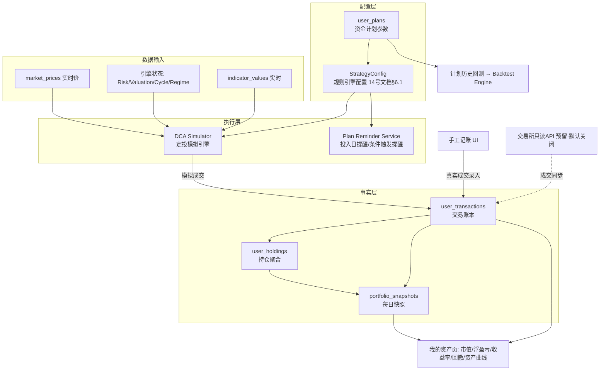
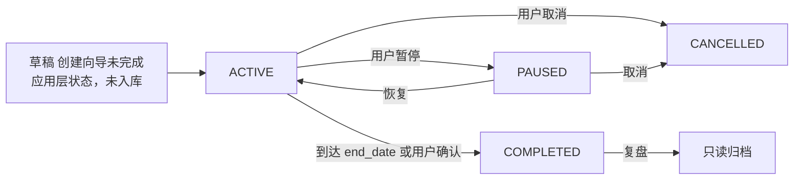
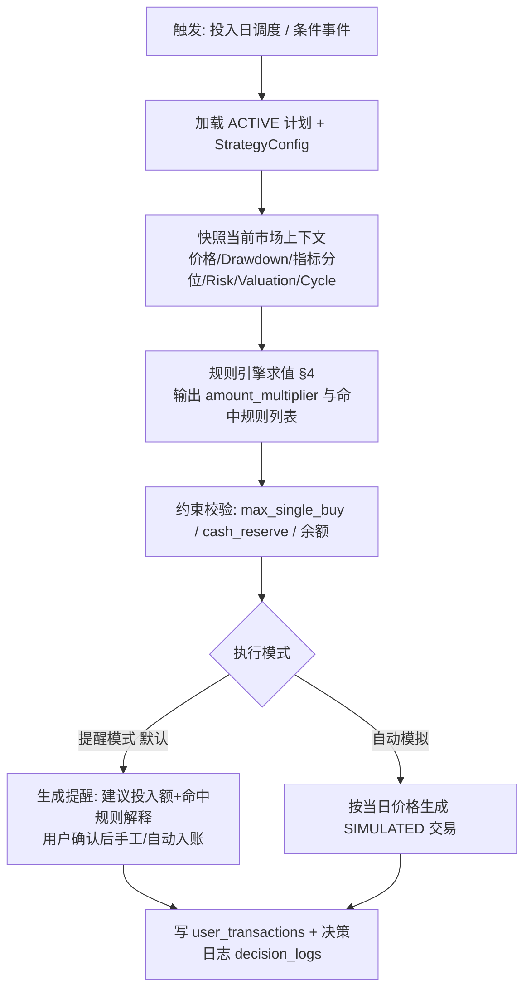

# 15. 个人资金计划架构（Portfolio Architecture）

> **文档定位**：定义个人资金计划（Plan）、资产账本（Ledger）、定投模拟引擎（DCA Simulator）、规则引擎（Rule Engine）与组合快照（Snapshot）的完整架构。
>
> **对应需求**：需求文档第二十~二十二节（资金计划/资产账本/定投模拟）、第四十七节（策略不是自动交易）、第五十二节验收条件 14~21。
>
> **相关文档**：规则配置与回测共用 → `14-backtest-architecture.md` §6；风险/估值/周期状态输入 → `13-model-architecture.md`；可引用指标条件集 → `12-indicator-dictionary.md`。

---

## 0. 总体原则

1. **只分析、只模拟、只提醒，不自动交易**（需求文档第四十七节）：本模块全部功能不接触任何交易所下单 API；预留的交易所接口仅限**只读**（同步持仓/成交到本地账本），默认关闭、单独授权、最小权限（读取-only API Key）、独立模块、可随时关闭；
2. **账本与计划分离**：Plan 是「将来打算怎么做」（前瞻配置），Ledger 是「实际发生了什么」（事实记录），两者通过模拟执行/手工记账关联，永不混淆；
3. **用户数据至高**：计划与账本数据仅依赖本地数据库，任何 Provider 失效不影响其完整性与可查性（第四十一节：用户的重要资产计划绝不能因为 API 失效而丢失）；
4. **回测同源**：定投模拟引擎与回测引擎（14 号文档）共用同一规则引擎与同一 StrategyConfig 格式——用户计划的历史回测、模拟执行、提醒判定三者行为一致；
5. **实时 vs 历史严格分离**：真实计划执行只用实时数据（as_of=None）；历史回测只用 PIT 数据；两者不共享查询路径（防泄漏，14 号文档 §2）。

### 0.1 模块关系



---

## 1. 资金计划模型（user_plans）

对应需求文档第二十节。

### 1.1 计划参数（字段定义）

| 字段 | 类型 | 默认 | 说明 |
|---|---|---|---|
| id / user_id | uuid | — | 归属用户 |
| name | varchar | — | 计划名称（如「十年 BTC 养老计划」） |
| status | enum | ACTIVE | ACTIVE / PAUSED / COMPLETED / CANCELLED（状态机见 §1.3） |
| initial_capital | numeric(18,2) | 0 | 初始资金（计划启动时一次性投入额，0 = 纯定投） |
| monthly_income | numeric(18,2) | null | 每月收入（仅用于投入比例建议与提示，不强制） |
| monthly_amount | numeric(18,2) | null | 每月投入金额 |
| weekly_amount | numeric(18,2) | null | 每周投入金额（与 monthly 可并存） |
| dca_period | enum | MONTHLY | WEEKLY / MONTHLY / BIWEEKLY |
| dca_day | int | 1 | 每月第 N 日（1~28）或每周第 N 天（1~7） |
| start_date / end_date | date | start=创建日 | 投资期限；end_date 可为空（无限期） |
| quote_currency | enum | CNY | CNY / USD |
| asset | varchar | BTC | 预留多币种扩展 |
| cash_reserve | numeric(18,2) | 0 | 现金储备下限：模拟买入不得使现金低于此值 |
| max_single_buy | numeric(18,2) | null | 最大单次投入上限（规则加仓后的封顶） |
| extra_buy_rules | jsonb | [] | 额外加仓规则 → StrategyConfig.rules（§4） |
| max_drawdown_tolerance | numeric(5,2) | -0.5 | 最大回撤容忍度（触发提示阈值，不自动卖出） |
| strategy_template | varchar | FIXED_DCA | 引用的策略模板（14 号文档 §6.2），可复制后自定义 |
| strategy_version | varchar | — | 关联 StrategyConfig 版本（不可变引用） |
| reminders_enabled | bool | true | 投入日/条件触发提醒开关 |
| created_at / updated_at / archived_at | timestamptz | — | |

### 1.2 多计划并行

- 一个用户可创建多个 ACTIVE 计划（如「长期定投」+「回调加仓弹药」），各计划独立账本视图；
- 交易记录必须归属唯一 plan_id（手工记账也强制选择计划），总资产页做跨计划聚合；
- 计划间资金隔离：cash_reserve / max_single_buy 按各自计划校验，不共享额度。

### 1.3 计划状态机



> **注**：DRAFT 为应用层状态（创建向导未完成），不写入数据库；仅当用户完成向导后才以 status=ACTIVE 写入 `user_plans` 表。数据库 ENUM `plan_status` 定义为：ACTIVE / PAUSED / COMPLETED / CANCELLED（详见 09-core-tables.md）。

- PAUSED：模拟器与提醒停止，已有账本与快照保留；
- COMPLETED/CANCELLED：只读归档，仍可回看全部历史与曲线，可「复制为新计划」；
- 状态变更写 audit_logs（谁、何时、原因）。

### 1.4 计划创建向导（产品要求）

三步：① 基础参数（金额/周期/期限/币种）→ ② 策略选择（模板 + 规则可视化预览，每条规则附普通用户解释）→ ③ 即时历史回测预览（调用 Backtest Engine 展示「如果过去 N 年执行此计划」的 §4.1 核心指标与资产曲线，标注非未来收益保证）。创建完成即生成 `user_plans` 行 + StrategyConfig 版本。

---

## 2. 资产账本（Ledger）

对应需求文档第二十一节。

### 2.1 交易记录（user_transactions）

> **字段映射说明**：下表为业务架构视角字段名，物理数据库字段详见 `09-core-tables.md`。主要映射：direction → side (trade_side ENUM)，executed_at → transaction_time，btc_amount → quantity_btc，quote_amount → amount，fee_asset → fee_currency。

| 字段 | 类型 | 说明 |
|---|---|---|
| id / user_id / plan_id | uuid | 归属 |
| source | enum | MANUAL（手工）/ SIMULATED（模拟执行）/ EXCHANGE_SYNC（预留，默认关闭） |
| direction | enum | BUY / SELL |
| executed_at | timestamptz | 成交时间 |
| price | numeric(18,2) | 成交价（quote_currency 计；外币成交附原币种与原币价格字段） |
| btc_amount | numeric(20,8) | BTC 数量（8 位小数，satoshi 精度） |
| quote_amount | numeric(18,2) | 法币金额（= price × btc_amount ± fee，口径字段注明 fee 是否含在内） |
| fee | numeric(18,2) | 手续费（quote 计） |
| fee_asset | enum | QUOTE / BTC |
| exchange / notes | varchar | 成交场所备注 / 用户备注 |
| fx_rate | numeric | 非 quote 币种成交时的汇率与汇率时间 |
| created_at / updated_at / deleted_at | timestamptz | 软删除（audit 保留） |
| checksum | varchar | 行内容哈希（防篡改审计） |

规则：账本**只增改留痕**——修改/删除交易生成新版本行并记录 audit_logs，历史快照（§5）不重算除非用户显式触发「重算历史」；SIMULATED 交易由定投模拟引擎产生（§3），与 MANUAL/EXCHANGE_SYNC 在所有汇总中默认分列展示（模拟 ≠ 真实持仓，UI 必须区分，可切换合并视图）。

### 2.2 持仓计算（user_holdings，物化聚合）

| 字段 | 计算口径 |
|---|---|
| total_invested | Σ(BUY.quote_amount) − Σ(SELL.quote_amount 中的本金回收部分)（口径：净投入法，SELL 按比例冲减投入，报告注明） |
| btc_balance | Σ(BUY.btc_amount) − Σ(SELL.btc_amount) |
| avg_cost | **DCA 方法**：Σ(买入 quote_amount 含费) / Σ(买入 btc_amount)；卖出采用「移动加权平均」——卖出不改变 avg_cost，仅减少余额（口径文档化，界面注明） |
| realized_pnl | Σ(SELL.quote_amount − 对应卖出份额 × avg_cost − fee) |

### 2.3 实时估值（查询时计算，不落库或短缓存）

| 指标 | 公式 |
|---|---|
| 当前市值 market_value | btc_balance × 最新价（quality_status 透传，STALE 时显示最后更新时间） |
| 浮动盈亏 unrealized_pnl | market_value − btc_balance × avg_cost |
| 累计收益 total_pnl | unrealized_pnl + realized_pnl |
| 收益率 total_return | total_pnl / total_invested |
| 最大回撤 | 基于 portfolio_snapshots 市值净值序列（§5）计算 |
| 今日/7D/30D 变化 | 快照差分 |

### 2.4 交易所 API 预留（默认关闭）

- 独立模块 `portfolio/exchange_sync/`，接口抽象 `ExchangeReadonlyAdapter`（get_balances / get_trade_history / get_deposit_withdrawal）；
- 安全约束（第四十七节逐条落实）：默认关闭；只接受只读权限 Key（连接时校验 Key 权限位，发现交易/提现权限直接拒绝保存）；单独授权流程（二次确认 + 风险提示）；Key 加密存储（应用层加密，密钥独立配置）；同步仅拉取成交与余额写入 `source=EXCHANGE_SYNC` 账本行；全部同步操作写 audit_logs；设置页一键断开即吊销本地凭据；
- **永不实现下单**：代码库中不存在任何 order/withdraw 调用路径（CI 静态检查禁止出现相关 SDK 方法引用）。

---

## 3. 定投模拟引擎（DCA Simulator）

对应需求文档第二十二节。职责：按计划的 StrategyConfig 在每个投入日（及条件触发日）计算「本期应投金额」，生成提醒与（用户确认或自动模拟模式下）SIMULATED 交易记录。

### 3.1 执行流水线



- **决策日志 decision_logs**：每次求值记录（plan_id, as_of, 市场上下文快照, 命中规则, 计算过程, 最终金额）——「为什么今天建议投 1.5 倍」全程可追溯；
- 执行模式默认「提醒模式」（符合第四十七节）；「自动模拟」仅生成 SIMULATED 账本行，绝不触达交易所；
- 价格来源：投入日按调度时刻的聚合参考价（多源中位数，quality_status 透传）；数据 STALE/不可用时**推迟执行并提示**，禁止用陈旧价格静默入账。

### 3.2 内置策略模式（全部可配置，默认参数 = 需求文档示例）

| 模式 | 默认规则（用户全部可调） |
|---|---|
| 固定定投 fixed | 每周/每月固定金额，无条件规则 |
| 下跌加仓 dip_ath | 距 ATH：−10% 内 ×1.0；−10%~−20% ×1.2；−20%~−30% ×1.5；−30%~−40% ×2.0；>−40% ×2.5（梯度表配置化） |
| 回撤加仓 dip_recent | 距近 N 日高点（默认 90）回撤达阈值梯度加仓（同上梯度结构，独立配置） |
| 估值加仓 value | MVRV 分位 <30% ×1.5；<15% ×2.0；NUPL <0.25 ×1.3（多条件 any/all 可组） |
| 风险调整 risk_adjust | Risk Overall：VERY_LOW ×1.3 / LOW ×1.2 / MODERATE ×1.0 / HIGH ×0.5 / VERY_HIGH ×0.3 / EXTREME ×0.2 |
| 周期调整 cycle_adjust | Cycle 阶段倍数表：BOTTOM_BUILDING ×1.5 / RECOVERY ×1.2 / UPTREND ×1.0 / ACCELERATION ×0.6 / DISTRIBUTION ×0.4 / TOP_RISK ×0.2 / 其余 ×1.0 |
| 自定义 custom | 用户在规则编辑器中自由组合（§4） |

组合语义：多模式叠加时，各模式 multiplier **连乘**后受 max_single_buy / cash_reserve 约束封顶；每条命中规则进入决策日志与用户提醒文案（普通用户解释模板：「今日建议投入 7,500 元 = 基础 5,000 × 1.5，原因：BTC 距历史高点回撤 32%（触发 −30% 档加仓）」）。

### 3.3 历史模拟（计划的「过去会怎样」）

创建/修改计划时的历史回测预览与「定投模拟」页的完整历史模拟，均委托 Backtest Engine（14 号文档）：StrategyConfig 直接作为回测策略输入，PIT 数据 + as-run 引擎状态；模拟结果与真实账本分列展示，报告附 §4.3 强制附注。

---

## 4. 规则引擎设计

与 14 号文档 §6.1 共用同一实现（`engines/base` 之外的公共库 `app/portfolio/rule_engine/`，回测与实盘模拟共同依赖），保证语义一致。

### 4.1 规则格式

```
IF <condition> THEN <action>    （每条规则携带 id、priority、enabled、普通用户解释文案）
```

### 4.2 条件类型（算子清单，版本化可扩展）

| 类别 | 算子 | 参数示例 |
|---|---|---|
| 价格条件 | price_above / price_below | {value: 60000} |
| 价格条件 | price_vs_ma | {ma: "sma200d", op: "below"} |
| 价格条件 | drawdown_from_ath | {lte: -0.30, gt: -0.40}（区间语义） |
| 价格条件 | drawdown_from_recent_high | {window: 90, lte: -0.20} |
| 指标条件 | indicator_value | {code: "onchain.mvrv", lte: 1.0} |
| 指标条件 | indicator_percentile | {code: "onchain.nupl", lte: 15, window: "FULL"} |
| 指标条件 | funding_annualized | {gte: 0.30} |
| 状态条件 | risk_level | {gte: "HIGH"}（有序枚举比较） |
| 状态条件 | valuation_state / cycle_stage / regime_label | {in: ["BOTTOM_BUILDING","RECOVERY"]} |
| 时间条件 | date_range | {from: "2026-01-01", to: "2026-12-31"} |
| 时间条件 | day_of_month / day_of_week | {eq: 1} |
| 组合条件 | all / any / not | 嵌套子条件（深度 ≤ 3，防配置失控） |

条件求值上下文（EvaluationContext）：当前价格、引擎最新状态、指标最新值/分位、计划自身状态（已投金额、现金余额、距上次投入天数）。上下文所有值携带 quality_status——**引用数据 STALE/缺失时该条件求值为 UNKNOWN**（处理见 §4.5）。

### 4.3 动作类型

| 动作 | 参数 | 语义 |
|---|---|---|
| multiply_amount | factor | 基础金额 × factor（多规则连乘） |
| fixed_amount | value | 覆盖为固定金额（与 multiply 互斥，见冲突解决） |
| extra_buy | value | 在当期之外立即追加一笔投入（一次性动作） |
| skip | — | 本期不投入（multiplier = 0） |
| pause | days / until_condition | 暂停计划 N 天或直至条件满足（需用户确认，不自动生效于真实提醒流） |
| notify_only | message | 仅提醒不改变金额（如「回撤超过容忍度，请注意风险」） |

### 4.4 优先级与冲突解决

1. **求值顺序**：规则按 priority 升序（数值小者先）求值；
2. **乘数类叠加**：multiply_amount 连乘（3.2 组合语义）；
3. **互斥类裁决**（fixed_amount / skip 与 multiplier 冲突）：
   - skip 优先级最高——任何 skip 命中即本期 0 投入，其余动作失效（但通知照常）；
   - fixed_amount 命中时覆盖累计乘数结果（后命中的 fixed 覆盖先前 fixed，以 priority 最大者为准）；
   - 同 priority 冲突：取「更保守」动作（投入更少者），并在决策日志标记 CONFLICT_RESOLVED 提示用户调整优先级；
4. **约束终审**：任何动作结果最终受 max_single_buy、cash_reserve、（可选）max_drawdown_tolerance 熔断约束裁剪——约束优先级高于一切规则；
5. 配置校验器：保存 StrategyConfig 时静态检测（不可达规则、恒真条件、循环 pause、优先级重复的互斥动作）并警告。

### 4.5 数据不可用时的行为（降级语义，强制）

| 条件引用数据状态 | 求值结果 | 行为 |
|---|---|---|
| VERIFIED / ESTIMATED | 正常 true/false | — |
| STALE（超期 <24h） | true/false + 警告 | 照常执行，提醒文案附「XX 数据延迟」 |
| STALE（超期 ≥24h）/ 缺失 | UNKNOWN | 该规则不生效（视同未命中），**基础定投照常执行**（定投纪律优先于条件失效），决策日志与提醒注明「XX 条件因数据不可用未参与判定」 |
| CONFLICT | UNKNOWN（同上） | 同上，附冲突详情链接 |

原则：**任何数据故障不得中断用户的基础定投**，也不得让故障数据静默触发加仓。

---

## 5. 组合快照（portfolio_snapshots）

### 5.1 表结构

| 字段 | 类型 | 说明 |
|---|---|---|
| user_id / plan_id | uuid | plan_id 可空（NULL = 用户级跨计划聚合行） |
| date | date | 快照日（每日 UTC 收盘后生成，主键 (user_id, plan_id, date)） |
| total_invested | numeric | 截至当日累计净投入 |
| btc_amount | numeric(20,8) | 截至当日持仓 |
| avg_cost | numeric | 截至当日移动平均成本 |
| market_value | numeric | 当日收盘市值 |
| price_used | numeric | 快照用价格（含 source_id 与 quality_status 冗余列，可追溯） |
| pnl / pnl_percentage | numeric | 累计收益（unrealized+realized）/ 收益率 |
| max_drawdown | numeric | 截至当日的历史最大回撤（滚动更新） |
| drawdown_current | numeric | 当日相对历史峰值的回撤 |
| simulated_flag | bool | 该快照是否仅含 SIMULATED 交易（模拟与真实分列） |
| created_at | timestamptz | |

### 5.2 生成与维护

- 每日任务 `portfolio_snapshot_daily`（UTC 收盘后，依赖当日价格任务完成；失败重试，缺口由补洞任务回填——回填行标记 `backfilled=true`）；
- 当日有交易时交易后立即追加/更新当日快照（保证曲线最新点准确）；
- 快照**只追加不修改**（除显式重算：账本更正后用户触发「重算历史」→ 生成新快照版本行，旧行保留并标记 superseded，audit 记录）；
- 资产曲线图数据 = 快照序列直出（前端不做重计算），支持区间缩放、与 BTC 价格曲线/投入成本线叠加、回撤带渲染、事件时间线标记（14 号文档 §4.2 同一图表组件）。

### 5.3 衍生服务

- 收益率/回撤/最佳最差月份等统计全部基于快照序列计算（口径与 14 号文档 §4.1 对齐：IRR 为主、TWRR 对照）；
- max_drawdown_tolerance 监控：每日快照生成后检查 drawdown_current ≤ 容忍度，突破时生成提醒（notify_only，不自动卖出——第四十七节）；
- 报告导出：计划月报（投入/成交/持仓/收益/命中规则统计/数据质量摘要），全部数字可溯源到账本行与快照行。

---

## 6. API 与页面映射（摘要）

| API | 页面 |
|---|---|
| POST/GET/PATCH /api/v1/plans | 我的计划（创建向导/列表/详情） |
| POST /api/v1/plans/{id}/pause·resume·complete·cancel | 计划操作 |
| GET /api/v1/plans/{id}/preview-backtest | 创建向导第③步 & 定投模拟页 |
| CRUD /api/v1/plans/{id}/strategy | 策略编辑器（规则可视化） |
| CRUD /api/v1/transactions | 我的资产（手工记账） |
| GET /api/v1/holdings /valuation | 我的资产（持仓/实时估值卡片） |
| GET /api/v1/snapshots?plan_id&from&to | 资产曲线图 |
| GET /api/v1/plans/{id}/decisions | 决策日志（「为什么今天建议投这么多」） |
| （预留）POST /api/v1/exchange-connections | 数据源中心-交易所只读连接（默认隐藏开关） |

权限：全部接口 user 级隔离；管理端仅可见脱敏统计（活跃计划数、模拟交易总量），不可见个人金额明细（权限设计文档约束）。
