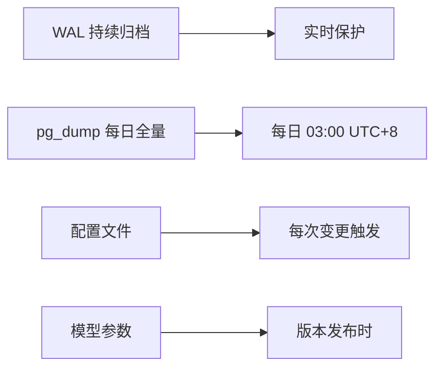
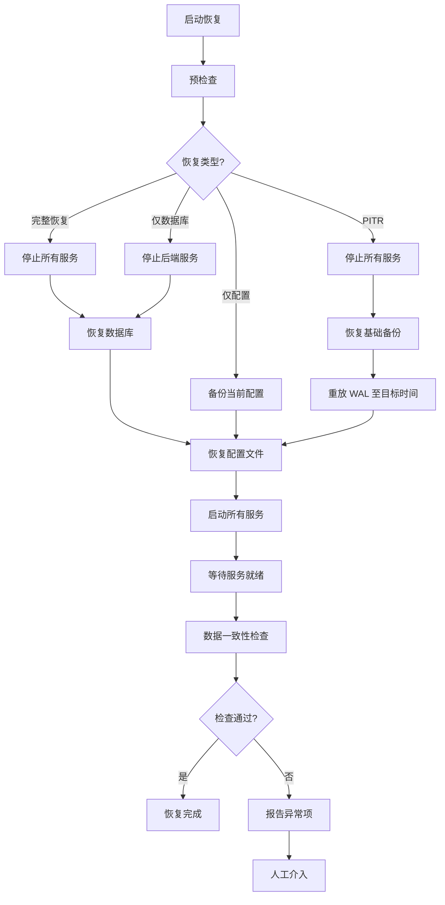

# 备份恢复设计

> **文档编号**: 20  
> **版本**: 1.0  
> **状态**: Draft  
> **最后更新**: 2026-09-27

## 概述

BTC 全市场智能研究平台目标运行 5-10 年以上，数据是最核心的资产。本文档定义完整的备份与恢复策略，确保在硬件故障、数据损坏、误操作或灾难场景下能够快速恢复系统运行，且历史数据零丢失。

**设计原则**：
- 自动化：所有备份通过脚本定时执行，无需人工干预
- 可验证：定期恢复验证备份完整性
- 分层保留：短期密集、长期稀疏，兼顾存储成本与恢复粒度
- 加密安全：敏感配置加密存储

---

## 目录

1. [备份策略总览](#1-备份策略总览)
2. [数据库备份](#2-数据库备份)
3. [配置备份](#3-配置备份)
4. [模型与用户数据备份](#4-模型与用户数据备份)
5. [一键恢复流程](#5-一键恢复流程)
6. [备份监控](#6-备份监控)

---

## 1. 备份策略总览

### 1.1 备份对象

| 类别 | 具体内容 | 重要性 | 备份方式 |
|------|---------|--------|---------|
| 数据库 | PostgreSQL + TimescaleDB 全量数据 | ★★★★★ | pg_dump + WAL 归档 |
| 环境配置 | `.env` 文件 | ★★★★ | 加密备份 |
| Provider 配置 | Provider YAML/JSON 定义、优先级、API Key 引用 | ★★★★ | 版本化备份 |
| Docker 编排 | `docker-compose.yml`、Nginx 配置 | ★★★ | Git + 本地备份 |
| 模型参数 | 模型权重、版本信息、训练参数 | ★★★★ | 导出至文件 |
| 用户数据 | 计划、交易记录、持仓快照 | ★★★★★ | 随数据库备份 |
| 回测结果 | 回测运行记录、策略配置 | ★★★ | 随数据库备份 |
| 指标定义 | 自定义指标公式与参数 | ★★★ | 随数据库备份 |

### 1.2 备份频率



| 备份类型 | 频率 | 触发方式 |
|---------|------|---------|
| WAL 归档 | 持续（每段 WAL 写满即归档） | PostgreSQL 自动 |
| 数据库全量 | 每日 03:00 | cron / APScheduler |
| 配置文件 | 变更后 5 分钟内 | inotifywait / 手动 |
| 模型参数 | 新版本创建时 | 应用层触发 |
| 完整系统备份 | 每周日 04:00 | cron |

### 1.3 备份存储

```
/opt/btc-platform/backups/
├── database/
│   ├── daily/          # 每日全量备份
│   ├── weekly/         # 每周全量备份
│   ├── monthly/        # 每月全量备份
│   └── wal/            # WAL 归档文件
├── config/
│   ├── env/            # 加密 .env 备份
│   ├── providers/      # Provider 配置
│   └── docker/         # Docker Compose / Nginx
├── models/
│   └── versions/       # 模型参数快照
└── metadata/
    └── backup_log.json # 备份日志
```

**远程存储（可选）**：
- 通过 `rclone` 同步至对象存储（S3/OSS/B2）
- 加密后传输
- 配置独立的远程保留策略

### 1.4 保留策略

| 备份类型 | 保留时长 | 说明 |
|---------|---------|------|
| 每日全量 | 30 天 | 超过 30 天自动删除 |
| 每周全量 | 1 年 | 每周日备份保留 52 份 |
| 每月全量 | 永久 | 每月 1 号备份永不删除 |
| WAL 归档 | 7 天 | 支持 7 天内任意时间点恢复 |
| 配置备份 | 最近 100 个版本 | 滚动保留 |
| 模型参数 | 永久 | 所有版本保留 |

### 1.5 清理策略脚本

```bash
#!/bin/bash
# backup_cleanup.sh - 按保留策略清理过期备份

BACKUP_DIR="/opt/btc-platform/backups"

# 清理超过30天的每日备份
find "$BACKUP_DIR/database/daily" -name "*.sql.gz" -mtime +30 -delete

# 清理超过365天的每周备份
find "$BACKUP_DIR/database/weekly" -name "*.sql.gz" -mtime +365 -delete

# 清理超过7天的WAL归档
find "$BACKUP_DIR/database/wal" -name "*.gz" -mtime +7 -delete

# 每月备份 - 永不清理

echo "[$(date -Iseconds)] 备份清理完成" >> "$BACKUP_DIR/metadata/cleanup.log"
```

---

## 2. 数据库备份

### 2.1 pg_dump 定时全量备份

#### 备份脚本

```bash
#!/bin/bash
# db_backup.sh - PostgreSQL 全量备份脚本
set -euo pipefail

# ===== 配置 =====
BACKUP_ROOT="/opt/btc-platform/backups/database"
TIMESTAMP=$(date +%Y%m%d_%H%M%S)
DAY_OF_WEEK=$(date +%u)  # 1=Monday, 7=Sunday
DAY_OF_MONTH=$(date +%d)
CONTAINER_NAME="btc_postgres"
DB_NAME="${POSTGRES_DB:-btc_platform}"
DB_USER="${POSTGRES_USER:-btc_admin}"
COMPRESSION="zstd"  # zstd 或 gzip

# ===== 确定存储目录 =====
if [ "$DAY_OF_MONTH" = "01" ]; then
    BACKUP_DIR="$BACKUP_ROOT/monthly"
elif [ "$DAY_OF_WEEK" = "7" ]; then
    BACKUP_DIR="$BACKUP_ROOT/weekly"
else
    BACKUP_DIR="$BACKUP_ROOT/daily"
fi

mkdir -p "$BACKUP_DIR"

# ===== 执行备份 =====
BACKUP_FILE="$BACKUP_DIR/btc_platform_${TIMESTAMP}.sql"

echo "[$(date -Iseconds)] 开始数据库备份: $BACKUP_FILE"

# 使用 pg_dump 自定义格式（支持并行恢复）
docker exec "$CONTAINER_NAME" pg_dump \
    -U "$DB_USER" \
    -d "$DB_NAME" \
    --format=custom \
    --compress=9 \
    --no-owner \
    --no-privileges \
    --verbose \
    > "${BACKUP_FILE}.dump"

# ===== 压缩 =====
if [ "$COMPRESSION" = "zstd" ]; then
    zstd -19 --rm "${BACKUP_FILE}.dump"
    FINAL_FILE="${BACKUP_FILE}.dump.zst"
else
    gzip -9 "${BACKUP_FILE}.dump"
    FINAL_FILE="${BACKUP_FILE}.dump.gz"
fi

# ===== 生成校验和 =====
sha256sum "$FINAL_FILE" > "${FINAL_FILE}.sha256"

# ===== 记录元数据 =====
FILE_SIZE=$(stat -f%z "$FINAL_FILE" 2>/dev/null || stat -c%s "$FINAL_FILE")
cat >> "$BACKUP_ROOT/../metadata/backup_log.json" << EOF
{
  "timestamp": "$(date -Iseconds)",
  "type": "full_dump",
  "file": "$FINAL_FILE",
  "size_bytes": $FILE_SIZE,
  "compression": "$COMPRESSION",
  "status": "success"
}
EOF

echo "[$(date -Iseconds)] 备份完成: $FINAL_FILE ($FILE_SIZE bytes)"
```

#### Cron 定时任务

```crontab
# /etc/cron.d/btc-platform-backup
# 每日 03:00 执行全量备份
0 3 * * * btc /opt/btc-platform/scripts/backup/db_backup.sh >> /var/log/btc-backup.log 2>&1

# 每日 03:30 执行配置备份
30 3 * * * btc /opt/btc-platform/scripts/backup/config_backup.sh >> /var/log/btc-backup.log 2>&1

# 每日 04:00 执行备份清理
0 4 * * * btc /opt/btc-platform/scripts/backup/backup_cleanup.sh >> /var/log/btc-backup.log 2>&1

# 每周日 05:00 验证最近备份
0 5 * * 0 btc /opt/btc-platform/scripts/backup/verify_backup.sh >> /var/log/btc-backup.log 2>&1
```

### 2.2 WAL 归档实现 PITR

#### PostgreSQL 配置

```ini
# postgresql.conf (通过 Docker volume 挂载)
wal_level = replica
archive_mode = on
archive_command = 'test ! -f /var/lib/postgresql/wal_archive/%f && cp %p /var/lib/postgresql/wal_archive/%f'
archive_timeout = 300  # 最长5分钟强制归档一次

# 恢复相关
restore_command = 'cp /var/lib/postgresql/wal_archive/%f %p'
recovery_target_time = ''  # PITR 时设置目标时间
recovery_target_action = 'promote'
```

#### Docker Compose WAL 归档配置

```yaml
# docker-compose.yml 中 postgres 服务补充
services:
  postgres:
    volumes:
      - postgres_data:/var/lib/postgresql/data
      - wal_archive:/var/lib/postgresql/wal_archive
      - ./docker/postgres/postgresql.conf:/etc/postgresql/postgresql.conf
    command: postgres -c config_file=/etc/postgresql/postgresql.conf

volumes:
  wal_archive:
    driver: local
```

#### PITR 恢复流程

```bash
#!/bin/bash
# pitr_restore.sh - 时间点恢复
# 用法: ./pitr_restore.sh "2026-09-25 14:30:00+08"

TARGET_TIME="${1:?用法: $0 '2026-09-25 14:30:00+08'}"
BACKUP_ROOT="/opt/btc-platform/backups/database"
DATA_DIR="/var/lib/postgresql/data"
WAL_DIR="/var/lib/postgresql/wal_archive"

echo "=== PITR 恢复至: $TARGET_TIME ==="

# 1. 停止 PostgreSQL
docker compose stop postgres

# 2. 找到目标时间之前最近的全量备份
LATEST_BACKUP=$(find "$BACKUP_ROOT" -name "*.dump.zst" -newer "$BACKUP_ROOT/../metadata/pitr_marker" | sort | head -1)
if [ -z "$LATEST_BACKUP" ]; then
    LATEST_BACKUP=$(ls -t "$BACKUP_ROOT"/daily/*.dump.zst "$BACKUP_ROOT"/weekly/*.dump.zst 2>/dev/null | head -1)
fi

echo "使用基础备份: $LATEST_BACKUP"

# 3. 清空数据目录并恢复基础备份
docker run --rm \
    -v postgres_data:/var/lib/postgresql/data \
    -v "$(dirname "$LATEST_BACKUP")":/backup \
    timescale/timescaledb:latest-pg16 \
    bash -c "
        rm -rf /var/lib/postgresql/data/*
        pg_restore -U btc_admin -d btc_platform --clean /backup/$(basename "$LATEST_BACKUP")
    "

# 4. 配置 recovery
docker run --rm \
    -v postgres_data:/var/lib/postgresql/data \
    alpine \
    sh -c "cat > /var/lib/postgresql/data/recovery.signal && \
           echo \"restore_command = 'cp $WAL_DIR/%f %p'\" >> /var/lib/postgresql/data/postgresql.auto.conf && \
           echo \"recovery_target_time = '$TARGET_TIME'\" >> /var/lib/postgresql/data/postgresql.auto.conf && \
           echo \"recovery_target_action = 'promote'\" >> /var/lib/postgresql/data/postgresql.auto.conf"

# 5. 启动 PostgreSQL 执行恢复
docker compose start postgres

echo "等待 WAL 恢复完成..."
sleep 30

# 6. 验证恢复结果
docker exec btc_postgres psql -U btc_admin -d btc_platform -c "SELECT now(), count(*) FROM market_prices;"

echo "=== PITR 恢复完成 ==="
```

### 2.3 TimescaleDB 特殊考虑

#### Hypertable 备份注意事项

| 特性 | 备份影响 | 处理方式 |
|------|---------|---------|
| Hypertable 分区 | 普通 pg_dump 可导出，但恢复需要重新创建 | 使用 `--section=pre-data` 先恢复 schema |
| Continuous Aggregates | 定义随 schema 导出，数据可重建 | 恢复后执行 `CALL refresh_continuous_aggregate(...)` |
| Compression | 压缩后的 chunk 备份体积更小 | 正常备份即可 |
| Retention Policies | 策略定义随 schema 导出 | 恢复后验证策略是否生效 |

#### TimescaleDB 备份顺序

```bash
# 1. 备份 schema（包含扩展、hypertable 定义、continuous aggregate 定义）
docker exec btc_postgres pg_dump -U btc_admin -d btc_platform \
    --schema-only --no-owner > schema_backup.sql

# 2. 备份数据（使用自定义格式，支持选择性恢复）
docker exec btc_postgres pg_dump -U btc_admin -d btc_platform \
    --format=custom --compress=9 > full_backup.dump

# 3. 导出 TimescaleDB 元数据（hypertable 列表、压缩状态、策略）
docker exec btc_postgres psql -U btc_admin -d btc_platform -c "
    SELECT * FROM timescaledb_information.hypertables;
    SELECT * FROM timescaledb_information.compression_settings;
    SELECT * FROM timescaledb_information.jobs;
" > timescale_metadata.txt
```

#### 恢复后重建 Continuous Aggregates

```sql
-- 恢复后刷新所有 continuous aggregates
DO $$
DECLARE
    r RECORD;
BEGIN
    FOR r IN SELECT view_name FROM timescaledb_information.continuous_aggregates
    LOOP
        EXECUTE format('CALL refresh_continuous_aggregate(%L, NULL, NULL)', r.view_name);
        RAISE NOTICE 'Refreshed: %', r.view_name;
    END LOOP;
END $$;
```

### 2.4 备份压缩

| 算法 | 压缩率 | 速度 | 推荐场景 |
|------|--------|------|---------|
| gzip -9 | ~4:1 | 中等 | 通用默认 |
| zstd -19 | ~5:1 | 快 | 推荐生产使用 |
| lz4 | ~3:1 | 极快 | WAL 归档 |
| 无压缩 | 1:1 | 最快 | 调试/临时 |

**推荐配置**：数据库全量使用 `zstd -19`，WAL 归档使用 `lz4`。

### 2.5 备份验证

```bash
#!/bin/bash
# verify_backup.sh - 定期验证备份完整性
set -euo pipefail

BACKUP_ROOT="/opt/btc-platform/backups/database"
VERIFY_DB="btc_verify_$(date +%s)"

echo "=== 备份验证开始 ==="

# 1. 获取最新备份
LATEST=$(ls -t "$BACKUP_ROOT"/daily/*.dump.zst 2>/dev/null | head -1)
if [ -z "$LATEST" ]; then
    echo "ERROR: 未找到可用备份"
    exit 1
fi

echo "验证备份文件: $LATEST"

# 2. 校验 SHA256
echo "检查校验和..."
sha256sum -c "${LATEST}.sha256"
if [ $? -ne 0 ]; then
    echo "ERROR: 校验和不匹配，备份可能已损坏"
    exit 1
fi

# 3. 解压验证
echo "解压验证..."
TEMP_FILE=$(mktemp)
zstd -d "$LATEST" -o "$TEMP_FILE"

# 4. 在临时数据库中恢复
echo "创建验证数据库..."
docker exec btc_postgres psql -U btc_admin -c "CREATE DATABASE $VERIFY_DB;"

echo "恢复至验证数据库..."
docker exec -i btc_postgres pg_restore -U btc_admin -d "$VERIFY_DB" < "$TEMP_FILE"

# 5. 执行完整性检查
echo "数据完整性检查..."
docker exec btc_postgres psql -U btc_admin -d "$VERIFY_DB" -c "
    SELECT
        (SELECT count(*) FROM information_schema.tables WHERE table_schema='public') as tables,
        (SELECT count(*) FROM timescaledb_information.hypertables) as hypertables;
"

# 6. 清理
docker exec btc_postgres psql -U btc_admin -c "DROP DATABASE $VERIFY_DB;"
rm -f "$TEMP_FILE"

echo "=== 备份验证通过 ==="
```

---

## 3. 配置备份

### 3.1 .env 文件加密备份

```bash
#!/bin/bash
# config_backup.sh - 配置文件加密备份
set -euo pipefail

PLATFORM_DIR="/opt/btc-platform"
BACKUP_DIR="$PLATFORM_DIR/backups/config"
TIMESTAMP=$(date +%Y%m%d_%H%M%S)
ENCRYPTION_KEY_FILE="$PLATFORM_DIR/.backup_key"  # 64字符hex密钥

mkdir -p "$BACKUP_DIR/env" "$BACKUP_DIR/providers" "$BACKUP_DIR/docker"

# ===== .env 加密备份 =====
if [ -f "$PLATFORM_DIR/.env" ]; then
    # 使用 age 加密（或 openssl 作为后备）
    if command -v age &> /dev/null; then
        age -r "$(cat "$ENCRYPTION_KEY_FILE")" \
            -o "$BACKUP_DIR/env/env_${TIMESTAMP}.age" \
            "$PLATFORM_DIR/.env"
    else
        openssl enc -aes-256-cbc -salt -pbkdf2 \
            -in "$PLATFORM_DIR/.env" \
            -out "$BACKUP_DIR/env/env_${TIMESTAMP}.enc" \
            -pass "file:$ENCRYPTION_KEY_FILE"
    fi
    echo "[$TIMESTAMP] .env 加密备份完成"
fi

# ===== Provider 配置备份 =====
if [ -d "$PLATFORM_DIR/backend/config/providers" ]; then
    tar -czf "$BACKUP_DIR/providers/providers_${TIMESTAMP}.tar.gz" \
        -C "$PLATFORM_DIR/backend/config" providers/
fi

# ===== Docker 配置备份 =====
tar -czf "$BACKUP_DIR/docker/docker_${TIMESTAMP}.tar.gz" \
    -C "$PLATFORM_DIR" \
    docker-compose.yml \
    docker-compose.dev.yml \
    docker/nginx/ \
    docker/postgres/ \
    Makefile \
    2>/dev/null || true

# ===== 保留最近100个配置备份 =====
ls -t "$BACKUP_DIR/env/"* 2>/dev/null | tail -n +101 | xargs -r rm -f
ls -t "$BACKUP_DIR/providers/"* 2>/dev/null | tail -n +101 | xargs -r rm -f

echo "[$(date -Iseconds)] 配置备份完成"
```

### 3.2 Provider 配置版本化

Provider 配置采用 Git 管理 + 本地快照双重保障：

```
backend/config/providers/
├── market/
│   ├── binance.yaml
│   ├── coinbase.yaml
│   ├── kraken.yaml
│   └── okx.yaml
├── onchain/
│   ├── glassnode.yaml
│   └── cryptoquant.yaml
├── etf/
│   └── farside.yaml
├── derivatives/
│   └── coinglass.yaml
├── macro/
│   └── fred.yaml
└── sentiment/
    └── alternative_me.yaml
```

**Provider YAML 示例**：
```yaml
# backend/config/providers/market/binance.yaml
provider:
  name: binance
  category: market
  enabled: true
  priority: 1
  
connection:
  base_url: "https://api.binance.com"
  timeout: 10
  retry_count: 3
  retry_backoff: exponential
  proxy: null  # 或 "http://proxy:port"
  
auth:
  type: api_key
  key_env: PROVIDER_BINANCE_KEY  # 从环境变量读取，不存储明文
  
health:
  check_interval: 60
  failure_threshold: 3
  recovery_threshold: 5
  rate_limit:
    requests_per_minute: 1200
    burst: 100
```

### 3.3 Docker Compose 配置备份

所有编排配置通过 Git 管理，同时在备份目录保留当前运行版本的快照：

```bash
# 记录当前运行的镜像版本
docker compose ps --format json > "$BACKUP_DIR/docker/running_containers_${TIMESTAMP}.json"
docker images --format "{{.Repository}}:{{.Tag}} {{.ID}}" > "$BACKUP_DIR/docker/images_${TIMESTAMP}.txt"
```

---

## 4. 模型与用户数据备份

### 4.1 模型参数/权重导出

```python
# backend/app/services/model_backup.py
"""模型参数备份服务"""

import json
from datetime import datetime
from pathlib import Path

import numpy as np


class ModelBackupService:
    """模型参数导出与备份"""
    
    BACKUP_DIR = Path("/opt/btc-platform/backups/models/versions")
    
    async def export_model(self, model_id: str, version: str) -> Path:
        """导出模型参数到文件"""
        model_dir = self.BACKUP_DIR / f"{model_id}_v{version}"
        model_dir.mkdir(parents=True, exist_ok=True)
        
        # 导出模型元数据
        metadata = {
            "model_id": model_id,
            "version": version,
            "exported_at": datetime.utcnow().isoformat(),
            "training_period": {},  # 从数据库读取
            "parameters": {},       # 模型超参数
            "metrics": {},          # 训练/验证指标
        }
        
        # 导出权重（numpy格式）
        # weights = await self._load_weights(model_id, version)
        # np.savez_compressed(model_dir / "weights.npz", **weights)
        
        # 导出元数据
        with open(model_dir / "metadata.json", "w") as f:
            json.dump(metadata, f, indent=2, ensure_ascii=False)
        
        return model_dir
    
    async def list_backups(self) -> list[dict]:
        """列出所有模型备份"""
        backups = []
        for d in sorted(self.BACKUP_DIR.iterdir()):
            if d.is_dir():
                meta_file = d / "metadata.json"
                if meta_file.exists():
                    with open(meta_file) as f:
                        backups.append(json.load(f))
        return backups
```

### 4.2 用户数据备份范围

用户数据作为数据库的一部分，随每日全量备份一并保存。以下表为关键用户数据：

| 表名 | 内容 | 恢复优先级 |
|------|------|-----------|
| `user_plans` | 用户资金计划配置 | 最高 |
| `user_transactions` | 买入/卖出记录 | 最高 |
| `user_holdings` | 当前持仓状态 | 高 |
| `portfolio_snapshots` | 资产快照历史 | 高 |
| `backtest_runs` | 回测配置与参数 | 中 |
| `backtest_results` | 回测计算结果 | 中（可重算） |

### 4.3 指标定义备份

```sql
-- 导出指标定义（可通过 pg_dump 的 --table 参数单独备份）
-- 包含自定义指标公式、参数、数据源映射
COPY (
    SELECT 
        id, name, category, formula, parameters,
        data_sources, created_at, updated_at, version
    FROM indicator_definitions
    ORDER BY category, name
) TO '/tmp/indicator_definitions.csv' WITH CSV HEADER;
```

### 4.4 选择性导出脚本

```bash
#!/bin/bash
# export_user_data.sh - 单独导出用户关键数据
# 用于迁移或灾难恢复时优先恢复用户数据

TIMESTAMP=$(date +%Y%m%d_%H%M%S)
OUTPUT_DIR="/opt/btc-platform/backups/user_data/$TIMESTAMP"
mkdir -p "$OUTPUT_DIR"

TABLES=(
    "user_plans"
    "user_transactions" 
    "user_holdings"
    "portfolio_snapshots"
    "indicator_definitions"
    "model_versions"
    "model_weights"
)

for TABLE in "${TABLES[@]}"; do
    docker exec btc_postgres pg_dump \
        -U btc_admin -d btc_platform \
        --table="$TABLE" \
        --format=custom \
        > "$OUTPUT_DIR/${TABLE}.dump"
    echo "导出完成: $TABLE"
done

# 生成清单
ls -la "$OUTPUT_DIR" > "$OUTPUT_DIR/manifest.txt"
echo "[$TIMESTAMP] 用户数据导出完成: $OUTPUT_DIR"
```

---

## 5. 一键恢复流程

### 5.1 restore.sh 脚本设计

```bash
#!/bin/bash
# =============================================================
# restore.sh - BTC 平台一键恢复脚本
# 用法:
#   ./restore.sh                    # 交互式恢复（最新备份）
#   ./restore.sh --latest           # 自动恢复最新备份
#   ./restore.sh --file <path>      # 从指定备份文件恢复
#   ./restore.sh --time "2026-09-25 14:30:00+08"  # PITR恢复
#   ./restore.sh --only config      # 只恢复配置
#   ./restore.sh --only database    # 只恢复数据库
#   ./restore.sh --dry-run          # 模拟运行，不实际恢复
# =============================================================
set -euo pipefail

# ===== 配置 =====
PLATFORM_DIR="/opt/btc-platform"
BACKUP_ROOT="$PLATFORM_DIR/backups"
COMPOSE_FILE="$PLATFORM_DIR/docker-compose.yml"
LOG_FILE="$BACKUP_ROOT/metadata/restore_$(date +%Y%m%d_%H%M%S).log"

# ===== 颜色输出 =====
RED='\033[0;31m'
GREEN='\033[0;32m'
YELLOW='\033[1;33m'
NC='\033[0m'

log() { echo -e "[$(date -Iseconds)] $1" | tee -a "$LOG_FILE"; }
info() { log "${GREEN}INFO${NC}: $1"; }
warn() { log "${YELLOW}WARN${NC}: $1"; }
error() { log "${RED}ERROR${NC}: $1"; exit 1; }

# ===== 参数解析 =====
MODE="interactive"
TARGET_FILE=""
TARGET_TIME=""
ONLY=""
DRY_RUN=false

while [[ $# -gt 0 ]]; do
    case $1 in
        --latest) MODE="latest"; shift ;;
        --file) TARGET_FILE="$2"; MODE="file"; shift 2 ;;
        --time) TARGET_TIME="$2"; MODE="pitr"; shift 2 ;;
        --only) ONLY="$2"; shift 2 ;;
        --dry-run) DRY_RUN=true; shift ;;
        *) error "未知参数: $1" ;;
    esac
done

# ===== 预检查 =====
preflight_check() {
    info "执行预检查..."
    
    # 检查 Docker
    command -v docker &> /dev/null || error "Docker 未安装"
    docker info &> /dev/null || error "Docker 未运行"
    
    # 检查磁盘空间（至少需要备份文件3倍空间）
    local available_kb=$(df -k "$PLATFORM_DIR" | tail -1 | awk '{print $4}')
    local available_gb=$((available_kb / 1024 / 1024))
    if [ "$available_gb" -lt 5 ]; then
        error "磁盘空间不足（可用: ${available_gb}GB，需要至少 5GB）"
    fi
    
    info "预检查通过 (可用磁盘: ${available_gb}GB)"
}

# ===== 查找备份文件 =====
find_backup() {
    case $MODE in
        latest)
            TARGET_FILE=$(ls -t "$BACKUP_ROOT"/database/daily/*.dump.zst \
                          "$BACKUP_ROOT"/database/weekly/*.dump.zst \
                          "$BACKUP_ROOT"/database/monthly/*.dump.zst 2>/dev/null | head -1)
            [ -z "$TARGET_FILE" ] && error "未找到可用备份文件"
            ;;
        interactive)
            echo ""
            echo "可用备份列表:"
            echo "=============="
            local i=1
            while IFS= read -r f; do
                local size=$(stat -c%s "$f" 2>/dev/null || stat -f%z "$f")
                local size_mb=$((size / 1024 / 1024))
                local date_part=$(basename "$f" | grep -oP '\d{8}_\d{6}')
                echo "  [$i] $date_part (${size_mb}MB) - $f"
                BACKUP_LIST[$i]="$f"
                ((i++))
            done < <(ls -t "$BACKUP_ROOT"/database/{daily,weekly,monthly}/*.dump.zst 2>/dev/null | head -10)
            
            echo ""
            read -p "选择备份编号 [1]: " choice
            choice=${choice:-1}
            TARGET_FILE="${BACKUP_LIST[$choice]}"
            [ -z "$TARGET_FILE" ] && error "无效选择"
            ;;
        file)
            [ ! -f "$TARGET_FILE" ] && error "备份文件不存在: $TARGET_FILE"
            ;;
    esac
    
    info "使用备份: $TARGET_FILE"
}

# ===== 停止服务 =====
stop_services() {
    info "停止所有服务..."
    if [ "$DRY_RUN" = true ]; then
        warn "[DRY RUN] 跳过停止服务"
        return
    fi
    cd "$PLATFORM_DIR"
    docker compose down --remove-orphans
    info "服务已停止"
}

# ===== 恢复数据库 =====
restore_database() {
    info "恢复数据库..."
    if [ "$DRY_RUN" = true ]; then
        warn "[DRY RUN] 跳过数据库恢复"
        return
    fi
    
    # 启动 PostgreSQL
    docker compose up -d postgres
    sleep 10
    
    # 等待 PostgreSQL 就绪
    until docker exec btc_postgres pg_isready -U btc_admin &> /dev/null; do
        sleep 2
    done
    
    # 解压并恢复
    local TEMP_DUMP=$(mktemp)
    zstd -d "$TARGET_FILE" -o "$TEMP_DUMP"
    
    # 删除并重建数据库
    docker exec btc_postgres psql -U btc_admin -c "
        SELECT pg_terminate_backend(pid) FROM pg_stat_activity 
        WHERE datname='btc_platform' AND pid <> pg_backend_pid();
    "
    docker exec btc_postgres dropdb -U btc_admin --if-exists btc_platform
    docker exec btc_postgres createdb -U btc_admin btc_platform
    
    # 恢复
    docker exec -i btc_postgres pg_restore \
        -U btc_admin -d btc_platform \
        --no-owner --no-privileges \
        < "$TEMP_DUMP"
    
    rm -f "$TEMP_DUMP"
    info "数据库恢复完成"
}

# ===== 恢复配置 =====
restore_config() {
    info "恢复配置文件..."
    if [ "$DRY_RUN" = true ]; then
        warn "[DRY RUN] 跳过配置恢复"
        return
    fi
    
    # 恢复最新的 .env
    local LATEST_ENV=$(ls -t "$BACKUP_ROOT"/config/env/*.age 2>/dev/null | head -1)
    if [ -n "$LATEST_ENV" ]; then
        age -d -i "$PLATFORM_DIR/.backup_key" "$LATEST_ENV" > "$PLATFORM_DIR/.env"
        info ".env 已恢复"
    fi
    
    # 恢复 Provider 配置
    local LATEST_PROVIDERS=$(ls -t "$BACKUP_ROOT"/config/providers/*.tar.gz 2>/dev/null | head -1)
    if [ -n "$LATEST_PROVIDERS" ]; then
        tar -xzf "$LATEST_PROVIDERS" -C "$PLATFORM_DIR/backend/config/"
        info "Provider 配置已恢复"
    fi
}

# ===== 启动服务 =====
start_services() {
    info "启动所有服务..."
    if [ "$DRY_RUN" = true ]; then
        warn "[DRY RUN] 跳过启动服务"
        return
    fi
    cd "$PLATFORM_DIR"
    docker compose up -d
    info "等待服务就绪..."
    sleep 15
}

# ===== 恢复后验证 =====
post_restore_verify() {
    info "执行恢复后验证..."
    if [ "$DRY_RUN" = true ]; then
        warn "[DRY RUN] 跳过验证"
        return
    fi
    
    local ERRORS=0
    
    # 检查容器状态
    local RUNNING=$(docker compose ps --format json | grep -c '"running"' || true)
    info "运行中容器数: $RUNNING"
    
    # 检查数据库连接
    if docker exec btc_postgres pg_isready -U btc_admin &> /dev/null; then
        info "✓ 数据库连接正常"
    else
        error "✗ 数据库连接失败"
        ((ERRORS++))
    fi
    
    # 检查关键表
    local TABLE_COUNT=$(docker exec btc_postgres psql -U btc_admin -d btc_platform -t -c \
        "SELECT count(*) FROM information_schema.tables WHERE table_schema='public';")
    info "✓ 公共表数量: $TABLE_COUNT"
    
    # 检查 TimescaleDB
    local HT_COUNT=$(docker exec btc_postgres psql -U btc_admin -d btc_platform -t -c \
        "SELECT count(*) FROM timescaledb_information.hypertables;")
    info "✓ Hypertable 数量: $HT_COUNT"
    
    # 检查数据行数
    local ROW_COUNT=$(docker exec btc_postgres psql -U btc_admin -d btc_platform -t -c \
        "SELECT sum(n_live_tup) FROM pg_stat_user_tables;")
    info "✓ 总数据行数: $ROW_COUNT"
    
    # 检查 Redis
    if docker exec btc_redis redis-cli -a "${REDIS_PASSWORD:-changeme}" ping | grep -q PONG; then
        info "✓ Redis 连接正常"
    else
        warn "✗ Redis 连接失败"
        ((ERRORS++))
    fi
    
    # 检查后端 API
    if curl -sf http://localhost:8000/api/v1/system/health > /dev/null 2>&1; then
        info "✓ 后端 API 正常"
    else
        warn "✗ 后端 API 无响应"
        ((ERRORS++))
    fi
    
    if [ $ERRORS -eq 0 ]; then
        info "=== 恢复验证全部通过 ==="
    else
        warn "=== 恢复完成，但有 $ERRORS 项检查未通过 ==="
    fi
}

# ===== 主流程 =====
main() {
    echo ""
    echo "╔══════════════════════════════════════════╗"
    echo "║  BTC 平台 - 一键恢复工具               ║"
    echo "╚══════════════════════════════════════════╝"
    echo ""
    
    if [ "$DRY_RUN" = true ]; then
        warn "=== DRY RUN 模式 - 不会实际执行任何修改 ==="
    fi
    
    preflight_check
    
    if [ -z "$ONLY" ] || [ "$ONLY" = "database" ]; then
        if [ "$MODE" != "pitr" ]; then
            find_backup
        fi
        stop_services
        if [ "$MODE" = "pitr" ]; then
            # 调用 PITR 脚本
            "$PLATFORM_DIR/scripts/backup/pitr_restore.sh" "$TARGET_TIME"
        else
            restore_database
        fi
    fi
    
    if [ -z "$ONLY" ] || [ "$ONLY" = "config" ]; then
        restore_config
    fi
    
    start_services
    post_restore_verify
    
    echo ""
    info "恢复流程结束。日志: $LOG_FILE"
}

main
```

### 5.2 恢复步骤流程图



### 5.3 恢复后数据一致性检查

```sql
-- consistency_check.sql - 恢复后执行的数据一致性验证

-- 1. 检查关键表是否存在
SELECT table_name 
FROM information_schema.tables 
WHERE table_schema = 'public'
AND table_name IN (
    'providers', 'provider_health', 'market_prices', 'candles',
    'onchain_metrics', 'etf_flows', 'derivatives', 'options_data',
    'macro_series', 'sentiment', 'indicator_definitions', 'indicator_values',
    'cycle_states', 'valuation_states', 'risk_scores', 'market_regimes',
    'model_versions', 'user_plans', 'user_transactions'
)
ORDER BY table_name;

-- 2. 检查时间序列数据连续性（最近7天）
SELECT 
    date_trunc('day', observation_time) as day,
    count(*) as records
FROM market_prices
WHERE observation_time > now() - interval '7 days'
GROUP BY 1
ORDER BY 1;

-- 3. 检查用户数据完整性
SELECT 
    (SELECT count(*) FROM user_plans) as plans,
    (SELECT count(*) FROM user_transactions) as transactions,
    (SELECT count(*) FROM portfolio_snapshots) as snapshots;

-- 4. 检查 Provider 状态
SELECT name, category, enabled, current_priority 
FROM providers 
ORDER BY category, current_priority;

-- 5. 检查 TimescaleDB Hypertable
SELECT hypertable_name, num_chunks, compression_enabled
FROM timescaledb_information.hypertables;
```

---

## 6. 备份监控

### 6.1 监控指标

| 指标 | 检查频率 | 告警阈值 | 说明 |
|------|---------|---------|------|
| 最后备份时间 | 每小时 | > 26小时 | 超过预期间隔未备份 |
| 备份文件大小 | 每次备份后 | 变化 > 50% | 大小异常波动 |
| 备份成功率 | 每日 | < 100% | 任何失败立即告警 |
| 磁盘剩余空间 | 每小时 | < 10GB | 存储空间不足 |
| WAL 归档延迟 | 每5分钟 | > 10分钟 | WAL 归档积压 |
| 恢复验证结果 | 每周 | 失败 | 备份无法恢复 |

### 6.2 备份状态检查脚本

```bash
#!/bin/bash
# check_backup_status.sh - 备份状态健康检查
# 可被监控系统（如 healthchecks.io）定期调用

BACKUP_ROOT="/opt/btc-platform/backups"
MAX_AGE_HOURS=26
MIN_DISK_GB=10

STATUS="OK"
MESSAGES=()

# 1. 检查最后备份时间
LATEST_BACKUP=$(ls -t "$BACKUP_ROOT"/database/daily/*.dump.zst 2>/dev/null | head -1)
if [ -z "$LATEST_BACKUP" ]; then
    STATUS="CRITICAL"
    MESSAGES+=("未找到任何数据库备份")
else
    BACKUP_AGE_HOURS=$(( ($(date +%s) - $(stat -c%Y "$LATEST_BACKUP")) / 3600 ))
    if [ "$BACKUP_AGE_HOURS" -gt "$MAX_AGE_HOURS" ]; then
        STATUS="WARNING"
        MESSAGES+=("最后备份已过时: ${BACKUP_AGE_HOURS}小时前")
    fi
fi

# 2. 检查备份文件大小趋势
if [ -n "$LATEST_BACKUP" ]; then
    CURRENT_SIZE=$(stat -c%s "$LATEST_BACKUP")
    PREV_BACKUP=$(ls -t "$BACKUP_ROOT"/database/daily/*.dump.zst 2>/dev/null | sed -n '2p')
    if [ -n "$PREV_BACKUP" ]; then
        PREV_SIZE=$(stat -c%s "$PREV_BACKUP")
        if [ "$PREV_SIZE" -gt 0 ]; then
            CHANGE_PCT=$(( (CURRENT_SIZE - PREV_SIZE) * 100 / PREV_SIZE ))
            if [ "${CHANGE_PCT#-}" -gt 50 ]; then
                STATUS="WARNING"
                MESSAGES+=("备份大小变化异常: ${CHANGE_PCT}%")
            fi
        fi
    fi
fi

# 3. 检查磁盘空间
AVAILABLE_GB=$(df -BG "$BACKUP_ROOT" | tail -1 | awk '{print $4}' | tr -d 'G')
if [ "$AVAILABLE_GB" -lt "$MIN_DISK_GB" ]; then
    STATUS="CRITICAL"
    MESSAGES+=("磁盘空间不足: ${AVAILABLE_GB}GB 剩余")
fi

# 4. 输出结果
if [ "$STATUS" = "OK" ]; then
    echo "BACKUP_STATUS: OK"
    echo "LAST_BACKUP: $LATEST_BACKUP"
    echo "BACKUP_AGE: ${BACKUP_AGE_HOURS:-unknown}h"
    echo "DISK_FREE: ${AVAILABLE_GB}GB"
    exit 0
else
    echo "BACKUP_STATUS: $STATUS"
    for msg in "${MESSAGES[@]}"; do
        echo "ALERT: $msg"
    done
    [ "$STATUS" = "CRITICAL" ] && exit 2 || exit 1
fi
```

### 6.3 通知机制

```python
# backend/app/services/backup_notifier.py
"""备份状态通知服务"""

from dataclasses import dataclass
from enum import Enum


class BackupStatus(str, Enum):
    SUCCESS = "success"
    FAILED = "failed"
    WARNING = "warning"


@dataclass
class BackupReport:
    status: BackupStatus
    backup_type: str
    file_path: str
    size_bytes: int
    duration_seconds: float
    error_message: str | None = None


class BackupNotifier:
    """备份结果通知（支持多通道）"""
    
    async def notify(self, report: BackupReport) -> None:
        """发送备份结果通知"""
        if report.status == BackupStatus.SUCCESS:
            await self._log_success(report)
        else:
            await self._send_alert(report)
    
    async def _log_success(self, report: BackupReport) -> None:
        """记录成功日志"""
        # 写入备份日志
        pass
    
    async def _send_alert(self, report: BackupReport) -> None:
        """发送告警通知"""
        # 方式1: 系统日志（journalctl 可监控）
        # 方式2: Webhook（企业微信/钉钉/Telegram）
        # 方式3: 邮件
        # 方式4: healthchecks.io ping 失败
        pass
```

### 6.4 备份仪表盘数据

系统后台管理界面展示以下备份信息：

```
┌─────────────────────────────────────────────────┐
│  备份状态仪表盘                                 │
├─────────────────────────────────────────────────┤
│  最后成功备份: 2026-09-27 03:00:15              │
│  备份状态: ✅ 正常                              │
│  备份大小: 2.3 GB (压缩后)                      │
│  磁盘使用: 45 GB / 100 GB (45%)                 │
│  WAL 归档延迟: 2 分钟                           │
│  本周验证: ✅ 通过 (2026-09-22)                 │
├─────────────────────────────────────────────────┤
│  备份大小趋势 (近30天):                         │
│  ▁▂▂▃▃▃▃▄▄▄▄▅▅▅▅▅▆▆▆▆▆▆▇▇▇▇▇▇█                │
│  增长率: +2.1%/天                               │
│  预计磁盘满载: 约 180 天后                      │
└─────────────────────────────────────────────────┘
```

### 6.5 与 healthchecks.io 集成

```bash
# 备份脚本末尾添加 ping
# 成功时 ping
curl -fsS --retry 3 https://hc-ping.com/<your-uuid> > /dev/null

# 失败时 ping
curl -fsS --retry 3 https://hc-ping.com/<your-uuid>/fail > /dev/null
```

---

## 附录

### A. 备份目录权限

```bash
# 创建备份用户
useradd -r -s /bin/false btc

# 设置权限
chown -R btc:btc /opt/btc-platform/backups
chmod 700 /opt/btc-platform/backups
chmod 600 /opt/btc-platform/backups/config/env/*
chmod 600 /opt/btc-platform/.backup_key
```

### B. 灾难恢复检查清单

- [ ] 确认最新备份可用且校验和正确
- [ ] 确认恢复脚本可执行
- [ ] 确认 Docker / Docker Compose 已安装
- [ ] 确认目标服务器磁盘空间充足
- [ ] 执行恢复流程
- [ ] 验证数据库连接
- [ ] 验证关键表数据行数
- [ ] 验证 TimescaleDB hypertable
- [ ] 验证 Redis 连接
- [ ] 验证后端 API 健康检查
- [ ] 验证前端页面可访问
- [ ] 验证数据采集任务恢复运行
- [ ] 验证 Provider 健康状态

### C. 相关文档

- [部署设计](./21-deployment.md)
- [测试设计](./22-testing-design.md)
- [开发路线图](./23-development-roadmap.md)
