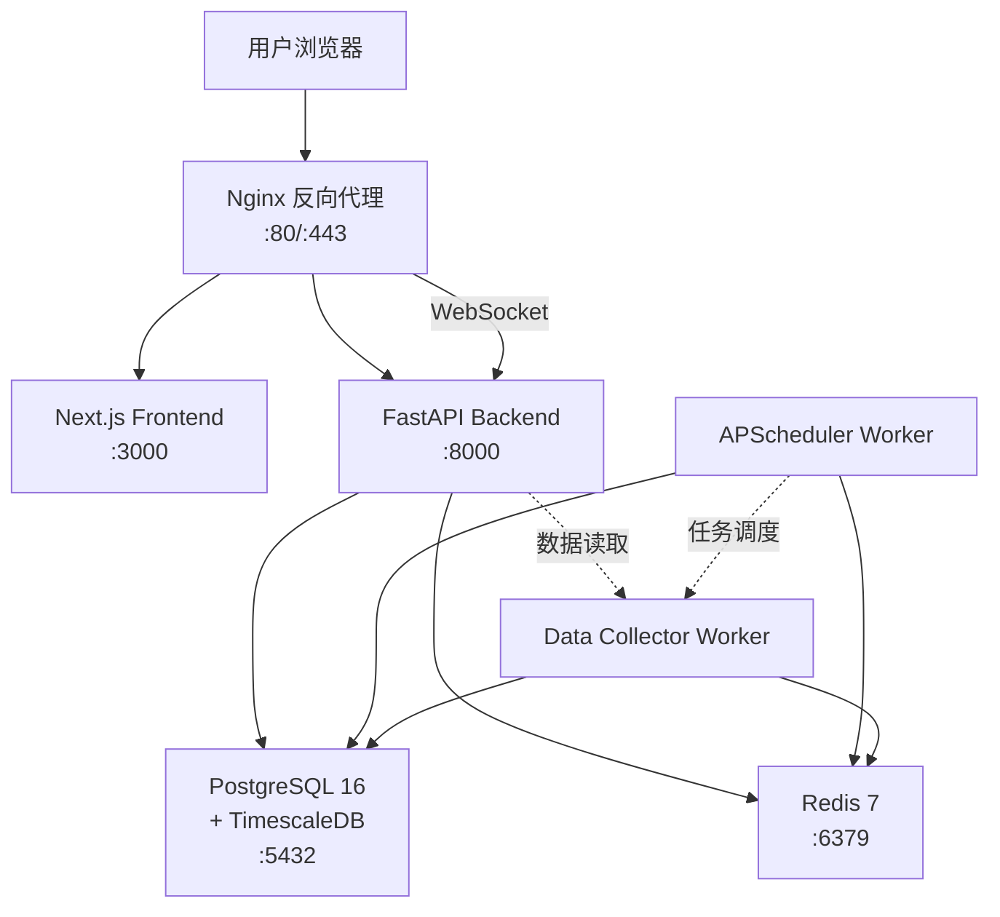
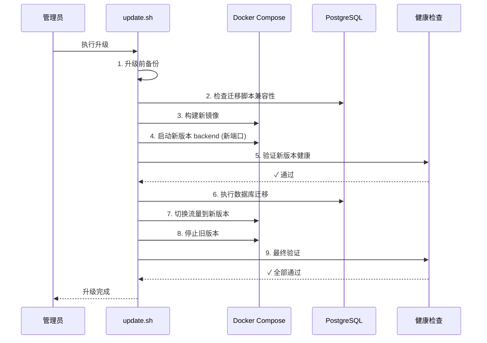

# 部署设计

> **文档编号**: 21  
> **版本**: 1.0  
> **状态**: Draft  
> **最后更新**: 2026-09-27

## 概述

BTC 全市场智能研究平台采用 Docker Compose 编排，生产部署在 Linux 服务器。本文档定义完整的生产部署架构、服务编排、容器镜像构建、环境配置、反向代理、systemd 集成、一键安装脚本及升级策略。

**部署目标**：
- 单机 Docker Compose 生产部署（VPS / 专用服务器）
- Windows Docker Desktop 开发环境
- 一键安装、升级、备份、恢复
- 零停机升级能力
- 5-10 年长期运行

---

## 目录

1. [Docker Compose 生产部署架构](#1-docker-compose-生产部署架构)
2. [Dockerfile 设计](#2-dockerfile-设计)
3. [环境变量管理](#3-环境变量管理)
4. [Nginx 反向代理配置](#4-nginx-反向代理配置)
5. [systemd 集成](#5-systemd-集成)
6. [一键安装脚本设计](#6-一键安装脚本设计)
7. [Windows 开发环境配置](#7-windows-开发环境配置)
8. [升级策略](#8-升级策略)

---

## 1. Docker Compose 生产部署架构

### 1.1 服务拓扑



### 1.2 生产环境 docker-compose.yml

```yaml
version: '3.8'

services:
  # ===== 基础设施 =====
  postgres:
    image: timescale/timescaledb:latest-pg16
    container_name: btc_postgres
    restart: unless-stopped
    environment:
      POSTGRES_DB: ${POSTGRES_DB}
      POSTGRES_USER: ${POSTGRES_USER}
      POSTGRES_PASSWORD: ${POSTGRES_PASSWORD}
    volumes:
      - postgres_data:/var/lib/postgresql/data
      - wal_archive:/var/lib/postgresql/wal_archive
      - ./docker/postgres/init.sql:/docker-entrypoint-initdb.d/init.sql
      - ./docker/postgres/postgresql.conf:/etc/postgresql/postgresql.conf
    command: postgres -c config_file=/etc/postgresql/postgresql.conf
    ports:
      - "127.0.0.1:${POSTGRES_PORT:-5432}:5432"  # 仅本地访问
    healthcheck:
      test: ["CMD-SHELL", "pg_isready -U ${POSTGRES_USER}"]
      interval: 10s
      timeout: 5s
      retries: 5
    deploy:
      resources:
        limits:
          memory: 4G
        reservations:
          memory: 1G
    networks:
      - backend

  redis:
    image: redis:7-alpine
    container_name: btc_redis
    restart: unless-stopped
    command: >
      redis-server
      --requirepass ${REDIS_PASSWORD}
      --maxmemory 512mb
      --maxmemory-policy allkeys-lru
      --appendonly yes
      --appendfsync everysec
    volumes:
      - redis_data:/data
    ports:
      - "127.0.0.1:${REDIS_PORT:-6379}:6379"
    healthcheck:
      test: ["CMD", "redis-cli", "-a", "${REDIS_PASSWORD}", "ping"]
      interval: 10s
      timeout: 5s
      retries: 5
    deploy:
      resources:
        limits:
          memory: 768M
    networks:
      - backend

  # ===== 应用服务 =====
  backend:
    build:
      context: ./backend
      dockerfile: Dockerfile
      target: production
    container_name: btc_backend
    restart: unless-stopped
    env_file: .env
    environment:
      - APP_ENV=production
      - WORKER_COUNT=4
    depends_on:
      postgres:
        condition: service_healthy
      redis:
        condition: service_healthy
    healthcheck:
      test: ["CMD", "curl", "-f", "http://localhost:8000/api/v1/system/health"]
      interval: 30s
      timeout: 10s
      retries: 3
      start_period: 30s
    deploy:
      resources:
        limits:
          memory: 2G
        reservations:
          memory: 512M
    networks:
      - backend

  scheduler:
    build:
      context: ./backend
      dockerfile: Dockerfile
      target: production
    container_name: btc_scheduler
    restart: unless-stopped
    env_file: .env
    environment:
      - APP_ENV=production
      - RUN_MODE=scheduler
    command: python -m app.scheduler.worker
    depends_on:
      postgres:
        condition: service_healthy
      redis:
        condition: service_healthy
    healthcheck:
      test: ["CMD", "python", "-c", "from app.scheduler.health import check; check()"]
      interval: 60s
      timeout: 10s
      retries: 3
    deploy:
      resources:
        limits:
          memory: 1G
    networks:
      - backend

  collector:
    build:
      context: ./backend
      dockerfile: Dockerfile
      target: production
    container_name: btc_collector
    restart: unless-stopped
    env_file: .env
    environment:
      - APP_ENV=production
      - RUN_MODE=collector
    command: python -m app.collectors.worker
    depends_on:
      postgres:
        condition: service_healthy
      redis:
        condition: service_healthy
    healthcheck:
      test: ["CMD", "python", "-c", "from app.collectors.health import check; check()"]
      interval: 60s
      timeout: 10s
      retries: 3
    deploy:
      resources:
        limits:
          memory: 2G
    networks:
      - backend

  frontend:
    build:
      context: ./frontend
      dockerfile: Dockerfile
      target: production
    container_name: btc_frontend
    restart: unless-stopped
    environment:
      - NODE_ENV=production
      - NEXT_PUBLIC_API_URL=${PUBLIC_API_URL:-http://localhost/api}
    depends_on:
      - backend
    healthcheck:
      test: ["CMD", "wget", "--no-verbose", "--tries=1", "--spider", "http://localhost:3000/"]
      interval: 30s
      timeout: 5s
      retries: 3
    networks:
      - backend

  # ===== 反向代理 =====
  nginx:
    image: nginx:1.27-alpine
    container_name: btc_nginx
    restart: unless-stopped
    ports:
      - "80:80"
      - "443:443"
    volumes:
      - ./docker/nginx/nginx.conf:/etc/nginx/nginx.conf:ro
      - ./docker/nginx/conf.d:/etc/nginx/conf.d:ro
      - ./docker/nginx/ssl:/etc/nginx/ssl:ro
      - certbot_data:/etc/letsencrypt:ro
    depends_on:
      frontend:
        condition: service_healthy
      backend:
        condition: service_healthy
    healthcheck:
      test: ["CMD", "wget", "--no-verbose", "--tries=1", "--spider", "http://localhost/health"]
      interval: 30s
      timeout: 5s
      retries: 3
    networks:
      - backend

  # ===== SSL 证书自动续期 =====
  certbot:
    image: certbot/certbot:latest
    container_name: btc_certbot
    volumes:
      - certbot_data:/etc/letsencrypt
      - ./docker/nginx/ssl:/etc/nginx/ssl
    entrypoint: "/bin/sh -c 'trap exit TERM; while :; do certbot renew; sleep 12h & wait $${!}; done;'"
    networks:
      - backend

volumes:
  postgres_data:
    driver: local
  redis_data:
    driver: local
  wal_archive:
    driver: local
  certbot_data:
    driver: local

networks:
  backend:
    driver: bridge
```

### 1.3 资源规划建议

| 服务 | CPU | 内存（推荐） | 内存（最低） | 磁盘 |
|------|-----|-------------|-------------|------|
| PostgreSQL | 2核 | 4 GB | 2 GB | 100 GB+ (SSD) |
| Redis | 0.5核 | 512 MB | 256 MB | 1 GB |
| Backend (4 workers) | 2核 | 2 GB | 1 GB | - |
| Scheduler | 1核 | 1 GB | 512 MB | - |
| Collector | 2核 | 2 GB | 1 GB | - |
| Frontend | 0.5核 | 256 MB | 128 MB | - |
| Nginx | 0.5核 | 128 MB | 64 MB | - |
| **总计** | **8核** | **10 GB** | **5 GB** | **100 GB+** |

---

## 2. Dockerfile 设计

### 2.1 Backend Dockerfile

```dockerfile
# backend/Dockerfile
# =============================================
# BTC 平台后端 - 多阶段构建
# =============================================

# ===== Stage 1: 依赖安装 =====
FROM python:3.12-slim AS builder

# 安装 uv (极快的 Python 包管理器)
COPY --from=ghcr.io/astral-sh/uv:latest /uv /usr/local/bin/uv

WORKDIR /app

# 仅复制依赖定义文件，利用 Docker 缓存
COPY pyproject.toml uv.lock ./

# 安装依赖到虚拟环境
RUN uv venv /app/.venv && \
    uv sync --frozen --no-dev --no-install-project

# ===== Stage 2: 生产镜像 =====
FROM python:3.12-slim AS production

# 安装运行时系统依赖
RUN apt-get update && apt-get install -y --no-install-recommends \
    curl \
    && rm -rf /var/lib/apt/lists/*

# 创建非 root 用户
RUN groupadd -r btc && useradd -r -g btc -s /bin/false btc

WORKDIR /app

# 从 builder 复制虚拟环境
COPY --from=builder /app/.venv /app/.venv

# 复制应用代码
COPY . .

# 设置 PATH
ENV PATH="/app/.venv/bin:$PATH" \
    PYTHONUNBUFFERED=1 \
    PYTHONDONTWRITEBYTECODE=1

# 切换用户
USER btc

EXPOSE 8000

# 默认启动命令（可通过 docker-compose command 覆盖）
CMD ["uvicorn", "app.main:app", \
     "--host", "0.0.0.0", \
     "--port", "8000", \
     "--workers", "4", \
     "--access-log", \
     "--log-level", "info"]

# ===== Stage 3: 开发镜像 =====
FROM production AS development

USER root
COPY --from=builder /app/.venv /app/.venv
RUN uv sync --frozen --extra dev
USER btc

CMD ["uvicorn", "app.main:app", \
     "--host", "0.0.0.0", \
     "--port", "8000", \
     "--reload", \
     "--reload-dir", "/app/app"]
```

### 2.2 Frontend Dockerfile

```dockerfile
# frontend/Dockerfile
# =============================================
# BTC 平台前端 - Next.js Standalone 构建
# =============================================

# ===== Stage 1: 依赖安装 =====
FROM node:20-alpine AS deps

RUN corepack enable && corepack prepare pnpm@latest --activate

WORKDIR /app

COPY package.json pnpm-lock.yaml ./
RUN pnpm install --frozen-lockfile

# ===== Stage 2: 构建 =====
FROM node:20-alpine AS builder

RUN corepack enable && corepack prepare pnpm@latest --activate

WORKDIR /app

COPY --from=deps /app/node_modules ./node_modules
COPY . .

# 构建时注入环境变量
ARG NEXT_PUBLIC_API_URL=http://localhost/api
ENV NEXT_PUBLIC_API_URL=$NEXT_PUBLIC_API_URL
ENV NEXT_TELEMETRY_DISABLED=1

RUN pnpm build

# ===== Stage 3: 生产运行 =====
FROM node:20-alpine AS production

WORKDIR /app

# 创建非 root 用户
RUN addgroup -S btc && adduser -S btc -G btc

ENV NODE_ENV=production \
    NEXT_TELEMETRY_DISABLED=1

# 复制 standalone 输出
COPY --from=builder /app/public ./public
COPY --from=builder --chown=btc:btc /app/.next/standalone ./
COPY --from=builder --chown=btc:btc /app/.next/static ./.next/static

USER btc

EXPOSE 3000

ENV PORT=3000 \
    HOSTNAME="0.0.0.0"

CMD ["node", "server.js"]
```

### 2.3 Scheduler / Collector

Scheduler 和 Collector 与 Backend 使用相同镜像，通过 `command` 覆盖入口：

```yaml
# docker-compose.yml 中已定义
scheduler:
  build:
    context: ./backend
    dockerfile: Dockerfile
    target: production
  command: python -m app.scheduler.worker

collector:
  build:
    context: ./backend
    dockerfile: Dockerfile
    target: production
  command: python -m app.collectors.worker
```

### 2.4 Nginx 配置挂载

Nginx 使用官方镜像 + 自定义配置挂载，无需单独构建 Dockerfile：

```yaml
nginx:
  image: nginx:1.27-alpine
  volumes:
    - ./docker/nginx/nginx.conf:/etc/nginx/nginx.conf:ro
    - ./docker/nginx/conf.d:/etc/nginx/conf.d:ro
```

---

## 3. 环境变量管理

### 3.1 .env 文件格式（生产环境）

```bash
# ==========================================================
# BTC 全市场智能研究平台 - 生产环境变量
# 位置: /opt/btc-platform/.env
# 权限: chmod 600 .env
# ==========================================================

# ---------- 应用基础 ----------
APP_ENV=production
DEBUG=false
API_V1_PREFIX=/api/v1
HOST=0.0.0.0
PORT=8000
WORKER_COUNT=4
PUBLIC_API_URL=https://your-domain.com/api
PUBLIC_WS_URL=wss://your-domain.com/ws

# ---------- 安全 / 鉴权 ----------
SECRET_KEY=<生成: openssl rand -hex 32>
ACCESS_TOKEN_EXPIRE_MINUTES=1440
ALGORITHM=HS256

# ---------- 数据库 ----------
POSTGRES_HOST=postgres
POSTGRES_PORT=5432
POSTGRES_DB=btc_platform
POSTGRES_USER=btc_admin
POSTGRES_PASSWORD=<强密码>

# ---------- Redis ----------
REDIS_HOST=redis
REDIS_PORT=6379
REDIS_PASSWORD=<强密码>
REDIS_DB=0

# ---------- 外部数据源 API Keys ----------
PROVIDER_BINANCE_KEY=
PROVIDER_COINBASE_KEY=
PROVIDER_COINGLASS_KEY=
PROVIDER_GLASSNODE_KEY=
PROVIDER_CRYPTOQUANT_KEY=
PROVIDER_FARSIDE_KEY=
PROVIDER_DERIBIT_KEY=
PROVIDER_FRED_KEY=
PROVIDER_ALTERNATIVE_KEY=

# ---------- 代理配置（中国大陆网络环境）----------
HTTP_PROXY=
HTTPS_PROXY=
SOCKS5_PROXY=
NO_PROXY=localhost,127.0.0.1,postgres,redis

# ---------- 调度器 ----------
SCHEDULER_ENABLED=true
SCHEDULER_TIMEZONE=Asia/Shanghai

# ---------- 备份 ----------
BACKUP_DIR=/opt/btc-platform/backups
BACKUP_ENCRYPTION_KEY=<生成: openssl rand -hex 32>

# ---------- 日志 ----------
LOG_LEVEL=INFO
LOG_FORMAT=json
LOG_FILE=/var/log/btc-platform/app.log
```

### 3.2 环境变量分类

| 分类 | 变量前缀 | 敏感级别 | 管理方式 |
|------|---------|---------|---------|
| 应用配置 | `APP_`, `HOST`, `PORT` | 低 | .env 明文 |
| 数据库 | `POSTGRES_` | 高 | .env + Docker secrets |
| 缓存 | `REDIS_` | 中 | .env + Docker secrets |
| 安全 | `SECRET_KEY`, `ALGORITHM` | 极高 | Docker secrets |
| API Keys | `PROVIDER_*_KEY` | 高 | .env (600权限) |
| 代理 | `*_PROXY` | 低 | .env 明文 |
| 日志 | `LOG_*` | 低 | .env 明文 |

### 3.3 Docker Secrets（生产环境高安全选项）

```yaml
# docker-compose.yml 中使用 secrets
services:
  backend:
    secrets:
      - db_password
      - redis_password
      - jwt_secret
    environment:
      POSTGRES_PASSWORD_FILE: /run/secrets/db_password
      REDIS_PASSWORD_FILE: /run/secrets/redis_password
      SECRET_KEY_FILE: /run/secrets/jwt_secret

secrets:
  db_password:
    file: ./secrets/db_password.txt
  redis_password:
    file: ./secrets/redis_password.txt
  jwt_secret:
    file: ./secrets/jwt_secret.txt
```

**应用层读取 secrets**：
```python
# backend/app/core/config.py
from pathlib import Path

def read_secret(env_var: str) -> str:
    """优先从 Docker secret 文件读取，回退到环境变量"""
    secret_file = os.environ.get(f"{env_var}_FILE")
    if secret_file and Path(secret_file).exists():
        return Path(secret_file).read_text().strip()
    return os.environ.get(env_var, "")
```

---

## 4. Nginx 反向代理配置

### 4.1 主配置文件

```nginx
# docker/nginx/nginx.conf
user nginx;
worker_processes auto;
error_log /var/log/nginx/error.log warn;
pid /var/run/nginx.pid;

events {
    worker_connections 2048;
    multi_accept on;
}

http {
    include /etc/nginx/mime.types;
    default_type application/octet-stream;

    # 日志格式
    log_format main '$remote_addr - $remote_user [$time_local] "$request" '
                    '$status $body_bytes_sent "$http_referer" '
                    '"$http_user_agent" "$http_x_forwarded_for" '
                    'rt=$request_time';

    access_log /var/log/nginx/access.log main;

    # 性能优化
    sendfile on;
    tcp_nopush on;
    tcp_nodelay on;
    keepalive_timeout 65;
    types_hash_max_size 2048;
    client_max_body_size 50m;

    # Gzip 压缩
    gzip on;
    gzip_vary on;
    gzip_proxied any;
    gzip_comp_level 6;
    gzip_min_length 256;
    gzip_types
        text/plain
        text/css
        text/xml
        text/javascript
        application/json
        application/javascript
        application/xml
        application/rss+xml
        image/svg+xml;

    # Rate Limiting
    limit_req_zone $binary_remote_addr zone=api_limit:10m rate=30r/s;
    limit_req_zone $binary_remote_addr zone=ws_limit:10m rate=5r/s;
    limit_conn_zone $binary_remote_addr zone=conn_limit:10m;

    # 上游服务
    upstream backend {
        server backend:8000;
        keepalive 32;
    }

    upstream frontend {
        server frontend:3000;
        keepalive 16;
    }

    include /etc/nginx/conf.d/*.conf;
}
```

### 4.2 站点配置

```nginx
# docker/nginx/conf.d/btc-platform.conf

# HTTP -> HTTPS 重定向
server {
    listen 80;
    server_name your-domain.com;

    # Let's Encrypt 验证路径
    location /.well-known/acme-challenge/ {
        root /var/www/certbot;
    }

    # 健康检查端点（不重定向）
    location /health {
        proxy_pass http://backend/api/v1/system/health;
    }

    location / {
        return 301 https://$server_name$request_uri;
    }
}

# HTTPS 主站
server {
    listen 443 ssl http2;
    server_name your-domain.com;

    # SSL 配置
    ssl_certificate /etc/letsencrypt/live/your-domain.com/fullchain.pem;
    ssl_certificate_key /etc/letsencrypt/live/your-domain.com/privkey.pem;
    ssl_protocols TLSv1.2 TLSv1.3;
    ssl_ciphers ECDHE-ECDSA-AES128-GCM-SHA256:ECDHE-RSA-AES128-GCM-SHA256:ECDHE-ECDSA-AES256-GCM-SHA384:ECDHE-RSA-AES256-GCM-SHA384;
    ssl_prefer_server_ciphers off;
    ssl_session_cache shared:SSL:10m;
    ssl_session_timeout 1d;
    ssl_session_tickets off;

    # 安全头
    add_header X-Frame-Options "SAMEORIGIN" always;
    add_header X-Content-Type-Options "nosniff" always;
    add_header X-XSS-Protection "1; mode=block" always;
    add_header Referrer-Policy "strict-origin-when-cross-origin" always;
    add_header Strict-Transport-Security "max-age=63072000; includeSubDomains; preload" always;
    add_header Content-Security-Policy "default-src 'self'; script-src 'self' 'unsafe-inline' 'unsafe-eval'; style-src 'self' 'unsafe-inline'; img-src 'self' data: https:; font-src 'self' data:; connect-src 'self' wss://your-domain.com https://your-domain.com;" always;

    # 连接限制
    limit_conn conn_limit 50;

    # ===== API 路由 =====
    location /api/ {
        limit_req zone=api_limit burst=50 nodelay;

        proxy_pass http://backend;
        proxy_http_version 1.1;
        proxy_set_header Upgrade $http_upgrade;
        proxy_set_header Connection "upgrade";
        proxy_set_header Host $host;
        proxy_set_header X-Real-IP $remote_addr;
        proxy_set_header X-Forwarded-For $proxy_add_x_forwarded_for;
        proxy_set_header X-Forwarded-Proto $scheme;
        proxy_read_timeout 120s;
        proxy_send_timeout 120s;
        proxy_connect_timeout 10s;
    }

    # ===== WebSocket 路由 =====
    location /ws {
        limit_req zone=ws_limit burst=10 nodelay;

        proxy_pass http://backend;
        proxy_http_version 1.1;
        proxy_set_header Upgrade $http_upgrade;
        proxy_set_header Connection "upgrade";
        proxy_set_header Host $host;
        proxy_set_header X-Real-IP $remote_addr;
        proxy_set_header X-Forwarded-For $proxy_add_x_forwarded_for;
        proxy_read_timeout 86400s;  # WebSocket 长连接
        proxy_send_timeout 86400s;
    }

    # ===== 前端静态资源缓存 =====
    location /_next/static/ {
        proxy_pass http://frontend;
        proxy_cache_valid 200 365d;
        add_header Cache-Control "public, max-age=31536000, immutable";
    }

    # ===== 前端页面 =====
    location / {
        proxy_pass http://frontend;
        proxy_http_version 1.1;
        proxy_set_header Host $host;
        proxy_set_header X-Real-IP $remote_addr;
        proxy_set_header X-Forwarded-For $proxy_add_x_forwarded_for;
        proxy_set_header X-Forwarded-Proto $scheme;
    }

    # ===== 健康检查 =====
    location /health {
        proxy_pass http://backend/api/v1/system/health;
        access_log off;
    }

    # 禁止访问隐藏文件
    location ~ /\. {
        deny all;
        access_log off;
        log_not_found off;
    }
}
```

### 4.3 路由规则总结

| 路径 | 目标 | 说明 |
|------|------|------|
| `/` | frontend:3000 | Next.js 页面 |
| `/_next/static/` | frontend:3000 | 静态资源（强缓存） |
| `/api/` | backend:8000 | RESTful API |
| `/ws` | backend:8000 | WebSocket 连接 |
| `/health` | backend:8000 | 健康检查 |
| `/.well-known/acme-challenge/` | 本地文件 | Let's Encrypt 验证 |

---

## 5. systemd 集成

### 5.1 主服务单元文件

```ini
# /etc/systemd/system/btc-platform.service
[Unit]
Description=BTC 全市场智能研究平台
Requires=docker.service
After=docker.service network-online.target
Wants=network-online.target

[Service]
Type=oneshot
RemainAfterExit=yes
WorkingDirectory=/opt/btc-platform
ExecStart=/usr/bin/docker compose -f docker-compose.yml up -d --remove-orphans
ExecStop=/usr/bin/docker compose -f docker-compose.yml down
ExecReload=/usr/bin/docker compose -f docker-compose.yml restart
TimeoutStartSec=300
TimeoutStopSec=120

# 安全加固
User=root
Group=root
UMask=0077
NoNewPrivileges=true
ProtectSystem=strict
ReadWritePaths=/opt/btc-platform /var/lib/docker

[Install]
WantedBy=multi-user.target
```

### 5.2 备份定时任务

```ini
# /etc/systemd/system/btc-backup.service
[Unit]
Description=BTC Platform Database Backup
After=btc-platform.service

[Service]
Type=oneshot
User=btc
Group=btc
ExecStart=/opt/btc-platform/scripts/backup/db_backup.sh
ExecStartPost=/opt/btc-platform/scripts/backup/config_backup.sh
StandardOutput=journal
StandardError=journal
SyslogIdentifier=btc-backup
```

```ini
# /etc/systemd/system/btc-backup.timer
[Unit]
Description=Daily BTC Platform Backup at 03:00

[Timer]
OnCalendar=*-*-* 03:00:00
Persistent=true
RandomizedDelaySec=300

[Install]
WantedBy=timers.target
```

### 5.3 管理命令

```bash
# 启用开机自启
sudo systemctl enable btc-platform.service

# 启动
sudo systemctl start btc-platform.service

# 停止
sudo systemctl stop btc-platform.service

# 重启
sudo systemctl restart btc-platform.service

# 查看状态
sudo systemctl status btc-platform.service

# 查看日志
sudo journalctl -u btc-platform.service -f
sudo journalctl -u btc-platform.service --since "1 hour ago"

# 启用备份定时任务
sudo systemctl enable btc-backup.timer
sudo systemctl start btc-backup.timer

# 查看备份定时器状态
sudo systemctl list-timers btc-backup.timer
```

---

## 6. 一键安装脚本设计

### 6.1 脚本清单

| 脚本 | 功能 | 触发方式 |
|------|------|---------|
| `install.sh` | 全新安装 | 手动执行 |
| `update.sh` | 升级更新 | 手动/定时 |
| `uninstall.sh` | 卸载清理 | 手动执行 |
| `backup.sh` | 执行完整备份 | 手动/定时 |
| `restore.sh` | 从备份恢复 | 手动执行 |
| `manage.sh` | 交互式管理菜单 | 手动执行 |

### 6.2 install.sh

```bash
#!/bin/bash
# =============================================================
# install.sh - BTC 全市场智能研究平台一键安装
# 支持: Ubuntu 22.04+, Debian 12+
# =============================================================
set -euo pipefail

VERSION="1.0.0"
INSTALL_DIR="/opt/btc-platform"
SCRIPT_DIR="$(cd "$(dirname "${BASH_SOURCE[0]}")" && pwd)"

# 颜色
RED='\033[0;31m'; GREEN='\033[0;32m'; YELLOW='\033[1;33m'; NC='\033[0m'
info() { echo -e "${GREEN}[INFO]${NC} $1"; }
warn() { echo -e "${YELLOW}[WARN]${NC} $1"; }
error() { echo -e "${RED}[ERROR]${NC} $1"; exit 1; }

echo ""
echo "╔══════════════════════════════════════════════════╗"
echo "║  BTC 全市场智能研究平台 - 安装程序 v${VERSION}      ║"
echo "╚══════════════════════════════════════════════════╝"
echo ""

# ===== Step 1: 系统检查 =====
info "[1/8] 系统环境检查..."

# 检查是否为 root
if [ "$EUID" -ne 0 ]; then
    error "请使用 sudo 运行此脚本"
fi

# 检查操作系统
if [ -f /etc/os-release ]; then
    . /etc/os-release
    info "操作系统: $PRETTY_NAME"
else
    error "无法检测操作系统"
fi

# 检查系统资源
TOTAL_RAM_GB=$(free -g | awk '/Mem:/{print $2}')
DISK_AVAIL_GB=$(df -BG / | tail -1 | awk '{print $4}' | tr -d 'G')
info "系统内存: ${TOTAL_RAM_GB}GB, 可用磁盘: ${DISK_AVAIL_GB}GB"

if [ "$TOTAL_RAM_GB" -lt 4 ]; then
    warn "内存不足 4GB，可能影响性能"
fi
if [ "$DISK_AVAIL_GB" -lt 20 ]; then
    error "磁盘空间不足，至少需要 20GB"
fi

# ===== Step 2: 安装 Docker =====
info "[2/8] 检查/安装 Docker..."

if command -v docker &> /dev/null; then
    info "Docker 已安装: $(docker --version)"
else
    info "安装 Docker..."
    curl -fsSL https://get.docker.com | sh
    systemctl enable docker
    systemctl start docker
    info "Docker 安装完成: $(docker --version)"
fi

# 检查 Docker Compose
if docker compose version &> /dev/null; then
    info "Docker Compose 已安装: $(docker compose version --short)"
else
    error "Docker Compose 未安装，请安装 Docker Compose V2 插件"
fi

# ===== Step 3: 创建安装目录 =====
info "[3/8] 创建安装目录..."

mkdir -p "$INSTALL_DIR"
mkdir -p "$INSTALL_DIR/backups"/{database/{daily,weekly,monthly,wal},config/{env,providers,docker},models/versions,metadata}
mkdir -p "$INSTALL_DIR/scripts"/{backup,utils}
mkdir -p "$INSTALL_DIR/docker"/{nginx/conf.d,nginx/ssl,postgres}
mkdir -p "$INSTALL_DIR/secrets"
mkdir -p "$INSTALL_DIR/logs"

# ===== Step 4: 复制项目文件 =====
info "[4/8] 部署应用文件..."

# 复制项目文件（从源码目录或下载的 release 包）
if [ -f "$SCRIPT_DIR/docker-compose.yml" ]; then
    cp -r "$SCRIPT_DIR"/* "$INSTALL_DIR/"
    cp "$SCRIPT_DIR"/.env.example "$INSTALL_DIR/.env"
else
    error "未找到项目文件，请确保从项目根目录运行"
fi

chmod +x "$INSTALL_DIR"/scripts/**/*.sh 2>/dev/null || true

# ===== Step 5: 生成安全配置 =====
info "[5/8] 生成安全配置..."

# 生成随机密码
DB_PASSWORD=$(openssl rand -base64 24 | tr -d '/+=' | head -c 24)
REDIS_PASSWORD=$(openssl rand -base64 24 | tr -d '/+=' | head -c 24)
SECRET_KEY=$(openssl rand -hex 32)
BACKUP_KEY=$(openssl rand -hex 32)

# 更新 .env
sed -i "s|POSTGRES_PASSWORD=changeme|POSTGRES_PASSWORD=$DB_PASSWORD|" "$INSTALL_DIR/.env"
sed -i "s|REDIS_PASSWORD=changeme|REDIS_PASSWORD=$REDIS_PASSWORD|" "$INSTALL_DIR/.env"
sed -i "s|SECRET_KEY=change-me-in-production|SECRET_KEY=$SECRET_KEY|" "$INSTALL_DIR/.env"
sed -i "s|APP_ENV=development|APP_ENV=production|" "$INSTALL_DIR/.env"
sed -i "s|DEBUG=true|DEBUG=false|" "$INSTALL_DIR/.env"

# 保存备份加密密钥
echo "$BACKUP_KEY" > "$INSTALL_DIR/.backup_key"
chmod 600 "$INSTALL_DIR/.backup_key"
chmod 600 "$INSTALL_DIR/.env"

# ===== Step 6: 构建 Docker 镜像 =====
info "[6/8] 构建 Docker 镜像..."

cd "$INSTALL_DIR"
docker compose build --no-cache

# ===== Step 7: 初始化数据库 =====
info "[7/8] 初始化数据库..."

docker compose up -d postgres redis
sleep 15

# 等待 PostgreSQL 就绪
until docker exec btc_postgres pg_isready -U btc_admin &> /dev/null; do
    sleep 2
done

# 执行数据库迁移
docker compose run --rm backend alembic upgrade head

# ===== Step 8: 启动所有服务 =====
info "[8/8] 启动所有服务..."

docker compose up -d

# 等待服务就绪
sleep 20

# 验证
info "验证服务状态..."
docker compose ps

echo ""
echo "╔══════════════════════════════════════════════════╗"
echo "║  安装完成！                                      ║"
echo "╠══════════════════════════════════════════════════╣"
echo "║  安装目录: $INSTALL_DIR"
echo "║  管理命令: $INSTALL_DIR/scripts/manage.sh"
echo "║  日志查看: docker compose -f $INSTALL_DIR/docker-compose.yml logs -f"
echo "║                                                  ║"
echo "║  ⚠️  请编辑 .env 配置 API Keys 和域名          ║"
echo "╚══════════════════════════════════════════════════╝"
```

### 6.3 update.sh

```bash
#!/bin/bash
# =============================================================
# update.sh - BTC 平台升级更新脚本
# =============================================================
set -euo pipefail

INSTALL_DIR="/opt/btc-platform"
GREEN='\033[0;32m'; YELLOW='\033[1;33m'; RED='\033[0;31m'; NC='\033[0m'
info() { echo -e "${GREEN}[INFO]${NC} $1"; }
warn() { echo -e "${YELLOW}[WARN]${NC} $1"; }
error() { echo -e "${RED}[ERROR]${NC} $1"; exit 1; }

cd "$INSTALL_DIR"

info "===== BTC 平台升级开始 ====="

# 1. 升级前备份
info "[1/6] 执行升级前备份..."
"$INSTALL_DIR/scripts/backup/db_backup.sh"
"$INSTALL_DIR/scripts/backup/config_backup.sh"

# 2. 记录当前版本
CURRENT_VERSION=$(docker compose exec -T backend python -c "from app import __version__; print(__version__)" 2>/dev/null || echo "unknown")
info "[2/6] 当前版本: $CURRENT_VERSION"

# 3. 拉取新代码/镜像
info "[3/6] 拉取更新..."
if [ -d ".git" ]; then
    git fetch --all
    git stash  # 保存本地修改
    git pull origin main
    git stash pop || true
fi
docker compose build --no-cache

# 4. 数据库迁移
info "[4/6] 执行数据库迁移..."
docker compose run --rm backend alembic upgrade head

# 5. 重启服务
info "[5/6] 重启服务..."
docker compose up -d --remove-orphans

# 6. 验证
info "[6/6] 验证升级结果..."
sleep 15

if curl -sf http://localhost:8000/api/v1/system/health > /dev/null 2>&1; then
    NEW_VERSION=$(docker compose exec -T backend python -c "from app import __version__; print(__version__)" 2>/dev/null || echo "unknown")
    info "升级成功: $CURRENT_VERSION -> $NEW_VERSION"
else
    error "升级后服务异常！请执行回滚: $INSTALL_DIR/scripts/rollback.sh"
fi

info "===== 升级完成 ====="
```

### 6.4 uninstall.sh

```bash
#!/bin/bash
# =============================================================
# uninstall.sh - BTC 平台卸载脚本
# =============================================================
set -euo pipefail

INSTALL_DIR="/opt/btc-platform"
RED='\033[0;31m'; YELLOW='\033[1;33m'; GREEN='\033[0;32m'; NC='\033[0m'

echo ""
echo -e "${RED}╔══════════════════════════════════════════╗${NC}"
echo -e "${RED}║  BTC 平台 - 卸载程序                    ║${NC}"
echo -e "${RED}╚══════════════════════════════════════════╝${NC}"
echo ""
echo -e "${YELLOW}警告: 此操作将停止并移除所有服务${NC}"
echo ""

read -p "确认卸载? (yes/no): " confirm
[ "$confirm" != "yes" ] && exit 0

cd "$INSTALL_DIR"

# 1. 停止服务
echo "[1/4] 停止所有服务..."
docker compose down -v --remove-orphans 2>/dev/null || true

# 2. 移除 systemd 服务
echo "[2/4] 移除 systemd 配置..."
systemctl stop btc-platform.service 2>/dev/null || true
systemctl disable btc-platform.service 2>/dev/null || true
rm -f /etc/systemd/system/btc-platform.service
rm -f /etc/systemd/system/btc-backup.{service,timer}
systemctl daemon-reload

# 3. 移除 cron
echo "[3/4] 移除定时任务..."
rm -f /etc/cron.d/btc-platform-backup

# 4. 可选删除数据
echo "[4/4] 清理文件..."
read -p "是否删除所有数据（数据库、备份）? 此操作不可恢复! (yes/no): " delete_data

if [ "$delete_data" = "yes" ]; then
    read -p "再次确认：永久删除所有数据? (DELETE-ALL): " final_confirm
    if [ "$final_confirm" = "DELETE-ALL" ]; then
        docker volume rm btc-postgres_data btc-redis_data btc-wal_archive 2>/dev/null || true
        rm -rf "$INSTALL_DIR"
        echo "所有数据已删除"
    fi
else
    echo "数据已保留在: $INSTALL_DIR/backups/"
    echo "如需完全清理: rm -rf $INSTALL_DIR"
fi

echo ""
echo -e "${GREEN}卸载完成${NC}"
```

### 6.5 manage.sh（交互式管理菜单）

```bash
#!/bin/bash
# =============================================================
# manage.sh - BTC 平台交互式管理工具
# =============================================================

INSTALL_DIR="/opt/btc-platform"
cd "$INSTALL_DIR"

GREEN='\033[0;32m'; YELLOW='\033[1;33m'; RED='\033[0;31m'; CYAN='\033[0;36m'; NC='\033[0m'

show_menu() {
    clear
    echo ""
    echo -e "${CYAN}╔══════════════════════════════════════════════════╗${NC}"
    echo -e "${CYAN}║     BTC 全市场智能研究平台 - 管理控制台         ║${NC}"
    echo -e "${CYAN}╚══════════════════════════════════════════════════╝${NC}"
    echo ""
    echo -e "  ${GREEN}服务管理${NC}"
    echo "  ─────────────────────────────────────"
    echo "  [1] 启动所有服务"
    echo "  [2] 停止所有服务"
    echo "  [3] 重启所有服务"
    echo "  [4] 查看服务状态"
    echo "  [5] 查看服务日志"
    echo ""
    echo -e "  ${GREEN}维护操作${NC}"
    echo "  ─────────────────────────────────────"
    echo "  [6] 执行备份"
    echo "  [7] 从备份恢复"
    echo "  [8] 升级系统"
    echo "  [9] 数据库迁移"
    echo ""
    echo -e "  ${GREEN}系统配置${NC}"
    echo "  ─────────────────────────────────────"
    echo "  [10] 启用 systemd 自启"
    echo "  [11] 禁用 systemd 自启"
    echo "  [12] 查看系统信息"
    echo ""
    echo "  [0] 退出"
    echo ""
    read -p "  请选择操作 [0-12]: " choice
}

case_handler() {
    case $1 in
        1)  echo "启动服务..."; docker compose up -d ;;
        2)  echo "停止服务..."; docker compose down ;;
        3)  echo "重启服务..."; docker compose restart ;;
        4)  docker compose ps; echo ""; docker stats --no-stream ;;
        5)  echo "选择服务查看日志:"
            docker compose ps --format "{{.Name}}" | nl
            read -p "输入编号: " svc_num
            SVC=$(docker compose ps --format "{{.Name}}" | sed -n "${svc_num}p")
            docker compose logs -f "$SVC" --tail=100
            ;;
        6)  ./scripts/backup/db_backup.sh; ./scripts/backup/config_backup.sh ;;
        7)  ./scripts/restore.sh ;;
        8)  ./scripts/update.sh ;;
        9)  docker compose run --rm backend alembic upgrade head ;;
        10) systemctl enable btc-platform.service
            systemctl enable btc-backup.timer
            echo "systemd 自启已启用" ;;
        11) systemctl disable btc-platform.service
            systemctl disable btc-backup.timer
            echo "systemd 自启已禁用" ;;
        12) echo "=== 系统信息 ==="
            echo "安装目录: $INSTALL_DIR"
            echo "Docker: $(docker --version)"
            echo "磁盘使用:"; df -h "$INSTALL_DIR" | tail -1
            echo "内存使用:"; free -h | head -2
            echo "容器状态:"; docker compose ps --format "table {{.Name}}\t{{.Status}}\t{{.Ports}}"
            ;;
        0)  echo "退出"; exit 0 ;;
        *)  echo "无效选择" ;;
    esac
}

while true; do
    show_menu
    case_handler "$choice"
    echo ""
    read -p "按回车键继续..."
done
```

---

## 7. Windows 开发环境配置

### 7.1 前置条件

| 工具 | 版本要求 | 说明 |
|------|---------|------|
| Docker Desktop | 4.30+ | 含 Docker Compose V2 |
| Node.js | 20 LTS | 前端开发 |
| pnpm | 9+ | 前端包管理 |
| Python | 3.12+ | 后端开发 |
| uv | latest | Python 包管理（极速） |
| Git | 2.40+ | 版本控制 |

### 7.2 Docker Desktop 配置

```
Settings > Resources:
  - CPUs: 4+ (推荐 6)
  - Memory: 8 GB+ (推荐 12 GB)
  - Disk: 60 GB+

Settings > General:
  ✓ Start Docker Desktop when you sign in
  ✓ Use WSL 2 based engine
```

### 7.3 开发环境启动流程

```powershell
# 方式1: 使用一键启动脚本
powershell -ExecutionPolicy Bypass -File .\scripts\dev-start.ps1

# 方式2: 手动分步启动
# Step 1: 启动基础设施
docker compose -f docker-compose.yml -f docker-compose.dev.yml up -d

# Step 2: 安装后端依赖
cd backend; uv sync --extra dev; cd ..

# Step 3: 安装前端依赖
cd frontend; pnpm install; cd ..

# Step 4: 启动后端（终端1）
cd backend; uv run uvicorn app.main:app --reload --host 0.0.0.0 --port 8000

# Step 5: 启动前端（终端2）
cd frontend; pnpm dev
```

### 7.4 开发环境端口映射

| 服务 | 端口 | URL | 说明 |
|------|------|-----|------|
| Frontend | 3000 | http://localhost:3000 | Next.js 开发服务器 |
| Backend API | 8000 | http://localhost:8000 | FastAPI (热重载) |
| API Docs | 8000 | http://localhost:8000/docs | Swagger UI |
| PostgreSQL | 5432 | localhost:5432 | 数据库直连 |
| Redis | 6379 | localhost:6379 | 缓存 |
| Adminer | 8080 | http://localhost:8080 | 数据库管理 UI |

### 7.5 热重载配置

**后端热重载**（uvicorn --reload）：
- 监控 `backend/app/` 目录下所有 `.py` 文件变更
- 变更后自动重启 worker

**前端热重载**（Next.js HMR）：
- 组件级热替换
- CSS/Tailwind 即时生效
- API Route 变更自动重编译

### 7.6 开发环境 vs 生产环境差异

| 项目 | 开发 | 生产 |
|------|------|------|
| docker-compose 文件 | `docker-compose.yml` + `docker-compose.dev.yml` | `docker-compose.yml` |
| Adminer | ✓ (端口8080) | ✗ |
| Backend 热重载 | ✓ | ✗ |
| Frontend dev server | ✓ (pnpm dev) | ✗ (standalone build) |
| Nginx | ✗ (直连服务) | ✓ (反向代理+SSL) |
| DEBUG | true | false |
| 日志级别 | DEBUG | INFO |
| Workers | 1 | 4 |

---

## 8. 升级策略

### 8.1 零停机升级流程



### 8.2 数据库迁移（Alembic）

```bash
# 生成迁移脚本
cd backend
uv run alembic revision --autogenerate -m "描述变更内容"

# 执行迁移
uv run alembic upgrade head

# 回滚一个版本
uv run alembic downgrade -1

# 查看迁移历史
uv run alembic history --verbose

# 检查当前版本
uv run alembic current
```

**迁移规则**：
- 每个迁移必须可回滚（实现 `downgrade()`）
- 大表变更使用 `CONCURRENTLY`（如添加索引）
- 迁移前必须备份
- 禁止在迁移中删除列（先标记废弃，下个版本再删除）

### 8.3 回滚方案

```bash
#!/bin/bash
# rollback.sh - 升级回滚脚本
set -euo pipefail

INSTALL_DIR="/opt/btc-platform"
cd "$INSTALL_DIR"

echo "=== 执行回滚 ==="

# 1. 停止当前服务
docker compose down

# 2. 回滚代码（Git）
if [ -d ".git" ]; then
    git log --oneline -5
    read -p "输入要回滚到的 commit hash: " COMMIT
    git checkout "$COMMIT"
fi

# 3. 回滚数据库
echo "回滚数据库..."
docker compose run --rm backend alembic downgrade -1

# 4. 重新构建并启动
docker compose build
docker compose up -d

# 5. 验证
sleep 15
curl -sf http://localhost:8000/api/v1/system/health && echo "回滚成功" || echo "回滚后服务异常"
```

### 8.4 版本兼容性检查

```python
# backend/app/core/compatibility.py
"""版本兼容性检查"""

# 最低兼容版本要求
COMPATIBILITY_MATRIX = {
    "database_schema": ">=1.0.0",
    "api_version": "v1",
    "python": ">=3.12",
    "postgresql": ">=16.0",
    "timescaledb": ">=2.14",
    "redis": ">=7.0",
    "node": ">=20.0",
}


def check_compatibility(current_version: str, target_version: str) -> dict:
    """
    检查从 current_version 升级到 target_version 的兼容性
    
    Returns:
        {
            "compatible": bool,
            "breaking_changes": list[str],
            "required_migrations": list[str],
            "warnings": list[str]
        }
    """
    # 实现版本兼容性检查逻辑
    pass
```

### 8.5 升级检查清单

- [ ] 阅读 CHANGELOG 确认变更内容
- [ ] 确认数据库迁移脚本可逆
- [ ] 执行升级前完整备份
- [ ] 在 staging 环境验证（如有）
- [ ] 选择低流量时段执行
- [ ] 执行 `update.sh`
- [ ] 验证健康检查通过
- [ ] 验证核心功能正常
- [ ] 监控 30 分钟确认稳定
- [ ] 记录升级日志

---

## 附录

### A. 目录结构（生产部署）

```
/opt/btc-platform/
├── .env                    # 环境变量（600权限）
├── .backup_key             # 备份加密密钥（600权限）
├── docker-compose.yml      # 生产编排
├── Makefile                # 常用命令
├── backend/
│   ├── Dockerfile
│   ├── pyproject.toml
│   ├── alembic.ini
│   ├── migrations/
│   ├── config/
│   │   └── providers/      # Provider 配置
│   ├── app/
│   └── tests/
├── frontend/
│   ├── Dockerfile
│   ├── package.json
│   └── src/
├── docker/
│   ├── nginx/
│   │   ├── nginx.conf
│   │   ├── conf.d/
│   │   └── ssl/
│   └── postgres/
│       ├── init.sql
│       └── postgresql.conf
├── scripts/
│   ├── install.sh
│   ├── update.sh
│   ├── uninstall.sh
│   ├── manage.sh
│   ├── rollback.sh
│   ├── backup/
│   │   ├── db_backup.sh
│   │   ├── config_backup.sh
│   │   ├── verify_backup.sh
│   │   └── backup_cleanup.sh
│   └── utils/
├── backups/                # 备份存储
├── secrets/                # Docker secrets
└── logs/                   # 应用日志
```

### B. 端口使用清单

| 端口 | 服务 | 对外暴露 | 说明 |
|------|------|---------|------|
| 80 | Nginx | ✓ | HTTP (重定向至HTTPS) |
| 443 | Nginx | ✓ | HTTPS |
| 3000 | Frontend | ✗ | 仅内部访问 |
| 8000 | Backend | ✗ | 仅内部访问 |
| 5432 | PostgreSQL | ✗ | 仅 localhost |
| 6379 | Redis | ✗ | 仅 localhost |

### C. 相关文档

- [备份恢复设计](./20-backup-restore.md)
- [测试设计](./22-testing-design.md)
- [开发路线图](./23-development-roadmap.md)
