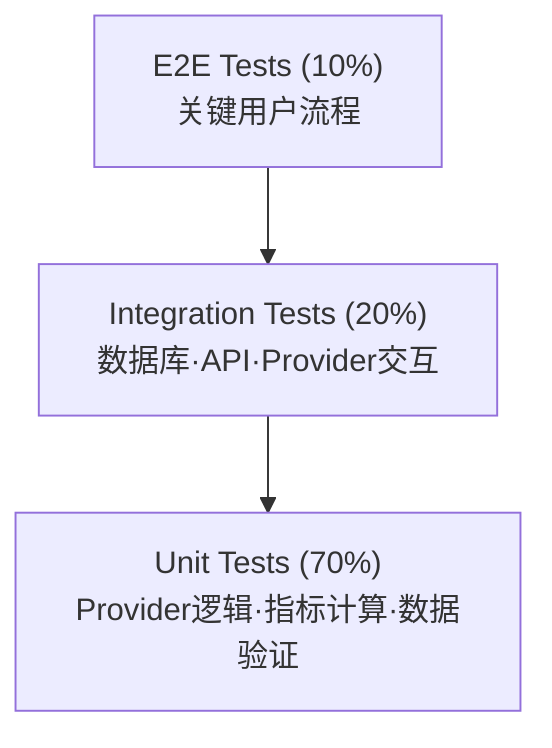
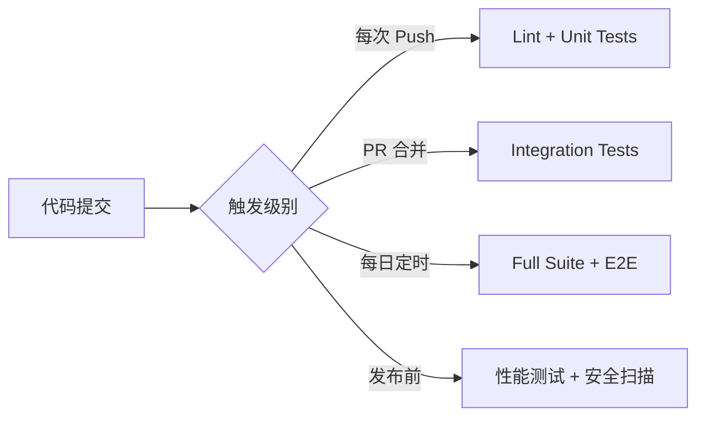

# 测试设计

> **文档编号**: 22  
> **版本**: 1.0  
> **状态**: Draft  
> **最后更新**: 2026-09-27

## 概述

BTC 全市场智能研究平台是一套需要长期稳定运行的数据密集型系统。测试策略必须覆盖：数据源可靠性、故障切换正确性、计算精度、数据完整性、系统稳定性等核心能力。本文档定义完整的测试金字塔、框架选型、各类测试方案及 CI/CD 集成。

**测试目标**：
- 任何 Provider 故障不导致系统崩溃
- 数据计算结果可验证、可重现
- 回测无未来数据泄漏
- 系统可 7×24 小时稳定运行

---

## 目录

1. [测试金字塔](#1-测试金字塔)
2. [测试框架选型](#2-测试框架选型)
3. [Provider 测试](#3-provider-测试)
4. [故障切换测试](#4-故障切换测试)
5. [数据完整性测试](#5-数据完整性测试)
6. [指标计算测试](#6-指标计算测试)
7. [回测测试](#7-回测测试)
8. [长时间运行测试](#8-长时间运行测试)
9. [CI/CD 测试流程](#9-cicd-测试流程)

---

## 1. 测试金字塔



### 1.1 测试层级定义

| 层级 | 占比 | 范围 | 速度 | 依赖 |
|------|------|------|------|------|
| Unit Tests | 70% | 单函数/类逻辑 | 毫秒级 | 无外部依赖 |
| Integration Tests | 20% | 模块间交互、数据库操作、API 端点 | 秒级 | 数据库容器 |
| E2E Tests | 10% | 完整用户流程 | 十秒级 | 全部服务 |

### 1.2 测试分布

| 模块 | Unit | Integration | E2E | 总计 |
|------|------|-------------|-----|------|
| Providers (数据源) | 50+ | 20+ | - | 70+ |
| Failover Engine | 20+ | 10+ | 5 | 35+ |
| Indicators (指标) | 40+ | 5 | - | 45+ |
| Backtest Engine | 15+ | 10+ | 3 | 28+ |
| API Endpoints | - | 30+ | 5 | 35+ |
| Data Quality | 15+ | 10+ | - | 25+ |
| Portfolio/Plan | 10+ | 10+ | 3 | 23+ |
| Frontend | - | - | 10+ | 10+ |
| **总计** | **150+** | **95+** | **26+** | **271+** |

### 1.3 测试命名规范

```
tests/
├── unit/
│   ├── providers/
│   │   ├── test_binance_provider.py
│   │   ├── test_coinbase_provider.py
│   │   └── test_provider_failover.py
│   ├── indicators/
│   │   ├── test_rsi.py
│   │   ├── test_macd.py
│   │   └── test_bollinger.py
│   ├── engines/
│   │   ├── test_cycle_engine.py
│   │   ├── test_valuation_engine.py
│   │   └── test_risk_engine.py
│   └── data_quality/
│       ├── test_validation.py
│       └── test_cross_validation.py
├── integration/
│   ├── test_database_operations.py
│   ├── test_api_endpoints.py
│   ├── test_provider_persistence.py
│   └── test_scheduler.py
├── e2e/
│   ├── test_homepage_flow.py
│   ├── test_backtest_flow.py
│   └── test_failover_recovery.py
└── fixtures/
    ├── mock_responses/
    ├── sample_data/
    └── conftest.py
```

---

## 2. 测试框架选型

### 2.1 后端测试框架

| 框架 | 用途 | 版本要求 |
|------|------|---------|
| pytest | 测试运行器 & 断言 | >=8.3 |
| pytest-asyncio | 异步测试支持 | >=0.24 |
| pytest-cov | 覆盖率报告 | >=6.0 |
| httpx (AsyncClient) | API 测试客户端 | >=0.27 |
| respx | HTTP mock (httpx) | >=0.21 |
| testcontainers | 数据库集成测试 | >=4.0 |
| factory_boy | 测试数据工厂 | >=3.3 |
| faker | 伪造数据生成 | >=30.0 |
| freezegun | 时间冻结 | >=1.4 |
| pytest-timeout | 测试超时控制 | >=2.3 |

### 2.2 前端测试框架

| 框架 | 用途 |
|------|------|
| vitest | 单元测试 |
| @testing-library/react | 组件测试 |
| playwright | E2E 测试 |
| msw | API mock |

### 2.3 pyproject.toml 测试配置

```toml
[project.optional-dependencies]
dev = [
    "pytest>=8.3.0",
    "pytest-asyncio>=0.24.0",
    "pytest-cov>=6.0.0",
    "pytest-timeout>=2.3.0",
    "httpx>=0.27.2",
    "respx>=0.21.0",
    "testcontainers[postgres]>=4.0.0",
    "factory-boy>=3.3.0",
    "faker>=30.0.0",
    "freezegun>=1.4.0",
    "ruff>=0.7.0",
    "mypy>=1.13.0",
]

[tool.pytest.ini_options]
asyncio_mode = "auto"
testpaths = ["tests"]
pythonpath = ["."]
timeout = 60
markers = [
    "unit: 单元测试（无外部依赖）",
    "integration: 集成测试（需要数据库/服务）",
    "e2e: 端到端测试",
    "slow: 耗时测试（>10s）",
    "failover: 故障切换测试",
    "backtest: 回测相关测试",
    "leak_detection: 数据泄漏检测",
]
addopts = "-v --tb=short --strict-markers"
filterwarnings = ["ignore::DeprecationWarning"]

[tool.coverage.run]
source = ["app"]
omit = ["tests/*", "*/migrations/*"]

[tool.coverage.report]
fail_under = 80
show_missing = true
exclude_lines = ["pragma: no cover", "if TYPE_CHECKING:"]
```

### 2.4 conftest.py 基础 Fixtures

```python
# backend/tests/conftest.py
"""全局测试 Fixtures"""

import asyncio
from typing import AsyncGenerator

import pytest
import pytest_asyncio
from httpx import ASGITransport, AsyncClient
from sqlalchemy.ext.asyncio import AsyncSession, create_async_engine
from testcontainers.postgres import PostgresContainer

from app.core.config import settings
from app.main import app


# ===== 事件循环 =====
@pytest.fixture(scope="session")
def event_loop():
    loop = asyncio.new_event_loop()
    yield loop
    loop.close()


# ===== 数据库容器 =====
@pytest.fixture(scope="session")
def postgres_container():
    """启动测试用 PostgreSQL + TimescaleDB 容器"""
    with PostgresContainer(
        image="timescale/timescaledb:latest-pg16",
        dbname="test_btc",
        username="test_user",
        password="test_pass",
    ) as pg:
        yield pg


@pytest_asyncio.fixture
async def db_session(postgres_container) -> AsyncGenerator[AsyncSession, None]:
    """提供数据库会话"""
    engine = create_async_engine(postgres_container.get_connection_url())
    async with AsyncSession(engine) as session:
        yield session
        await session.rollback()
    await engine.dispose()


# ===== API 客户端 =====
@pytest_asyncio.fixture
async def client() -> AsyncGenerator[AsyncClient, None]:
    """提供测试用 HTTP 客户端"""
    transport = ASGITransport(app=app)
    async with AsyncClient(transport=transport, base_url="http://test") as ac:
        yield ac


# ===== Mock Provider =====
@pytest.fixture
def mock_market_data():
    """模拟市场行情数据"""
    return {
        "symbol": "BTCUSDT",
        "price": 105000.50,
        "timestamp": "2026-09-27T10:00:00Z",
        "volume_24h": 25000000000,
        "high_24h": 106500.00,
        "low_24h": 103200.00,
    }


@pytest.fixture
def mock_provider_config():
    """模拟 Provider 配置"""
    return {
        "name": "test_provider",
        "category": "market",
        "enabled": True,
        "priority": 1,
        "timeout": 10,
        "retry_count": 3,
        "failure_threshold": 3,
        "recovery_threshold": 5,
    }
```

---

## 3. Provider 测试

### 3.1 测试覆盖要求

每个 Provider 必须覆盖以下场景（对应需求文档第四十节）：

| # | 场景 | 预期行为 | Mock 方式 |
|---|------|---------|-----------|
| 1 | 正常响应 | 返回解析后的数据 | respx 返回标准 JSON |
| 2 | HTTP 超时 | 触发 Failover，标记 SLOW | respx 设置延迟 |
| 3 | 429 限流 | 降低频率，等待后重试 | respx 返回 429 + Retry-After |
| 4 | 403 认证失败 | 标记 AUTH_ERROR，不重试 | respx 返回 403 |
| 5 | 500 服务器错误 | 重试后 Failover | respx 返回 500 |
| 6 | 502/503 网关错误 | 重试 + Failover | respx 返回 502 |
| 7 | DNS 失败 | 立即 Failover | 模拟 DNS 异常 |
| 8 | TLS 错误 | 立即 Failover | 模拟 SSL 异常 |
| 9 | 空数据 | 标记 DATA_ERROR，尝试下一个 | respx 返回空数组/null |
| 10 | 格式异常 | 标记 DATA_ERROR，通知管理员 | respx 返回错误格式 |
| 11 | 数据质量异常 | 拒绝数据，不覆盖正确值 | 返回超出范围的值 |
| 12 | 数据过期 | 标记 stale，尝试其他源 | 返回过去时间戳 |

### 3.2 Provider 单元测试模板

```python
# backend/tests/unit/providers/test_binance_provider.py
"""Binance Provider 完整测试"""

import httpx
import pytest
import respx
from freezegun import freeze_time

from app.providers.market.binance import BinanceProvider


@pytest.fixture
def provider():
    return BinanceProvider(api_key="test_key", api_secret="test_secret")


class TestBinanceProviderNormal:
    """正常响应测试"""

    @respx.mock
    @freeze_time("2026-09-27 10:00:00")
    async def test_get_current_price_success(self, provider):
        """正常获取价格"""
        respx.get("https://api.binance.com/api/v3/ticker/price").mock(
            return_value=httpx.Response(200, json={
                "symbol": "BTCUSDT",
                "price": "105000.50"
            })
        )
        
        result = await provider.get_current_price("BTC")
        
        assert result.price == 105000.50
        assert result.symbol == "BTCUSDT"
        assert result.source == "binance"
        assert result.quality_status == "VERIFIED"

    @respx.mock
    async def test_get_ohlcv_success(self, provider):
        """正常获取K线数据"""
        respx.get("https://api.binance.com/api/v3/klines").mock(
            return_value=httpx.Response(200, json=[
                [1727395200000, "105000.0", "106500.0", "103200.0", "105800.0", "12345.6",
                 1727481599999, "1300000000.0", 50000, "6000.0", "635000000.0", "0"]
            ])
        )
        
        result = await provider.get_ohlcv("BTC", interval="1d", limit=1)
        
        assert len(result) == 1
        assert result[0].open == 105000.0
        assert result[0].close == 105800.0


class TestBinanceProviderErrors:
    """错误场景测试"""

    @respx.mock
    async def test_timeout_triggers_failover(self, provider):
        """HTTP 超时触发故障切换"""
        respx.get("https://api.binance.com/api/v3/ticker/price").mock(
            side_effect=httpx.ReadTimeout("Request timed out")
        )
        
        with pytest.raises(httpx.ReadTimeout):
            await provider.get_current_price("BTC")
        
        # 验证 Provider 状态已更新
        assert provider.health_status in ("SLOW", "NETWORK_ERROR")

    @respx.mock
    async def test_rate_limit_429(self, provider):
        """429 限流处理"""
        respx.get("https://api.binance.com/api/v3/ticker/price").mock(
            return_value=httpx.Response(429, headers={"Retry-After": "60"})
        )
        
        with pytest.raises(provider.RateLimitError):
            await provider.get_current_price("BTC")
        
        assert provider.health_status == "RATE_LIMITED"
        assert provider.rate_limit_until is not None

    @respx.mock
    async def test_auth_error_403(self, provider):
        """403 认证失败"""
        respx.get("https://api.binance.com/api/v3/ticker/price").mock(
            return_value=httpx.Response(403, json={"msg": "Invalid API key"})
        )
        
        with pytest.raises(provider.AuthError):
            await provider.get_current_price("BTC")
        
        assert provider.health_status == "AUTH_ERROR"
        # 403 不应重试
        assert provider.consecutive_failures == 1

    @respx.mock
    async def test_server_error_500(self, provider):
        """500 服务器错误"""
        respx.get("https://api.binance.com/api/v3/ticker/price").mock(
            return_value=httpx.Response(500, text="Internal Server Error")
        )
        
        with pytest.raises(provider.ServerError):
            await provider.get_current_price("BTC")

    @respx.mock
    async def test_empty_response(self, provider):
        """空数据响应"""
        respx.get("https://api.binance.com/api/v3/ticker/price").mock(
            return_value=httpx.Response(200, json={})
        )
        
        with pytest.raises(provider.DataError):
            await provider.get_current_price("BTC")
        
        assert provider.health_status == "DATA_ERROR"

    @respx.mock
    async def test_malformed_response(self, provider):
        """格式异常响应"""
        respx.get("https://api.binance.com/api/v3/ticker/price").mock(
            return_value=httpx.Response(200, json={"unexpected": "format"})
        )
        
        with pytest.raises(provider.DataFormatError):
            await provider.get_current_price("BTC")

    @respx.mock
    async def test_stale_data_detection(self, provider):
        """数据过期检测"""
        respx.get("https://api.binance.com/api/v3/ticker/price").mock(
            return_value=httpx.Response(200, json={
                "symbol": "BTCUSDT",
                "price": "105000.50",
                "time": 1727308800000  # 24小时前的时间戳
            })
        )
        
        result = await provider.get_current_price("BTC")
        
        assert result.quality_status == "STALE"

    @respx.mock
    async def test_dns_failure(self, provider):
        """DNS 解析失败"""
        respx.get("https://api.binance.com/api/v3/ticker/price").mock(
            side_effect=httpx.ConnectError("DNS resolution failed")
        )
        
        with pytest.raises(httpx.ConnectError):
            await provider.get_current_price("BTC")
        
        assert provider.health_status == "NETWORK_ERROR"
```

### 3.3 数据质量验证测试

```python
# backend/tests/unit/providers/test_data_quality.py
"""数据质量验证测试"""

import pytest

from app.providers.base.quality_checker import DataQualityChecker


class TestDataQualityChecker:
    """数据质量检查器测试"""

    @pytest.fixture
    def checker(self):
        return DataQualityChecker(
            price_range=(1000, 1_000_000),  # BTC 合理价格范围
            max_deviation_percent=5.0,       # 与前一数据点最大偏差
            max_age_seconds=300,             # 数据最大年龄
        )

    def test_valid_price(self, checker):
        """正常价格通过验证"""
        assert checker.validate_price(105000.0) is True

    def test_price_too_low(self, checker):
        """价格异常低"""
        assert checker.validate_price(100.0) is False

    def test_price_too_high(self, checker):
        """价格异常高"""
        assert checker.validate_price(10_000_000.0) is False

    def test_price_zero(self, checker):
        """价格为零"""
        assert checker.validate_price(0.0) is False

    def test_price_negative(self, checker):
        """价格为负"""
        assert checker.validate_price(-100.0) is False

    def test_sudden_spike_detection(self, checker):
        """突然飙升检测（可能是数据错误）"""
        previous = 105000.0
        current = 210000.0  # 翻倍 -> 异常
        assert checker.validate_deviation(current, previous) is False

    def test_normal_fluctuation(self, checker):
        """正常波动通过验证"""
        previous = 105000.0
        current = 106000.0  # ~1% -> 正常
        assert checker.validate_deviation(current, previous) is True

    def test_stale_data_detection(self, checker):
        """过期数据检测"""
        from datetime import datetime, timedelta
        old_time = datetime.utcnow() - timedelta(minutes=10)
        assert checker.validate_freshness(old_time) is False

    def test_fresh_data(self, checker):
        """新鲜数据通过"""
        from datetime import datetime
        now = datetime.utcnow()
        assert checker.validate_freshness(now) is True
```

---

## 4. 故障切换测试

### 4.1 故障切换测试矩阵

| # | 场景 | 初始状态 | 触发事件 | 预期结果 |
|---|------|---------|---------|---------|
| 1 | 主→备切换 | A(Primary), B(Backup) | A 超时 | B 接管，记录 FailoverEvent |
| 2 | 备→三切换 | A(Down), B(Primary), C(Backup) | B 也失败 | C 接管 |
| 3 | 全部断开 | 所有 Provider 失败 | 网络断开 | 使用缓存，标记 stale，不产生假数据 |
| 4 | 恢复提升 | A(Down), B(Active) | A 连续成功 N 次 | A 提升为 Primary |
| 5 | 抖动防护 | A 恢复后再次失败 | A 成功1次又失败 | A 不提升，B 继续服务 |
| 6 | 限流切换 | A 被限流 | 429 响应 | 切换 B，A 进入冷却期 |
| 7 | 数据冲突 | A、B 数据不一致 | 交叉验证 | 记录冲突，选择多数一致的值 |

### 4.2 故障切换集成测试

```python
# backend/tests/integration/test_failover.py
"""故障切换集成测试"""

import pytest
from unittest.mock import AsyncMock, patch
from datetime import datetime

from app.providers.base.failover_engine import FailoverEngine
from app.providers.base.health_monitor import HealthMonitor
from app.models.provider import ProviderStatus


@pytest.mark.failover
class TestFailoverEngine:
    """故障切换引擎测试"""

    @pytest.fixture
    async def failover_engine(self):
        """初始化故障切换引擎，配置3个Provider"""
        engine = FailoverEngine()
        await engine.register_provider("provider_a", priority=1, category="market")
        await engine.register_provider("provider_b", priority=2, category="market")
        await engine.register_provider("provider_c", priority=3, category="market")
        return engine

    async def test_primary_failover_to_backup(self, failover_engine):
        """测试1: 主Provider断开 -> 备用自动接管"""
        # 模拟 Provider A 失败
        failover_engine.report_failure("provider_a", reason="timeout")
        failover_engine.report_failure("provider_a", reason="timeout")
        failover_engine.report_failure("provider_a", reason="timeout")
        
        # 达到失败阈值，应该切换
        active = await failover_engine.get_active_provider("market")
        assert active == "provider_b"
        
        # 验证 Failover Event 已记录
        events = await failover_engine.get_failover_events(category="market")
        assert len(events) >= 1
        assert events[-1].from_provider == "provider_a"
        assert events[-1].to_provider == "provider_b"
        assert events[-1].reason == "timeout"

    async def test_cascading_failover(self, failover_engine):
        """测试2: 备用也断开 -> 第三Provider接管"""
        # A 失败
        for _ in range(3):
            failover_engine.report_failure("provider_a", reason="timeout")
        
        # B 也失败
        for _ in range(3):
            failover_engine.report_failure("provider_b", reason="server_error")
        
        active = await failover_engine.get_active_provider("market")
        assert active == "provider_c"

    async def test_all_providers_down_no_fake_data(self, failover_engine):
        """测试3: 全部断开 -> 不产生假数据，使用缓存，标记stale"""
        # 所有 Provider 失败
        for provider in ["provider_a", "provider_b", "provider_c"]:
            for _ in range(3):
                failover_engine.report_failure(provider, reason="network_error")
        
        active = await failover_engine.get_active_provider("market")
        assert active is None  # 无可用 Provider
        
        # 验证系统返回缓存数据并标记 stale
        cached = await failover_engine.get_cached_data("market", "BTC_price")
        assert cached is not None
        assert cached.quality_status == "STALE"
        assert cached.last_updated is not None
        
        # 绝不能返回假数据
        assert cached.is_fabricated is False

    async def test_recovery_threshold_promotion(self, failover_engine):
        """测试4: Provider恢复 -> 满足Recovery Threshold后提升为Primary"""
        # A 失败并切换
        for _ in range(3):
            failover_engine.report_failure("provider_a", reason="timeout")
        
        assert await failover_engine.get_active_provider("market") == "provider_b"
        
        # A 恢复，但未达到恢复阈值
        failover_engine.report_success("provider_a")
        failover_engine.report_success("provider_a")
        assert await failover_engine.get_active_provider("market") == "provider_b"  # 还没提升
        
        # 达到恢复阈值（连续成功3次）
        failover_engine.report_success("provider_a")
        
        # A 应该被提升为 Primary
        active = await failover_engine.get_active_provider("market")
        assert active == "provider_a"

    async def test_flapping_protection(self, failover_engine):
        """测试5: 抖动防护 - 反复失败不会快速切换"""
        # A 失败切换
        for _ in range(3):
            failover_engine.report_failure("provider_a", reason="timeout")
        
        # A 恢复1次又失败
        failover_engine.report_success("provider_a")
        failover_engine.report_failure("provider_a", reason="timeout")
        
        # 恢复计数应该重置
        assert failover_engine.get_consecutive_successes("provider_a") == 0
        # B 仍然是 Active
        assert await failover_engine.get_active_provider("market") == "provider_b"

    async def test_data_continuity_during_failover(self, failover_engine):
        """测试6: 切换过程数据连续性验证"""
        # 记录切换前最后数据
        failover_engine.report_failure("provider_a", reason="timeout")
        failover_engine.report_failure("provider_a", reason="timeout")
        
        last_data_before = await failover_engine.get_cached_data("market", "BTC_price")
        
        # 完成切换
        failover_engine.report_failure("provider_a", reason="timeout")
        
        # B 提供新数据
        await failover_engine.update_data("provider_b", "market", "BTC_price", {
            "price": 105100.0,
            "timestamp": datetime.utcnow()
        })
        
        current_data = await failover_engine.get_cached_data("market", "BTC_price")
        
        # 数据应该连续（不能有间隙）
        assert current_data is not None
        assert current_data.price > 0
```

### 4.3 断网运行测试

```python
# backend/tests/integration/test_offline_mode.py
"""断网/离线运行测试"""

import pytest
from unittest.mock import patch

from app.services.market_service import MarketService


@pytest.mark.integration
class TestOfflineMode:
    """系统断网降级运行测试"""

    async def test_all_network_down_graceful_degradation(self):
        """全部网络断开时系统降级运行"""
        service = MarketService()
        
        # 模拟所有网络请求失败
        with patch("httpx.AsyncClient.get", side_effect=Exception("Network unreachable")):
            result = await service.get_btc_price()
        
        # 应该返回缓存数据
        assert result is not None
        assert result.status == "stale"
        assert result.last_updated is not None
        assert "数据暂时无法更新" in result.message

    async def test_historical_data_available_offline(self):
        """离线时历史数据仍可查询"""
        service = MarketService()
        
        with patch("httpx.AsyncClient.get", side_effect=Exception("Network unreachable")):
            # 历史数据应该从本地数据库读取
            history = await service.get_historical_prices("BTC", days=30)
        
        assert history is not None
        assert len(history) > 0  # 本地数据应该存在

    async def test_partial_failure_isolation(self):
        """局部故障不影响整体系统"""
        service = MarketService()
        
        # 只有链上数据源断开
        with patch(
            "app.providers.onchain.base.OnChainProvider.fetch",
            side_effect=Exception("OnChain API down")
        ):
            # 市场行情应该正常
            price = await service.get_btc_price()
            assert price is not None
            assert price.status != "error"
            
            # 链上数据应该降级
            onchain = await service.get_onchain_metrics()
            assert onchain.status == "unavailable"
            assert "数据暂时不可用" in onchain.message
```

---

## 5. 数据完整性测试

### 5.1 历史数据完整性

```python
# backend/tests/integration/test_data_integrity.py
"""数据完整性测试"""

import pytest
from datetime import date, timedelta

from app.services.data_quality_service import DataQualityService


@pytest.mark.integration
class TestHistoricalDataIntegrity:
    """历史数据完整性验证"""

    async def test_no_missing_daily_candles(self, db_session):
        """日线数据无缺失"""
        service = DataQualityService(db_session)
        
        # 检查 2020-01-01 至今的每日K线
        gaps = await service.find_gaps(
            table="candles",
            interval="1d",
            start=date(2020, 1, 1),
            end=date.today(),
        )
        
        assert len(gaps) == 0, f"发现 {len(gaps)} 个数据缺口: {gaps[:5]}"

    async def test_price_range_validation(self, db_session):
        """价格范围合理性检查"""
        service = DataQualityService(db_session)
        
        anomalies = await service.find_anomalies(
            table="market_prices",
            column="price",
            min_value=1000,        # BTC 不可能低于 $1000（2020年后）
            max_value=10_000_000,  # 合理上限
        )
        
        assert len(anomalies) == 0, f"发现 {len(anomalies)} 个异常价格"

    async def test_time_series_continuity(self, db_session):
        """时间序列连续性验证"""
        service = DataQualityService(db_session)
        
        result = await service.check_continuity(
            table="candles",
            time_column="open_time",
            expected_interval=timedelta(days=1),
            tolerance=timedelta(hours=1),
        )
        
        assert result.is_continuous, f"时间序列不连续: {result.gaps[:5]}"

    async def test_raw_to_normalized_conversion(self, db_session):
        """Raw -> Normalized 转换正确性"""
        service = DataQualityService(db_session)
        
        # 随机抽样验证
        samples = await service.get_random_raw_samples(table="raw_market_data", limit=100)
        
        for sample in samples:
            normalized = await service.get_normalized(sample.id)
            assert normalized is not None, f"Raw ID {sample.id} 无对应 Normalized 数据"
            assert normalized.source_id == sample.provider_id
            # 验证数值转换正确（单位、精度）
            assert abs(normalized.price - float(sample.raw_payload["price"])) < 0.01
```

### 5.2 数据交叉验证测试

```python
# backend/tests/unit/test_cross_validation.py
"""多数据源交叉验证测试"""

import pytest

from app.services.cross_validation import CrossValidator


class TestCrossValidator:
    """交叉验证逻辑测试"""

    @pytest.fixture
    def validator(self):
        return CrossValidator(max_deviation_percent=1.0)

    def test_consistent_sources(self, validator):
        """多源数据一致"""
        prices = {
            "binance": 105000.0,
            "coinbase": 105020.0,
            "kraken": 104980.0,
        }
        
        result = validator.validate(prices)
        
        assert result.status == "VERIFIED"
        assert result.median_price == 105000.0
        assert result.max_deviation_percent < 1.0

    def test_conflicting_sources(self, validator):
        """数据源冲突"""
        prices = {
            "binance": 105000.0,
            "coinbase": 108000.0,  # 异常偏差 ~3%
            "kraken": 105100.0,
        }
        
        result = validator.validate(prices)
        
        assert result.status == "CONFLICT"
        assert result.outlier_sources == ["coinbase"]
        assert result.conflict_details is not None

    def test_majority_consensus(self, validator):
        """多数一致性判定"""
        prices = {
            "binance": 105000.0,
            "coinbase": 105010.0,
            "kraken": 104990.0,
            "okx": 110000.0,  # 明显异常
        }
        
        result = validator.validate(prices)
        
        # 多数一致，标记异常源
        assert result.status == "VERIFIED"
        assert "okx" in result.outlier_sources
        # 最终价格使用多数一致的中位数
        assert abs(result.final_price - 105000.0) < 100
```

---

## 6. 指标计算测试

### 6.1 已知输入/输出验证

```python
# backend/tests/unit/indicators/test_rsi.py
"""RSI 指标计算测试 - 与已知结果对比验证"""

import numpy as np
import pytest

from app.indicators.technical import calculate_rsi


class TestRSI:
    """RSI (Relative Strength Index) 计算测试"""

    def test_known_values(self):
        """与 TradingView 已知结果对比"""
        # 使用 BTC 2024-01-01 至 2024-01-15 真实日线收盘价
        closes = np.array([
            42500, 43200, 43800, 42900, 44100, 44500, 43800,
            44200, 45000, 44800, 45500, 46200, 45800, 46500, 47000
        ])
        
        rsi = calculate_rsi(closes, period=14)
        
        # 与 TradingView 计算结果对比（允许小数误差）
        expected_last_rsi = 72.5  # TradingView 显示值
        assert abs(rsi[-1] - expected_last_rsi) < 1.0

    def test_rsi_range(self):
        """RSI 值必须在 0-100 之间"""
        np.random.seed(42)
        prices = np.cumsum(np.random.randn(100)) + 50000
        
        rsi = calculate_rsi(prices, period=14)
        valid_rsi = rsi[~np.isnan(rsi)]
        
        assert np.all(valid_rsi >= 0)
        assert np.all(valid_rsi <= 100)

    def test_all_gains(self):
        """持续上涨时 RSI 接近 100"""
        closes = np.arange(100, 130, 1.0)  # 连续上涨
        
        rsi = calculate_rsi(closes, period=14)
        
        assert rsi[-1] > 90

    def test_all_losses(self):
        """持续下跌时 RSI 接近 0"""
        closes = np.arange(130, 100, -1.0)  # 连续下跌
        
        rsi = calculate_rsi(closes, period=14)
        
        assert rsi[-1] < 10

    def test_flat_market(self):
        """横盘时 RSI 接近 50"""
        closes = np.full(50, 100000.0)
        closes += np.random.randn(50) * 10  # 微小波动
        
        rsi = calculate_rsi(closes, period=14)
        
        assert 40 < rsi[-1] < 60

    def test_insufficient_data(self):
        """数据不足时返回 NaN"""
        closes = np.array([100000, 101000, 102000])  # 只有3个数据点
        
        rsi = calculate_rsi(closes, period=14)
        
        assert np.all(np.isnan(rsi[:14]))

    def test_precision(self):
        """精度验证 - 小数位数"""
        closes = np.array([42000 + i * 100.5 for i in range(50)])
        
        rsi = calculate_rsi(closes, period=14)
        
        # RSI 应保留至少2位小数精度
        valid_rsi = rsi[~np.isnan(rsi)]
        assert valid_rsi.dtype in (np.float64, np.float32)
```

### 6.2 指标测试覆盖清单

| 指标 | 测试项 | 参考来源 |
|------|--------|---------|
| RSI | 已知值、范围、边界 | TradingView |
| MACD | 金叉/死叉检测、信号线 | TradingView |
| Bollinger Bands | 带宽计算、突破检测 | TradingView |
| EMA/SMA | 周期验证、收敛性 | 手动计算 |
| ATR | 波动率范围 | 历史数据 |
| MVRV | 与 Glassnode 对比 | Glassnode |
| SOPR | 与已知数据对比 | Glassnode |
| NUPL | 范围验证 | 学术论文 |
| Funding Rate | 范围合理性 | Binance |

### 6.3 精度对比测试框架

```python
# backend/tests/unit/indicators/test_precision.py
"""指标精度对比测试 - 与第三方计算结果验证"""

import pytest
import numpy as np
import polars as pl


class TestIndicatorPrecision:
    """与第三方数据源对比验证计算精度"""

    TOLERANCE = 0.01  # 允许 1% 误差（不同实现细节差异）

    @pytest.fixture
    def btc_daily_data(self):
        """加载测试用 BTC 日线数据（固定数据集）"""
        # 使用 2024 年真实数据作为测试基准
        return pl.read_csv("tests/fixtures/sample_data/btc_daily_2024.csv")

    def test_rsi_matches_reference(self, btc_daily_data):
        """RSI 与参考实现对比"""
        from app.indicators.technical import calculate_rsi
        
        closes = btc_daily_data["close"].to_numpy()
        our_rsi = calculate_rsi(closes, period=14)
        
        # 参考值（来自 ta-lib 或 TradingView 导出）
        reference_rsi = btc_daily_data["rsi_14_ref"].to_numpy()
        
        # 跳过前14个 NaN 值
        valid_mask = ~np.isnan(reference_rsi)
        np.testing.assert_allclose(
            our_rsi[valid_mask], 
            reference_rsi[valid_mask], 
            rtol=self.TOLERANCE
        )

    def test_macd_matches_reference(self, btc_daily_data):
        """MACD 与参考实现对比"""
        from app.indicators.technical import calculate_macd
        
        closes = btc_daily_data["close"].to_numpy()
        macd, signal, histogram = calculate_macd(closes)
        
        ref_macd = btc_daily_data["macd_ref"].to_numpy()
        valid_mask = ~np.isnan(ref_macd)
        
        np.testing.assert_allclose(
            macd[valid_mask], ref_macd[valid_mask], rtol=self.TOLERANCE
        )
```

---

## 7. 回测测试

### 7.1 未来数据泄漏检测

```python
# backend/tests/unit/backtest/test_lookahead_bias.py
"""未来数据泄漏（Look-ahead Bias）检测测试"""

import pytest
from datetime import date, datetime

from app.backtest.engine import BacktestEngine
from app.backtest.data_feeder import HistoricalDataFeeder


@pytest.mark.leak_detection
class TestLookaheadBias:
    """防止未来数据泄漏"""

    async def test_no_future_price_access(self):
        """回测过程中不能访问未来价格"""
        engine = BacktestEngine()
        feeder = HistoricalDataFeeder(
            start_date=date(2020, 1, 1),
            end_date=date(2024, 12, 31)
        )
        
        # 模拟在 2022-01-01 时点
        current_date = date(2022, 1, 1)
        feeder.set_current_date(current_date)
        
        # 尝试访问未来数据应该被阻止
        with pytest.raises(feeder.FutureDataAccessError):
            await feeder.get_price(date(2022, 6, 1))  # 未来日期
        
        with pytest.raises(feeder.FutureDataAccessError):
            await feeder.get_price(date(2023, 1, 1))  # 更远的未来

    async def test_macro_data_release_date(self):
        """宏观数据必须使用 Release Date 而非 Observation Date"""
        feeder = HistoricalDataFeeder(start_date=date(2020, 1, 1))
        
        # 2022年1月CPI数据的 Release Date 是 2022-02-10
        feeder.set_current_date(date(2022, 2, 1))
        
        # 在 Release Date 之前，不应该能获取到该数据
        cpi = await feeder.get_macro_data("CPI", as_of=date(2022, 2, 1))
        assert cpi is None or cpi.observation_date < date(2022, 1, 1)
        
        # Release Date 之后可以获取
        feeder.set_current_date(date(2022, 2, 11))
        cpi = await feeder.get_macro_data("CPI", as_of=date(2022, 2, 11))
        assert cpi is not None

    async def test_no_revised_data_in_backtest(self):
        """回测不能使用后来修订的数据"""
        feeder = HistoricalDataFeeder(start_date=date(2020, 1, 1))
        feeder.set_current_date(date(2022, 3, 1))
        
        # GDP 初值和修订值不同
        gdp = await feeder.get_macro_data("GDP", as_of=date(2022, 3, 1))
        
        # 应该获取当时可用的版本，不是最新修订版
        assert gdp.revision_date <= date(2022, 3, 1)

    async def test_indicator_calculation_no_lookahead(self):
        """指标计算不使用未来数据"""
        engine = BacktestEngine()
        
        # 运行回测到某个日期
        result = await engine.run_until(date(2022, 6, 15))
        
        # 验证计算使用的数据范围
        for indicator in result.indicators_used:
            assert indicator.data_end_date <= date(2022, 6, 15), \
                f"指标 {indicator.name} 使用了未来数据: {indicator.data_end_date}"

    async def test_survivorship_bias_prevention(self):
        """防止幸存者偏差"""
        engine = BacktestEngine()
        
        # 回测应该包含已退市/停止的 Provider 数据
        result = await engine.run(start=date(2020, 1, 1), end=date(2024, 12, 31))
        
        # 验证数据源包含历史所有 Provider（含已停止的）
        providers_used = set(result.data_sources.keys())
        assert len(providers_used) >= 3  # 应该使用多个历史数据源
```

### 7.2 回测可重现性测试

```python
# backend/tests/unit/backtest/test_reproducibility.py
"""回测结果可重现性测试"""

import pytest

from app.backtest.engine import BacktestEngine


class TestBacktestReproducibility:
    """回测结果必须可重现"""

    async def test_same_input_same_output(self):
        """相同输入产生相同输出"""
        config = {
            "initial_capital": 100000,
            "monthly_investment": 5000,
            "strategy": "fixed_dca",
            "start_date": "2020-01-01",
            "end_date": "2024-12-31",
            "fee_rate": 0.001,
            "slippage": 0.0005,
        }
        
        engine = BacktestEngine(config)
        
        result1 = await engine.run()
        result2 = await engine.run()
        
        assert result1.final_value == result2.final_value
        assert result1.total_return == result2.total_return
        assert result1.max_drawdown == result2.max_drawdown
        assert result1.sharpe_ratio == result2.sharpe_ratio

    async def test_deterministic_random(self):
        """涉及随机性的策略必须可设定种子"""
        config = {
            "strategy": "monte_carlo",
            "random_seed": 42,
            "simulations": 100,
        }
        
        engine = BacktestEngine(config)
        
        result1 = await engine.run()
        result2 = await engine.run()
        
        assert result1.final_value == result2.final_value
```

### 7.3 极端行情测试

```python
# backend/tests/unit/backtest/test_extreme_events.py
"""极端行情回测测试"""

import pytest
from datetime import date

from app.backtest.engine import BacktestEngine


@pytest.mark.backtest
class TestExtremeMarketEvents:
    """极端行情事件回测"""

    async def test_black_thursday_2020_03_12(self):
        """2020-03-12 黑色星期四（BTC 从 $7900 跌至 $3800）"""
        engine = BacktestEngine({
            "start_date": "2020-03-01",
            "end_date": "2020-03-31",
            "initial_capital": 100000,
            "strategy": "fixed_dca",
        })
        
        result = await engine.run()
        
        # 系统应该正确处理极端波动
        assert result is not None
        assert result.max_drawdown > 0.3  # 至少30%回撤
        # 不应崩溃或产生异常值
        assert 0 < result.final_value < result.initial_capital * 2

    async def test_may_crash_2021_05_19(self):
        """2021-05-19 大崩盘（BTC 从 $43000 跌至 $30000）"""
        engine = BacktestEngine({
            "start_date": "2021-05-01",
            "end_date": "2021-06-30",
            "initial_capital": 100000,
            "strategy": "fixed_dca",
        })
        
        result = await engine.run()
        
        assert result is not None
        assert result.max_drawdown > 0.2
        # 验证没有使用未来数据
        assert result.data_end_date <= date(2021, 6, 30)

    async def test_ftx_collapse_2022_11(self):
        """2022-11 FTX 崩盘"""
        engine = BacktestEngine({
            "start_date": "2022-11-01",
            "end_date": "2022-12-31",
            "initial_capital": 100000,
            "strategy": "fixed_dca",
        })
        
        result = await engine.run()
        
        assert result is not None
        # 系统应该在极端情况下仍然正常完成回测
        assert result.status == "completed"
```

---

## 8. 长时间运行测试

### 8.1 内存泄漏检测

```python
# backend/tests/integration/test_memory_leak.py
"""内存泄漏检测测试"""

import gc
import os
import pytest
import psutil
import asyncio


@pytest.mark.slow
class TestMemoryLeak:
    """内存泄漏检测"""

    async def test_provider_pool_memory_stable(self):
        """Provider 连接池内存稳定"""
        process = psutil.Process(os.getpid())
        
        # 预热
        from app.providers.market.binance import BinanceProvider
        provider = BinanceProvider(api_key="test")
        
        gc.collect()
        baseline_memory = process.memory_info().rss
        
        # 模拟大量请求
        for i in range(1000):
            # 模拟请求和响应处理
            await provider._process_mock_response({"price": str(50000 + i)})
            if i % 100 == 0:
                gc.collect()
        
        gc.collect()
        final_memory = process.memory_info().rss
        
        # 内存增长不应超过 50MB
        memory_growth_mb = (final_memory - baseline_memory) / 1024 / 1024
        assert memory_growth_mb < 50, f"内存增长 {memory_growth_mb:.1f}MB，可能存在泄漏"

    async def test_scheduler_memory_stable(self):
        """调度器长时间运行内存稳定"""
        process = psutil.Process(os.getpid())
        
        from app.scheduler.worker import SchedulerWorker
        worker = SchedulerWorker()
        
        gc.collect()
        baseline = process.memory_info().rss
        
        # 模拟运行 1000 个调度周期
        for _ in range(1000):
            await worker.tick()
        
        gc.collect()
        final = process.memory_info().rss
        
        growth_mb = (final - baseline) / 1024 / 1024
        assert growth_mb < 100, f"调度器内存增长 {growth_mb:.1f}MB"

    async def test_database_session_no_leak(self):
        """数据库会话不泄漏"""
        from app.core.database import async_session_factory
        
        gc.collect()
        process = psutil.Process(os.getpid())
        baseline = process.memory_info().rss
        
        # 大量数据库操作
        for _ in range(500):
            async with async_session_factory() as session:
                await session.execute("SELECT 1")
        
        gc.collect()
        final = process.memory_info().rss
        growth_mb = (final - baseline) / 1024 / 1024
        
        assert growth_mb < 30, f"数据库会话内存增长 {growth_mb:.1f}MB"
```

### 8.2 连接池耗尽测试

```python
# backend/tests/integration/test_connection_pool.py
"""连接池耗尽测试"""

import asyncio
import pytest


@pytest.mark.slow
class TestConnectionPool:
    """连接池压力测试"""

    async def test_pool_exhaustion_graceful_handling(self):
        """连接池耗尽时优雅处理"""
        from app.core.database import engine
        
        pool_size = engine.pool.size()
        
        # 同时发起超过池大小的请求
        async def long_query():
            async with engine.connect() as conn:
                await conn.execute("SELECT pg_sleep(1)")
        
        tasks = [asyncio.create_task(long_query()) for _ in range(pool_size * 3)]
        
        # 不应抛出未处理的异常
        results = await asyncio.gather(*tasks, return_exceptions=True)
        
        # 所有任务应该最终完成（可能有些超时）
        completed = [r for r in results if not isinstance(r, Exception)]
        assert len(completed) > 0

    async def test_http_connection_pool_limits(self):
        """HTTP 连接池限制测试"""
        import httpx
        
        limits = httpx.Limits(
            max_connections=10,
            max_keepalive_connections=5
        )
        
        async with httpx.AsyncClient(limits=limits) as client:
            # 并发请求不应超过连接池限制
            tasks = [
                client.get("https://httpbin.org/delay/1")
                for _ in range(20)
            ]
            results = await asyncio.gather(*tasks, return_exceptions=True)
            
            # 应该有一些成功，不应全部崩溃
            successes = [r for r in results if not isinstance(r, Exception)]
            assert len(successes) >= 10
```

### 8.3 7×24 小时运行验证

```bash
#!/bin/bash
# scripts/test_long_running.sh - 长时间运行测试
# 在 staging 环境运行 7 天，监控关键指标

DURATION_HOURS=${1:-168}  # 默认7天
CHECK_INTERVAL=300        # 每5分钟检查一次
LOG_FILE="/tmp/long_running_test_$(date +%Y%m%d).log"

echo "开始长时间运行测试: ${DURATION_HOURS}小时" | tee "$LOG_FILE"

START_TIME=$(date +%s)
END_TIME=$((START_TIME + DURATION_HOURS * 3600))
CHECKS=0
FAILURES=0

while [ $(date +%s) -lt $END_TIME ]; do
    CHECKS=$((CHECKS + 1))
    
    # 检查服务状态
    HEALTH=$(curl -sf http://localhost:8000/api/v1/system/health 2>/dev/null)
    if [ $? -ne 0 ]; then
        FAILURES=$((FAILURES + 1))
        echo "[$(date -Iseconds)] FAIL: 健康检查失败" | tee -a "$LOG_FILE"
    fi
    
    # 检查内存使用
    MEMORY=$(docker stats --no-stream --format "{{.MemUsage}}" btc_backend | awk '{print $1}')
    echo "[$(date -Iseconds)] Check #$CHECKS: Memory=$MEMORY" >> "$LOG_FILE"
    
    # 检查数据库连接数
    DB_CONNECTIONS=$(docker exec btc_postgres psql -U btc_admin -d btc_platform -t -c \
        "SELECT count(*) FROM pg_stat_activity WHERE state='active';")
    echo "[$(date -Iseconds)] DB Active Connections: $DB_CONNECTIONS" >> "$LOG_FILE"
    
    # 检查数据更新
    LAST_UPDATE=$(docker exec btc_postgres psql -U btc_admin -d btc_platform -t -c \
        "SELECT max(created_at) FROM market_prices;")
    echo "[$(date -Iseconds)] Last Data: $LAST_UPDATE" >> "$LOG_FILE"
    
    sleep $CHECK_INTERVAL
done

echo "" | tee -a "$LOG_FILE"
echo "=== 长时间运行测试完成 ===" | tee -a "$LOG_FILE"
echo "总检查次数: $CHECKS" | tee -a "$LOG_FILE"
echo "失败次数: $FAILURES" | tee -a "$LOG_FILE"
echo "成功率: $(( (CHECKS - FAILURES) * 100 / CHECKS ))%" | tee -a "$LOG_FILE"

if [ $FAILURES -gt $((CHECKS / 100)) ]; then  # 允许1%失败率
    echo "WARNING: 失败率超过1%" | tee -a "$LOG_FILE"
    exit 1
fi
```

---

## 9. CI/CD 测试流程

### 9.1 测试触发策略



| 触发条件 | 测试范围 | 超时 | 阻塞部署 |
|---------|---------|------|---------|
| 每次 Push | ruff lint + mypy + unit tests | 5分钟 | ✓ |
| PR 合并 | unit + integration tests | 15分钟 | ✓ |
| 每日 02:00 | full test suite + E2E | 60分钟 | ✗ |
| Release Tag | 全部 + 性能测试 | 120分钟 | ✓ |

### 9.2 GitHub Actions 配置

```yaml
# .github/workflows/test.yml
name: Test Suite

on:
  push:
    branches: [main, develop]
  pull_request:
    branches: [main]
  schedule:
    - cron: '0 18 * * *'  # UTC 18:00 = 北京时间 02:00

env:
  PYTHON_VERSION: '3.12'
  NODE_VERSION: '20'

jobs:
  # ===== Lint =====
  lint:
    runs-on: ubuntu-latest
    steps:
      - uses: actions/checkout@v4
      - uses: astral-sh/setup-uv@v4
      - name: Install dependencies
        run: cd backend && uv sync --extra dev
      - name: Ruff check
        run: cd backend && uv run ruff check .
      - name: Ruff format check
        run: cd backend && uv run ruff format --check .
      - name: MyPy
        run: cd backend && uv run mypy app
      - name: Frontend lint
        run: cd frontend && pnpm install && pnpm lint

  # ===== Unit Tests =====
  unit-tests:
    runs-on: ubuntu-latest
    needs: lint
    steps:
      - uses: actions/checkout@v4
      - uses: astral-sh/setup-uv@v4
      - name: Install dependencies
        run: cd backend && uv sync --extra dev
      - name: Run unit tests
        run: cd backend && uv run pytest tests/unit -v --cov=app --cov-report=xml
      - name: Upload coverage
        uses: codecov/codecov-action@v4
        with:
          file: backend/coverage.xml

  # ===== Integration Tests =====
  integration-tests:
    runs-on: ubuntu-latest
    needs: unit-tests
    if: github.event_name == 'pull_request' || github.event_name == 'schedule'
    services:
      postgres:
        image: timescale/timescaledb:latest-pg16
        env:
          POSTGRES_DB: test_btc
          POSTGRES_USER: test_user
          POSTGRES_PASSWORD: test_pass
        ports: ['5432:5432']
        options: --health-cmd pg_isready --health-interval 10s --health-timeout 5s --health-retries 5
      redis:
        image: redis:7-alpine
        ports: ['6379:6379']
        options: --health-cmd "redis-cli ping" --health-interval 10s --health-timeout 5s --health-retries 5
    steps:
      - uses: actions/checkout@v4
      - uses: astral-sh/setup-uv@v4
      - name: Install dependencies
        run: cd backend && uv sync --extra dev
      - name: Run migrations
        run: cd backend && uv run alembic upgrade head
        env:
          POSTGRES_HOST: localhost
          POSTGRES_PORT: 5432
          POSTGRES_DB: test_btc
          POSTGRES_USER: test_user
          POSTGRES_PASSWORD: test_pass
      - name: Run integration tests
        run: cd backend && uv run pytest tests/integration -v --timeout=120
        env:
          POSTGRES_HOST: localhost
          REDIS_HOST: localhost

  # ===== E2E Tests (Daily) =====
  e2e-tests:
    runs-on: ubuntu-latest
    needs: integration-tests
    if: github.event_name == 'schedule'
    steps:
      - uses: actions/checkout@v4
      - name: Start full stack
        run: docker compose -f docker-compose.yml -f docker-compose.test.yml up -d --build
      - name: Wait for services
        run: sleep 30
      - name: Run E2E tests
        run: cd backend && uv run pytest tests/e2e -v --timeout=300
      - name: Collect logs on failure
        if: failure()
        run: docker compose logs > /tmp/e2e_logs.txt
      - uses: actions/upload-artifact@v4
        if: failure()
        with:
          name: e2e-logs
          path: /tmp/e2e_logs.txt

  # ===== Performance Tests (Release) =====
  performance-tests:
    runs-on: ubuntu-latest
    if: startsWith(github.ref, 'refs/tags/v')
    steps:
      - uses: actions/checkout@v4
      - name: Run performance benchmarks
        run: |
          cd backend
          uv sync --extra dev
          uv run pytest tests/performance -v --timeout=600
```

### 9.3 测试覆盖率目标

| 模块 | 目标覆盖率 | 说明 |
|------|-----------|------|
| providers/ | 90%+ | 核心可靠性代码 |
| engines/ (failover) | 95%+ | 故障切换逻辑 |
| indicators/ | 85%+ | 计算正确性 |
| backtest/ | 85%+ | 回测引擎 |
| api/ | 75%+ | API 端点 |
| services/ | 80%+ | 业务逻辑 |
| **整体** | **80%+** | 最低门槛 |

### 9.4 测试数据管理

```python
# backend/tests/fixtures/conftest.py
"""测试数据管理"""

import pytest
from pathlib import Path

FIXTURES_DIR = Path(__file__).parent
MOCK_RESPONSES_DIR = FIXTURES_DIR / "mock_responses"
SAMPLE_DATA_DIR = FIXTURES_DIR / "sample_data"


@pytest.fixture
def mock_binance_response():
    """加载 Binance mock 响应"""
    import json
    with open(MOCK_RESPONSES_DIR / "binance_ticker.json") as f:
        return json.load(f)


@pytest.fixture
def btc_historical_prices():
    """加载 BTC 历史价格数据（用于回测测试）"""
    import polars as pl
    return pl.read_csv(SAMPLE_DATA_DIR / "btc_1d_2020_2024.csv")


@pytest.fixture
def extreme_event_data():
    """极端行情数据"""
    return {
        "black_thursday": {
            "date": "2020-03-12",
            "high": 7937.0,
            "low": 3858.0,
            "close": 5557.0,
        },
        "may_crash": {
            "date": "2021-05-19",
            "high": 43500.0,
            "low": 29800.0,
            "close": 36500.0,
        },
        "ftx_collapse": {
            "date": "2022-11-09",
            "high": 20500.0,
            "low": 15800.0,
            "close": 16800.0,
        },
    }
```

### 9.5 测试执行命令速查

```bash
# 运行全部单元测试
cd backend && uv run pytest tests/unit -v

# 运行集成测试（需要数据库）
cd backend && uv run pytest tests/integration -v

# 运行故障切换测试
cd backend && uv run pytest -m failover -v

# 运行回测泄漏检测
cd backend && uv run pytest -m leak_detection -v

# 运行慢速测试
cd backend && uv run pytest -m slow -v --timeout=600

# 生成覆盖率报告
cd backend && uv run pytest --cov=app --cov-report=html --cov-report=term-missing

# 只运行某个 Provider 的测试
cd backend && uv run pytest tests/unit/providers/test_binance_provider.py -v

# 并行运行（加速）
cd backend && uv run pytest -n auto tests/unit
```

---

## 附录

### A. Mock 响应数据示例

```json
// tests/fixtures/mock_responses/binance_ticker.json
{
  "symbol": "BTCUSDT",
  "priceChange": "1234.56",
  "priceChangePercent": "1.234",
  "lastPrice": "105000.50",
  "highPrice": "106500.00",
  "lowPrice": "103200.00",
  "volume": "123456.78",
  "quoteVolume": "13000000000.00",
  "openTime": 1727308800000,
  "closeTime": 1727395199999
}
```

### B. 测试环境配置

```bash
# tests/.env.test
APP_ENV=test
DEBUG=true
POSTGRES_HOST=localhost
POSTGRES_PORT=5432
POSTGRES_DB=test_btc
POSTGRES_USER=test_user
POSTGRES_PASSWORD=test_pass
REDIS_HOST=localhost
REDIS_PORT=6379
REDIS_PASSWORD=
SCHEDULER_ENABLED=false
LOG_LEVEL=DEBUG
```

### C. 相关文档

- [备份恢复设计](./20-backup-restore.md)
- [部署设计](./21-deployment.md)
- [开发路线图](./23-development-roadmap.md)
