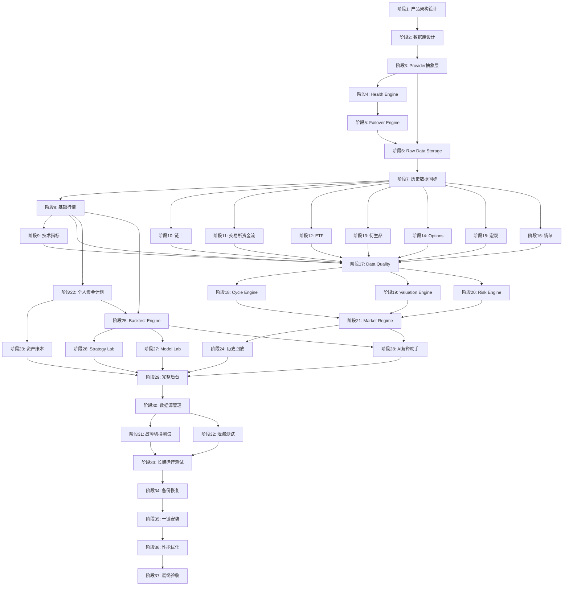
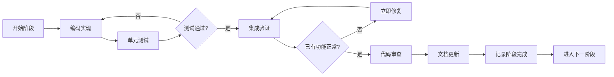

# 完整开发路线

> **文档编号**: 23  
> **版本**: 1.0  
> **状态**: Draft  
> **最后更新**: 2026-09-27

## 概述

本文档定义 BTC 全市场智能研究平台从零到一完整交付的 37 个开发阶段，划分为 5 个里程碑。每个阶段包含目标、依赖、交付物、验收标准、工作量估算和风险点，可直接作为开发任务执行。

**核心开发原则**：
- 每完成一个阶段必须测试、检查、记录
- 禁止为了修新功能而破坏旧功能
- 保持已有功能正常是最高优先级
- 如果修改旧代码导致原有功能损坏，必须立即修复

---

## 目录

1. [里程碑划分](#1-里程碑划分)
2. [M1 基础架构（阶段1-7）](#2-m1-基础架构阶段1-7)
3. [M2 数据层（阶段8-17）](#3-m2-数据层阶段8-17)
4. [M3 引擎层（阶段18-21）](#4-m3-引擎层阶段18-21)
5. [M4 应用层（阶段22-30）](#5-m4-应用层阶段22-30)
6. [M5 质量保障（阶段31-37）](#6-m5-质量保障阶段31-37)
7. [依赖关系图](#7-依赖关系图)
8. [里程碑验收标准](#8-里程碑验收标准)
9. [风险识别与缓解措施](#9-风险识别与缓解措施)
10. [开发原则与规范](#10-开发原则与规范)

---

## 1. 里程碑划分

| 里程碑 | 阶段范围 | 名称 | 核心目标 | 预估总工作量 |
|--------|---------|------|---------|-------------|
| M1 | 1-7 | 基础架构 | Provider 可配置、可自动切换、数据可持久化 | XL |
| M2 | 8-17 | 数据层 | 全部数据类别可采集、可查询、有质量保障 | XL |
| M3 | 18-21 | 引擎层 | 四大引擎可运行、结果可解释 | L |
| M4 | 22-30 | 应用层 | 用户可完整使用所有功能 | XL |
| M5 | 31-37 | 质量保障 | 满足全部50项验收条件 | L |

**工作量定义**：S = 1-3天，M = 4-7天，L = 8-14天，XL = 15-25天

---

## 2. M1 基础架构（阶段1-7）

### 阶段 1：完整产品架构设计

| 项目 | 内容 |
|------|------|
| **目标** | 输出完整的产品架构文档集，为后续编码提供蓝图 |
| **前置依赖** | 无 |
| **输入** | 需求文档、技术选型 |
| **输出/交付物** | 产品架构文档、技术架构文档、系统模块图、数据库ER设计、API设计、页面信息架构 |
| **验收标准** | ① 所有架构文档完成并通过审查 ② 模块边界清晰 ③ 接口定义完整 ④ 技术选型确定 |
| **工作量** | M（5-7天） |
| **风险点** | 架构设计遗漏导致后期重构 |
| **可并行** | 否（所有后续工作的基础） |

### 阶段 2：数据库设计

| 项目 | 内容 |
|------|------|
| **目标** | 完成全部数据库表设计、TimescaleDB 超表配置、Alembic 迁移框架 |
| **前置依赖** | 阶段1 |
| **输入** | ER设计文档、数据类别定义 |
| **输出/交付物** | 全部 DDL 脚本、Alembic 初始迁移、TimescaleDB hypertable 配置、seed 数据 |
| **验收标准** | ① 所有需求文档定义的表已创建 ② hypertable 分区策略正确 ③ 迁移可正向/反向执行 ④ 索引覆盖查询需求 |
| **工作量** | L（8-10天） |
| **风险点** | 表结构设计不合理导致后期大规模迁移；TimescaleDB 分区策略影响性能 |
| **可并行** | 否（阶段3-7依赖数据库） |

### 阶段 3：Provider 抽象层

| 项目 | 内容 |
|------|------|
| **目标** | 实现统一 Provider 接口抽象、基类、注册机制、配置加载 |
| **前置依赖** | 阶段2 |
| **输入** | Provider 接口标准文档 |
| **输出/交付物** | BaseProvider 抽象类、ProviderRegistry、Provider 配置 YAML schema、至少2个 Market Provider 实现 |
| **验收标准** | ① Provider 可通过 YAML 配置注册 ② 统一接口 get_price/get_ohlcv 可调用 ③ 新增 Provider 无需修改业务代码 ④ 单元测试覆盖正常/异常场景 |
| **工作量** | L（10-12天） |
| **风险点** | 接口设计不够通用，后续数据类别扩展困难 |
| **可并行** | 部分可与阶段2并行（接口设计不依赖具体表） |

### 阶段 4：Provider Health Engine

| 项目 | 内容 |
|------|------|
| **目标** | 实现 Provider 健康监控系统：状态追踪、评分、告警 |
| **前置依赖** | 阶段3 |
| **输入** | Provider 健康评分机制文档 |
| **输出/交付物** | HealthMonitor 类、ProviderScore 计算、状态机（ONLINE/DEGRADED/SLOW/RATE_LIMITED/AUTH_ERROR/NETWORK_ERROR/DATA_ERROR/OFFLINE/DISABLED）、健康数据持久化 |
| **验收标准** | ① 每个 Provider 实时状态可查询 ② 评分因子覆盖：准确性、延迟、稳定性、成功率 ③ 状态转换逻辑正确 ④ 健康数据写入 provider_health 表 |
| **工作量** | M（5-7天） |
| **风险点** | 健康检查本身消耗过多 Provider 配额 |
| **可并行** | 否 |

### 阶段 5：自动 Failover Engine

| 项目 | 内容 |
|------|------|
| **目标** | 实现自动故障切换：检测失败→切换备用→记录事件→恢复提升 |
| **前置依赖** | 阶段4 |
| **输入** | Failover 机制文档 |
| **输出/交付物** | FailoverEngine、Recovery Threshold 机制、Failover Event 记录、抖动防护（Flapping Protection） |
| **验收标准** | ① 主 Provider 失败达阈值后自动切换 ② 切换过程对业务层透明 ③ Failover Event 正确记录 ④ 恢复后满足阈值才提升 ⑤ 不产生假数据 ⑥ 全部故障切换测试通过 |
| **工作量** | L（8-12天） |
| **风险点** | 切换过程中数据不连续；恢复阈值设置不当导致抖动 |
| **可并行** | 否 |

### 阶段 6：Raw Data Storage

| 项目 | 内容 |
|------|------|
| **目标** | 实现原始数据与标准化数据双存储机制 |
| **前置依赖** | 阶段3、阶段5 |
| **输入** | 数据流架构文档 |
| **输出/交付物** | RawDataWriter、DataNormalizer、双写入管道、数据溯源链 |
| **验收标准** | ① 原始响应完整保存到 raw_* 表 ② Normalized 数据正确转换 ③ 每条数据包含 source_id、fetch_time、observation_time ④ 存储空间管理（压缩策略） |
| **工作量** | M（5-7天） |
| **风险点** | 原始数据量过大导致存储压力 |
| **可并行** | 可与阶段5部分并行 |

### 阶段 7：历史数据同步

| 项目 | 内容 |
|------|------|
| **目标** | 实现历史数据批量同步：断点续传、Checkpoint、自动补洞 |
| **前置依赖** | 阶段6 |
| **输入** | 历史数据保存机制文档 |
| **输出/交付物** | HistorySyncWorker、CheckpointManager、GapDetector、自动补洞逻辑 |
| **验收标准** | ① 支持从 2015 年开始同步 BTC 日线数据 ② 中断后可从 Checkpoint 继续 ③ 自动检测并填补缺失数据 ④ 同步进度可查询 ⑤ 支持暂停/恢复/重试/跳过 |
| **工作量** | L（10-14天） |
| **风险点** | 历史数据源不提供完整历史；API 限流导致同步极慢 |
| **可并行** | 否 |

---

## 3. M2 数据层（阶段8-17）

### 阶段 8：基础行情

| 项目 | 内容 |
|------|------|
| **目标** | 实现 BTC 实时行情采集与存储（价格、OHLCV、成交量、市值） |
| **前置依赖** | 阶段7 |
| **输入** | Market Provider 接口定义 |
| **输出/交付物** | MarketService、3+ Market Provider（Binance/Coinbase/Kraken）、行情采集任务、API 端点 |
| **验收标准** | ① 实时价格可获取并缓存 ② 1m/5m/1h/1d K线可查询 ③ 交叉验证正常 ④ Provider 切换正常 ⑤ 历史数据从2015年可查 |
| **工作量** | L（8-12天） |
| **风险点** | 不同交易所价格差异处理 |
| **可并行** | 否（后续数据类别依赖此模式） |

### 阶段 9：技术指标

| 项目 | 内容 |
|------|------|
| **目标** | 实现全部技术指标计算引擎 |
| **前置依赖** | 阶段8 |
| **输入** | 指标字典文档 |
| **输出/交付物** | IndicatorEngine、MA/EMA/RSI/MACD/ADX/ATR/Bollinger/VolumeProfile/HV/Percentile 实现、指标定义表、计算结果持久化 |
| **验收标准** | ① 所有指标计算结果与 TradingView 误差 <1% ② 支持自定义周期参数 ③ 计算结果缓存 ④ 指标定义可配置 |
| **工作量** | L（10-14天） |
| **风险点** | 不同实现的细微差异导致与参考值不一致 |
| **可并行** | 可与阶段10-16并行（指标只依赖行情数据） |

### 阶段 10：链上数据

| 项目 | 内容 |
|------|------|
| **目标** | 实现链上数据采集（MVRV/SOPR/NUPL/Puell/RHODL等） |
| **前置依赖** | 阶段7 |
| **输入** | OnChain Provider 定义 |
| **输出/交付物** | OnChainService、2+ OnChain Provider（Glassnode/CryptoQuant）、链上数据采集任务 |
| **验收标准** | ① 需求文档定义的全部链上指标可获取 ② 历史数据可查 ③ Provider 切换正常 ④ 数据质量验证通过 |
| **工作量** | L（8-12天） |
| **风险点** | Glassnode/CryptoQuant API 在国内访问不稳定；免费额度有限 |
| **可并行** | ✓ 可与阶段9/11-16并行 |

### 阶段 11：交易所资金流

| 项目 | 内容 |
|------|------|
| **目标** | 实现交易所 BTC 流入/流出/净流量数据采集 |
| **前置依赖** | 阶段7 |
| **输入** | ExchangeFlow Provider 定义 |
| **输出/交付物** | ExchangeFlowService、Provider 实现、采集任务 |
| **验收标准** | ① Exchange Reserve/Netflow/Inflow/Outflow 可获取 ② 历史数据完整 ③ 数据源可追溯 |
| **工作量** | M（5-7天） |
| **风险点** | 数据源有限，可能需要付费 API |
| **可并行** | ✓ |

### 阶段 12：ETF 数据

| 项目 | 内容 |
|------|------|
| **目标** | 实现 BTC ETF 资金流数据采集 |
| **前置依赖** | 阶段7 |
| **输入** | ETF Provider 定义 |
| **输出/交付物** | ETFService、Farside/其他 Provider、ETF 日报采集任务 |
| **验收标准** | ① Daily Inflow/Outflow/Net Flow 可获取 ② 7D/30D/90D/Cumulative 可计算 ③ ETF Holdings 可追踪 |
| **工作量** | M（4-6天） |
| **风险点** | ETF 数据源较少且可能收费 |
| **可并行** | ✓ |

### 阶段 13：衍生品数据

| 项目 | 内容 |
|------|------|
| **目标** | 实现衍生品数据采集（Funding Rate/OI/Liquidation/Long-Short） |
| **前置依赖** | 阶段7 |
| **输入** | Derivatives Provider 定义 |
| **输出/交付物** | DerivativesService、Coinglass/Binance Futures Provider、采集任务 |
| **验收标准** | ① Funding Rate 实时更新 ② OI 历史可查 ③ Liquidation 数据可获取 ④ Basis/Premium 可计算 |
| **工作量** | L（8-10天） |
| **风险点** | 不同交易所衍生品数据格式差异大 |
| **可并行** | ✓ |

### 阶段 14：Options 数据

| 项目 | 内容 |
|------|------|
| **目标** | 实现期权数据采集（OI/Volume/IV/Put-Call/Skew/Gamma） |
| **前置依赖** | 阶段7 |
| **输入** | Options Provider 定义 |
| **输出/交付物** | OptionsService、Deribit Provider、期权数据采集任务 |
| **验收标准** | ① 期权 OI/Volume 可获取 ② IV 曲面数据可查 ③ Put/Call Ratio 可计算 ④ 到期日数据完整 |
| **工作量** | M（5-7天） |
| **风险点** | Deribit API 国内访问受限 |
| **可并行** | ✓ |

### 阶段 15：宏观数据

| 项目 | 内容 |
|------|------|
| **目标** | 实现宏观经济数据采集（DXY/Fed Rate/CPI/PCE/NFP/GDP/M2） |
| **前置依赖** | 阶段7 |
| **输入** | Macro Provider 定义 |
| **输出/交付物** | MacroService、FRED Provider、宏观数据采集任务、Release Date 追踪 |
| **验收标准** | ① 全部宏观指标可获取 ② 区分 Observation/Release/Revision Date ③ 历史数据完整 ④ 支持 FRED API |
| **工作量** | M（5-7天） |
| **风险点** | FRED API 需要 Key；数据修订版本管理复杂 |
| **可并行** | ✓ |

### 阶段 16：情绪数据

| 项目 | 内容 |
|------|------|
| **目标** | 实现市场情绪数据采集（Fear&Greed/Google Trends/News Sentiment） |
| **前置依赖** | 阶段7 |
| **输入** | Sentiment Provider 定义 |
| **输出/交付物** | SentimentService、Alternative.me Provider、情绪数据采集任务 |
| **验收标准** | ① Fear & Greed Index 可获取 ② Google Trends 数据可查 ③ 社交情绪可追踪 ④ 历史数据完整 |
| **工作量** | S（3-5天） |
| **风险点** | Google Trends API 非官方；社交数据获取困难 |
| **可并行** | ✓ |

### 阶段 17：Data Quality Engine

| 项目 | 内容 |
|------|------|
| **目标** | 实现数据质量中心：缺失检测、异常检测、交叉验证、自动补洞 |
| **前置依赖** | 阶段8-16 |
| **输入** | 数据质量机制文档 |
| **输出/交付物** | DataQualityEngine、GapDetector、AnomalyDetector、CrossValidator、AutoFillWorker、质量仪表盘数据 API |
| **验收标准** | ① 自动发现数据缺失并补洞 ② 异常数据不覆盖正确数据 ③ 交叉验证结果可查看 ④ 数据置信度计算正确 ⑤ 质量状态可查询（VERIFIED/ESTIMATED/STALE/CONFLICT/INVALID） |
| **工作量** | L（10-14天） |
| **风险点** | 误判正常波动为异常；补洞数据源也不可用 |
| **可并行** | 否（依赖所有数据层完成） |

---

## 4. M3 引擎层（阶段18-21）

### 阶段 18：Cycle Engine

| 项目 | 内容 |
|------|------|
| **目标** | 实现 BTC 市场周期识别引擎 |
| **前置依赖** | 阶段17 |
| **输入** | 历史周期数据、多因子输入 |
| **输出/交付物** | CycleEngine、周期阶段定义（深度熊市→顶部风险共9阶段）、置信度计算、证据链、历史相似阶段匹配 |
| **验收标准** | ① 能正确识别2017/2021牛市顶部区域 ② 能正确识别2018/2022熊市底部区域 ③ 每个判断附带证据和反向证据 ④ 置信度输出合理 ⑤ 不硬编码四年周期 |
| **工作量** | XL（15-20天） |
| **风险点** | 周期识别准确性难以量化验证；市场结构可能变化 |
| **可并行** | ✓ 可与阶段19-21并行 |

### 阶段 19：Valuation Engine

| 项目 | 内容 |
|------|------|
| **目标** | 实现 BTC 估值引擎（基于 MVRV/Realized Cap/历史分位数） |
| **前置依赖** | 阶段17 |
| **输入** | 链上估值指标 |
| **输出/交付物** | ValuationEngine、估值状态（深度低估→极端高估共5级）、历史分位数计算、证据链 |
| **验收标准** | ① 估值状态与市场实际走势相关性合理 ② 历史分位数计算正确 ③ 不输出"一定上涨/下跌"的结论 ④ 每个判断可解释 |
| **工作量** | L（8-12天） |
| **风险点** | 估值模型在新市场结构下可能失效 |
| **可并行** | ✓ |

### 阶段 20：Risk Engine

| 项目 | 内容 |
|------|------|
| **目标** | 实现独立风险评估引擎 |
| **前置依赖** | 阶段17 |
| **输入** | 多维度风险因子数据 |
| **输出/交付物** | RiskEngine、风险维度（Trend/Valuation/Leverage/Liquidity/Macro/OnChain/Overall）、风险评分、证据展开 |
| **验收标准** | ① 各风险维度独立计算 ② Overall Risk 综合加权 ③ 点击可展开所有原因 ④ 极端行情时风险评分正确升高 ⑤ 不使用未来数据 |
| **工作量** | L（10-14天） |
| **风险点** | 风险模型权重设定主观性强 |
| **可并行** | ✓ |

### 阶段 21：Market Regime Engine

| 项目 | 内容 |
|------|------|
| **目标** | 实现多因子综合市场状态引擎 |
| **前置依赖** | 阶段18、19、20 |
| **输入** | Cycle/Valuation/Risk Engine 输出 + 各维度状态 |
| **输出/交付物** | MarketRegimeEngine、9维状态输出、状态变化持久化、历史回放支持 |
| **验收标准** | ① 综合输出 Market Regime ② 每次变化保存到数据库 ③ 可回看任意历史日期的系统判断 ④ 不输出简单 BUY/SELL ⑤ 结果可解释可追溯 |
| **工作量** | L（8-12天） |
| **风险点** | 多引擎输出的综合逻辑复杂 |
| **可并行** | 否（依赖前三个引擎） |

---

## 5. M4 应用层（阶段22-30）

### 阶段 22：个人资金计划

| 项目 | 内容 |
|------|------|
| **目标** | 实现用户资金计划创建与管理 |
| **前置依赖** | 阶段8 |
| **输入** | 用户需求定义 |
| **输出/交付物** | PlanService、Plan CRUD API、计划配置项（初始资金/月投入/周期/策略/风控参数）、前端页面 |
| **验收标准** | ① 用户可创建/编辑/删除计划 ② 所有配置项可设置 ③ 支持多计划并行 ④ 计划执行提醒 |
| **工作量** | M（5-7天） |
| **风险点** | 无 |
| **可并行** | ✓ 可与阶段18-21并行 |

### 阶段 23：资产账本

| 项目 | 内容 |
|------|------|
| **目标** | 实现个人资产记录与计算 |
| **前置依赖** | 阶段22 |
| **输入** | 交易记录、实时价格 |
| **输出/交付物** | PortfolioService、Transaction CRUD、持仓计算（平均成本/浮盈亏/收益率/最大回撤）、资产曲线 API、前端页面 |
| **验收标准** | ① 手工录入买入/卖出 ② 自动计算平均成本、持仓市值 ③ 资产曲线图正确 ④ 最大回撤计算正确 |
| **工作量** | M（5-7天） |
| **风险点** | 无 |
| **可并行** | ✓ |

### 阶段 24：历史回放

| 项目 | 内容 |
|------|------|
| **目标** | 实现任意历史日期的市场状态回放 |
| **前置依赖** | 阶段21 |
| **输入** | 历史数据、引擎历史输出 |
| **输出/交付物** | ReplayService、当时视角/事后视角切换、时间线导航、前端回放页面 |
| **验收标准** | ① 选择任意日期可查看当日全貌 ② "当时视角"绝不使用未来信息 ③ "事后视角"可查看后续30/90/180/365天 ④ 数据缺失时明确标注 |
| **工作量** | L（8-12天） |
| **风险点** | 早期历史数据可能不完整 |
| **可并行** | 否（依赖引擎层） |

### 阶段 25：Backtest Engine

| 项目 | 内容 |
|------|------|
| **目标** | 实现完整回测引擎 |
| **前置依赖** | 阶段8、阶段22 |
| **输入** | 历史数据、策略定义 |
| **输出/交付物** | BacktestEngine、策略接口、回测结果（收益率/年化/Sharpe/Sortino/最大回撤/恢复时间）、防泄漏机制 |
| **验收标准** | ① 支持 2015-今 全区间回测 ② 手续费/滑点可配置 ③ 无未来数据泄漏 ④ 结果可重现 ⑤ 极端行情不崩溃 |
| **工作量** | XL（15-20天） |
| **风险点** | 未来数据泄漏难以完全排除；回测性能 |
| **可并行** | ✓ 可与阶段24并行 |

### 阶段 26：Strategy Lab

| 项目 | 内容 |
|------|------|
| **目标** | 实现策略实验室：定投策略模拟与比较 |
| **前置依赖** | 阶段25 |
| **输入** | 回测引擎、策略模板 |
| **输出/交付物** | StrategyLab、内置策略（固定定投/下跌加仓/回撤加仓/估值加仓/风险调整/周期调整/自定义）、策略对比、参数优化 |
| **验收标准** | ① 所有内置策略可运行 ② 用户可自定义策略规则 ③ 策略对比视图正确 ④ 加仓规则完全可配置 |
| **工作量** | L（10-14天） |
| **风险点** | 策略过拟合 |
| **可并行** | 否（依赖回测引擎） |

### 阶段 27：Model Lab

| 项目 | 内容 |
|------|------|
| **目标** | 实现模型实验室：模型训练、验证、版本管理 |
| **前置依赖** | 阶段25 |
| **输入** | 历史数据、模型框架 |
| **输出/交付物** | ModelLab、In-Sample/Out-of-Sample/Walk-Forward 验证、模型版本化、预测输出（概率+置信度） |
| **验收标准** | ① Walk Forward 验证正确实现 ② 模型版本不可覆盖 ③ 预测输出包含置信度 ④ 证据不足时显示"无法可靠预测" ⑤ 禁止输出"99%准确"等无依据结论 |
| **工作量** | XL（15-20天） |
| **风险点** | 模型过拟合；预测准确性难以保证 |
| **可并行** | 可与阶段26并行 |

### 阶段 28：AI 解释助手

| 项目 | 内容 |
|------|------|
| **目标** | 实现 AI 金融解释助手（解释数据，不预测未来） |
| **前置依赖** | 阶段21、阶段25 |
| **输入** | 市场数据、引擎输出、用户问题 |
| **输出/交付物** | AIAssistant Service、解释生成（引用实际数据）、区分事实/统计/模型判断、不确定性标注 |
| **验收标准** | ① 能解释"为什么风险变高"并引用实际数据 ② 不编造数据 ③ 区分事实与判断 ④ 列出反向证据 ⑤ 标注不确定性 |
| **工作量** | L（10-14天） |
| **风险点** | AI 幻觉导致编造数据 |
| **可并行** | 否 |

### 阶段 29：完整后台

| 项目 | 内容 |
|------|------|
| **目标** | 实现完整前端界面（首页、行情、各数据模块、普通/专业模式） |
| **前置依赖** | 阶段8-28 |
| **输入** | 页面信息架构、API 端点 |
| **输出/交付物** | 全部前端页面、普通用户模式、专业模式切换、数据溯源展示、响应式布局 |
| **验收标准** | ① 首页简洁回答核心问题 ② 任何结论可点击展开到原始数据 ③ 普通/专业模式切换 ④ 所有导航页面可访问 ⑤ 移动端适配 |
| **工作量** | XL（20-25天） |
| **风险点** | 前端工作量大；数据可视化复杂度 |
| **可并行** | 部分页面可与后端并行开发 |

### 阶段 30：数据源管理

| 项目 | 内容 |
|------|------|
| **目标** | 实现管理后台：Provider CRUD、优先级配置、健康监控、任务管理 |
| **前置依赖** | 阶段4、5、29 |
| **输入** | Provider 管理系统需求 |
| **输出/交付物** | Admin Panel、Provider 管理页面、一键测试全部 Provider、任务管理、系统日志查看 |
| **验收标准** | ① 可新增/删除/启用/禁用 Provider ② 可修改优先级和配置 ③ 一键测试全部 Provider ④ 任务可暂停/恢复/重试 ⑤ 审计日志完整 |
| **工作量** | L（8-12天） |
| **风险点** | 管理操作误触导致生产故障 |
| **可并行** | 可与阶段29后期并行 |

---

## 6. M5 质量保障（阶段31-37）

### 阶段 31：故障切换测试

| 项目 | 内容 |
|------|------|
| **目标** | 完整验证故障切换机制在所有场景下的正确性 |
| **前置依赖** | 阶段30 |
| **输入** | 测试设计文档 |
| **输出/交付物** | 故障切换测试套件、测试报告、发现的 Bug 修复 |
| **验收标准** | ① 主→备切换正确 ② 级联切换正确 ③ 全部断开不产生假数据 ④ 恢复提升正确 ⑤ 数据连续性验证通过 ⑥ 抖动防护有效 |
| **工作量** | M（5-7天） |
| **风险点** | 边缘场景遗漏 |
| **可并行** | ✓ 可与阶段32并行 |

### 阶段 32：未来数据泄漏测试

| 项目 | 内容 |
|------|------|
| **目标** | 验证回测系统和历史回放不存在未来数据泄漏 |
| **前置依赖** | 阶段30 |
| **输入** | 测试设计文档 |
| **输出/交付物** | 泄漏检测测试套件、宏观数据 Release Date 验证、测试报告 |
| **验收标准** | ① Look-ahead Bias 检测通过 ② 宏观数据使用 Release Date ③ 无 Revision Leakage ④ 回测结果在 OOS 数据上验证 ⑤ 历史回放"当时视角"无未来数据 |
| **工作量** | M（5-7天） |
| **风险点** | 隐蔽的泄漏路径难以完全排查 |
| **可并行** | ✓ |

### 阶段 33：长期运行测试

| 项目 | 内容 |
|------|------|
| **目标** | 验证系统可 7×24 小时稳定运行 |
| **前置依赖** | 阶段31、32 |
| **输入** | 系统运行指标 |
| **输出/交付物** | 长期运行测试报告、内存泄漏修复、连接池优化、稳定性报告 |
| **验收标准** | ① 连续运行 7 天无崩溃 ② 内存使用稳定（无泄漏） ③ 连接池不耗尽 ④ 数据持续更新 ⑤ CPU 使用合理 |
| **工作量** | M（7天运行 + 3天修复） |
| **风险点** | 内存泄漏难以完全消除 |
| **可并行** | 否 |

### 阶段 34：备份恢复

| 项目 | 内容 |
|------|------|
| **目标** | 实现完整的备份恢复机制并验证 |
| **前置依赖** | 阶段33 |
| **输入** | 备份恢复设计文档 |
| **输出/交付物** | backup.sh、restore.sh、WAL 归档配置、定时任务、恢复验证测试 |
| **验收标准** | ① 每日自动备份执行成功 ② 从备份完整恢复验证通过 ③ PITR 可恢复到任意时间点 ④ 备份加密正确 ⑤ 恢复后数据一致性检查通过 |
| **工作量** | M（5-7天） |
| **风险点** | 大数据库恢复耗时长 |
| **可并行** | ✓ 可与阶段33并行 |

### 阶段 35：一键安装

| 项目 | 内容 |
|------|------|
| **目标** | 实现完整的一键安装/升级/卸载/管理系统 |
| **前置依赖** | 阶段34 |
| **输入** | 部署设计文档 |
| **输出/交付物** | install.sh、update.sh、uninstall.sh、manage.sh、systemd 配置、完整文档 |
| **验收标准** | ① 全新服务器一键安装成功 ② 升级不丢失数据 ③ 卸载干净 ④ 管理菜单功能完整 ⑤ systemd 自启正常 |
| **工作量** | M（5-7天） |
| **风险点** | 不同 Linux 发行版兼容性问题 |
| **可并行** | ✓ |

### 阶段 36：性能优化

| 项目 | 内容 |
|------|------|
| **目标** | 全系统性能优化：数据库查询、API 响应、前端加载 |
| **前置依赖** | 阶段35 |
| **输入** | 性能基线数据 |
| **输出/交付物** | 性能优化报告、数据库索引优化、查询优化、缓存策略调优、前端 bundle 优化 |
| **验收标准** | ① API 平均响应 <200ms ② 首页加载 <3s ③ 数据库查询无全表扫描 ④ 缓存命中率 >80% ⑤ TimescaleDB 压缩率合理 |
| **工作量** | L（8-12天） |
| **风险点** | 优化可能引入新 Bug |
| **可并行** | 否 |

### 阶段 37：最终验收

| 项目 | 内容 |
|------|------|
| **目标** | 对照需求文档第五十二节全部50项验收条件逐一验证 |
| **前置依赖** | 阶段36 |
| **输入** | 50项验收条件 |
| **输出/交付物** | 验收测试报告、全部条件逐项验证结果、遗留问题清单 |
| **验收标准** | 50项验收条件全部通过（详见下方清单） |
| **工作量** | M（5-7天） |
| **风险点** | 个别条件可能需要额外开发 |
| **可并行** | 否（最终阶段） |

---

## 7. 依赖关系图



### 关键路径

**关键路径**（决定最短完成时间）：
```
阶段1 → 2 → 3 → 4 → 5 → 6 → 7 → 8 → 17 → 18/19/20 → 21 → 24 → 29 → 30 → 31 → 33 → 34 → 35 → 36 → 37
```

**可并行机会**：
- 阶段 9-16 可全部并行（数据类别独立）
- 阶段 18/19/20 可并行（三个引擎独立）
- 阶段 22-23 可与 M3 并行（不依赖引擎层）
- 阶段 25-27 可部分并行
- 阶段 31/32 可并行
- 阶段 34 可与 33 并行

---

## 8. 里程碑验收标准

### M1 验收标准

| # | 验收条件 | 验证方式 |
|---|---------|---------|
| 1 | Provider 可通过 YAML 配置注册 | 配置文件测试 |
| 2 | 统一接口可调用获取数据 | 单元测试 |
| 3 | Provider 健康状态实时监控 | 集成测试 |
| 4 | 故障自动切换正确工作 | Failover 测试套件 |
| 5 | 恢复后满足阈值自动提升 | 恢复测试 |
| 6 | 全部断开不产生假数据 | 边界测试 |
| 7 | 原始数据+标准化数据双存储 | 数据库验证 |
| 8 | 历史数据可断点续传同步 | 同步测试 |
| 9 | 自动补洞机制工作 | 质量测试 |

### M2 验收标准

| # | 验收条件 | 验证方式 |
|---|---------|---------|
| 1 | 全部9类数据可采集 | 逐类验证 |
| 2 | 数据可查询（API端点） | API 测试 |
| 3 | 交叉验证正确运行 | 单元测试 |
| 4 | 数据质量状态可查看 | 集成测试 |
| 5 | 技术指标计算精度 <1% 误差 | 对比测试 |
| 6 | 历史数据覆盖 2015-今 | 数据完整性检查 |
| 7 | 数据缺失自动发现并补洞 | 质量引擎测试 |

### M3 验收标准

| # | 验收条件 | 验证方式 |
|---|---------|---------|
| 1 | Cycle Engine 正确识别历史牛熊 | 回测验证 |
| 2 | Valuation Engine 输出合理估值状态 | 历史对比 |
| 3 | Risk Engine 在极端行情时正确升高风险 | 事件回放 |
| 4 | Market Regime 综合输出可解释 | 人工审查 |
| 5 | 每个结论附带证据链 | 代码审查+测试 |
| 6 | 状态变化持久化可回查 | 数据库验证 |

### M4 验收标准

| # | 验收条件 | 验证方式 |
|---|---------|---------|
| 1 | 用户可创建/管理资金计划 | E2E 测试 |
| 2 | 资产账本计算正确 | 手动验证 |
| 3 | 历史回放无未来数据 | 泄漏测试 |
| 4 | 回测结果可重现 | 重复运行测试 |
| 5 | 策略实验室可比较策略 | E2E 测试 |
| 6 | 模型版本不可覆盖 | 代码审查 |
| 7 | AI 解释不编造数据 | 人工审查 |
| 8 | 首页简洁回答核心问题 | UX 审查 |
| 9 | 管理后台功能完整 | E2E 测试 |

### M5 验收标准

**对应需求文档第五十二节全部50项验收条件**：

| # | 验收条件 | 状态 |
|---|---------|------|
| 1 | 可以真实获取 BTC 数据 | ☐ |
| 2 | 可以配置多个 Provider | ☐ |
| 3 | 可以自动检测 Provider 是否正常 | ☐ |
| 4 | 一个 Provider 失败后能够自动切换 | ☐ |
| 5 | 主 Provider 恢复后能够自动恢复 | ☐ |
| 6 | 所有 Provider 失败时不会产生假数据 | ☐ |
| 7 | 历史数据保存在自己的数据库 | ☐ |
| 8 | 历史数据不依赖第三方实时 API | ☐ |
| 9 | 可以查看长期历史 | ☐ |
| 10 | 可以查看任意历史日期 | ☐ |
| 11 | 可以进行历史回放 | ☐ |
| 12 | 可以进行真实回测 | ☐ |
| 13 | 回测不存在未来数据泄漏 | ☐ |
| 14 | 可以设置初始资金 | ☐ |
| 15 | 可以设置每月/每周投入资金 | ☐ |
| 16 | 可以建立多个计划 | ☐ |
| 17 | 可以查看个人资产曲线 | ☐ |
| 18 | 可以查看平均成本 | ☐ |
| 19 | 可以模拟不同定投策略 | ☐ |
| 20 | 可以查看最大回撤 | ☐ |
| 21 | 可以查看收益和风险 | ☐ |
| 22 | 可以查看周期 | ☐ |
| 23 | 可以查看估值 | ☐ |
| 24 | 可以查看链上 | ☐ |
| 25 | 可以查看资金流 | ☐ |
| 26 | 可以查看 ETF | ☐ |
| 27 | 可以查看衍生品 | ☐ |
| 28 | 可以查看宏观 | ☐ |
| 29 | 可以查看情绪 | ☐ |
| 30 | 可以查看综合市场状态 | ☐ |
| 31 | 每个结论都可以追溯 | ☐ |
| 32 | 每个关键数据都有来源 | ☐ |
| 33 | 每个关键数据都有更新时间 | ☐ |
| 34 | 数据异常会主动提示 | ☐ |
| 35 | 数据源故障会主动提示 | ☐ |
| 36 | 数据源冲突会主动提示 | ☐ |
| 37 | 网络中断时系统可以降级运行 | ☐ |
| 38 | 数据采集任务可以断点恢复 | ☐ |
| 39 | 支持数据自动补洞 | ☐ |
| 40 | 支持完整备份和恢复 | ☐ |
| 41 | 支持长期运行 | ☐ |
| 42 | 支持 Provider 替换 | ☐ |
| 43 | 支持模型版本化 | ☐ |
| 44 | 支持策略版本化 | ☐ |
| 45 | 支持一键安装和升级 | ☐ |
| 46 | 支持 systemd | ☐ |
| 47 | 支持后台管理 | ☐ |
| 48 | 普通人能够看懂 | ☐ |
| 49 | 专业人员能够查看原始数据和计算过程 | ☐ |
| 50 | AI 不能编造金融数据和预测结果 | ☐ |

---

## 9. 风险识别与缓解措施

| # | 风险 | 概率 | 影响 | 缓解措施 |
|---|------|------|------|---------|
| 1 | 数据源 API 停止服务 | 高 | 高 | 多 Provider 架构；本地历史数据优先 |
| 2 | 中国大陆网络不稳定 | 极高 | 中 | 代理配置；多线路；超时重试；断网降级 |
| 3 | API 限流/配额不足 | 高 | 中 | 智能限流；本地缓存；降低采集频率 |
| 4 | TimescaleDB 数据量过大 | 中 | 中 | 压缩策略；Retention Policy；分区 |
| 5 | 回测存在隐蔽数据泄漏 | 中 | 高 | 严格时间屏障；OOS 验证；代码审查 |
| 6 | 模型过拟合 | 中 | 中 | Walk Forward；参数敏感性分析 |
| 7 | 内存泄漏长期运行 | 中 | 高 | 定期 GC；内存监控；自动重启 |
| 8 | 服务器磁盘空间不足 | 低 | 高 | 监控告警；自动清理；压缩 |
| 9 | 数据库损坏 | 低 | 极高 | WAL 归档；每日备份；定期验证 |
| 10 | 安全漏洞 | 低 | 高 | 依赖更新；最小权限；安全头 |
| 11 | Provider API 格式变更 | 高 | 中 | 数据验证层；快速修复机制 |
| 12 | 关键开发人员不可用 | 低 | 高 | 完整文档；代码注释；自动化测试 |

---

## 10. 开发原则与规范

### 10.1 阶段交付流程



### 10.2 核心规则

| # | 规则 | 说明 |
|---|------|------|
| 1 | 不破坏已有功能 | 修改旧代码导致功能损坏必须立即修复 |
| 2 | 每阶段必须测试 | 测试不通过不进入下一阶段 |
| 3 | 每阶段必须记录 | 记录完成内容、遇到的问题、解决方案 |
| 4 | 不使用假数据 | 开发阶段无真实API时明确显示"未配置" |
| 5 | 不跳过阶段 | 严格按顺序执行，除非明确标注可并行 |
| 6 | 先设计后编码 | 复杂模块先写设计文档再实现 |
| 7 | 增量提交 | 每个功能点独立提交，便于回滚 |
| 8 | 代码审查 | 关键模块变更需要审查 |

### 10.3 代码提交规范

```
<type>(<scope>): <subject>

类型:
- feat: 新功能
- fix: Bug修复
- refactor: 重构（不改变功能）
- test: 测试
- docs: 文档
- perf: 性能优化
- chore: 构建/工具

示例:
feat(providers): 实现 Binance Market Provider
fix(failover): 修复恢复阈值计数重置Bug
test(indicators): 添加 RSI 精度对比测试
```

### 10.4 质量门禁

| 门禁 | 标准 | 阻塞级别 |
|------|------|---------|
| Lint | ruff check 0 errors | 阻塞合并 |
| Type Check | mypy 0 errors | 阻塞合并 |
| Unit Tests | 全部通过 | 阻塞合并 |
| Coverage | >= 80% | 警告 |
| Integration Tests | 全部通过 | 阻塞部署 |
| E2E Tests | 关键流程通过 | 阻塞发布 |
| 性能基线 | 不低于上一版本 | 警告 |

---

## 附录

### A. 工作量汇总

| 里程碑 | S | M | L | XL | 预估总天数 |
|--------|---|---|---|----|-----------| 
| M1 | 0 | 2 | 4 | 1 | 55-75天 |
| M2 | 1 | 5 | 4 | 0 | 55-75天 |
| M3 | 0 | 0 | 3 | 1 | 40-58天 |
| M4 | 0 | 2 | 4 | 3 | 60-85天 |
| M5 | 0 | 5 | 1 | 0 | 35-50天 |
| **总计** | **1** | **14** | **16** | **5** | **245-343天** |

> 注：考虑可并行性，实际日历时间约为 180-250 天（6-8个月）。

### B. 技术债务管理

每个阶段完成后记录：
- 临时方案（TODO/FIXME）
- 已知但未修复的问题
- 需要后续优化的性能点
- 缺失的测试覆盖

技术债务在 M5 阶段集中处理。

### C. 相关文档

- [备份恢复设计](./20-backup-restore.md)
- [部署设计](./21-deployment.md)
- [测试设计](./22-testing-design.md)
